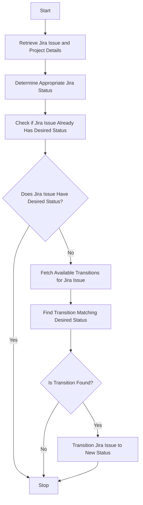

This document will cover the process of synchronizing the status of a Sentry issue with a linked Jira issue. We'll cover:

1. Retrieving the Jira issue and project details
2. Determining the appropriate Jira status
3. Updating the Jira issue if necessary.

Technical document: <SwmLink doc-title="Synchronizing Sentry and Jira Issue Status">[Synchronizing Sentry and Jira Issue Status](/.swm/synchronizing-sentry-and-jira-issue-status.s8porjvu.sw.md)</SwmLink>

# [Retrieving the Jira Issue and Project Details](https://app.swimm.io/repos/Z2l0aHViJTNBJTNBc2VudHJ5LWRlbW8tMSUzQSUzQVN3aW1tLURlbW8=/docs/s8porjvu#sync_status_outbound)

The process begins by retrieving the Jira issue and its associated project details. This step ensures that we have the necessary information about the Jira issue, such as its current status and the project it belongs to. This information is crucial for determining the next steps in the synchronization process.

# [Determining the Appropriate Jira Status](https://app.swimm.io/repos/Z2l0aHViJTNBJTNBc2VudHJ5LWRlbW8tMSUzQSUzQVN3aW1tLURlbW8=/docs/s8porjvu#sync_status_outbound)

Next, we determine the appropriate Jira status based on whether the Sentry issue is resolved or not. If the Sentry issue is resolved, we aim to transition the Jira issue to a 'resolved' status. Conversely, if the Sentry issue is unresolved, we aim to transition the Jira issue to an 'unresolved' status. This step ensures that the statuses of the linked issues in Sentry and Jira are aligned.

# [Updating the Jira Issue if Necessary](https://app.swimm.io/repos/Z2l0aHViJTNBJTNBc2VudHJ5LWRlbW8tMSUzQSUzQVN3aW1tLURlbW8=/docs/s8porjvu#sync_status_outbound)

If the Jira issue already has the desired status, the process stops here. However, if the Jira issue does not have the desired status, we proceed to fetch the available transitions for the Jira issue. We then attempt to find the transition that matches the desired status. If a matching transition is found, we transition the Jira issue to the new status. This step ensures that the Jira issue's status is updated to reflect the current status of the linked Sentry issue.

&nbsp;

*This is an auto-generated document by Swimm AI 🌊 and has not yet been verified by a human*

<SwmMeta version="3.0.0" repo-id="Z2l0aHViJTNBJTNBc2VudHJ5LWRlbW8tMSUzQSUzQVN3aW1tLURlbW8=" repo-name="sentry-demo-1" doc-type="product-flows">Powered by [Swimm](/)</SwmMeta>
