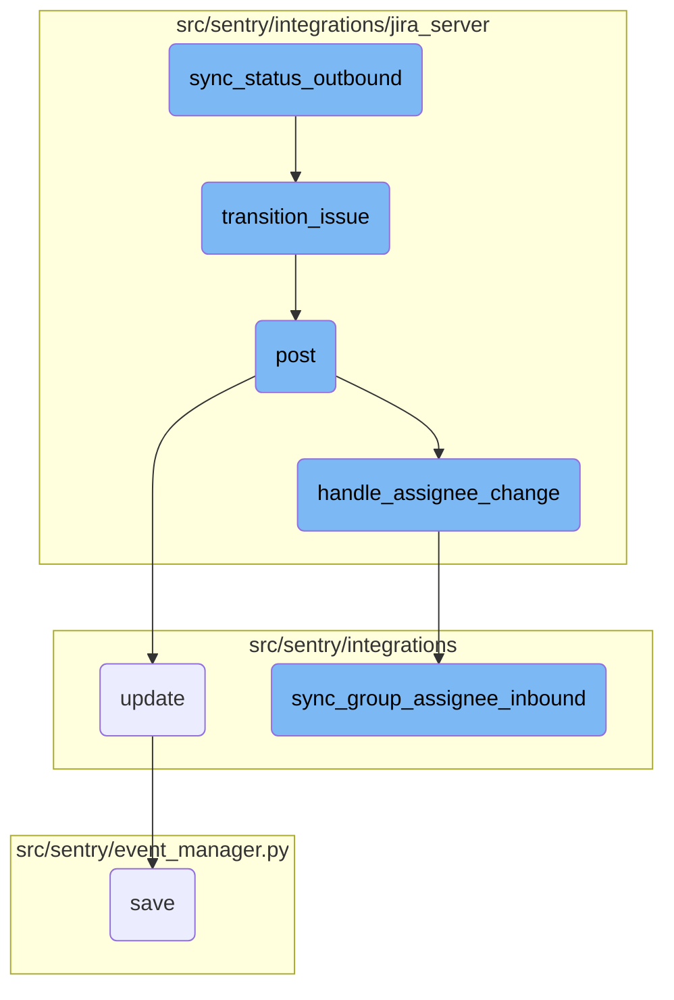

In this document, we will explain the process of synchronizing the status of a Sentry issue with a linked Jira issue. The process involves several steps, including retrieving the Jira issue, determining the appropriate status, and updating the Jira issue if necessary.

The flow starts by retrieving the Jira issue and its project details. Then, it determines the appropriate Jira status based on whether the Sentry issue is resolved or not. If the Jira issue already has the desired status, the process stops. Otherwise, it fetches the available transitions for the Jira issue and attempts to find the transition that matches the desired status. If found, it transitions the Jira issue to the new status.

# Flow drill down



<SwmSnippet path="/src/sentry/integrations/jira_server/integration.py" line="1090">

---

## <SwmToken path="src/sentry/integrations/jira_server/integration.py" pos="1090:3:3" line-data="    def sync_status_outbound(self, external_issue, is_resolved, project_id, **kwargs):">`sync_status_outbound`</SwmToken>

The function <SwmToken path="src/sentry/integrations/jira_server/integration.py" pos="1090:3:3" line-data="    def sync_status_outbound(self, external_issue, is_resolved, project_id, **kwargs):">`sync_status_outbound`</SwmToken> is responsible for propagating the status of a Sentry issue to a linked Jira issue. It first retrieves the Jira issue and its project details. Then, it determines the appropriate Jira status based on whether the Sentry issue is resolved or not. If the Jira issue already has the desired status, the function exits early. Otherwise, it fetches the available transitions for the Jira issue and attempts to find the transition that matches the desired status. If found, it transitions the Jira issue to the new status.

```python
    def sync_status_outbound(self, external_issue, is_resolved, project_id, **kwargs):
        """
        Propagate a sentry issue's status to a linked issue's status.
        """
        client = self.get_client()
        jira_issue = client.get_issue(external_issue.key)
        jira_project = jira_issue["fields"]["project"]

        external_project = integration_service.get_integration_external_project(
            organization_id=external_issue.organization_id,
            integration_id=external_issue.integration_id,
            external_id=jira_project["id"],
        )
        if not external_project:
            return

        jira_status = (
            external_project.resolved_status if is_resolved else external_project.unresolved_status
        )

        # don't bother updating if it's already the status we'd change it to
```

---

</SwmSnippet>

<SwmSnippet path="/src/sentry/integrations/jira_server/client.py" line="196">

---

## <SwmToken path="src/sentry/integrations/jira_server/client.py" pos="196:3:3" line-data="    def transition_issue(self, issue_key, transition_id):">`transition_issue`</SwmToken>

The function <SwmToken path="src/sentry/integrations/jira_server/client.py" pos="196:3:3" line-data="    def transition_issue(self, issue_key, transition_id):">`transition_issue`</SwmToken> sends a POST request to the Jira API to transition an issue to a new status. It constructs the URL using the issue key and includes the transition ID in the request body.

```python
    def transition_issue(self, issue_key, transition_id):
        return self.post(
            self.TRANSITION_URL % issue_key, data={"transition": {"id": transition_id}}
        )
```

---

</SwmSnippet>

<SwmSnippet path="/src/sentry/integrations/jira_server/webhooks.py" line="64">

---

## post

The function <SwmToken path="src/sentry/integrations/jira_server/webhooks.py" pos="64:3:3" line-data="    def post(self, request: Request, token, *args, **kwargs) -&gt; Response:">`post`</SwmToken> handles incoming webhook requests from Jira. It validates the token, processes the request data, and calls functions to handle assignee and status changes. If any errors occur during processing, it logs the errors and responds with a 400 status code.

```python
    def post(self, request: Request, token, *args, **kwargs) -> Response:
        clear_tags_and_context()
        extra: dict[str, object] = {}
        try:
            integration = get_integration_from_token(token)
            extra["integration_id"] = integration.id
        except ValueError as err:
            extra.update({"token": token, "error": str(err)})
            logger.warning("token-validation-error", extra=extra)
            metrics.incr("jira_server.webhook.invalid_token")
            return self.respond(status=400)

        data = request.data

        # Note: If we ever process more webhooks from jira server
        # we also need to update JiraServerRequestParser
        if not data.get("changelog"):
            logger.info("missing-changelog", extra=extra)
            return self.respond()

        try:
```

---

</SwmSnippet>

<SwmSnippet path="/src/sentry/integrations/api/bases/external_actor.py" line="102">

---

## update

The function <SwmToken path="src/sentry/integrations/api/bases/external_actor.py" pos="102:3:3" line-data="    def update(">`update`</SwmToken> updates an <SwmToken path="src/sentry/integrations/api/bases/external_actor.py" pos="103:7:7" line-data="        self, instance: ExternalActor, validated_data: MutableMapping[str, Any]">`ExternalActor`</SwmToken> instance with validated data. It ensures that the instance type is correct and saves the updated instance. If a duplicate association is detected, it raises a validation error.

```python
    def update(
        self, instance: ExternalActor, validated_data: MutableMapping[str, Any]
    ) -> ExternalActor:
        # Discard the object ID passed by the API.
        if "id" in validated_data:
            validated_data.pop("id")

        if self._actor_key in validated_data:
            validated_data.update(self.get_actor_params({**validated_data}))

        for key, value in validated_data.items():
            setattr(self.instance, key, value)
        try:
            assert type(self.instance) is ExternalActor, "Instance type must be ExternalActor"
            self.instance.save()
            return self.instance
        except IntegrityError:
            raise serializers.ValidationError(
                "There already exists an external association with this external_name and provider."
            )
```

---

</SwmSnippet>

<SwmSnippet path="/src/sentry/integrations/jira_server/utils/api.py" line="25">

---

## <SwmToken path="src/sentry/integrations/jira_server/utils/api.py" pos="25:2:2" line-data="def handle_assignee_change(">`handle_assignee_change`</SwmToken>

The function <SwmToken path="src/sentry/integrations/jira_server/utils/api.py" pos="25:2:2" line-data="def handle_assignee_change(">`handle_assignee_change`</SwmToken> checks if the assignee of a Jira issue has changed. If the assignee has changed, it either unassigns the issue or assigns it to the new assignee based on the provided data. It then calls <SwmToken path="src/sentry/integrations/jira_server/utils/api.py" pos="42:1:1" line-data="        sync_group_assignee_inbound(integration, None, issue_key, assign=False)">`sync_group_assignee_inbound`</SwmToken> to synchronize the assignee information with Sentry.

```python
def handle_assignee_change(
    integration: RpcIntegration | Integration,
    data: Mapping[str, Any],
) -> None:
    assignee_changed = any(
        item for item in data["changelog"]["items"] if item["field"] == "assignee"
    )
    if not assignee_changed:
        return

    fields = data["issue"]["fields"]

    # If there is no assignee, assume it was unassigned.
    assignee = fields.get("assignee")
    issue_key = data["issue"]["key"]

    if assignee is None:
        sync_group_assignee_inbound(integration, None, issue_key, assign=False)
        return

    email = get_assignee_email(integration, assignee)
```

---

</SwmSnippet>

<SwmSnippet path="/src/sentry/integrations/utils/sync.py" line="64">

---

## <SwmToken path="src/sentry/integrations/utils/sync.py" pos="64:2:2" line-data="def sync_group_assignee_inbound(">`sync_group_assignee_inbound`</SwmToken>

The function <SwmToken path="src/sentry/integrations/utils/sync.py" pos="64:2:2" line-data="def sync_group_assignee_inbound(">`sync_group_assignee_inbound`</SwmToken> assigns or unassigns Sentry groups to users based on the assignee information from an external issue. It checks project membership and returns a list of groups that were successfully assigned or unassigned.

```python
def sync_group_assignee_inbound(
    integration: RpcIntegration,
    email: str | None,
    external_issue_key: str,
    assign: bool = True,
) -> Sequence[Group]:
    """
    Given an integration, user email address and an external issue key,
    assign linked groups to matching users. Checks project membership.
    Returns a list of groups that were successfully assigned.
    """

    logger = logging.getLogger(f"sentry.integrations.{integration.provider}")

    orgs_with_sync_enabled = where_should_sync(integration, "inbound_assignee")
    affected_groups = Group.objects.get_groups_by_external_issue(
        integration,
        orgs_with_sync_enabled,
        external_issue_key,
    )
    log_context = {
```

---

</SwmSnippet>

<SwmSnippet path="/src/sentry/event_manager.py" line="448">

---

## save

The function <SwmToken path="src/sentry/event_manager.py" pos="448:3:3" line-data="    def save(">`save`</SwmToken> processes and saves an event in Sentry. It normalizes the event data, updates related models, and writes the event to the event stream. It handles different types of events, such as transactions and generic events, and ensures that the event is correctly saved and deduplicated.

```python
    def save(
        self,
        project_id: int | None,
        raw: bool = False,
        assume_normalized: bool = False,
        start_time: float | None = None,
        cache_key: str | None = None,
        skip_send_first_transaction: bool = False,
        has_attachments: bool = False,
    ) -> Event:
        """
        After normalizing and processing an event, save adjacent models such as
        releases and environments to postgres and write the event into
        eventstream. From there it will be picked up by Snuba and
        post-processing.

        We re-insert events with duplicate IDs into Snuba, which is responsible
        for deduplicating events. Since deduplication in Snuba is on the primary
        key (based on event ID, project ID and day), events with same IDs are only
        deduplicated if their timestamps fall on the same day. The latest event
        always wins and overwrites the value of events received earlier in that day.
```

---

</SwmSnippet>

&nbsp;

*This is an auto-generated document by Swimm AI 🌊 and has not yet been verified by a human*

<SwmMeta version="3.0.0" repo-id="Z2l0aHViJTNBJTNBc2VudHJ5LWRlbW8tMSUzQSUzQVN3aW1tLURlbW8=" repo-name="sentry-demo-1" doc-type="flows"><sup>Powered by [Swimm](/)</sup></SwmMeta>
