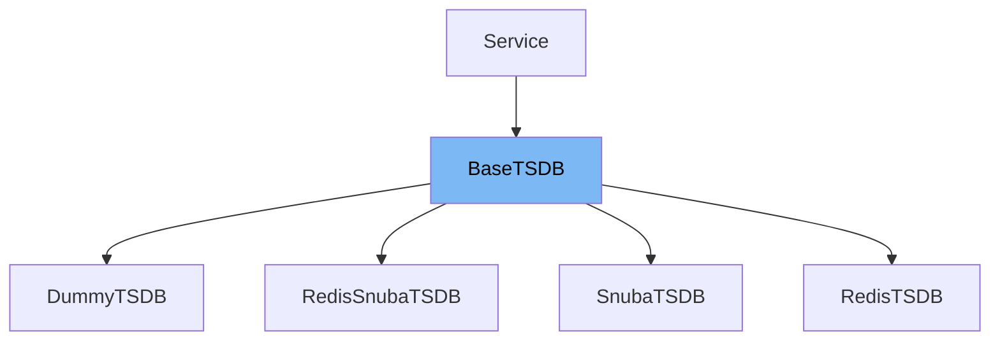

This document will cover the class <SwmToken path="src/sentry/tsdb/base.py" pos="113:2:2" line-data="class BaseTSDB(Service):">`BaseTSDB`</SwmToken> in detail. We will cover:

1. What <SwmToken path="src/sentry/tsdb/base.py" pos="113:2:2" line-data="class BaseTSDB(Service):">`BaseTSDB`</SwmToken> is.
2. Variables and functions defined in <SwmToken path="src/sentry/tsdb/base.py" pos="113:2:2" line-data="class BaseTSDB(Service):">`BaseTSDB`</SwmToken>.
3. Usage example of <SwmToken path="src/sentry/tsdb/base.py" pos="113:2:2" line-data="class BaseTSDB(Service):">`BaseTSDB`</SwmToken> in `RedisTSDB`.



# What is <SwmToken path="src/sentry/tsdb/base.py" pos="113:2:2" line-data="class BaseTSDB(Service):">`BaseTSDB`</SwmToken>

<SwmToken path="src/sentry/tsdb/base.py" pos="113:2:2" line-data="class BaseTSDB(Service):">`BaseTSDB`</SwmToken> is a base class for time series databases in the Sentry project. It provides a common interface and shared functionality for different time series database implementations. This class defines various methods for reading and writing time series data, managing rollups, and handling distinct counts and frequencies.

<SwmSnippet path="/src/sentry/tsdb/base.py" line="114">

---

# Variables and functions

The variable <SwmToken path="src/sentry/tsdb/base.py" pos="114:1:1" line-data="    __read_methods__ = frozenset(">`__read_methods__`</SwmToken> is a frozenset that contains the names of all the read methods available in the <SwmToken path="src/sentry/tsdb/base.py" pos="113:2:2" line-data="class BaseTSDB(Service):">`BaseTSDB`</SwmToken> class. These methods are used to retrieve data from the time series database.

```python
    __read_methods__ = frozenset(
        [
            "get_range",
            "get_sums",
            "get_distinct_counts_series",
            "get_distinct_counts_totals",
            "get_distinct_counts_union",
            "get_most_frequent",
            "get_most_frequent_series",
            "get_frequency_series",
            "get_frequency_totals",
        ]
    )
```

---

</SwmSnippet>

<SwmSnippet path="/src/sentry/tsdb/base.py" line="128">

---

The variable <SwmToken path="src/sentry/tsdb/base.py" pos="128:1:1" line-data="    __write_methods__ = frozenset(">`__write_methods__`</SwmToken> is a frozenset that contains the names of all the write methods available in the <SwmToken path="src/sentry/tsdb/base.py" pos="113:2:2" line-data="class BaseTSDB(Service):">`BaseTSDB`</SwmToken> class. These methods are used to write data to the time series database.

```python
    __write_methods__ = frozenset(
        [
            "incr",
            "incr_multi",
            "merge",
            "delete",
            "record",
            "record_multi",
            "merge_distinct_counts",
            "delete_distinct_counts",
            "record_frequency_multi",
            "merge_frequencies",
            "delete_frequencies",
            "flush",
        ]
    )
```

---

</SwmSnippet>

<SwmSnippet path="/src/sentry/tsdb/base.py" line="145">

---

The variable <SwmToken path="src/sentry/tsdb/base.py" pos="145:1:1" line-data="    __all__ = (">`__all__`</SwmToken> is a frozenset that combines the read methods, write methods, and additional methods available in the <SwmToken path="src/sentry/tsdb/base.py" pos="113:2:2" line-data="class BaseTSDB(Service):">`BaseTSDB`</SwmToken> class. This variable provides a comprehensive list of all the methods that can be used with <SwmToken path="src/sentry/tsdb/base.py" pos="113:2:2" line-data="class BaseTSDB(Service):">`BaseTSDB`</SwmToken>.

```python
    __all__ = (
        frozenset(
            [
                "get_earliest_timestamp",
                "get_optimal_rollup",
                "get_optimal_rollup_series",
                "get_rollups",
                "make_series",
                "models_with_environment_support",
                "normalize_to_epoch",
                "rollup",
            ]
        )
        | __write_methods__
        | __read_methods__
    )
```

---

</SwmSnippet>

<SwmSnippet path="/src/sentry/tsdb/base.py" line="162">

---

The variable <SwmToken path="src/sentry/tsdb/base.py" pos="162:1:1" line-data="    models_with_environment_support = frozenset(">`models_with_environment_support`</SwmToken> is a frozenset that contains the models which support environment parameters. This is used to validate if a model can handle environment-specific data.

```python
    models_with_environment_support = frozenset(
        [
            TSDBModel.project,
            TSDBModel.group,
            TSDBModel.release,
            TSDBModel.users_affected_by_group,
            TSDBModel.users_affected_by_project,
        ]
    )
```

---

</SwmSnippet>

<SwmSnippet path="/src/sentry/tsdb/base.py" line="172">

---

The <SwmToken path="src/sentry/tsdb/base.py" pos="172:3:3" line-data="    def __init__(">`__init__`</SwmToken> function initializes the <SwmToken path="src/sentry/tsdb/base.py" pos="113:2:2" line-data="class BaseTSDB(Service):">`BaseTSDB`</SwmToken> class. It sets up the rollups and legacy rollups configurations. Rollups define the granularity of the time series data, and legacy rollups store previous configurations.

```python
    def __init__(
        self,
        rollups: Iterable[tuple[int, int]] | None = None,
        legacy_rollups: dict[int, int] | None = None,
        **options: object,
    ):
        if rollups is None:
            rollups = settings.SENTRY_TSDB_ROLLUPS

        self.rollups: dict[int, int] = dict(rollups)

        # The ``SENTRY_TSDB_LEGACY_ROLLUPS`` setting should be used to store
        # previous rollup configuration values after they are modified in
        # ``SENTRY_TSDB_ROLLUPS``. The values can be removed after the new
        # rollup period is full of new data.
        if legacy_rollups is None:
            legacy_rollups = getattr(settings, "SENTRY_TSDB_LEGACY_ROLLUPS", {})

        self.__legacy_rollups = legacy_rollups
```

---

</SwmSnippet>

<SwmSnippet path="/src/sentry/tsdb/base.py" line="192">

---

The <SwmToken path="src/sentry/tsdb/base.py" pos="192:3:3" line-data="    def validate_arguments(">`validate_arguments`</SwmToken> function checks if the provided models and environment IDs are valid. It raises a <SwmToken path="src/sentry/tsdb/base.py" pos="198:3:3" line-data="                raise ValueError(&quot;not all models support environment parameters&quot;)">`ValueError`</SwmToken> if any unsupported models are found.

```python
    def validate_arguments(
        self, models: list[TSDBModel], environment_ids: Iterable[int | None]
    ) -> None:
        if any(e is not None for e in environment_ids):
            unsupported_models = set(models) - self.models_with_environment_support
            if unsupported_models:
                raise ValueError("not all models support environment parameters")

```

---

</SwmSnippet>

<SwmSnippet path="/src/sentry/tsdb/base.py" line="200">

---

The <SwmToken path="src/sentry/tsdb/base.py" pos="200:3:3" line-data="    def get_rollups(self) -&gt; dict[int, int]:">`get_rollups`</SwmToken> function returns the current rollups configuration as a dictionary.

```python
    def get_rollups(self) -> dict[int, int]:
        return self.rollups

```

---

</SwmSnippet>

<SwmSnippet path="/src/sentry/tsdb/base.py" line="203">

---

The <SwmToken path="src/sentry/tsdb/base.py" pos="203:3:3" line-data="    def normalize_to_epoch(self, timestamp: datetime, seconds: int) -&gt; int:">`normalize_to_epoch`</SwmToken> function converts a given timestamp to an epoch timestamp, normalized to the specified number of seconds.

```python
    def normalize_to_epoch(self, timestamp: datetime, seconds: int) -> int:
        """
        Given a ``timestamp`` (datetime object) normalize to an epoch timestamp.

        i.e. if the rollup is minutes, the resulting timestamp would have
        the seconds and microseconds rounded down.
        """
        epoch = int(timestamp.timestamp())
        return epoch - (epoch % seconds)

```

---

</SwmSnippet>

<SwmSnippet path="/src/sentry/tsdb/base.py" line="213">

---

The <SwmToken path="src/sentry/tsdb/base.py" pos="213:3:3" line-data="    def normalize_ts_to_epoch(self, epoch: float, seconds: int) -&gt; float:">`normalize_ts_to_epoch`</SwmToken> function normalizes an epoch timestamp to the specified number of seconds.

```python
    def normalize_ts_to_epoch(self, epoch: float, seconds: int) -> float:
        """
        Given a ``epoch`` normalize to an epoch rollup.
        """
        return epoch - (epoch % seconds)

```

---

</SwmSnippet>

<SwmSnippet path="/src/sentry/tsdb/base.py" line="219">

---

The <SwmToken path="src/sentry/tsdb/base.py" pos="219:3:3" line-data="    def normalize_to_rollup(self, timestamp: datetime | float, seconds: int) -&gt; int:">`normalize_to_rollup`</SwmToken> function normalizes a given timestamp to an epoch rollup.

```python
    def normalize_to_rollup(self, timestamp: datetime | float, seconds: int) -> int:
        """
        Given a ``timestamp`` (datetime object) normalize to an epoch rollup.
        """
        if isinstance(timestamp, datetime):
            epoch = int(timestamp.timestamp())
        else:
            epoch = int(timestamp)
        return int(epoch / seconds)

```

---

</SwmSnippet>

<SwmSnippet path="/src/sentry/tsdb/base.py" line="229">

---

The <SwmToken path="src/sentry/tsdb/base.py" pos="229:3:3" line-data="    def normalize_ts_to_rollup(self, epoch: float, seconds: int) -&gt; int:">`normalize_ts_to_rollup`</SwmToken> function normalizes an epoch timestamp to an epoch rollup.

```python
    def normalize_ts_to_rollup(self, epoch: float, seconds: int) -> int:
        """
        Given a ``epoch`` normalize to an epoch rollup.
        """
        return int(epoch / seconds)

```

---

</SwmSnippet>

<SwmSnippet path="/src/sentry/tsdb/base.py" line="235">

---

The <SwmToken path="src/sentry/tsdb/base.py" pos="235:3:3" line-data="    def get_optimal_rollup(self, start_timestamp: datetime, end_timestamp: datetime) -&gt; int:">`get_optimal_rollup`</SwmToken> function identifies the lowest granularity rollup available within a given time range.

```python
    def get_optimal_rollup(self, start_timestamp: datetime, end_timestamp: datetime) -> int:
        """
        Identify the lowest granularity rollup available within the given time
        range.
        """
        num_seconds = int(end_timestamp.timestamp()) - int(start_timestamp.timestamp())

        # This loop attempts to find the smallest possible rollup that will
        # contain both the start and end timestamps. ``self.rollups`` is
        # ordered from the highest resolution (smallest interval) to lowest
        # resolution (largest interval.)
        # XXX: There is a bug here, since this function assumes that the end
        # timestamp is always equal to or greater than the current time. If the
        # time range is shifted far enough into the past (e.g. a 30 second
        # window, retrieved several days after it's occurrence), this can
        # return a rollup that has already been evicted due to TTL, even if a
        # lower resolution representation of the range exists.
        for rollup, samples in self.rollups.items():
            if rollup * samples >= num_seconds:
                return rollup

```

---

</SwmSnippet>

<SwmSnippet path="/src/sentry/tsdb/base.py" line="260">

---

The <SwmToken path="src/sentry/tsdb/base.py" pos="260:3:3" line-data="    def get_optimal_rollup_series(">`get_optimal_rollup_series`</SwmToken> function creates a series of timestamps with the optimal rollup resolution for a given time range.

```python
    def get_optimal_rollup_series(
        self, start: datetime, end: datetime | None = None, rollup: int | None = None
    ) -> tuple[int, list[int]]:
        if end is None:
            end = timezone.now()

        if rollup is None:
            rollup = self.get_optimal_rollup(start, end)

        # This attempts to create a range with a duration as close as possible
        # to the requested interval using the requested (or inferred) rollup
        # resolution. This result always includes the ``end`` timestamp, but
        # may not include the ``start`` timestamp.
        series = []
        timestamp = end
        while timestamp >= start:
            series.append(self.normalize_to_epoch(timestamp, rollup))
            timestamp = timestamp - timedelta(seconds=rollup)

        return rollup, series[::-1]
```

---

</SwmSnippet>

<SwmSnippet path="/src/sentry/tsdb/base.py" line="281">

---

The <SwmToken path="src/sentry/tsdb/base.py" pos="281:3:3" line-data="    def get_active_series(">`get_active_series`</SwmToken> function returns a dictionary of active series for each rollup interval.

```python
    def get_active_series(
        self,
        start: datetime | None = None,
        end: datetime | None = None,
        timestamp: datetime | None = None,
    ) -> dict[int, list[datetime]]:
        rollups: dict[int, list[datetime]] = {}
        for rollup, samples in self.rollups.items():
            _, series = self.get_optimal_rollup_series(
                (
                    start
                    if start is not None
                    else to_datetime(self.get_earliest_timestamp(rollup, timestamp=timestamp))
                ),
                end,
                rollup=rollup,
            )
            rollups[rollup] = [to_datetime(item) for item in series]
        return rollups
```

---

</SwmSnippet>

<SwmSnippet path="/src/sentry/tsdb/base.py" line="301">

---

The <SwmToken path="src/sentry/tsdb/base.py" pos="301:3:3" line-data="    def make_series(">`make_series`</SwmToken> function creates a series of data points with default values for a given time range and rollup interval.

```python
    def make_series(
        self, default, start: datetime, end: datetime | None = None, rollup: int | None = None
    ) -> list[tuple[int, int]]:
        f = default if callable(default) else lambda timestamp: default
        return [
            (timestamp, f(timestamp))
            for timestamp in self.get_optimal_rollup_series(start, end, rollup)[1]
        ]
```

---

</SwmSnippet>

<SwmSnippet path="/src/sentry/tsdb/base.py" line="310">

---

The <SwmToken path="src/sentry/tsdb/base.py" pos="310:3:3" line-data="    def calculate_expiry(self, rollup: int, samples: int, timestamp: datetime) -&gt; int:">`calculate_expiry`</SwmToken> function calculates the expiration time for a rollup based on the number of samples and the timestamp.

```python
    def calculate_expiry(self, rollup: int, samples: int, timestamp: datetime) -> int:
        """
        Calculate the expiration time for a rollup.

        :param rollup: rollup interval (in seconds)
        :param samples: number of samples to maintain
        :param timestamp: datetime used to calculate the rollup epoch
        """
        epoch = self.normalize_to_epoch(timestamp, rollup)
        return epoch + (rollup * samples)

```

---

</SwmSnippet>

<SwmSnippet path="/src/sentry/tsdb/base.py" line="321">

---

The <SwmToken path="src/sentry/tsdb/base.py" pos="321:3:3" line-data="    def get_earliest_timestamp(self, rollup: int, timestamp: datetime | None = None) -&gt; int:">`get_earliest_timestamp`</SwmToken> function calculates the earliest available timestamp for a rollup.

```python
    def get_earliest_timestamp(self, rollup: int, timestamp: datetime | None = None) -> int:
        """
        Calculate the earliest available timestamp for a rollup.
        """
        if timestamp is None:
            timestamp = timezone.now()

        samples = self.__legacy_rollups.get(rollup)
        if samples is None:
            samples = self.rollups[rollup]

        seconds = rollup * (samples - 1)
        lifespan = timedelta(seconds=seconds)
        return self.normalize_to_epoch(timestamp - lifespan, rollup)

```

---

</SwmSnippet>

<SwmSnippet path="/src/sentry/tsdb/base.py" line="336">

---

The <SwmToken path="src/sentry/tsdb/base.py" pos="336:3:3" line-data="    def incr(">`incr`</SwmToken> function is a placeholder for incrementing a counter for a given model and key. It raises a <SwmToken path="src/sentry/tsdb/base.py" pos="349:3:3" line-data="        raise NotImplementedError">`NotImplementedError`</SwmToken> as it needs to be implemented by subclasses.

```python
    def incr(
        self,
        model: TSDBModel,
        key: TSDBKey,
        timestamp: datetime | None = None,
        count: int = 1,
        environment_id: int | None = None,
    ) -> None:
        """
        Increment project ID=1:

        >>> incr(TimeSeriesModel.project, 1)
        """
        raise NotImplementedError

```

---

</SwmSnippet>

<SwmSnippet path="/src/sentry/tsdb/base.py" line="351">

---

The <SwmToken path="src/sentry/tsdb/base.py" pos="351:3:3" line-data="    def incr_multi(">`incr_multi`</SwmToken> function increments multiple counters for given models and keys. It calls the <SwmToken path="src/sentry/tsdb/base.py" pos="130:2:2" line-data="            &quot;incr&quot;,">`incr`</SwmToken> function for each item in the list.

```python
    def incr_multi(
        self,
        items: Sequence[tuple[TSDBModel, TSDBKey] | tuple[TSDBModel, TSDBKey, IncrMultiOptions]],
        timestamp: datetime | None = None,
        count: int = 1,
        environment_id: int | None = None,
    ) -> None:
        """
        Increment project ID=1 and group ID=5:

        >>> incr_multi([(TimeSeriesModel.project, 1), (TimeSeriesModel.group, 5)])

        Increment individual timestamps:

        >>> incr_multi([(TimeSeriesModel.project, 1, {"timestamp": ...}),
        ...             (TimeSeriesModel.group, 5, {"timestamp": ...})])
        """
        for item in items:
            if len(item) == 2:
                model, key = item
                _timestamp: datetime | None = timestamp
```

---

</SwmSnippet>

<SwmSnippet path="/src/sentry/tsdb/base.py" line="388">

---

The <SwmToken path="src/sentry/tsdb/base.py" pos="388:3:3" line-data="    def merge(">`merge`</SwmToken> function is a placeholder for merging counters from source keys to a destination key. It raises a <SwmToken path="src/sentry/tsdb/base.py" pos="399:3:3" line-data="        raise NotImplementedError">`NotImplementedError`</SwmToken> as it needs to be implemented by subclasses.

```python
    def merge(
        self,
        model: TSDBModel,
        destination: int,
        sources: list[int],
        timestamp: datetime | None = None,
        environment_ids: Iterable[int] | None = None,
    ) -> None:
        """
        Transfer all counters from the source keys to the destination key.
        """
        raise NotImplementedError
```

---

</SwmSnippet>

<SwmSnippet path="/src/sentry/tsdb/base.py" line="401">

---

The <SwmToken path="src/sentry/tsdb/base.py" pos="401:3:3" line-data="    def delete(">`delete`</SwmToken> function is a placeholder for deleting counters for given models and keys. It raises a <SwmToken path="src/sentry/tsdb/base.py" pos="413:3:3" line-data="        raise NotImplementedError">`NotImplementedError`</SwmToken> as it needs to be implemented by subclasses.

```python
    def delete(
        self,
        models: list[TSDBModel],
        keys: list[int],
        start: datetime | None = None,
        end: datetime | None = None,
        timestamp: datetime | None = None,
        environment_ids: Iterable[int | None] | None = None,
    ) -> None:
        """
        Delete all counters.
        """
        raise NotImplementedError
```

---

</SwmSnippet>

<SwmSnippet path="/src/sentry/tsdb/base.py" line="415">

---

The <SwmToken path="src/sentry/tsdb/base.py" pos="415:3:3" line-data="    def get_range(">`get_range`</SwmToken> function is a placeholder for retrieving a range of data for given models and keys. It raises a <SwmToken path="src/sentry/tsdb/base.py" pos="349:3:3" line-data="        raise NotImplementedError">`NotImplementedError`</SwmToken> as it needs to be implemented by subclasses.

```python
    def get_range(
        self,
        model: TSDBModel,
        keys: Sequence[TSDBKey],
        start: datetime,
        end: datetime,
        rollup: int | None = None,
        environment_ids: Sequence[int] | None = None,
        conditions=None,
        use_cache: bool = False,
        jitter_value: int | None = None,
        tenant_ids: dict[str, str | int] | None = None,
        referrer_suffix: str | None = None,
    ) -> dict[TSDBKey, list[tuple[int, int]]]:
        """
        To get a range of data for group ID=[1, 2, 3]:

        Returns a mapping of key => [(timestamp, count), ...].

        >>> now = timezone.now()
        >>> get_range([TSDBModel.group], [1, 2, 3],
```

---

</SwmSnippet>

<SwmSnippet path="/src/sentry/tsdb/base.py" line="441">

---

The <SwmToken path="src/sentry/tsdb/base.py" pos="441:3:3" line-data="    def get_sums(">`get_sums`</SwmToken> function retrieves the sum of data points for given models and keys within a specified time range.

```python
    def get_sums(
        self,
        model: TSDBModel,
        keys: list[int],
        start: datetime,
        end: datetime,
        rollup: int | None = None,
        environment_id: int | None = None,
        use_cache: bool = False,
        jitter_value: int | None = None,
        tenant_ids: dict[str, str | int] | None = None,
        referrer_suffix: str | None = None,
    ) -> dict[int, int]:
        range_set = self.get_range(
            model,
            keys,
            start,
            end,
            rollup,
            environment_ids=[environment_id] if environment_id is not None else None,
            use_cache=use_cache,
```

---

</SwmSnippet>

<SwmSnippet path="/src/sentry/tsdb/base.py" line="469">

---

The <SwmToken path="src/sentry/tsdb/base.py" pos="469:3:3" line-data="    def _add_jitter_to_series(">`_add_jitter_to_series`</SwmToken> function adds jitter to a series of timestamps to avoid collisions.

```python
    def _add_jitter_to_series(
        self, series: list[int], start: datetime, rollup: int, jitter_value: int | None
    ) -> list[int]:
        if jitter_value and series:
            jitter = jitter_value % rollup
            if (start - to_datetime(series[0])).total_seconds() < jitter:
                jitter -= rollup
            return [value + jitter for value in series]
        return series
```

---

</SwmSnippet>

<SwmSnippet path="/src/sentry/tsdb/base.py" line="479">

---

The <SwmToken path="src/sentry/tsdb/base.py" pos="479:3:3" line-data="    def rollup(">`rollup`</SwmToken> function aggregates data points into larger intervals based on the specified rollup interval.

```python
    def rollup(
        self, values: Mapping[TSDBKey, Sequence[tuple[float, int]]], rollup: int
    ) -> dict[TSDBKey, list[list[float]]]:
        """
        Given a set of values (as returned from ``get_range``), roll them up
        using the ``rollup`` time (in seconds).
        """
        result: dict[TSDBKey, list[list[float]]] = {}
        for key, points in values.items():
            result[key] = []
            last_new_ts = None
            for ts, count in points:
                new_ts = self.normalize_ts_to_epoch(ts, rollup)
                if new_ts == last_new_ts:
                    result[key][-1][1] += count
                else:
                    result[key].append([new_ts, count])
                    last_new_ts = new_ts
        return result
```

---

</SwmSnippet>

<SwmSnippet path="/src/sentry/tsdb/base.py" line="499">

---

The <SwmToken path="src/sentry/tsdb/base.py" pos="499:3:3" line-data="    def record(">`record`</SwmToken> function is a placeholder for recording occurrences of items in a distinct counter. It raises a <SwmToken path="src/sentry/tsdb/base.py" pos="510:3:3" line-data="        raise NotImplementedError">`NotImplementedError`</SwmToken> as it needs to be implemented by subclasses.

```python
    def record(
        self,
        model: TSDBModel,
        key: int,
        values: Iterable[str],
        timestamp: datetime | None = None,
        environment_id: int | None = None,
    ) -> None:
        """
        Record occurrence of items in a single distinct counter.
        """
        raise NotImplementedError

```

---

</SwmSnippet>

&nbsp;

*This is an auto-generated document by Swimm AI 🌊 and has not yet been verified by a human*

<SwmMeta version="3.0.0" repo-id="Z2l0aHViJTNBJTNBc2VudHJ5LWRlbW8tMSUzQSUzQVN3aW1tLURlbW8=" repo-name="sentry-demo-1" doc-type="class"><sup>Powered by [Swimm](/)</sup></SwmMeta>
