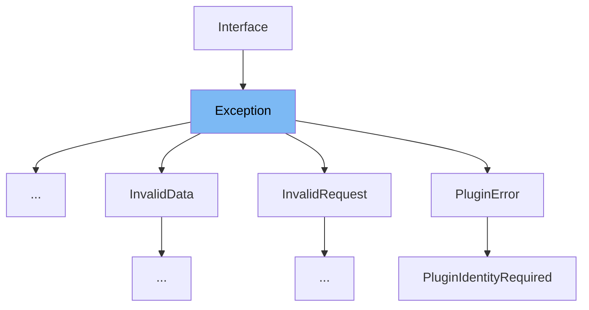

This document will cover the class <SwmToken path="src/sentry/interfaces/exception.py" pos="10:6:6" line-data="__all__ = (&quot;Exception&quot;, &quot;Mechanism&quot;, &quot;upgrade_legacy_mechanism&quot;)">`Exception`</SwmToken> in the file <SwmPath>[src/sentry/interfaces/exception.py](src/sentry/interfaces/exception.py)</SwmPath>. We will cover:

1. What is <SwmToken path="src/sentry/interfaces/exception.py" pos="10:6:6" line-data="__all__ = (&quot;Exception&quot;, &quot;Mechanism&quot;, &quot;upgrade_legacy_mechanism&quot;)">`Exception`</SwmToken>
2. Variables and functions
3. Usage example



# What is Exception

The <SwmToken path="src/sentry/interfaces/exception.py" pos="10:6:6" line-data="__all__ = (&quot;Exception&quot;, &quot;Mechanism&quot;, &quot;upgrade_legacy_mechanism&quot;)">`Exception`</SwmToken> class in <SwmPath>[src/sentry/interfaces/exception.py](src/sentry/interfaces/exception.py)</SwmPath> represents a list of exception values, typically containing a single exception with an optional stacktrace interface. Each exception has a mandatory <SwmToken path="src/sentry/interfaces/exception.py" pos="450:6:6" line-data="        for index, value in values.items():">`value`</SwmToken> argument and optional <SwmToken path="src/sentry/interfaces/exception.py" pos="466:10:10" line-data="            output.append(f&quot;{exc.type}: {exc.value}\n&quot;)">`type`</SwmToken> and <SwmToken path="src/sentry/interfaces/exception.py" pos="219:2:2" line-data="    ``module`` argument describing the exception class type and">`module`</SwmToken> arguments describing the exception class type and module namespace. The class allows binding a stacktrace interface to an exception, and the spec is identical to <SwmToken path="src/sentry/interfaces/exception.py" pos="439:3:3" line-data="                v.stacktrace.get_has_system_frames() for v in self.values if v and v.stacktrace">`stacktrace`</SwmToken>.

<SwmSnippet path="/src/sentry/interfaces/exception.py" line="393">

---

# Variables and functions

The variable <SwmToken path="src/sentry/interfaces/exception.py" pos="393:1:1" line-data="    score = 2000">`score`</SwmToken> is used to assign a score to the exception interface, which is set to 2000.

```python
    score = 2000
```

---

</SwmSnippet>

<SwmSnippet path="/src/sentry/interfaces/exception.py" line="394">

---

The variable <SwmToken path="src/sentry/interfaces/exception.py" pos="394:1:1" line-data="    grouping_variants = [&quot;system&quot;, &quot;app&quot;]">`grouping_variants`</SwmToken> is a list containing the strings 'system' and 'app', which are used for grouping exceptions.

```python
    grouping_variants = ["system", "app"]
```

---

</SwmSnippet>

<SwmSnippet path="/src/sentry/interfaces/exception.py" line="396">

---

The function <SwmToken path="src/sentry/interfaces/exception.py" pos="396:3:3" line-data="    def exceptions(self):">`exceptions`</SwmToken> returns the list of exception values, filtered using the <SwmToken path="src/sentry/interfaces/exception.py" pos="397:3:3" line-data="        return get_path(self.values, filter=True)">`get_path`</SwmToken> utility.

```python
    def exceptions(self):
        return get_path(self.values, filter=True)

```

---

</SwmSnippet>

<SwmSnippet path="/src/sentry/interfaces/exception.py" line="399">

---

The function <SwmToken path="src/sentry/interfaces/exception.py" pos="399:3:3" line-data="    def __getitem__(self, key):">`__getitem__`</SwmToken> allows accessing an exception by its index.

```python
    def __getitem__(self, key):
        return self.exceptions()[key]
```

---

</SwmSnippet>

<SwmSnippet path="/src/sentry/interfaces/exception.py" line="402">

---

The function <SwmToken path="src/sentry/interfaces/exception.py" pos="402:3:3" line-data="    def __iter__(self):">`__iter__`</SwmToken> returns an iterator over the list of exceptions.

```python
    def __iter__(self):
        return iter(self.exceptions())
```

---

</SwmSnippet>

<SwmSnippet path="/src/sentry/interfaces/exception.py" line="405">

---

The function <SwmToken path="src/sentry/interfaces/exception.py" pos="405:3:3" line-data="    def __len__(self):">`__len__`</SwmToken> returns the number of exceptions in the list.

```python
    def __len__(self):
        return len(self.exceptions())
```

---

</SwmSnippet>

<SwmSnippet path="/src/sentry/interfaces/exception.py" line="409">

---

The class method <SwmToken path="src/sentry/interfaces/exception.py" pos="409:3:3" line-data="    def to_python(cls, data, **kwargs):">`to_python`</SwmToken> converts the input data to a Python object, processing each exception value and converting it using the <SwmToken path="src/sentry/interfaces/exception.py" pos="416:5:5" line-data="                values.append(SingleException.to_python_subpath(data, [&quot;values&quot;, i], **kwargs))">`SingleException`</SwmToken> class.

```python
    def to_python(cls, data, **kwargs):
        values = []
        for i, v in enumerate(get_path(data, "values", default=[])):
            if not v:
                # Cannot skip over None-values, need to preserve offsets
                values.append(v)
            else:
                values.append(SingleException.to_python_subpath(data, ["values", i], **kwargs))

        return super().to_python(
            {"values": values, "exc_omitted": data.get("exc_omitted")}, **kwargs
        )
```

---

</SwmSnippet>

<SwmSnippet path="/src/sentry/interfaces/exception.py" line="425">

---

The function <SwmToken path="src/sentry/interfaces/exception.py" pos="425:3:3" line-data="    def to_json(self):">`to_json`</SwmToken> converts the exception data to a JSON-compatible format, pruning empty keys.

```python
    def to_json(self):
        return prune_empty_keys(
            {
                "values": [v and v.to_json() for v in self.values] or None,
                "exc_omitted": self.exc_omitted,
            }
        )
```

---

</SwmSnippet>

<SwmSnippet path="/src/sentry/interfaces/exception.py" line="433">

---

The function <SwmToken path="src/sentry/interfaces/exception.py" pos="433:3:3" line-data="    def get_api_context(self, is_public=False, platform=None):">`get_api_context`</SwmToken> returns the API context for the exception, including details about the stacktrace and whether system frames are present.

```python
    def get_api_context(self, is_public=False, platform=None):
        return {
            "values": [
                v.get_api_context(is_public=is_public, platform=platform) for v in self.values if v
            ],
            "hasSystemFrames": any(
                v.stacktrace.get_has_system_frames() for v in self.values if v and v.stacktrace
            ),
            "excOmitted": self.exc_omitted,
        }
```

---

</SwmSnippet>

<SwmSnippet path="/src/sentry/interfaces/exception.py" line="444">

---

The function <SwmToken path="src/sentry/interfaces/exception.py" pos="444:3:3" line-data="    def get_api_meta(self, meta, is_public=False, platform=None):">`get_api_meta`</SwmToken> returns metadata for the exception, including details about the mechanism and stacktrace.

```python
    def get_api_meta(self, meta, is_public=False, platform=None):
        if not meta:
            return meta

        result = {}
        values = meta.get("values", meta)
        for index, value in values.items():
            exc = self.values[int(index)]
            if exc is not None:
                result[index] = exc.get_api_meta(value, is_public=is_public, platform=platform)

        return {"values": result}
```

---

</SwmSnippet>

<SwmSnippet path="/src/sentry/interfaces/exception.py" line="457">

---

The function <SwmToken path="src/sentry/interfaces/exception.py" pos="457:3:3" line-data="    def to_string(self, event) -&gt; str:">`to_string`</SwmToken> returns a string representation of the exception, including the type, value, and stacktrace.

```python
    def to_string(self, event) -> str:
        if not self.values:
            return ""

        output = []
        for exc in self.values:
            if not exc:
                continue

            output.append(f"{exc.type}: {exc.value}\n")
            if exc.stacktrace:
                output.append(
                    exc.stacktrace.get_stacktrace(
                        event, system_frames=False, max_frames=5, header=False
                    )
                    + "\n\n"
                )
        return "".join(output).strip()

```

---

</SwmSnippet>

<SwmSnippet path="/src/sentry/interfaces/exception.py" line="476">

---

The function <SwmToken path="src/sentry/interfaces/exception.py" pos="476:3:3" line-data="    def get_stacktrace(self, *args, **kwargs):">`get_stacktrace`</SwmToken> returns the stacktrace of the last exception in the list.

```python
    def get_stacktrace(self, *args, **kwargs):
        exc = self.values[-1]
        if exc.stacktrace:
            return exc.stacktrace.get_stacktrace(*args, **kwargs)
        return ""
```

---

</SwmSnippet>

<SwmSnippet path="/src/sentry/interfaces/exception.py" line="482">

---

The function <SwmToken path="src/sentry/interfaces/exception.py" pos="482:3:3" line-data="    def iter_tags(self):">`iter_tags`</SwmToken> yields tags for the exception, including details about the mechanism if present.

```python
    def iter_tags(self):
        if not self.values or not self.values[-1]:
            return

        mechanism = self.values[-1].mechanism
        if mechanism:
            yield from mechanism.iter_tags()
```

---

</SwmSnippet>

# Usage example

Here is an example of how to use the <SwmToken path="src/sentry/interfaces/exception.py" pos="10:6:6" line-data="__all__ = (&quot;Exception&quot;, &quot;Mechanism&quot;, &quot;upgrade_legacy_mechanism&quot;)">`Exception`</SwmToken> class in the <SwmToken path="src/sentry/api/exceptions.py" pos="141:2:2" line-data="class InvalidRepository(Exception):">`InvalidRepository`</SwmToken> class.

<SwmSnippet path="/src/sentry/api/exceptions.py" line="10">

---

The <SwmToken path="src/sentry/api/exceptions.py" pos="141:2:2" line-data="class InvalidRepository(Exception):">`InvalidRepository`</SwmToken> class extends the <SwmToken path="src/sentry/interfaces/exception.py" pos="10:6:6" line-data="__all__ = (&quot;Exception&quot;, &quot;Mechanism&quot;, &quot;upgrade_legacy_mechanism&quot;)">`Exception`</SwmToken> class, demonstrating how to use it in a custom exception class.

```python
from sentry.organizations.services.organization.model import RpcOrganization
```

---

</SwmSnippet>

&nbsp;

*This is an auto-generated document by Swimm AI 🌊 and has not yet been verified by a human*

<SwmMeta version="3.0.0" repo-id="Z2l0aHViJTNBJTNBc2VudHJ5LWRlbW8tMSUzQSUzQVN3aW1tLURlbW8=" repo-name="sentry-demo-1" doc-type="class"><sup>Powered by [Swimm](/)</sup></SwmMeta>
