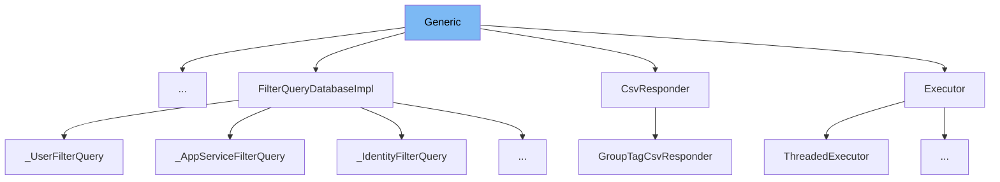

This document will cover the class <SwmToken path="static/app/components/events/interfaces/generic.tsx" pos="48:4:4" line-data="export function Generic({type, data, meta}: Props) {">`Generic`</SwmToken> in the file <SwmPath>[static/app/components/events/interfaces/generic.tsx](static/app/components/events/interfaces/generic.tsx)</SwmPath>. We will discuss:

1. What <SwmToken path="static/app/components/events/interfaces/generic.tsx" pos="48:4:4" line-data="export function Generic({type, data, meta}: Props) {">`Generic`</SwmToken> is and its purpose.
2. The variables and functions defined in <SwmToken path="static/app/components/events/interfaces/generic.tsx" pos="48:4:4" line-data="export function Generic({type, data, meta}: Props) {">`Generic`</SwmToken>.
3. An example of how to use <SwmToken path="static/app/components/events/interfaces/generic.tsx" pos="48:4:4" line-data="export function Generic({type, data, meta}: Props) {">`Generic`</SwmToken>.



# What is Generic

The <SwmToken path="static/app/components/events/interfaces/generic.tsx" pos="48:4:4" line-data="export function Generic({type, data, meta}: Props) {">`Generic`</SwmToken> component in <SwmPath>[static/app/components/events/interfaces/generic.tsx](static/app/components/events/interfaces/generic.tsx)</SwmPath> is a React functional component used to display different views of event data. It provides a segmented control to switch between a 'report' view and a 'raw' view, rendering the data accordingly.

<SwmSnippet path="/static/app/components/events/interfaces/generic.tsx" line="40">

---

# Variables and functions

The <SwmToken path="static/app/components/events/interfaces/generic.tsx" pos="40:2:2" line-data="type Props = {">`Props`</SwmToken> type defines the properties that the <SwmToken path="static/app/components/events/interfaces/generic.tsx" pos="48:4:4" line-data="export function Generic({type, data, meta}: Props) {">`Generic`</SwmToken> component expects. It includes <SwmToken path="static/app/components/events/interfaces/generic.tsx" pos="41:1:1" line-data="  data: Record&lt;string, any&gt; | null;">`data`</SwmToken>, <SwmToken path="static/app/components/events/interfaces/generic.tsx" pos="40:0:0" line-data="type Props = {">`type`</SwmToken>, and an optional <SwmToken path="static/app/components/events/interfaces/generic.tsx" pos="43:1:1" line-data="  meta?: Record&lt;string, any&gt;;">`meta`</SwmToken>.

```tsx
type Props = {
  data: Record<string, any> | null;
  type: string;
  meta?: Record<string, any>;
};
```

---

</SwmSnippet>

<SwmSnippet path="/static/app/components/events/interfaces/generic.tsx" line="46">

---

The <SwmToken path="static/app/components/events/interfaces/generic.tsx" pos="46:2:2" line-data="type View = &#39;report&#39; | &#39;raw&#39;;">`View`</SwmToken> type is a union type that can either be 'report' or 'raw'. It is used to determine which view to display.

```tsx
type View = 'report' | 'raw';

```

---

</SwmSnippet>

<SwmSnippet path="/static/app/components/events/interfaces/generic.tsx" line="9">

---

The <SwmToken path="static/app/components/events/interfaces/generic.tsx" pos="9:2:2" line-data="function getView({">`getView`</SwmToken> function takes <SwmToken path="static/app/components/events/interfaces/generic.tsx" pos="10:1:1" line-data="  data,">`data`</SwmToken>, <SwmToken path="static/app/components/events/interfaces/generic.tsx" pos="11:1:1" line-data="  meta,">`meta`</SwmToken>, and <SwmToken path="static/app/components/events/interfaces/generic.tsx" pos="12:1:1" line-data="  view,">`view`</SwmToken> as arguments and returns the appropriate JSX based on the <SwmToken path="static/app/components/events/interfaces/generic.tsx" pos="12:1:1" line-data="  view,">`view`</SwmToken> value. It handles rendering for 'report' and 'raw' views.

```tsx
function getView({
  data,
  meta,
  view,
}: {
  data: Props['data'];
  view: View;
  meta?: Record<any, any>;
}) {
  switch (view) {
    case 'report':
      return !data ? (
        <AnnotatedText value={data} meta={meta?.['']} />
      ) : (
        <KeyValueList
          data={Object.entries(data).map(([key, value]) => ({
            key,
            value,
            subject: key,
            meta: meta?.[key]?.[''],
          }))}
```

---

</SwmSnippet>

<SwmSnippet path="/static/app/components/events/interfaces/generic.tsx" line="48">

---

The <SwmToken path="static/app/components/events/interfaces/generic.tsx" pos="48:4:4" line-data="export function Generic({type, data, meta}: Props) {">`Generic`</SwmToken> component itself. It uses the <SwmToken path="static/app/components/events/interfaces/generic.tsx" pos="49:12:12" line-data="  const [view, setView] = useState&lt;View&gt;(&#39;report&#39;);">`useState`</SwmToken> hook to manage the current view state and renders the <SwmToken path="static/app/components/events/interfaces/generic.tsx" pos="51:2:2" line-data="    &lt;InterimSection">`InterimSection`</SwmToken> component with a <SwmToken path="static/app/components/events/interfaces/generic.tsx" pos="55:2:2" line-data="        &lt;SegmentedControl">`SegmentedControl`</SwmToken> to switch between views. It calls <SwmToken path="static/app/components/events/interfaces/generic.tsx" pos="66:2:2" line-data="      {getView({view, data, meta})}">`getView`</SwmToken> to render the appropriate view based on the current state.

```tsx
export function Generic({type, data, meta}: Props) {
  const [view, setView] = useState<View>('report');
  return (
    <InterimSection
      type={type}
      title={t('Report')}
      actions={
        <SegmentedControl
          aria-label={t('View')}
          size="xs"
          value={view}
          onChange={setView}
        >
          <SegmentedControl.Item key="report">{t('Report')}</SegmentedControl.Item>
          <SegmentedControl.Item key="raw">{t('Raw')}</SegmentedControl.Item>
        </SegmentedControl>
      }
    >
      {getView({view, data, meta})}
    </InterimSection>
  );
```

---

</SwmSnippet>

# Usage example

Here is an example of how to use the <SwmToken path="static/app/components/events/interfaces/generic.tsx" pos="48:4:4" line-data="export function Generic({type, data, meta}: Props) {">`Generic`</SwmToken> component in a parent component:

```jsx
import {Generic} from 'static/app/components/events/interfaces/generic';

function ParentComponent() {
  const eventData = { key1: 'value1', key2: 'value2' };
  const eventMeta = { key1: { '': 'meta1' }, key2: { '': 'meta2' } };

  return (
    <Generic type="exampleType" data={eventData} meta={eventMeta} />
  );
}
```

In this example, `ParentComponent` imports and uses the <SwmToken path="static/app/components/events/interfaces/generic.tsx" pos="48:4:4" line-data="export function Generic({type, data, meta}: Props) {">`Generic`</SwmToken> component, passing in <SwmToken path="static/app/components/events/interfaces/generic.tsx" pos="40:0:0" line-data="type Props = {">`type`</SwmToken>, <SwmToken path="static/app/components/events/interfaces/generic.tsx" pos="10:1:1" line-data="  data,">`data`</SwmToken>, and <SwmToken path="static/app/components/events/interfaces/generic.tsx" pos="11:1:1" line-data="  meta,">`meta`</SwmToken> as props.

&nbsp;

*This is an auto-generated document by Swimm AI 🌊 and has not yet been verified by a human*

<SwmMeta version="3.0.0" repo-id="Z2l0aHViJTNBJTNBc2VudHJ5LWRlbW8tMSUzQSUzQVN3aW1tLURlbW8=" repo-name="sentry-demo-1" doc-type="class"><sup>Powered by [Swimm](/)</sup></SwmMeta>
