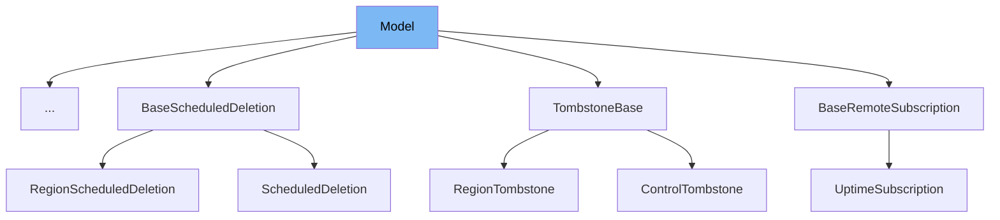

This document will cover the class <SwmToken path="src/sentry/dynamic_sampling/models/base.py" pos="29:2:2" line-data="class Model(ABC, Generic[Input, Output]):">`Model`</SwmToken> in the file <SwmPath>[src/sentry/dynamic_sampling/models/base.py](src/sentry/dynamic_sampling/models/base.py)</SwmPath>. We will discuss:

1. What <SwmToken path="src/sentry/dynamic_sampling/models/base.py" pos="29:2:2" line-data="class Model(ABC, Generic[Input, Output]):">`Model`</SwmToken> is and its purpose.
2. The variables and functions defined in <SwmToken path="src/sentry/dynamic_sampling/models/base.py" pos="29:2:2" line-data="class Model(ABC, Generic[Input, Output]):">`Model`</SwmToken>.
3. An example of how to use <SwmToken path="src/sentry/dynamic_sampling/models/base.py" pos="29:2:2" line-data="class Model(ABC, Generic[Input, Output]):">`Model`</SwmToken> in <SwmToken path="src/sentry/data_export/models.py" pos="160:2:2" line-data="class ExportedDataBlob(Model):">`ExportedDataBlob`</SwmToken>.



# What is Model

The <SwmToken path="src/sentry/dynamic_sampling/models/base.py" pos="29:2:2" line-data="class Model(ABC, Generic[Input, Output]):">`Model`</SwmToken> class in <SwmPath>[src/sentry/dynamic_sampling/models/base.py](src/sentry/dynamic_sampling/models/base.py)</SwmPath> is an abstract base class designed to define a generic model structure. It is used to create models that can process input data and produce output data. The class enforces the implementation of the <SwmToken path="src/sentry/dynamic_sampling/models/base.py" pos="31:3:3" line-data="    def _run(self, model_input: Input) -&gt; Output:">`_run`</SwmToken> method in any subclass, ensuring that the core functionality of running the model is defined by the subclass.

<SwmSnippet path="/src/sentry/dynamic_sampling/models/base.py" line="29">

---

# Variables and functions

The <SwmToken path="src/sentry/dynamic_sampling/models/base.py" pos="31:3:3" line-data="    def _run(self, model_input: Input) -&gt; Output:">`_run`</SwmToken> function is an abstract method that must be implemented by any subclass of <SwmToken path="src/sentry/dynamic_sampling/models/base.py" pos="29:2:2" line-data="class Model(ABC, Generic[Input, Output]):">`Model`</SwmToken>. It takes <SwmToken path="src/sentry/dynamic_sampling/models/base.py" pos="31:8:8" line-data="    def _run(self, model_input: Input) -&gt; Output:">`model_input`</SwmToken> as a parameter and is expected to return an output. This method defines the core logic of the model.

```python
class Model(ABC, Generic[Input, Output]):
    @abstractmethod
    def _run(self, model_input: Input) -> Output:
        raise NotImplementedError()
```

---

</SwmSnippet>

<SwmSnippet path="/src/sentry/dynamic_sampling/models/base.py" line="34">

---

The <SwmToken path="src/sentry/dynamic_sampling/models/base.py" pos="34:3:3" line-data="    def run(self, model_input: Input) -&gt; Output:">`run`</SwmToken> function is a concrete method that validates the <SwmToken path="src/sentry/dynamic_sampling/models/base.py" pos="34:8:8" line-data="    def run(self, model_input: Input) -&gt; Output:">`model_input`</SwmToken> before calling the <SwmToken path="src/sentry/dynamic_sampling/models/base.py" pos="38:5:5" line-data="        return self._run(model_input)">`_run`</SwmToken> method. If the input is not valid, it raises an <SwmToken path="src/sentry/dynamic_sampling/models/base.py" pos="36:3:3" line-data="            raise InvalidModelInputError()">`InvalidModelInputError`</SwmToken>. This function ensures that only valid inputs are processed by the model.

```python
    def run(self, model_input: Input) -> Output:
        if not model_input.validate():
            raise InvalidModelInputError()

        return self._run(model_input)
```

---

</SwmSnippet>

# Usage example

To use the <SwmToken path="src/sentry/dynamic_sampling/models/base.py" pos="29:2:2" line-data="class Model(ABC, Generic[Input, Output]):">`Model`</SwmToken> class, you need to create a subclass that implements the <SwmToken path="src/sentry/dynamic_sampling/models/base.py" pos="31:3:3" line-data="    def _run(self, model_input: Input) -&gt; Output:">`_run`</SwmToken> method. Here is an example of how to use <SwmToken path="src/sentry/dynamic_sampling/models/base.py" pos="29:2:2" line-data="class Model(ABC, Generic[Input, Output]):">`Model`</SwmToken> in <SwmToken path="src/sentry/data_export/models.py" pos="160:2:2" line-data="class ExportedDataBlob(Model):">`ExportedDataBlob`</SwmToken>.

<SwmSnippet path="/src/sentry/data_export/models.py" line="1">

---

The <SwmToken path="src/sentry/data_export/models.py" pos="160:2:2" line-data="class ExportedDataBlob(Model):">`ExportedDataBlob`</SwmToken> class extends the <SwmToken path="src/sentry/dynamic_sampling/models/base.py" pos="29:2:2" line-data="class Model(ABC, Generic[Input, Output]):">`Model`</SwmToken> class and provides an implementation for the <SwmToken path="src/sentry/dynamic_sampling/models/base.py" pos="31:3:3" line-data="    def _run(self, model_input: Input) -&gt; Output:">`_run`</SwmToken> method. This class demonstrates how to create a specific model by subclassing <SwmToken path="src/sentry/dynamic_sampling/models/base.py" pos="29:2:2" line-data="class Model(ABC, Generic[Input, Output]):">`Model`</SwmToken> and defining the core logic in the <SwmToken path="src/sentry/dynamic_sampling/models/base.py" pos="31:3:3" line-data="    def _run(self, model_input: Input) -&gt; Output:">`_run`</SwmToken> method.

```python
from __future__ import annotations

import logging
from typing import Any

```

---

</SwmSnippet>

&nbsp;

*This is an auto-generated document by Swimm AI 🌊 and has not yet been verified by a human*

<SwmMeta version="3.0.0" repo-id="Z2l0aHViJTNBJTNBc2VudHJ5LWRlbW8tMSUzQSUzQVN3aW1tLURlbW8=" repo-name="sentry-demo-1" doc-type="class"><sup>Powered by [Swimm](/)</sup></SwmMeta>
