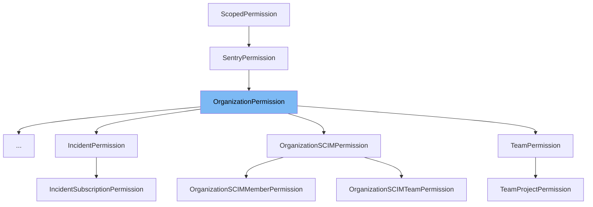

This document will cover the class <SwmToken path="src/sentry/api/bases/organization.py" pos="46:2:2" line-data="class OrganizationPermission(SentryPermission):">`OrganizationPermission`</SwmToken> in detail. We will cover:

1. What is <SwmToken path="src/sentry/api/bases/organization.py" pos="46:2:2" line-data="class OrganizationPermission(SentryPermission):">`OrganizationPermission`</SwmToken>
2. Variables and functions
3. Usage example



# What is <SwmToken path="src/sentry/api/bases/organization.py" pos="46:2:2" line-data="class OrganizationPermission(SentryPermission):">`OrganizationPermission`</SwmToken>

The <SwmToken path="src/sentry/api/bases/organization.py" pos="46:2:2" line-data="class OrganizationPermission(SentryPermission):">`OrganizationPermission`</SwmToken> class in <SwmPath>[src/sentry/api/bases/organization.py](src/sentry/api/bases/organization.py)</SwmPath> is a permission class that extends <SwmToken path="src/sentry/api/bases/organization.py" pos="17:10:10" line-data="from sentry.api.permissions import SentryPermission, StaffPermissionMixin">`SentryPermission`</SwmToken>. It is used to manage access control for various organization-related endpoints in the Sentry application. This class defines a set of permissions that are required for different HTTP methods (GET, POST, PUT, DELETE) and provides methods to check for two-factor authentication compliance, single sign-on (SSO) requirements, and object-level permissions.

<SwmSnippet path="/src/sentry/api/bases/organization.py" line="47">

---

# Variables and functions

The <SwmToken path="src/sentry/api/bases/organization.py" pos="47:1:1" line-data="    scope_map = {">`scope_map`</SwmToken> variable is a dictionary that maps HTTP methods to the required scopes for those methods. For example, a GET request requires <SwmToken path="src/sentry/api/bases/organization.py" pos="48:8:10" line-data="        &quot;GET&quot;: [&quot;org:read&quot;, &quot;org:write&quot;, &quot;org:admin&quot;],">`org:read`</SwmToken>, <SwmToken path="src/sentry/api/bases/organization.py" pos="48:15:17" line-data="        &quot;GET&quot;: [&quot;org:read&quot;, &quot;org:write&quot;, &quot;org:admin&quot;],">`org:write`</SwmToken>, or <SwmToken path="src/sentry/api/bases/organization.py" pos="48:22:24" line-data="        &quot;GET&quot;: [&quot;org:read&quot;, &quot;org:write&quot;, &quot;org:admin&quot;],">`org:admin`</SwmToken> scopes.

```python
    scope_map = {
        "GET": ["org:read", "org:write", "org:admin"],
        "POST": ["org:write", "org:admin"],
        "PUT": ["org:write", "org:admin"],
        "DELETE": ["org:admin"],
    }
```

---

</SwmSnippet>

<SwmSnippet path="/src/sentry/api/bases/organization.py" line="54">

---

The <SwmToken path="src/sentry/api/bases/organization.py" pos="54:3:3" line-data="    def is_not_2fa_compliant(">`is_not_2fa_compliant`</SwmToken> function checks if the user is compliant with the organization's two-factor authentication (2FA) requirements. It returns `True` if the user is not compliant and `False` otherwise.

```python
    def is_not_2fa_compliant(
        self, request: Request, organization: RpcOrganization | Organization
    ) -> bool:
        if not organization.flags.require_2fa:
            return False

        if request.user.has_2fa():  # type: ignore[union-attr]
            return False

        if is_active_superuser(request):
            return False

        return True
```

---

</SwmSnippet>

<SwmSnippet path="/src/sentry/api/bases/organization.py" line="68">

---

The <SwmToken path="src/sentry/api/bases/organization.py" pos="68:3:3" line-data="    def needs_sso(self, request: Request, organization: Organization | RpcOrganization) -&gt; bool:">`needs_sso`</SwmToken> function checks if the user needs to complete single sign-on (SSO) for the organization. It returns `True` if SSO is required and not completed, and `False` otherwise.

```python
    def needs_sso(self, request: Request, organization: Organization | RpcOrganization) -> bool:
        # XXX(dcramer): this is very similar to the server-rendered views
        # logic for checking valid SSO
        if not request.access.requires_sso:
            return False
        if not auth.has_completed_sso(request, organization.id):
            return True
        if not request.access.sso_is_valid:
            return True
        return False
```

---

</SwmSnippet>

<SwmSnippet path="/src/sentry/api/bases/organization.py" line="79">

---

The <SwmToken path="src/sentry/api/bases/organization.py" pos="79:3:3" line-data="    def has_object_permission(">`has_object_permission`</SwmToken> function checks if the user has the required object-level permissions for the organization. It determines the user's access and checks if any of the allowed scopes for the request method are present.

```python
    def has_object_permission(
        self,
        request: Request,
        view: object,
        organization: Organization | RpcOrganization | RpcUserOrganizationContext,
    ) -> bool:
        self.determine_access(request, organization)
        allowed_scopes = set(self.scope_map.get(request.method or "", []))
        return any(request.access.has_scope(s) for s in allowed_scopes)
```

---

</SwmSnippet>

<SwmSnippet path="/src/sentry/api/bases/organization.py" line="89">

---

The <SwmToken path="src/sentry/api/bases/organization.py" pos="89:3:3" line-data="    def is_member_disabled_from_limit(">`is_member_disabled_from_limit`</SwmToken> function checks if the user is disabled from accessing the organization due to membership limits. It returns `True` if the user is disabled and `False` otherwise.

```python
    def is_member_disabled_from_limit(
        self,
        request: Request,
        organization: Organization | RpcOrganization | RpcUserOrganizationContext,
    ) -> bool:
        return is_member_disabled_from_limit(request, organization)
```

---

</SwmSnippet>

# Usage example

Here is an example of how to use <SwmToken path="src/sentry/api/bases/organization.py" pos="46:2:2" line-data="class OrganizationPermission(SentryPermission):">`OrganizationPermission`</SwmToken> in <SwmToken path="src/sentry/api/endpoints/organization_access_request_details.py" pos="17:2:2" line-data="class AccessRequestPermission(OrganizationPermission):">`AccessRequestPermission`</SwmToken>.

<SwmSnippet path="/src/sentry/api/endpoints/organization_access_request_details.py" line="42">

---

The <SwmToken path="src/sentry/api/endpoints/organization_access_request_details.py" pos="17:2:2" line-data="class AccessRequestPermission(OrganizationPermission):">`AccessRequestPermission`</SwmToken> class extends <SwmToken path="src/sentry/api/bases/organization.py" pos="46:2:2" line-data="class OrganizationPermission(SentryPermission):">`OrganizationPermission`</SwmToken> to manage access requests for an organization. It uses the same permission checks defined in <SwmToken path="src/sentry/api/bases/organization.py" pos="46:2:2" line-data="class OrganizationPermission(SentryPermission):">`OrganizationPermission`</SwmToken>.

```python

class AccessRequestSerializer(serializers.Serializer):
```

---

</SwmSnippet>

&nbsp;

*This is an auto-generated document by Swimm AI 🌊 and has not yet been verified by a human*

<SwmMeta version="3.0.0" repo-id="Z2l0aHViJTNBJTNBc2VudHJ5LWRlbW8tMSUzQSUzQVN3aW1tLURlbW8=" repo-name="sentry-demo-1" doc-type="class"><sup>Powered by [Swimm](/)</sup></SwmMeta>
