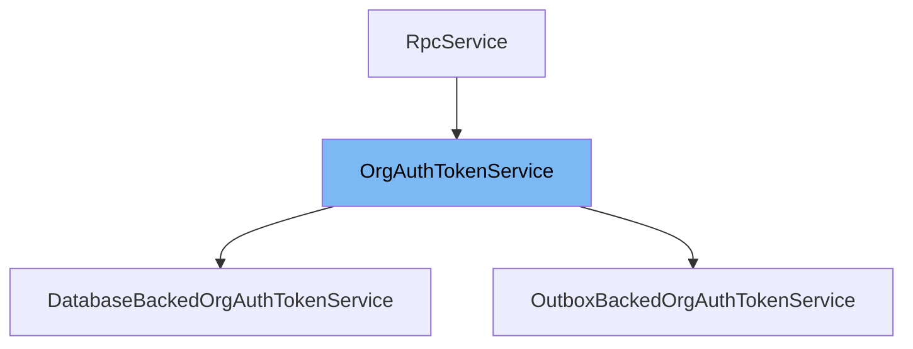

This document will cover the <SwmToken path="src/sentry/auth/services/orgauthtoken/service.py" pos="35:8:8" line-data="def impl_by_db() -&gt; OrgAuthTokenService:">`OrgAuthTokenService`</SwmToken> class. We will discuss:

1. What <SwmToken path="src/sentry/auth/services/orgauthtoken/service.py" pos="35:8:8" line-data="def impl_by_db() -&gt; OrgAuthTokenService:">`OrgAuthTokenService`</SwmToken> is.
2. The variables and functions defined in <SwmToken path="src/sentry/auth/services/orgauthtoken/service.py" pos="35:8:8" line-data="def impl_by_db() -&gt; OrgAuthTokenService:">`OrgAuthTokenService`</SwmToken>.
3. An example of how to use <SwmToken path="src/sentry/auth/services/orgauthtoken/service.py" pos="35:8:8" line-data="def impl_by_db() -&gt; OrgAuthTokenService:">`OrgAuthTokenService`</SwmToken> in <SwmToken path="src/sentry/auth/services/orgauthtoken/service.py" pos="36:8:8" line-data="    from .impl import DatabaseBackedOrgAuthTokenService">`DatabaseBackedOrgAuthTokenService`</SwmToken>.



# What is <SwmToken path="src/sentry/auth/services/orgauthtoken/service.py" pos="35:8:8" line-data="def impl_by_db() -&gt; OrgAuthTokenService:">`OrgAuthTokenService`</SwmToken>

<SwmToken path="src/sentry/auth/services/orgauthtoken/service.py" pos="35:8:8" line-data="def impl_by_db() -&gt; OrgAuthTokenService:">`OrgAuthTokenService`</SwmToken> is a class in <SwmPath>[src/sentry/auth/services/orgauthtoken/service.py](src/sentry/auth/services/orgauthtoken/service.py)</SwmPath> that extends <SwmToken path="src/sentry/auth/services/orgauthtoken/service.py" pos="19:10:10" line-data="    def get_local_implementation(cls) -&gt; RpcService:">`RpcService`</SwmToken>. It is used to manage organization authentication tokens within the Sentry application. This service provides an interface for updating the last used date and project ID for organization authentication tokens.

<SwmSnippet path="/src/sentry/auth/services/orgauthtoken/service.py" line="15">

---

# Variables and functions

The variable <SwmToken path="src/sentry/auth/services/orgauthtoken/service.py" pos="15:1:1" line-data="    key = &quot;orgauthtoken&quot;">`key`</SwmToken> is used to store the identifier for the <SwmToken path="src/sentry/auth/services/orgauthtoken/service.py" pos="35:8:8" line-data="def impl_by_db() -&gt; OrgAuthTokenService:">`OrgAuthTokenService`</SwmToken>. It is set to the string 'orgauthtoken'.

```python
    key = "orgauthtoken"
```

---

</SwmSnippet>

<SwmSnippet path="/src/sentry/auth/services/orgauthtoken/service.py" line="16">

---

The variable <SwmToken path="src/sentry/auth/services/orgauthtoken/service.py" pos="16:1:1" line-data="    local_mode = SiloMode.CONTROL">`local_mode`</SwmToken> is used to define the local mode for the service. It is set to <SwmToken path="src/sentry/auth/services/orgauthtoken/service.py" pos="16:5:7" line-data="    local_mode = SiloMode.CONTROL">`SiloMode.CONTROL`</SwmToken>.

```python
    local_mode = SiloMode.CONTROL
```

---

</SwmSnippet>

<SwmSnippet path="/src/sentry/auth/services/orgauthtoken/service.py" line="19">

---

The class method <SwmToken path="src/sentry/auth/services/orgauthtoken/service.py" pos="19:3:3" line-data="    def get_local_implementation(cls) -&gt; RpcService:">`get_local_implementation`</SwmToken> returns the local implementation of the <SwmToken path="src/sentry/auth/services/orgauthtoken/service.py" pos="35:8:8" line-data="def impl_by_db() -&gt; OrgAuthTokenService:">`OrgAuthTokenService`</SwmToken> by calling the <SwmToken path="src/sentry/auth/services/orgauthtoken/service.py" pos="20:3:3" line-data="        return impl_by_db()">`impl_by_db`</SwmToken> function.

```python
    def get_local_implementation(cls) -> RpcService:
        return impl_by_db()
```

---

</SwmSnippet>

<SwmSnippet path="/src/sentry/auth/services/orgauthtoken/service.py" line="24">

---

The abstract method <SwmToken path="src/sentry/auth/services/orgauthtoken/service.py" pos="24:3:3" line-data="    def update_orgauthtoken(">`update_orgauthtoken`</SwmToken> is used to update the organization authentication token. It takes parameters such as <SwmToken path="src/sentry/auth/services/orgauthtoken/service.py" pos="27:1:1" line-data="        organization_id: int,">`organization_id`</SwmToken>, <SwmToken path="src/sentry/auth/services/orgauthtoken/service.py" pos="28:1:1" line-data="        org_auth_token_id: int,">`org_auth_token_id`</SwmToken>, <SwmToken path="src/sentry/auth/services/orgauthtoken/service.py" pos="29:1:1" line-data="        date_last_used: datetime | None = None,">`date_last_used`</SwmToken>, and <SwmToken path="src/sentry/auth/services/orgauthtoken/service.py" pos="30:1:1" line-data="        project_last_used_id: int | None = None,">`project_last_used_id`</SwmToken>.

```python
    def update_orgauthtoken(
        self,
        *,
        organization_id: int,
        org_auth_token_id: int,
        date_last_used: datetime | None = None,
        project_last_used_id: int | None = None,
    ) -> None:
        pass
```

---

</SwmSnippet>

<SwmSnippet path="/src/sentry/auth/services/orgauthtoken/service.py" line="35">

---

The function <SwmToken path="src/sentry/auth/services/orgauthtoken/service.py" pos="35:2:2" line-data="def impl_by_db() -&gt; OrgAuthTokenService:">`impl_by_db`</SwmToken> returns an instance of <SwmToken path="src/sentry/auth/services/orgauthtoken/service.py" pos="36:8:8" line-data="    from .impl import DatabaseBackedOrgAuthTokenService">`DatabaseBackedOrgAuthTokenService`</SwmToken>, which is a concrete implementation of <SwmToken path="src/sentry/auth/services/orgauthtoken/service.py" pos="35:8:8" line-data="def impl_by_db() -&gt; OrgAuthTokenService:">`OrgAuthTokenService`</SwmToken>.

```python
def impl_by_db() -> OrgAuthTokenService:
    from .impl import DatabaseBackedOrgAuthTokenService

    return DatabaseBackedOrgAuthTokenService()
```

---

</SwmSnippet>

<SwmSnippet path="/src/sentry/auth/services/orgauthtoken/service.py" line="41">

---

The function <SwmToken path="src/sentry/auth/services/orgauthtoken/service.py" pos="41:2:2" line-data="def impl_by_outbox() -&gt; OrgAuthTokenService:">`impl_by_outbox`</SwmToken> returns an instance of <SwmToken path="src/sentry/auth/services/orgauthtoken/service.py" pos="42:8:8" line-data="    from .impl import OutboxBackedOrgAuthTokenService">`OutboxBackedOrgAuthTokenService`</SwmToken>, another concrete implementation of <SwmToken path="src/sentry/auth/services/orgauthtoken/service.py" pos="41:8:8" line-data="def impl_by_outbox() -&gt; OrgAuthTokenService:">`OrgAuthTokenService`</SwmToken>.

```python
def impl_by_outbox() -> OrgAuthTokenService:
    from .impl import OutboxBackedOrgAuthTokenService

    return OutboxBackedOrgAuthTokenService()
```

---

</SwmSnippet>

<SwmSnippet path="/src/sentry/auth/services/orgauthtoken/service.py" line="49">

---

The constant <SwmToken path="src/sentry/auth/services/orgauthtoken/service.py" pos="49:0:0" line-data="orgauthtoken_service: OrgAuthTokenService = silo_mode_delegation(">`orgauthtoken_service`</SwmToken> is an instance of <SwmToken path="src/sentry/auth/services/orgauthtoken/service.py" pos="49:3:3" line-data="orgauthtoken_service: OrgAuthTokenService = silo_mode_delegation(">`OrgAuthTokenService`</SwmToken> that delegates to different implementations based on the <SwmToken path="src/sentry/auth/services/orgauthtoken/service.py" pos="51:1:1" line-data="        SiloMode.REGION: impl_by_outbox,">`SiloMode`</SwmToken>. It uses <SwmToken path="src/sentry/auth/services/orgauthtoken/service.py" pos="51:6:6" line-data="        SiloMode.REGION: impl_by_outbox,">`impl_by_outbox`</SwmToken> for <SwmToken path="src/sentry/auth/services/orgauthtoken/service.py" pos="51:1:3" line-data="        SiloMode.REGION: impl_by_outbox,">`SiloMode.REGION`</SwmToken> and <SwmToken path="src/sentry/auth/services/orgauthtoken/service.py" pos="52:6:6" line-data="        SiloMode.CONTROL: impl_by_db,">`impl_by_db`</SwmToken> for <SwmToken path="src/sentry/auth/services/orgauthtoken/service.py" pos="52:1:3" line-data="        SiloMode.CONTROL: impl_by_db,">`SiloMode.CONTROL`</SwmToken> and <SwmToken path="src/sentry/auth/services/orgauthtoken/service.py" pos="53:1:3" line-data="        SiloMode.MONOLITH: impl_by_db,">`SiloMode.MONOLITH`</SwmToken>.

```python
orgauthtoken_service: OrgAuthTokenService = silo_mode_delegation(
    {
        SiloMode.REGION: impl_by_outbox,
        SiloMode.CONTROL: impl_by_db,
        SiloMode.MONOLITH: impl_by_db,
    }
)
```

---

</SwmSnippet>

<SwmSnippet path="/src/sentry/auth/services/orgauthtoken/service.py" line="58">

---

The constant <SwmToken path="src/sentry/auth/services/orgauthtoken/service.py" pos="58:0:0" line-data="orgauthtoken_rpc_service = OrgAuthTokenService.create_delegation()">`orgauthtoken_rpc_service`</SwmToken> is a delegated instance of <SwmToken path="src/sentry/auth/services/orgauthtoken/service.py" pos="58:4:4" line-data="orgauthtoken_rpc_service = OrgAuthTokenService.create_delegation()">`OrgAuthTokenService`</SwmToken> created using the <SwmToken path="src/sentry/auth/services/orgauthtoken/service.py" pos="58:6:6" line-data="orgauthtoken_rpc_service = OrgAuthTokenService.create_delegation()">`create_delegation`</SwmToken> method.

```python
orgauthtoken_rpc_service = OrgAuthTokenService.create_delegation()
```

---

</SwmSnippet>

# Usage example

Here is an example of how to use <SwmToken path="src/sentry/auth/services/orgauthtoken/service.py" pos="35:8:8" line-data="def impl_by_db() -&gt; OrgAuthTokenService:">`OrgAuthTokenService`</SwmToken> in <SwmToken path="src/sentry/auth/services/orgauthtoken/service.py" pos="36:8:8" line-data="    from .impl import DatabaseBackedOrgAuthTokenService">`DatabaseBackedOrgAuthTokenService`</SwmToken>.

<SwmSnippet path="/src/sentry/auth/services/orgauthtoken/service.py" line="35">

---

The <SwmToken path="src/sentry/auth/services/orgauthtoken/service.py" pos="35:2:2" line-data="def impl_by_db() -&gt; OrgAuthTokenService:">`impl_by_db`</SwmToken> function demonstrates how to instantiate <SwmToken path="src/sentry/auth/services/orgauthtoken/service.py" pos="36:8:8" line-data="    from .impl import DatabaseBackedOrgAuthTokenService">`DatabaseBackedOrgAuthTokenService`</SwmToken>, which is a concrete implementation of <SwmToken path="src/sentry/auth/services/orgauthtoken/service.py" pos="35:8:8" line-data="def impl_by_db() -&gt; OrgAuthTokenService:">`OrgAuthTokenService`</SwmToken>.

```python
def impl_by_db() -> OrgAuthTokenService:
    from .impl import DatabaseBackedOrgAuthTokenService

    return DatabaseBackedOrgAuthTokenService()
```

---

</SwmSnippet>

&nbsp;

*This is an auto-generated document by Swimm AI 🌊 and has not yet been verified by a human*

<SwmMeta version="3.0.0" repo-id="Z2l0aHViJTNBJTNBc2VudHJ5LWRlbW8tMSUzQSUzQVN3aW1tLURlbW8=" repo-name="sentry-demo-1" doc-type="class"><sup>Powered by [Swimm](/)</sup></SwmMeta>
