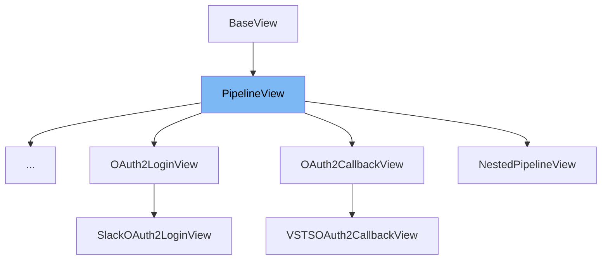

This document will cover the class <SwmToken path="src/sentry/pipeline/views/base.py" pos="16:2:2" line-data="class PipelineView(BaseView, abc.ABC):">`PipelineView`</SwmToken> in detail. We will discuss:

1. What <SwmToken path="src/sentry/pipeline/views/base.py" pos="16:2:2" line-data="class PipelineView(BaseView, abc.ABC):">`PipelineView`</SwmToken> is.
2. The variables and functions defined in <SwmToken path="src/sentry/pipeline/views/base.py" pos="16:2:2" line-data="class PipelineView(BaseView, abc.ABC):">`PipelineView`</SwmToken>.
3. An example of how to use <SwmToken path="src/sentry/pipeline/views/base.py" pos="16:2:2" line-data="class PipelineView(BaseView, abc.ABC):">`PipelineView`</SwmToken> in <SwmToken path="src/sentry/integrations/vsts/integration.py" pos="440:7:7" line-data="        return [identity_pipeline_view, AccountConfigView()]">`AccountConfigView`</SwmToken>.



# What is <SwmToken path="src/sentry/pipeline/views/base.py" pos="16:2:2" line-data="class PipelineView(BaseView, abc.ABC):">`PipelineView`</SwmToken>

The <SwmToken path="src/sentry/pipeline/views/base.py" pos="16:2:2" line-data="class PipelineView(BaseView, abc.ABC):">`PipelineView`</SwmToken> class in <SwmPath>[src/sentry/pipeline/views/base.py](src/sentry/pipeline/views/base.py)</SwmPath> is an abstract base class that can be used in a `PipelineProvider`'s <SwmToken path="src/sentry/pipeline/views/base.py" pos="19:1:1" line-data="    get_pipeline_views list.">`get_pipeline_views`</SwmToken> list. It provides a structure for handling requests within a pipeline, allowing data binding and pipeline traversal.

<SwmSnippet path="/src/sentry/pipeline/views/base.py" line="16">

---

# Variables and functions

The <SwmToken path="src/sentry/pipeline/views/base.py" pos="16:2:2" line-data="class PipelineView(BaseView, abc.ABC):">`PipelineView`</SwmToken> class is defined as an abstract base class that extends <SwmToken path="src/sentry/pipeline/views/base.py" pos="16:4:4" line-data="class PipelineView(BaseView, abc.ABC):">`BaseView`</SwmToken> and <SwmToken path="src/sentry/pipeline/views/base.py" pos="16:7:9" line-data="class PipelineView(BaseView, abc.ABC):">`abc.ABC`</SwmToken>. This means it cannot be instantiated directly and must be subclassed with the abstract methods implemented.

```python
class PipelineView(BaseView, abc.ABC):
    """
    A class implementing the PipelineView may be used in a PipelineProviders
    get_pipeline_views list.
    """
```

---

</SwmSnippet>

<SwmSnippet path="/src/sentry/pipeline/views/base.py" line="22">

---

The <SwmToken path="src/sentry/pipeline/views/base.py" pos="23:3:3" line-data="    def dispatch(self, request: Request, pipeline: &quot;Pipeline&quot;) -&gt; HttpResponseBase:">`dispatch`</SwmToken> function is an abstract method that must be implemented by any subclass of <SwmToken path="src/sentry/pipeline/views/base.py" pos="16:2:2" line-data="class PipelineView(BaseView, abc.ABC):">`PipelineView`</SwmToken>. It is called on request and receives the active pipeline, which should be used to bind data and traverse the pipeline.

```python
    @abc.abstractmethod
    def dispatch(self, request: Request, pipeline: "Pipeline") -> HttpResponseBase:
        """
        Called on request, the active pipeline is passed in which can and
        should be used to bind data and traverse the pipeline.
        """
```

---

</SwmSnippet>

<SwmSnippet path="/src/sentry/pipeline/views/base.py" line="29">

---

The <SwmToken path="src/sentry/pipeline/views/base.py" pos="30:3:3" line-data="    def render_react_view(">`render_react_view`</SwmToken> function is a static method that renders a React view. It takes the request, pipeline name, and properties as arguments and returns an <SwmToken path="src/sentry/pipeline/views/base.py" pos="34:5:5" line-data="    ) -&gt; HttpResponseBase:">`HttpResponseBase`</SwmToken> object. This method uses the <SwmToken path="src/sentry/pipeline/views/base.py" pos="35:3:3" line-data="        return render_to_response(">`render_to_response`</SwmToken> helper to render the <SwmPath>[src/sentry/templates/sentry/bases/react_pipeline.html](src/sentry/templates/sentry/bases/react_pipeline.html)</SwmPath> template with the provided context.

```python
    @staticmethod
    def render_react_view(
        request: Request,
        pipeline_name: str,
        props: Mapping[str, Any],
    ) -> HttpResponseBase:
        return render_to_response(
            template="sentry/bases/react_pipeline.html",
            request=request,
            context={"pipelineName": pipeline_name, "props": json.dumps(props)},
        )
```

---

</SwmSnippet>

# Usage example

The <SwmToken path="src/sentry/integrations/vsts/integration.py" pos="440:7:7" line-data="        return [identity_pipeline_view, AccountConfigView()]">`AccountConfigView`</SwmToken> class in <SwmPath>[src/sentry/integrations/vsts/integration.py](src/sentry/integrations/vsts/integration.py)</SwmPath> is an example of how to use <SwmToken path="src/sentry/pipeline/views/base.py" pos="16:2:2" line-data="class PipelineView(BaseView, abc.ABC):">`PipelineView`</SwmToken>. This class extends <SwmToken path="src/sentry/pipeline/views/base.py" pos="16:2:2" line-data="class PipelineView(BaseView, abc.ABC):">`PipelineView`</SwmToken> and implements the required <SwmToken path="src/sentry/pipeline/views/base.py" pos="23:3:3" line-data="    def dispatch(self, request: Request, pipeline: &quot;Pipeline&quot;) -&gt; HttpResponseBase:">`dispatch`</SwmToken> method to handle requests within the pipeline.

<SwmSnippet path="/src/sentry/integrations/vsts/integration.py" line="1">

---

The <SwmToken path="src/sentry/integrations/vsts/integration.py" pos="440:7:7" line-data="        return [identity_pipeline_view, AccountConfigView()]">`AccountConfigView`</SwmToken> class demonstrates how to subclass <SwmToken path="src/sentry/pipeline/views/base.py" pos="16:2:2" line-data="class PipelineView(BaseView, abc.ABC):">`PipelineView`</SwmToken> and implement the <SwmToken path="src/sentry/pipeline/views/base.py" pos="23:3:3" line-data="    def dispatch(self, request: Request, pipeline: &quot;Pipeline&quot;) -&gt; HttpResponseBase:">`dispatch`</SwmToken> method. This class is used to handle account configuration within the VSTS integration pipeline.

```python
from __future__ import annotations

import logging
import re
from collections.abc import Mapping, MutableMapping, Sequence
from time import time
from typing import Any
from urllib.parse import parse_qs, quote, urlencode, urlparse

from django import forms
from django.http import HttpRequest
from django.http.response import HttpResponseBase
from django.utils.translation import gettext as _

from sentry import features, http
from sentry.auth.exceptions import IdentityNotValid
from sentry.constants import ObjectStatus
from sentry.identity.pipeline import IdentityProviderPipeline
from sentry.identity.services.identity.model import RpcIdentity
from sentry.identity.vsts.provider import get_user_info
from sentry.integrations.base import (
```

---

</SwmSnippet>

&nbsp;

*This is an auto-generated document by Swimm AI 🌊 and has not yet been verified by a human*

<SwmMeta version="3.0.0" repo-id="Z2l0aHViJTNBJTNBc2VudHJ5LWRlbW8tMSUzQSUzQVN3aW1tLURlbW8=" repo-name="sentry-demo-1" doc-type="class"><sup>Powered by [Swimm](/)</sup></SwmMeta>
