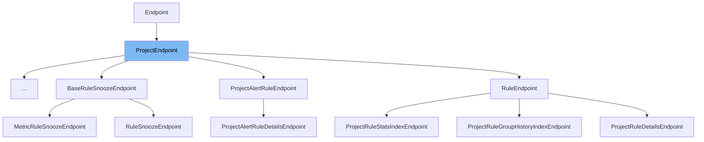

This document will cover the <SwmToken path="src/sentry/api/bases/project.py" pos="116:2:2" line-data="class ProjectEndpoint(Endpoint):">`ProjectEndpoint`</SwmToken> class in detail. We will discuss:

1. What <SwmToken path="src/sentry/api/bases/project.py" pos="116:2:2" line-data="class ProjectEndpoint(Endpoint):">`ProjectEndpoint`</SwmToken> is.
2. The variables and functions defined in <SwmToken path="src/sentry/api/bases/project.py" pos="116:2:2" line-data="class ProjectEndpoint(Endpoint):">`ProjectEndpoint`</SwmToken>.
3. An example of how to use <SwmToken path="src/sentry/api/bases/project.py" pos="116:2:2" line-data="class ProjectEndpoint(Endpoint):">`ProjectEndpoint`</SwmToken> in <SwmToken path="src/sentry/api/endpoints/source_map_debug_blue_thunder_edition.py" pos="127:2:2" line-data="class SourceMapDebugBlueThunderEditionEndpoint(ProjectEndpoint):">`SourceMapDebugBlueThunderEditionEndpoint`</SwmToken>.



# What is <SwmToken path="src/sentry/api/bases/project.py" pos="116:2:2" line-data="class ProjectEndpoint(Endpoint):">`ProjectEndpoint`</SwmToken>

<SwmToken path="src/sentry/api/bases/project.py" pos="116:2:2" line-data="class ProjectEndpoint(Endpoint):">`ProjectEndpoint`</SwmToken> is a class defined in <SwmPath>[src/sentry/api/bases/project.py](src/sentry/api/bases/project.py)</SwmPath>. It extends the <SwmToken path="src/sentry/api/bases/project.py" pos="10:10:10" line-data="from sentry.api.base import Endpoint">`Endpoint`</SwmToken> class and is used to handle project-specific API endpoints in the Sentry application. This class provides methods for argument conversion, filtering parameters, and handling exceptions specific to project-related requests.

<SwmSnippet path="/src/sentry/api/bases/project.py" line="117">

---

# Variables and functions

The variable <SwmToken path="src/sentry/api/bases/project.py" pos="117:1:1" line-data="    permission_classes: tuple[type[BasePermission], ...] = (ProjectPermission,)">`permission_classes`</SwmToken> is a tuple that defines the permission classes required for accessing the <SwmToken path="src/sentry/api/bases/project.py" pos="116:2:2" line-data="class ProjectEndpoint(Endpoint):">`ProjectEndpoint`</SwmToken>. It is set to <SwmToken path="src/sentry/api/bases/project.py" pos="117:17:20" line-data="    permission_classes: tuple[type[BasePermission], ...] = (ProjectPermission,)">`(ProjectPermission,)`</SwmToken>, meaning that the <SwmToken path="src/sentry/api/bases/project.py" pos="117:18:18" line-data="    permission_classes: tuple[type[BasePermission], ...] = (ProjectPermission,)">`ProjectPermission`</SwmToken> class is used to check permissions.

```python
    permission_classes: tuple[type[BasePermission], ...] = (ProjectPermission,)
```

---

</SwmSnippet>

<SwmSnippet path="/src/sentry/api/bases/project.py" line="119">

---

The function <SwmToken path="src/sentry/api/bases/project.py" pos="119:3:3" line-data="    def convert_args(">`convert_args`</SwmToken> is used to convert and validate the arguments passed to the endpoint. It retrieves the project based on the provided organization and project identifiers, checks permissions, and binds the organization context to the request.

```python
    def convert_args(
        self,
        request: Request,
        *args,
        **kwargs,
    ):
        if args and args[0] is not None:
            organization_id_or_slug: int | str = args[0]
            # Required so it behaves like the original convert_args, where organization_id_or_slug was another parameter
            # TODO: Remove this once we remove the old `organization_slug` parameter from getsentry
            args = args[1:]
        else:
            organization_id_or_slug = kwargs.pop("organization_id_or_slug", None) or kwargs.pop(
                "organization_slug"
            )

        if args and args[0] is not None:
            project_id_or_slug: int | str = args[0]
            # Required so it behaves like the original convert_args, where project_id_or_slug was another parameter
            args = args[1:]
        else:
```

---

</SwmSnippet>

<SwmSnippet path="/src/sentry/api/bases/project.py" line="195">

---

The function <SwmToken path="src/sentry/api/bases/project.py" pos="195:3:3" line-data="    def get_filter_params(self, request: Request, project, date_filter_optional=False):">`get_filter_params`</SwmToken> retrieves filter parameters from the request, such as date range and environment, and returns them in a dictionary. It is similar to a version used for organizations but tailored for a single project.

```python
    def get_filter_params(self, request: Request, project, date_filter_optional=False):
        """Similar to the version on the organization just for a single project."""
        # get the top level params -- projects, time range, and environment
        # from the request
        try:
            start, end = get_date_range_from_params(request.GET, optional=date_filter_optional)
        except InvalidParams as e:
            raise ProjectEventsError(str(e))

        environments = [env.name for env in get_environments(request, project.organization)]
        params = {"start": start, "end": end, "project_id": [project.id]}
        if environments:
            params["environment"] = environments

        return params
```

---

</SwmSnippet>

<SwmSnippet path="/src/sentry/api/bases/project.py" line="211">

---

The function <SwmToken path="src/sentry/api/bases/project.py" pos="211:3:3" line-data="    def handle_exception(">`handle_exception`</SwmToken> handles exceptions that occur during the request processing. If the exception is of type <SwmToken path="src/sentry/api/bases/project.py" pos="218:8:8" line-data="        if isinstance(exc, ProjectMoved):">`ProjectMoved`</SwmToken>, it returns a response with the new project location. Otherwise, it calls the superclass's <SwmToken path="src/sentry/api/bases/project.py" pos="211:3:3" line-data="    def handle_exception(">`handle_exception`</SwmToken> method.

```python
    def handle_exception(
        self,
        request: Request,
        exc: Exception,
        handler_context: Mapping[str, Any] | None = None,
        scope: Scope | None = None,
    ) -> Response:
        if isinstance(exc, ProjectMoved):
            response = Response(
                {"slug": exc.detail["detail"]["extra"]["slug"], "detail": exc.detail["detail"]},
                status=exc.status_code,
            )
            response["Location"] = exc.detail["detail"]["extra"]["url"]
            return response
        return super().handle_exception(request, exc, handler_context, scope)
```

---

</SwmSnippet>

# Usage example

The <SwmToken path="src/sentry/api/endpoints/source_map_debug_blue_thunder_edition.py" pos="127:2:2" line-data="class SourceMapDebugBlueThunderEditionEndpoint(ProjectEndpoint):">`SourceMapDebugBlueThunderEditionEndpoint`</SwmToken> class in <SwmPath>[src/sentry/api/endpoints/source_map_debug_blue_thunder_edition.py](src/sentry/api/endpoints/source_map_debug_blue_thunder_edition.py)</SwmPath> is an example of how to use <SwmToken path="src/sentry/api/bases/project.py" pos="116:2:2" line-data="class ProjectEndpoint(Endpoint):">`ProjectEndpoint`</SwmToken>. This class extends <SwmToken path="src/sentry/api/bases/project.py" pos="116:2:2" line-data="class ProjectEndpoint(Endpoint):">`ProjectEndpoint`</SwmToken> and inherits its methods and permissions.

<SwmSnippet path="/src/sentry/api/endpoints/source_map_debug_blue_thunder_edition.py" line="24">

---

The <SwmToken path="src/sentry/api/endpoints/source_map_debug_blue_thunder_edition.py" pos="127:2:2" line-data="class SourceMapDebugBlueThunderEditionEndpoint(ProjectEndpoint):">`SourceMapDebugBlueThunderEditionEndpoint`</SwmToken> class extends <SwmToken path="src/sentry/api/bases/project.py" pos="116:2:2" line-data="class ProjectEndpoint(Endpoint):">`ProjectEndpoint`</SwmToken>, demonstrating how to use the <SwmToken path="src/sentry/api/bases/project.py" pos="116:2:2" line-data="class ProjectEndpoint(Endpoint):">`ProjectEndpoint`</SwmToken> class for handling project-specific API endpoints.

```python
    ReleaseArtifactBundle,
```

---

</SwmSnippet>

&nbsp;

*This is an auto-generated document by Swimm AI 🌊 and has not yet been verified by a human*

<SwmMeta version="3.0.0" repo-id="Z2l0aHViJTNBJTNBc2VudHJ5LWRlbW8tMSUzQSUzQVN3aW1tLURlbW8=" repo-name="sentry-demo-1" doc-type="class"><sup>Powered by [Swimm](/)</sup></SwmMeta>
