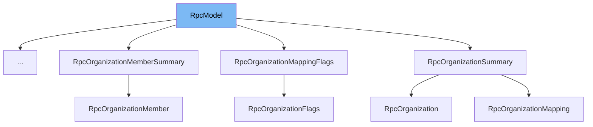

This document will cover the <SwmToken path="src/sentry/hybridcloud/rpc/__init__.py" pos="68:13:13" line-data="        transformation, if any) of this RpcModel class.">`RpcModel`</SwmToken> class. We will discuss:

1. What <SwmToken path="src/sentry/hybridcloud/rpc/__init__.py" pos="68:13:13" line-data="        transformation, if any) of this RpcModel class.">`RpcModel`</SwmToken> is.
2. The variables and functions defined in <SwmToken path="src/sentry/hybridcloud/rpc/__init__.py" pos="68:13:13" line-data="        transformation, if any) of this RpcModel class.">`RpcModel`</SwmToken>.
3. An example of how to use <SwmToken path="src/sentry/hybridcloud/rpc/__init__.py" pos="68:13:13" line-data="        transformation, if any) of this RpcModel class.">`RpcModel`</SwmToken> in <SwmToken path="src/sentry/hybridcloud/services/control_organization_provisioning/model.py" pos="4:2:2" line-data="class RpcOrganizationSlugReservation(RpcModel):">`RpcOrganizationSlugReservation`</SwmToken>.



# What is <SwmToken path="src/sentry/hybridcloud/rpc/__init__.py" pos="68:13:13" line-data="        transformation, if any) of this RpcModel class.">`RpcModel`</SwmToken>

<SwmToken path="src/sentry/hybridcloud/rpc/__init__.py" pos="68:13:13" line-data="        transformation, if any) of this RpcModel class.">`RpcModel`</SwmToken> is a class defined in <SwmPath>[src/sentry/hybridcloud/rpc/\__init_\_.py](src/sentry/hybridcloud/rpc/__init__.py)</SwmPath>. It is a serializable object that may be part of an RPC schema. This class is used to facilitate the serialization and deserialization of objects in a way that is compatible with RPC (Remote Procedure Call) mechanisms. It extends <SwmToken path="src/sentry/hybridcloud/rpc/__init__.py" pos="43:4:6" line-data="class RpcModel(pydantic.BaseModel):">`pydantic.BaseModel`</SwmToken>, leveraging Pydantic's data validation and settings management capabilities.

<SwmSnippet path="/src/sentry/hybridcloud/rpc/__init__.py" line="46">

---

# Variables and functions

The <SwmToken path="src/sentry/hybridcloud/rpc/__init__.py" pos="46:3:3" line-data="    class Config:">`Config`</SwmToken> class within <SwmToken path="src/sentry/hybridcloud/rpc/__init__.py" pos="68:13:13" line-data="        transformation, if any) of this RpcModel class.">`RpcModel`</SwmToken> sets the configuration for the Pydantic model. It enables ORM mode and the use of enum values.

```python
    class Config:
        orm_mode = True
        use_enum_values = True
```

---

</SwmSnippet>

<SwmSnippet path="/src/sentry/hybridcloud/rpc/__init__.py" line="50">

---

The <SwmToken path="src/sentry/hybridcloud/rpc/__init__.py" pos="51:3:3" line-data="    def get_field_names(cls) -&gt; Iterable[str]:">`get_field_names`</SwmToken> class method returns an iterable of the field names defined in the model. This is useful for dynamically accessing the fields of the model.

```python
    @classmethod
    def get_field_names(cls) -> Iterable[str]:
        return iter(cls.__fields__.keys())
```

---

</SwmSnippet>

<SwmSnippet path="/src/sentry/hybridcloud/rpc/__init__.py" line="55">

---

The <SwmToken path="src/sentry/hybridcloud/rpc/__init__.py" pos="55:3:3" line-data="    def serialize_by_field_name(">`serialize_by_field_name`</SwmToken> class method serializes an object with field names matching the model class. It optionally transforms field names and attribute values before serialization. This method is particularly useful for models where new fields may be added in the future and need to be serialized automatically.

```python
    def serialize_by_field_name(
        cls,
        obj: Any,
        name_transform: Callable[[str], str] | None = None,
        value_transform: Callable[[Any], Any] | None = None,
    ) -> Self:
        """Serialize an object with field names matching this model class.

        This class method may be called only on an instantiable subclass. The
        returned value is an instance of that subclass. The optional "transform"
        arguments, if present, modify each field name or attribute value before it is
        passed through to the serialized object. Raises AttributeError if the
        argument does not have an attribute matching each field name (after
        transformation, if any) of this RpcModel class.

        This method should not necessarily be used for every serialization operation.
        It is useful for model types, such as "flags" objects, where new fields may
        be added in the future and we'd like them to be serialized automatically. For
        more stable or more complex models, it is more suitable to list the fields
        out explicitly in a constructor call.
        """
```

---

</SwmSnippet>

# Usage example

Here is an example of how to use <SwmToken path="src/sentry/hybridcloud/rpc/__init__.py" pos="68:13:13" line-data="        transformation, if any) of this RpcModel class.">`RpcModel`</SwmToken> in <SwmToken path="src/sentry/hybridcloud/services/control_organization_provisioning/model.py" pos="4:2:2" line-data="class RpcOrganizationSlugReservation(RpcModel):">`RpcOrganizationSlugReservation`</SwmToken>.

<SwmSnippet path="/src/sentry/hybridcloud/services/control_organization_provisioning/model.py" line="18">

---

The <SwmToken path="src/sentry/hybridcloud/services/control_organization_provisioning/model.py" pos="4:2:2" line-data="class RpcOrganizationSlugReservation(RpcModel):">`RpcOrganizationSlugReservation`</SwmToken> class extends <SwmToken path="src/sentry/hybridcloud/rpc/__init__.py" pos="68:13:13" line-data="        transformation, if any) of this RpcModel class.">`RpcModel`</SwmToken>. It demonstrates how to define a model that can be serialized and deserialized using the methods provided by <SwmToken path="src/sentry/hybridcloud/rpc/__init__.py" pos="68:13:13" line-data="        transformation, if any) of this RpcModel class.">`RpcModel`</SwmToken>.

```python

```

---

</SwmSnippet>

&nbsp;

*This is an auto-generated document by Swimm AI 🌊 and has not yet been verified by a human*

<SwmMeta version="3.0.0" repo-id="Z2l0aHViJTNBJTNBc2VudHJ5LWRlbW8tMSUzQSUzQVN3aW1tLURlbW8=" repo-name="sentry-demo-1" doc-type="class"><sup>Powered by [Swimm](/)</sup></SwmMeta>
