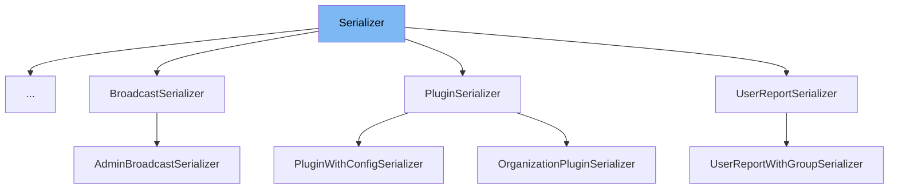

This document will cover the <SwmToken path="src/sentry/api/serializers/base.py" pos="80:2:2" line-data="class Serializer:">`Serializer`</SwmToken> class in detail. We will cover:

1. What is <SwmToken path="src/sentry/api/serializers/base.py" pos="80:2:2" line-data="class Serializer:">`Serializer`</SwmToken>
2. Variables and functions
3. Usage example



# What is Serializer

The <SwmToken path="src/sentry/api/serializers/base.py" pos="80:2:2" line-data="class Serializer:">`Serializer`</SwmToken> class in <SwmPath>[src/sentry/api/serializers/base.py](src/sentry/api/serializers/base.py)</SwmPath> is designed to handle the serialization of various types of objects into a format that consists entirely of primitive data types. This is particularly useful for converting complex data structures into a format that can be easily transmitted over a network or stored in a database.

<SwmSnippet path="/src/sentry/api/serializers/base.py" line="80">

---

# Variables and functions

The <SwmToken path="src/sentry/api/serializers/base.py" pos="80:2:2" line-data="class Serializer:">`Serializer`</SwmToken> class is defined here. It contains the logic to serialize a specific type of object.

```python
class Serializer:
    """A Serializer class contains the logic to serialize a specific type of object."""
```

---

</SwmSnippet>

<SwmSnippet path="/src/sentry/api/serializers/base.py" line="83">

---

The <SwmToken path="src/sentry/api/serializers/base.py" pos="83:3:3" line-data="    def __call__(">`__call__`</SwmToken> function is used to invoke the serializer. It takes an object, its attributes, and the user as parameters and returns a serialized version of the object.

```python
    def __call__(
        self, obj: Any, attrs: Mapping[Any, Any], user: Any, **kwargs: Any
    ) -> Mapping[str, Any] | None:
        """See documentation for `serialize`."""
        if obj is None:
            return None
        return self._serialize(obj, attrs, user, **kwargs)

```

---

</SwmSnippet>

<SwmSnippet path="/src/sentry/api/serializers/base.py" line="91">

---

The <SwmToken path="src/sentry/api/serializers/base.py" pos="91:3:3" line-data="    def get_attrs(">`get_attrs`</SwmToken> function fetches all the associated data needed to serialize the objects in the <SwmToken path="src/sentry/api/serializers/base.py" pos="92:4:4" line-data="        self, item_list: Sequence[Any], user: Any, **kwargs: Any">`item_list`</SwmToken>. It returns a mapping of items from the <SwmToken path="src/sentry/api/serializers/base.py" pos="92:4:4" line-data="        self, item_list: Sequence[Any], user: Any, **kwargs: Any">`item_list`</SwmToken> to an object.

```python
    def get_attrs(
        self, item_list: Sequence[Any], user: Any, **kwargs: Any
    ) -> MutableMapping[Any, Any]:
        """
        Fetch all of the associated data needed to serialize the objects in `item_list`.

        :param item_list: List of input objects that should be serialized.
        :param user: The user who will be viewing the objects.
        :param kwargs: Any
        :returns A mapping of items from the `item_list` to an Object.
        """
        return {}
```

---

</SwmSnippet>

<SwmSnippet path="/src/sentry/api/serializers/base.py" line="104">

---

The <SwmToken path="src/sentry/api/serializers/base.py" pos="104:3:3" line-data="    def _serialize(">`_serialize`</SwmToken> function is a helper function that tries to serialize an object and logs an exception if it fails.

```python
    def _serialize(
        self, obj: Any, attrs: Mapping[Any, Any], user: Any, **kwargs: Any
    ) -> Mapping[str, Any] | None:
        try:
            return self.serialize(obj, attrs, user, **kwargs)
        except Exception:
            logger.exception("Failed to serialize", extra={"instance": obj})
            return None
```

---

</SwmSnippet>

<SwmSnippet path="/src/sentry/api/serializers/base.py" line="113">

---

The <SwmToken path="src/sentry/api/serializers/base.py" pos="113:3:3" line-data="    def serialize(">`serialize`</SwmToken> function converts an arbitrary Python object to an object that only contains primitives. It takes an object, its attributes, and the user as parameters and returns a serialized version of the object.

```python
    def serialize(
        self, obj: Any, attrs: Mapping[Any, Any], user: Any, **kwargs: Any
    ) -> Mapping[str, Any]:
        """
        Convert an arbitrary python object `obj` to an object that only contains primitives.

        :param obj: An item from `item_list` that was passed to `get_attrs`.
        :param attrs: The object in `get_attrs` that corresponds to `obj`.
        :param user: The user who will be viewing the objects.
        :param kwargs: Any
        :returns A serialized version of `obj`.
        """
        return {}
```

---

</SwmSnippet>

# Usage example

Here is an example of how to use the <SwmToken path="src/sentry/api/serializers/base.py" pos="80:2:2" line-data="class Serializer:">`Serializer`</SwmToken> class in <SwmToken path="src/sentry/incidents/endpoints/serializers/alert_rule_trigger_action.py" pos="10:2:2" line-data="class AlertRuleTriggerActionSerializer(Serializer):">`AlertRuleTriggerActionSerializer`</SwmToken>.

<SwmSnippet path="/src/sentry/incidents/endpoints/serializers/alert_rule_trigger_action.py" line="17">

---

The <SwmToken path="src/sentry/incidents/endpoints/serializers/alert_rule_trigger_action.py" pos="10:2:2" line-data="class AlertRuleTriggerActionSerializer(Serializer):">`AlertRuleTriggerActionSerializer`</SwmToken> class extends the <SwmToken path="src/sentry/api/serializers/base.py" pos="80:2:2" line-data="class Serializer:">`Serializer`</SwmToken> class. It is used to serialize alert rule trigger actions.

```python
        )
        if priority:
            priority += " level"

        if action.type == action.Type.EMAIL.value:
            if action.target:
                if action.target_type == action.TargetType.USER.value:
```

---

</SwmSnippet>

&nbsp;

*This is an auto-generated document by Swimm AI 🌊 and has not yet been verified by a human*

<SwmMeta version="3.0.0" repo-id="Z2l0aHViJTNBJTNBc2VudHJ5LWRlbW8tMSUzQSUzQVN3aW1tLURlbW8=" repo-name="sentry-demo-1" doc-type="class"><sup>Powered by [Swimm](/)</sup></SwmMeta>
