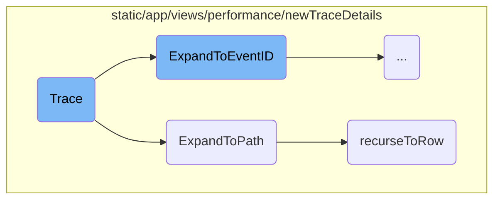
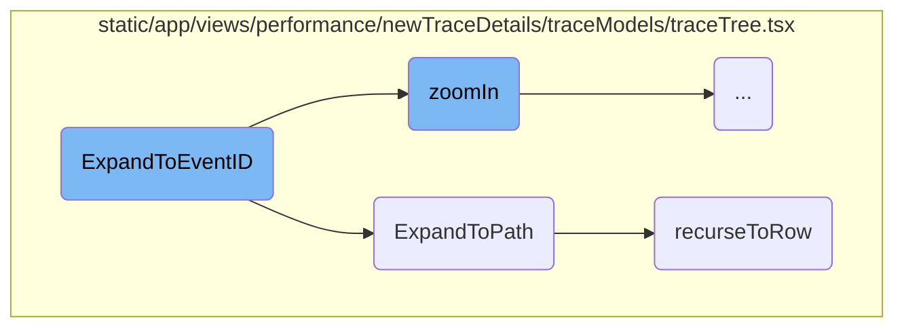

```mermaid
graph TD;
      subgraph static/app
92dea3acb654aef75539b9c90d0d1a3a7dd4c62d174bf34cdde6b1c612b2b8ce(zoomIn):::mainFlowStyle --> 950afc5078ac649b81a09c21a3495928104dc7a1c873e12567d8abc2df35d37f(fetchTransactionSpans):::mainFlowStyle
end

subgraph static/app
950afc5078ac649b81a09c21a3495928104dc7a1c873e12567d8abc2df35d37f(fetchTransactionSpans):::mainFlowStyle --> 1025c11ff078741e3a52849e4dc81510d630800b045c60aea951683433a1c993(requestPromise):::mainFlowStyle
end

subgraph static/app
1025c11ff078741e3a52849e4dc81510d630800b045c60aea951683433a1c993(requestPromise):::mainFlowStyle --> 4f5a67a71dfb71654db327ed24d5e8187187a49b58963a473eec18ecb0aef026(request):::mainFlowStyle
end

subgraph static/app
4f5a67a71dfb71654db327ed24d5e8187187a49b58963a473eec18ecb0aef026(request):::mainFlowStyle --> 4b2faee236c2e651d9932fa234f72966df49f7aa0f85eb9909d65f4b6d8ce1a6(parse):::mainFlowStyle
end

subgraph static/app
4b2faee236c2e651d9932fa234f72966df49f7aa0f85eb9909d65f4b6d8ce1a6(parse):::mainFlowStyle --> b2b47f6077e96a1ff47606d77c3fe70b18a84edc0ab0fa1349f7face4165d2ea(parseWidget):::mainFlowStyle
end

subgraph static/app
b2b47f6077e96a1ff47606d77c3fe70b18a84edc0ab0fa1349f7face4165d2ea(parseWidget):::mainFlowStyle --> 05bf2ddeab316943d2187e10bc3886949b4b03ae946f68d4f27a5bfc0025e132(mapToMetricsQuery):::mainFlowStyle
end


      classDef mainFlowStyle color:#000000,fill:#7CB9F4
classDef rootsStyle color:#000000,fill:#00FFF4
classDef Style1 color:#000000,fill:#00FFAA
classDef Style2 color:#000000,fill:#FFFF00
classDef Style3 color:#000000,fill:#AA7CB9

%% Swimm:
%% graph TD;
%%       subgraph <SwmPath>[static/app/](static/app/)</SwmPath>
%% 92dea3acb654aef75539b9c90d0d1a3a7dd4c62d174bf34cdde6b1c612b2b8ce(zoomIn):::mainFlowStyle --> 950afc5078ac649b81a09c21a3495928104dc7a1c873e12567d8abc2df35d37f(fetchTransactionSpans):::mainFlowStyle
%% end
%% 
%% subgraph <SwmPath>[static/app/](static/app/)</SwmPath>
%% 950afc5078ac649b81a09c21a3495928104dc7a1c873e12567d8abc2df35d37f(fetchTransactionSpans):::mainFlowStyle --> 1025c11ff078741e3a52849e4dc81510d630800b045c60aea951683433a1c993(requestPromise):::mainFlowStyle
%% end
%% 
%% subgraph <SwmPath>[static/app/](static/app/)</SwmPath>
%% 1025c11ff078741e3a52849e4dc81510d630800b045c60aea951683433a1c993(requestPromise):::mainFlowStyle --> 4f5a67a71dfb71654db327ed24d5e8187187a49b58963a473eec18ecb0aef026(request):::mainFlowStyle
%% end
%% 
%% subgraph <SwmPath>[static/app/](static/app/)</SwmPath>
%% 4f5a67a71dfb71654db327ed24d5e8187187a49b58963a473eec18ecb0aef026(request):::mainFlowStyle --> 4b2faee236c2e651d9932fa234f72966df49f7aa0f85eb9909d65f4b6d8ce1a6(parse):::mainFlowStyle
%% end
%% 
%% subgraph <SwmPath>[static/app/](static/app/)</SwmPath>
%% 4b2faee236c2e651d9932fa234f72966df49f7aa0f85eb9909d65f4b6d8ce1a6(parse):::mainFlowStyle --> b2b47f6077e96a1ff47606d77c3fe70b18a84edc0ab0fa1349f7face4165d2ea(parseWidget):::mainFlowStyle
%% end
%% 
%% subgraph <SwmPath>[static/app/](static/app/)</SwmPath>
%% b2b47f6077e96a1ff47606d77c3fe70b18a84edc0ab0fa1349f7face4165d2ea(parseWidget):::mainFlowStyle --> 05bf2ddeab316943d2187e10bc3886949b4b03ae946f68d4f27a5bfc0025e132(mapToMetricsQuery):::mainFlowStyle
%% end
%% 
%% 
%%       classDef mainFlowStyle color:#000000,fill:#7CB9F4
%% classDef rootsStyle color:#000000,fill:#00FFF4
%% classDef Style1 color:#000000,fill:#00FFAA
%% classDef Style2 color:#000000,fill:#FFFF00
%% classDef Style3 color:#000000,fill:#AA7CB9
```

In this document, we will explain the concept of a trace and its flow within the application. The trace flow involves initializing various hooks and references, handling view changes, expanding paths within the trace tree, and zooming into specific nodes to fetch transaction spans.

The trace flow starts with initializing necessary components like theme, API, and organization. When the trace view changes, it updates the timeline and synchronizes the zoom button. The flow then expands the trace tree to specific paths and nodes, and if needed, zooms into nodes to fetch more detailed data. This ensures that users can interact with and explore the trace data effectively.

Here is a high level diagram of the flow, showing only the most important functions:

```mermaid
graph TD;
      subgraph static/app/views/performance/newTraceDetails
07f98effca620669ef454aadde5ec95c9a91d689b9275d302a749702bccfb959(Trace):::mainFlowStyle --> 20d67da59164af6b37fd42d26ac26ab4df093db1f62fb276223fcdb650f8b44d(ExpandToPath)
end

subgraph static/app/views/performance/newTraceDetails
07f98effca620669ef454aadde5ec95c9a91d689b9275d302a749702bccfb959(Trace):::mainFlowStyle --> 39137435482e23af9d5e3e472420b07709797a6661b4d09c4518529fc9d57e76(ExpandToEventID):::mainFlowStyle
end

subgraph static/app/views/performance/newTraceDetails
39137435482e23af9d5e3e472420b07709797a6661b4d09c4518529fc9d57e76(ExpandToEventID):::mainFlowStyle --> 20d67da59164af6b37fd42d26ac26ab4df093db1f62fb276223fcdb650f8b44d(ExpandToPath)
end

subgraph static/app/views/performance/newTraceDetails
39137435482e23af9d5e3e472420b07709797a6661b4d09c4518529fc9d57e76(ExpandToEventID):::mainFlowStyle --> 92dea3acb654aef75539b9c90d0d1a3a7dd4c62d174bf34cdde6b1c612b2b8ce(zoomIn):::mainFlowStyle
end

subgraph static/app/views/performance/newTraceDetails
92dea3acb654aef75539b9c90d0d1a3a7dd4c62d174bf34cdde6b1c612b2b8ce(zoomIn):::mainFlowStyle --> 950afc5078ac649b81a09c21a3495928104dc7a1c873e12567d8abc2df35d37f(fetchTransactionSpans):::mainFlowStyle
end

subgraph static/app
950afc5078ac649b81a09c21a3495928104dc7a1c873e12567d8abc2df35d37f(fetchTransactionSpans):::mainFlowStyle --> 1025c11ff078741e3a52849e4dc81510d630800b045c60aea951683433a1c993(requestPromise):::mainFlowStyle
end

subgraph static/app
1025c11ff078741e3a52849e4dc81510d630800b045c60aea951683433a1c993(requestPromise):::mainFlowStyle --> 4f5a67a71dfb71654db327ed24d5e8187187a49b58963a473eec18ecb0aef026(request):::mainFlowStyle
end

subgraph static/app
4f5a67a71dfb71654db327ed24d5e8187187a49b58963a473eec18ecb0aef026(request):::mainFlowStyle --> 4b2faee236c2e651d9932fa234f72966df49f7aa0f85eb9909d65f4b6d8ce1a6(parse):::mainFlowStyle
end

subgraph static/app
4b2faee236c2e651d9932fa234f72966df49f7aa0f85eb9909d65f4b6d8ce1a6(parse):::mainFlowStyle --> b2b47f6077e96a1ff47606d77c3fe70b18a84edc0ab0fa1349f7face4165d2ea(parseWidget):::mainFlowStyle
end

subgraph static/app
b2b47f6077e96a1ff47606d77c3fe70b18a84edc0ab0fa1349f7face4165d2ea(parseWidget):::mainFlowStyle --> 05bf2ddeab316943d2187e10bc3886949b4b03ae946f68d4f27a5bfc0025e132(mapToMetricsQuery):::mainFlowStyle
end

subgraph static/app
05bf2ddeab316943d2187e10bc3886949b4b03ae946f68d4f27a5bfc0025e132(mapToMetricsQuery):::mainFlowStyle --> 635bb507b11255a8fd7c2375dac3b6c46b736470cf89007061c6861fc973e73b(fetchAvailableTags)
end


      classDef mainFlowStyle color:#000000,fill:#7CB9F4
classDef rootsStyle color:#000000,fill:#00FFF4
classDef Style1 color:#000000,fill:#00FFAA
classDef Style2 color:#000000,fill:#FFFF00
classDef Style3 color:#000000,fill:#AA7CB9

%% Swimm:
%% graph TD;
%%       subgraph <SwmPath>[static/app/views/performance/newTraceDetails/](static/app/views/performance/newTraceDetails/)</SwmPath>
%% 07f98effca620669ef454aadde5ec95c9a91d689b9275d302a749702bccfb959(Trace):::mainFlowStyle --> 20d67da59164af6b37fd42d26ac26ab4df093db1f62fb276223fcdb650f8b44d(ExpandToPath)
%% end
%% 
%% subgraph <SwmPath>[static/app/views/performance/newTraceDetails/](static/app/views/performance/newTraceDetails/)</SwmPath>
%% 07f98effca620669ef454aadde5ec95c9a91d689b9275d302a749702bccfb959(Trace):::mainFlowStyle --> 39137435482e23af9d5e3e472420b07709797a6661b4d09c4518529fc9d57e76(ExpandToEventID):::mainFlowStyle
%% end
%% 
%% subgraph <SwmPath>[static/app/views/performance/newTraceDetails/](static/app/views/performance/newTraceDetails/)</SwmPath>
%% 39137435482e23af9d5e3e472420b07709797a6661b4d09c4518529fc9d57e76(ExpandToEventID):::mainFlowStyle --> 20d67da59164af6b37fd42d26ac26ab4df093db1f62fb276223fcdb650f8b44d(ExpandToPath)
%% end
%% 
%% subgraph <SwmPath>[static/app/views/performance/newTraceDetails/](static/app/views/performance/newTraceDetails/)</SwmPath>
%% 39137435482e23af9d5e3e472420b07709797a6661b4d09c4518529fc9d57e76(ExpandToEventID):::mainFlowStyle --> 92dea3acb654aef75539b9c90d0d1a3a7dd4c62d174bf34cdde6b1c612b2b8ce(zoomIn):::mainFlowStyle
%% end
%% 
%% subgraph <SwmPath>[static/app/views/performance/newTraceDetails/](static/app/views/performance/newTraceDetails/)</SwmPath>
%% 92dea3acb654aef75539b9c90d0d1a3a7dd4c62d174bf34cdde6b1c612b2b8ce(zoomIn):::mainFlowStyle --> 950afc5078ac649b81a09c21a3495928104dc7a1c873e12567d8abc2df35d37f(fetchTransactionSpans):::mainFlowStyle
%% end
%% 
%% subgraph <SwmPath>[static/app/](static/app/)</SwmPath>
%% 950afc5078ac649b81a09c21a3495928104dc7a1c873e12567d8abc2df35d37f(fetchTransactionSpans):::mainFlowStyle --> 1025c11ff078741e3a52849e4dc81510d630800b045c60aea951683433a1c993(requestPromise):::mainFlowStyle
%% end
%% 
%% subgraph <SwmPath>[static/app/](static/app/)</SwmPath>
%% 1025c11ff078741e3a52849e4dc81510d630800b045c60aea951683433a1c993(requestPromise):::mainFlowStyle --> 4f5a67a71dfb71654db327ed24d5e8187187a49b58963a473eec18ecb0aef026(request):::mainFlowStyle
%% end
%% 
%% subgraph <SwmPath>[static/app/](static/app/)</SwmPath>
%% 4f5a67a71dfb71654db327ed24d5e8187187a49b58963a473eec18ecb0aef026(request):::mainFlowStyle --> 4b2faee236c2e651d9932fa234f72966df49f7aa0f85eb9909d65f4b6d8ce1a6(parse):::mainFlowStyle
%% end
%% 
%% subgraph <SwmPath>[static/app/](static/app/)</SwmPath>
%% 4b2faee236c2e651d9932fa234f72966df49f7aa0f85eb9909d65f4b6d8ce1a6(parse):::mainFlowStyle --> b2b47f6077e96a1ff47606d77c3fe70b18a84edc0ab0fa1349f7face4165d2ea(parseWidget):::mainFlowStyle
%% end
%% 
%% subgraph <SwmPath>[static/app/](static/app/)</SwmPath>
%% b2b47f6077e96a1ff47606d77c3fe70b18a84edc0ab0fa1349f7face4165d2ea(parseWidget):::mainFlowStyle --> 05bf2ddeab316943d2187e10bc3886949b4b03ae946f68d4f27a5bfc0025e132(mapToMetricsQuery):::mainFlowStyle
%% end
%% 
%% subgraph <SwmPath>[static/app/](static/app/)</SwmPath>
%% 05bf2ddeab316943d2187e10bc3886949b4b03ae946f68d4f27a5bfc0025e132(mapToMetricsQuery):::mainFlowStyle --> 635bb507b11255a8fd7c2375dac3b6c46b736470cf89007061c6861fc973e73b(fetchAvailableTags)
%% end
%% 
%% 
%%       classDef mainFlowStyle color:#000000,fill:#7CB9F4
%% classDef rootsStyle color:#000000,fill:#00FFF4
%% classDef Style1 color:#000000,fill:#00FFAA
%% classDef Style2 color:#000000,fill:#FFFF00
%% classDef Style3 color:#000000,fill:#AA7CB9
```



# Flow drill down

First, we'll zoom into this section of the flow:



<SwmSnippet path="/static/app/views/performance/newTraceDetails/trace.tsx" line="192">

---

## Trace Initialization

The <SwmToken path="static/app/views/performance/newTraceDetails/trace.tsx" pos="216:11:11" line-data="    const onTraceViewChange: TraceEvents[&#39;set trace view&#39;] = () =&gt; {">`trace`</SwmToken> function initializes various hooks and references that are essential for managing the trace view. It sets up the theme, API, projects, organization, trace state, and trace dispatch, which are crucial for rendering and interacting with the trace data.

```tsx
  const theme = useTheme();
  const api = useApi();
  const {projects} = useProjects();
  const organization = useOrganization();
  const traceState = useTraceState();
  const traceDispatch = useTraceStateDispatch();
```

---

</SwmSnippet>

<SwmSnippet path="/static/app/views/performance/newTraceDetails/trace.tsx" line="216">

---

## Handling Trace View Changes

The <SwmToken path="static/app/views/performance/newTraceDetails/trace.tsx" pos="216:3:3" line-data="    const onTraceViewChange: TraceEvents[&#39;set trace view&#39;] = () =&gt; {">`onTraceViewChange`</SwmToken> function is responsible for updating the timeline intervals and synchronizing the zoom button whenever the trace view changes. This ensures that the trace view is always up-to-date and interactive.

```tsx
    const onTraceViewChange: TraceEvents['set trace view'] = () => {
      manager.recomputeTimelineIntervals();
      manager.recomputeSpanToPXMatrix();
      manager.syncResetZoomButton();
```

---

</SwmSnippet>

<SwmSnippet path="/static/app/views/performance/newTraceDetails/traceModels/traceTree.tsx" line="1440">

---

## Expanding to Path

The <SwmToken path="static/app/views/performance/newTraceDetails/traceModels/traceTree.tsx" pos="1440:3:3" line-data="  static ExpandToPath(">`ExpandToPath`</SwmToken> function is designed to expand the trace tree to a specific path. It takes the tree, scroll queue, rerender function, and options as parameters and returns a promise that resolves to the index and node of the expanded path.

```tsx
  static ExpandToPath(
    tree: TraceTree,
    scrollQueue: TraceTree.NodePath[],
    rerender: () => void,
    options: ViewManagerScrollToOptions
  ): Promise<{index: number; node: TraceTreeNode<TraceTree.NodeValue>} | null | null> {
```

---

</SwmSnippet>

<SwmSnippet path="/static/app/views/performance/newTraceDetails/traceModels/traceTree.tsx" line="1462">

---

### Recursing to Row

The <SwmToken path="static/app/views/performance/newTraceDetails/traceModels/traceTree.tsx" pos="1462:3:3" line-data="    const recurseToRow = async (): Promise&lt;{">`recurseToRow`</SwmToken> function is a helper function used within <SwmToken path="static/app/views/performance/newTraceDetails/traceModels/traceTree.tsx" pos="1422:5:5" line-data="    return TraceTree.ExpandToPath(tree, node.path, rerender, options).then(">`ExpandToPath`</SwmToken> to recursively traverse the trace tree and find the target node. It handles various cases such as transaction nodes, autogrouped nodes, and ensures that the correct node is found and expanded.

```tsx
    const recurseToRow = async (): Promise<{
      index: number;
      node: TraceTreeNode<TraceTree.NodeValue>;
    } | null | null> => {
      const path = segments.pop();
      let current = findInTreeFromSegment(parent, path!);

      if (!current) {
        // Some parts of the codebase link to span:span_id, txn:event_id, where span_id is
        // actally stored on the txn:event_id node. Since we cant tell from the link itself
        // that this is happening, we will perform a final check to see if we've actually already
        // arrived to the node in the previous search call.
        if (path) {
          const [type, id] = path.split('-');

          if (
            type === 'span' &&
            isTransactionNode(parent) &&
            parent.value.span_id === id
          ) {
            current = parent;
```

---

</SwmSnippet>

Now, lets zoom into this section of the flow:



<SwmSnippet path="/static/app/views/performance/newTraceDetails/traceModels/traceTree.tsx" line="1410">

---

## <SwmToken path="static/app/views/performance/newTraceDetails/traceModels/traceTree.tsx" pos="1410:3:3" line-data="  static ExpandToEventID(">`ExpandToEventID`</SwmToken>

The <SwmToken path="static/app/views/performance/newTraceDetails/traceModels/traceTree.tsx" pos="1410:3:3" line-data="  static ExpandToEventID(">`ExpandToEventID`</SwmToken> function is responsible for locating a specific event within a trace tree by its event ID. It first searches for the node using <SwmToken path="static/app/views/performance/newTraceDetails/traceModels/traceTree.tsx" pos="1416:7:7" line-data="    const node = findInTreeByEventId(tree.root, eventId);">`findInTreeByEventId`</SwmToken>. If the node is found, it calls <SwmToken path="static/app/views/performance/newTraceDetails/traceModels/traceTree.tsx" pos="1422:5:5" line-data="    return TraceTree.ExpandToPath(tree, node.path, rerender, options).then(">`ExpandToPath`</SwmToken> to expand the tree to the path of the node. Additionally, if the node can fetch more data, it triggers the <SwmToken path="static/app/views/performance/newTraceDetails/traceModels/traceTree.tsx" pos="1429:5:5" line-data="          await tree.zoomIn(result.node, true, options).catch(_e =&gt; {">`zoomIn`</SwmToken> function to fetch the children of the node, ensuring that the user can see the list of spans within the transaction.

```tsx
  static ExpandToEventID(
    eventId: string,
    tree: TraceTree,
    rerender: () => void,
    options: ViewManagerScrollToOptions
  ): Promise<{index: number; node: TraceTreeNode<TraceTree.NodeValue>} | null | null> {
    const node = findInTreeByEventId(tree.root, eventId);

    if (!node) {
      return Promise.resolve(null);
    }

    return TraceTree.ExpandToPath(tree, node.path, rerender, options).then(
      async result => {
        // When users are coming off an eventID link, we want to fetch the children
        // of the node that the eventID points to. This is because the eventID link
        // only points to the transaction, but we want to fetch the children of the
        // transaction to show the user the list of spans in that transaction
        if (result?.node?.canFetch) {
          await tree.zoomIn(result.node, true, options).catch(_e => {
            Sentry.captureMessage('Failed to fetch children of eventId on mount');
```

---

</SwmSnippet>

Now, lets zoom into this section of the flow:



<SwmSnippet path="/static/app/views/performance/newTraceDetails/traceModels/traceTree.tsx" line="1560">

---

## <SwmToken path="static/app/views/performance/newTraceDetails/traceModels/traceTree.tsx" pos="1560:1:1" line-data="  zoomIn(">`zoomIn`</SwmToken> Function

The <SwmToken path="static/app/views/performance/newTraceDetails/traceModels/traceTree.tsx" pos="1560:1:1" line-data="  zoomIn(">`zoomIn`</SwmToken> function is responsible for handling the zooming in and out of nodes in the trace tree. It checks if the node is already zoomed in or out and updates the node's state accordingly. If zooming in, it fetches the transaction spans using the <SwmToken path="static/app/views/performance/newTraceDetails/traceModels/traceTree.tsx" pos="205:2:2" line-data="function fetchTransactionSpans(">`fetchTransactionSpans`</SwmToken> function and updates the tree with the new spans.

```tsx
  zoomIn(
    node: TraceTreeNode<TraceTree.NodeValue>,
    zoomedIn: boolean,
    options: {
      api: Client;
      organization: Organization;
    }
  ): Promise<Event | null> {
    if (zoomedIn === node.zoomedIn) {
      return Promise.resolve(null);
    }

    if (!zoomedIn) {
      const index = this._list.indexOf(node);

      if (index === -1) {
        return Promise.resolve(null);
      }

      const childrenCount = node.getVisibleChildrenCount();
      this._list.splice(index + 1, childrenCount);
```

---

</SwmSnippet>

<SwmSnippet path="/static/app/views/performance/newTraceDetails/traceModels/traceTree.tsx" line="205">

---

### Fetching Transaction Spans

The <SwmToken path="static/app/views/performance/newTraceDetails/traceModels/traceTree.tsx" pos="205:2:2" line-data="function fetchTransactionSpans(">`fetchTransactionSpans`</SwmToken> function is called within <SwmToken path="static/app/views/performance/newTraceDetails/traceModels/traceTree.tsx" pos="1429:5:5" line-data="          await tree.zoomIn(result.node, true, options).catch(_e =&gt; {">`zoomIn`</SwmToken> to retrieve the spans for a specific transaction. It constructs the API request URL and uses the <SwmToken path="static/app/views/performance/newTraceDetails/traceModels/traceTree.tsx" pos="211:5:5" line-data="  return api.requestPromise(">`requestPromise`</SwmToken> function to make the API call.

```tsx
function fetchTransactionSpans(
  api: Client,
  organization: Organization,
  project_slug: string,
  event_id: string
): Promise<EventTransaction> {
  return api.requestPromise(
    `/organizations/${organization.slug}/events/${project_slug}:${event_id}/?averageColumn=span.self_time&averageColumn=span.duration`
  );
}
```

---

</SwmSnippet>

<SwmSnippet path="/static/app/api.tsx" line="656">

---

### Making API Requests

The <SwmToken path="static/app/api.tsx" pos="656:1:1" line-data="  requestPromise&lt;IncludeAllArgsType extends boolean&gt;(">`requestPromise`</SwmToken> function is a wrapper around the <SwmToken path="static/app/api.tsx" pos="669:14:14" line-data="    const preservedError = new Error(&#39;API Request Error&#39;);">`Request`</SwmToken> function that handles making API requests. It constructs the request, handles success and error responses, and returns a promise.

```tsx
  requestPromise<IncludeAllArgsType extends boolean>(
    path: string,
    {
      includeAllArgs,
      ...options
    }: {includeAllArgs?: IncludeAllArgsType} & Readonly<RequestOptions> = {}
  ): Promise<IncludeAllArgsType extends true ? ApiResult : any> {
    // Create an error object here before we make any async calls so that we
    // have a helpful stack trace if it errors
    //
    // This *should* get logged to Sentry only if the promise rejection is not handled
    // (since SDK captures unhandled rejections). Ideally we explicitly ignore rejection
    // or handle with a user friendly error message
    const preservedError = new Error('API Request Error');

    return new Promise((resolve, reject) =>
      this.request(path, {
        ...options,
        preservedError,
        success: (data, textStatus, resp) => {
          if (includeAllArgs) {
```

---

</SwmSnippet>

<SwmSnippet path="/static/app/api.tsx" line="420">

---

### Handling API Requests

The <SwmToken path="static/app/api.tsx" pos="420:1:1" line-data="  request(path: string, options: Readonly&lt;RequestOptions&gt; = {}): Request {">`request`</SwmToken> function is responsible for making the actual API request. It constructs the full URL, sets up request headers, handles the response, and manages errors.

```tsx
  request(path: string, options: Readonly<RequestOptions> = {}): Request {
    const method = options.method || (options.data ? 'POST' : 'GET');

    let fullUrl = buildRequestUrl(this.baseUrl, path, options);

    let data = options.data;

    if (data !== undefined && method !== 'GET' && !(data instanceof FormData)) {
      data = JSON.stringify(data);
    }

    // TODO(epurkhiser): Mimicking the old jQuery API, data could be a string /
    // object for GET requests. jQuery just sticks it onto the URL as query
    // parameters
    if (method === 'GET' && data) {
      const queryString = typeof data === 'string' ? data : qs.stringify(data);

      if (queryString.length > 0) {
        fullUrl = fullUrl + (fullUrl.includes('?') ? '&' : '?') + queryString;
      }
    }
```

---

</SwmSnippet>

<SwmSnippet path="/static/app/utils/metrics/dashboardImport.tsx" line="138">

---

## Parsing Data

The <SwmToken path="static/app/utils/metrics/dashboardImport.tsx" pos="139:5:5" line-data="  public async parse() {">`parse`</SwmToken> function is responsible for parsing the imported widget data. It validates the widget type, parses the widget, and returns the parsed data along with any errors encountered during parsing.

```tsx
  // Parsing functions
  public async parse() {
    const {
      id,
      definition: {title, type: widgetType},
    } = this.importedWidget;

    try {
      if (!SUPPORTED_WIDGET_TYPES.has(widgetType)) {
        throw new Error(`widget - unsupported type ${widgetType}`);
      }
      const widget = await this.parseWidget();

      if (!widget || !widget.queries.length) {
        throw new Error('widget - no parseable queries found');
      }

      const outcome: ImportOutcome = this.errors.length ? 'warning' : 'success';

      return {
        report: {
```

---

</SwmSnippet>

<SwmSnippet path="/static/app/utils/metrics/dashboardImport.tsx" line="179">

---

### Parsing Widget

The <SwmToken path="static/app/utils/metrics/dashboardImport.tsx" pos="179:5:5" line-data="  private async parseWidget() {">`parseWidget`</SwmToken> function is called within <SwmToken path="static/app/utils/metrics/dashboardImport.tsx" pos="139:5:5" line-data="  public async parse() {">`parse`</SwmToken> to handle the parsing of individual widgets. It processes the widget's requests, maps them to metrics queries, and constructs the final dashboard widget.

```tsx
  private async parseWidget() {
    this.parseLegendColumns();

    const {title, requests = []} = this.importedWidget.definition as WidgetDefinition;

    const parsedRequests = requests.map(r => this.parseRequest(r));
    const parsedQueries = parsedRequests.flatMap(request => request.queries);

    const metricsQueries = await Promise.all(
      parsedQueries.map(async query => {
        const mapped = await this.mapToMetricsQuery(query);
        return {
          ...mapped,
        };
      })
    );

    const nonEmptyQueries = metricsQueries.filter(query => query.mri) as MetricsQuery[];

    if (!nonEmptyQueries.length) {
      return null;
```

---

</SwmSnippet>

<SwmSnippet path="/static/app/utils/metrics/dashboardImport.tsx" line="397">

---

### Mapping to Metrics Query

The <SwmToken path="static/app/utils/metrics/dashboardImport.tsx" pos="398:5:5" line-data="  private async mapToMetricsQuery(widget): Promise&lt;MetricsQuery | null&gt; {">`mapToMetricsQuery`</SwmToken> function is responsible for mapping a widget's query to a metrics query. It fetches available tags, constructs the query filter and group by parameters, and returns the metrics query.

```tsx
  // Mapping functions
  private async mapToMetricsQuery(widget): Promise<MetricsQuery | null> {
    const {metric, aggregation, filters} = widget;

    // @ts-expect-error name is actually defined on MetricMeta
    const metricMeta = this.availableMetrics.find(m => m.name === metric);

    if (!metricMeta) {
      this.errors.push(`widget.request.query - metric not found: ${metric}`);
      return null;
    }

    const availableTags = await this.fetchAvailableTags(metricMeta.mri);

    const query = this.constructMetricQueryFilter(filters, availableTags);
    const groupBy = this.constructMetricGroupBy(widget.groupBy, availableTags);

    return {
      mri: metricMeta.mri,
      aggregation,
      query,
```

---

</SwmSnippet>

&nbsp;

*This is an auto-generated document by Swimm AI 🌊 and has not yet been verified by a human*

<SwmMeta version="3.0.0" repo-id="Z2l0aHViJTNBJTNBc2VudHJ5LWRlbW8tMSUzQSUzQVN3aW1tLURlbW8=" repo-name="sentry-demo-1" doc-type="flows"><sup>Powered by [Swimm](/)</sup></SwmMeta>
