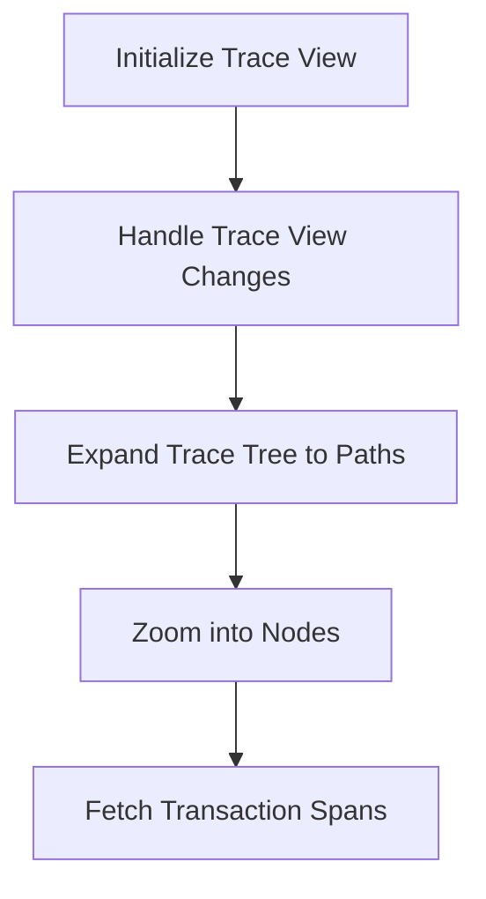

This document will cover the Trace Flow Overview feature, which includes:

1. Initializing the trace view
2. Handling trace view changes
3. Expanding the trace tree to specific paths
4. Zooming into nodes to fetch transaction spans.

Technical document: <SwmLink doc-title="Trace Flow Overview">[Trace Flow Overview](/.swm/trace-flow-overview.ury2uwre.sw.md)</SwmLink>

# [Initializing the Trace View](https://app.swimm.io/repos/Z2l0aHViJTNBJTNBc2VudHJ5LWRlbW8tMSUzQSUzQVN3aW1tLURlbW8=/docs/ury2uwre#trace-initialization)

The trace view initialization sets up the necessary components such as theme, API, projects, and organization. This step ensures that the trace view is ready for interaction by the user. It also initializes the trace state and dispatch, which are essential for managing the trace data and user interactions.

# [Handling Trace View Changes](https://app.swimm.io/repos/Z2l0aHViJTNBJTNBc2VudHJ5LWRlbW8tMSUzQSUzQVN3aW1tLURlbW8=/docs/ury2uwre#handling-trace-view-changes)

When the trace view changes, the system updates the timeline intervals and synchronizes the zoom button. This ensures that the trace view remains accurate and interactive, allowing users to explore the trace data effectively.

# [Expanding the Trace Tree to Specific Paths](https://app.swimm.io/repos/Z2l0aHViJTNBJTNBc2VudHJ5LWRlbW8tMSUzQSUzQVN3aW1tLURlbW8=/docs/ury2uwre#expanding-to-path)

The trace tree can be expanded to specific paths, allowing users to drill down into particular sections of the trace. This involves traversing the trace tree and finding the target node. The system handles various cases such as transaction nodes and autogrouped nodes to ensure the correct node is expanded.

# [Zooming into Nodes to Fetch Transaction Spans](https://app.swimm.io/repos/Z2l0aHViJTNBJTNBc2VudHJ5LWRlbW8tMSUzQSUzQVN3aW1tLURlbW8=/docs/ury2uwre#zoomin-function)

Zooming into nodes allows users to fetch more detailed data about specific transactions. If a node can fetch more data, the system triggers the zoom-in function to retrieve the transaction spans. This provides users with a detailed view of the spans within a transaction, enhancing their ability to analyze performance issues.

&nbsp;

*This is an auto-generated document by Swimm AI 🌊 and has not yet been verified by a human*

<SwmMeta version="3.0.0" repo-id="Z2l0aHViJTNBJTNBc2VudHJ5LWRlbW8tMSUzQSUzQVN3aW1tLURlbW8=" repo-name="sentry-demo-1" doc-type="product-flows">Powered by [Swimm](/)</SwmMeta>
