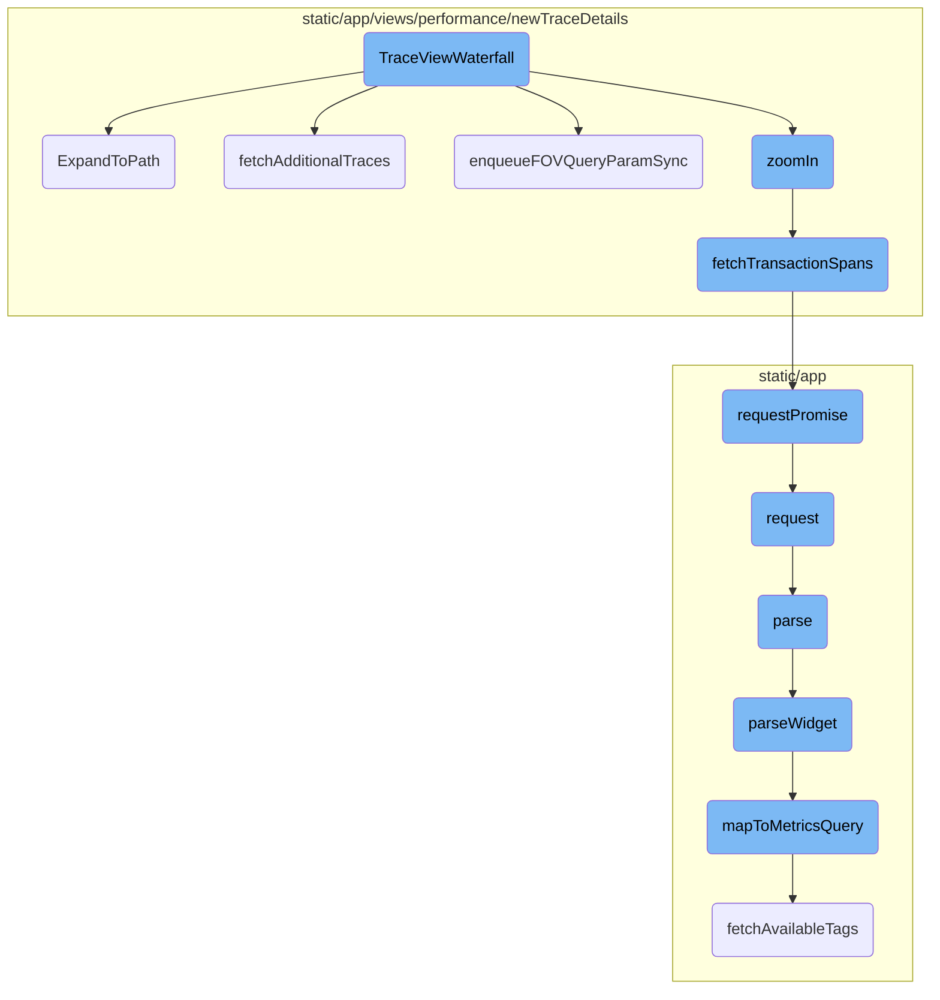
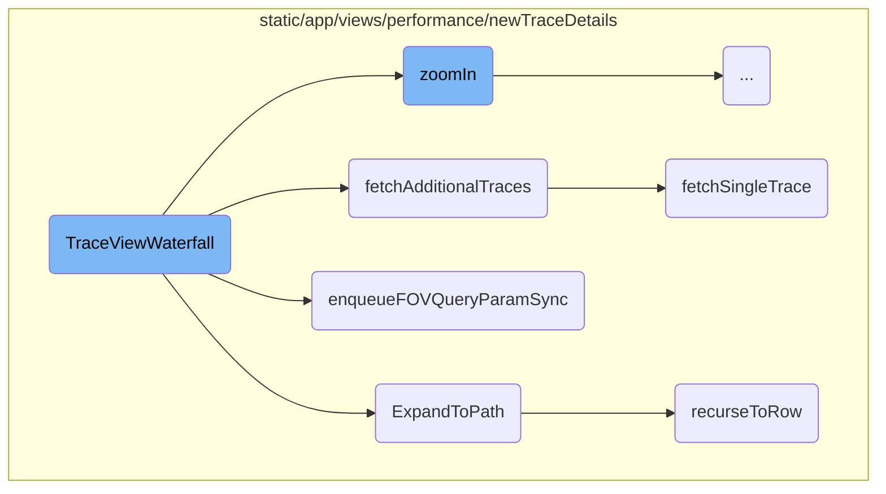

In this document, we will explain the <SwmToken path="static/app/views/performance/newTraceDetails/index.tsx" pos="275:4:4" line-data="export function TraceViewWaterfall(props: TraceViewWaterfallProps) {">`TraceViewWaterfall`</SwmToken> component, which is a crucial part of rendering and managing the trace view in the application. This component initializes various hooks and states, sets up API calls, and manages the trace state.

The flow starts with the initialization of the <SwmToken path="static/app/views/performance/newTraceDetails/index.tsx" pos="275:4:4" line-data="export function TraceViewWaterfall(props: TraceViewWaterfallProps) {">`TraceViewWaterfall`</SwmToken> component, which sets up necessary hooks and states. It then makes API calls to fetch trace data and updates the trace tree accordingly. The component also handles user interactions like zooming in and out of nodes, expanding paths in the trace tree, and synchronizing the field of view with the URL query parameters.

Here is a high level diagram of the flow, showing only the most important functions:



# Flow drill down

First, we'll zoom into this section of the flow:



<SwmSnippet path="/static/app/views/performance/newTraceDetails/index.tsx" line="275">

---

## <SwmToken path="static/app/views/performance/newTraceDetails/index.tsx" pos="275:4:4" line-data="export function TraceViewWaterfall(props: TraceViewWaterfallProps) {">`TraceViewWaterfall`</SwmToken> Initialization

The <SwmToken path="static/app/views/performance/newTraceDetails/index.tsx" pos="275:4:4" line-data="export function TraceViewWaterfall(props: TraceViewWaterfallProps) {">`TraceViewWaterfall`</SwmToken> function initializes various hooks and states that are essential for rendering the trace view. It sets up API calls, project data, organization context, and trace state management.

```tsx
export function TraceViewWaterfall(props: TraceViewWaterfallProps) {
  const api = useApi();
  const {projects} = useProjects();
  const organization = useOrganization();
  const loadingTraceRef = useRef<TraceTree | null>(null);
  const [forceRender, rerender] = useReducer(x => (x + 1) % Number.MAX_SAFE_INTEGER, 0);
  const traceState = useTraceState();
  const traceDispatch = useTraceStateDispatch();
  const traceStateEmitter = useTraceStateEmitter();
  const filters = usePageFilters();
  const traceScheduler = useMemo(() => new TraceScheduler(), []);
  const traceView = useMemo(() => new TraceViewModel(), []);
```

---

</SwmSnippet>

<SwmSnippet path="/static/app/views/performance/newTraceDetails/traceModels/traceTree.tsx" line="1440">

---

## <SwmToken path="static/app/views/performance/newTraceDetails/traceModels/traceTree.tsx" pos="1440:3:3" line-data="  static ExpandToPath(">`ExpandToPath`</SwmToken> Function

The <SwmToken path="static/app/views/performance/newTraceDetails/traceModels/traceTree.tsx" pos="1440:3:3" line-data="  static ExpandToPath(">`ExpandToPath`</SwmToken> function is responsible for expanding the trace tree to a specific path. It traverses the tree, expanding nodes as necessary, and ensures that the view is updated to reflect the expanded state.

```tsx
  static ExpandToPath(
    tree: TraceTree,
    scrollQueue: TraceTree.NodePath[],
    rerender: () => void,
    options: ViewManagerScrollToOptions
  ): Promise<{index: number; node: TraceTreeNode<TraceTree.NodeValue>} | null | null> {
    const segments = [...scrollQueue];
    const list = tree.list;

    if (!list) {
      return Promise.resolve(null);
    }

    if (segments.length === 1 && segments[0] === 'trace-root') {
      rerender();
      return Promise.resolve({index: 0, node: tree.root.children[0]});
    }

    // Keep parent reference as we traverse the tree so that we can only
    // perform searching in the current level and not the entire tree
    let parent: TraceTreeNode<TraceTree.NodeValue> = tree.root;
```

---

</SwmSnippet>

<SwmSnippet path="/static/app/views/performance/newTraceDetails/traceModels/traceTree.tsx" line="714">

---

## Fetching Additional Traces

The <SwmToken path="static/app/views/performance/newTraceDetails/traceModels/traceTree.tsx" pos="714:1:1" line-data="  fetchAdditionalTraces(options: TraceFetchOptions): () =&gt; void {">`fetchAdditionalTraces`</SwmToken> function fetches additional trace data from the server. It handles the loading state, makes API calls to fetch trace data, and updates the trace tree with the new data.

```tsx
  fetchAdditionalTraces(options: TraceFetchOptions): () => void {
    let cancelled = false;
    const {organization, api, urlParams, filters, rerender, replayTraces} = options;
    const clonedTraceIds = [...replayTraces];

    const root = this.root.children[0];
    root.fetchStatus = 'loading';
    rerender();

    (async () => {
      while (clonedTraceIds.length > 0) {
        const batch = clonedTraceIds.splice(0, 3);
        const results = await Promise.allSettled(
          batch.map(batchTraceData => {
            return fetchSingleTrace(api, {
              orgSlug: organization.slug,
              query: qs.stringify(
                getTraceQueryParams(urlParams, filters.selection, {
                  timestamp: batchTraceData.timestamp,
                })
              ),
```

---

</SwmSnippet>

<SwmSnippet path="/static/app/views/performance/newTraceDetails/traceRenderers/virtualizedViewManager.tsx" line="672">

---

## Enqueue FOV Query Param Sync

The <SwmToken path="static/app/views/performance/newTraceDetails/traceRenderers/virtualizedViewManager.tsx" pos="672:1:1" line-data="  enqueueFOVQueryParamSync(view: TraceView) {">`enqueueFOVQueryParamSync`</SwmToken> function updates the URL query parameters to reflect the current field of view (FOV) in the trace view. This ensures that the URL is always in sync with the user's current view.

```tsx
  enqueueFOVQueryParamSync(view: TraceView) {
    if (this.timers.onFovChange !== null) {
      window.cancelAnimationFrame(this.timers.onFovChange.id);
    }

    this.timers.onFovChange = requestAnimationTimeout(() => {
      browserHistory.replace({
        pathname: location.pathname,
        query: {
          ...qs.parse(location.search),
          fov: `${view.trace_view.x},${view.trace_view.width}`,
        },
      });
      this.timers.onFovChange = null;
    }, 500);
  }
```

---

</SwmSnippet>

<SwmSnippet path="/static/app/views/performance/newTraceDetails/traceModels/traceTree.tsx" line="482">

---

## Fetching a Single Trace

The <SwmToken path="static/app/views/performance/newTraceDetails/traceModels/traceTree.tsx" pos="482:2:2" line-data="function fetchSingleTrace(">`fetchSingleTrace`</SwmToken> function makes an API call to fetch data for a single trace. It constructs the API request and returns the trace data, which is then used to update the trace tree.

```tsx
function fetchSingleTrace(
  api: Client,
  params: {
    orgSlug: string;
    query: string;
    traceId: string;
  }
): Promise<TraceSplitResults<TraceTree.Transaction>> {
  return api.requestPromise(
    `/organizations/${params.orgSlug}/events-trace/${params.traceId}/?${params.query}`
  );
}
```

---

</SwmSnippet>

<SwmSnippet path="/static/app/views/performance/newTraceDetails/traceModels/traceTree.tsx" line="1462">

---

## Recursing to a Row

The <SwmToken path="static/app/views/performance/newTraceDetails/traceModels/traceTree.tsx" pos="1462:3:3" line-data="    const recurseToRow = async (): Promise&lt;{">`recurseToRow`</SwmToken> function is a helper function used by <SwmToken path="static/app/views/performance/newTraceDetails/traceModels/traceTree.tsx" pos="1440:3:3" line-data="  static ExpandToPath(">`ExpandToPath`</SwmToken> to recursively traverse the trace tree. It ensures that the correct node is found and expanded, updating the view as necessary.

```tsx
    const recurseToRow = async (): Promise<{
      index: number;
      node: TraceTreeNode<TraceTree.NodeValue>;
    } | null | null> => {
      const path = segments.pop();
      let current = findInTreeFromSegment(parent, path!);

      if (!current) {
        // Some parts of the codebase link to span:span_id, txn:event_id, where span_id is
        // actally stored on the txn:event_id node. Since we cant tell from the link itself
        // that this is happening, we will perform a final check to see if we've actually already
        // arrived to the node in the previous search call.
        if (path) {
          const [type, id] = path.split('-');

          if (
            type === 'span' &&
            isTransactionNode(parent) &&
            parent.value.span_id === id
          ) {
            current = parent;
```

---

</SwmSnippet>

Now, lets zoom into this section of the flow:

```mermaid
graph TD;
      subgraph static/app
92dea3acb654aef75539b9c90d0d1a3a7dd4c62d174bf34cdde6b1c612b2b8ce(zoomIn):::mainFlowStyle --> 950afc5078ac649b81a09c21a3495928104dc7a1c873e12567d8abc2df35d37f(fetchTransactionSpans):::mainFlowStyle
end

subgraph static/app
950afc5078ac649b81a09c21a3495928104dc7a1c873e12567d8abc2df35d37f(fetchTransactionSpans):::mainFlowStyle --> 1025c11ff078741e3a52849e4dc81510d630800b045c60aea951683433a1c993(requestPromise):::mainFlowStyle
end

subgraph static/app
1025c11ff078741e3a52849e4dc81510d630800b045c60aea951683433a1c993(requestPromise):::mainFlowStyle --> 4f5a67a71dfb71654db327ed24d5e8187187a49b58963a473eec18ecb0aef026(request):::mainFlowStyle
end

subgraph static/app
4f5a67a71dfb71654db327ed24d5e8187187a49b58963a473eec18ecb0aef026(request):::mainFlowStyle --> 4b2faee236c2e651d9932fa234f72966df49f7aa0f85eb9909d65f4b6d8ce1a6(parse):::mainFlowStyle
end

subgraph static/app
4b2faee236c2e651d9932fa234f72966df49f7aa0f85eb9909d65f4b6d8ce1a6(parse):::mainFlowStyle --> b2b47f6077e96a1ff47606d77c3fe70b18a84edc0ab0fa1349f7face4165d2ea(parseWidget):::mainFlowStyle
end

subgraph static/app
b2b47f6077e96a1ff47606d77c3fe70b18a84edc0ab0fa1349f7face4165d2ea(parseWidget):::mainFlowStyle --> 05bf2ddeab316943d2187e10bc3886949b4b03ae946f68d4f27a5bfc0025e132(mapToMetricsQuery):::mainFlowStyle
end


      classDef mainFlowStyle color:#000000,fill:#7CB9F4
classDef rootsStyle color:#000000,fill:#00FFF4
classDef Style1 color:#000000,fill:#00FFAA
classDef Style2 color:#000000,fill:#FFFF00
classDef Style3 color:#000000,fill:#AA7CB9

%% Swimm:
%% graph TD;
%%       subgraph <SwmPath>[static/app/](static/app/)</SwmPath>
%% 92dea3acb654aef75539b9c90d0d1a3a7dd4c62d174bf34cdde6b1c612b2b8ce(zoomIn):::mainFlowStyle --> 950afc5078ac649b81a09c21a3495928104dc7a1c873e12567d8abc2df35d37f(fetchTransactionSpans):::mainFlowStyle
%% end
%% 
%% subgraph <SwmPath>[static/app/](static/app/)</SwmPath>
%% 950afc5078ac649b81a09c21a3495928104dc7a1c873e12567d8abc2df35d37f(fetchTransactionSpans):::mainFlowStyle --> 1025c11ff078741e3a52849e4dc81510d630800b045c60aea951683433a1c993(requestPromise):::mainFlowStyle
%% end
%% 
%% subgraph <SwmPath>[static/app/](static/app/)</SwmPath>
%% 1025c11ff078741e3a52849e4dc81510d630800b045c60aea951683433a1c993(requestPromise):::mainFlowStyle --> 4f5a67a71dfb71654db327ed24d5e8187187a49b58963a473eec18ecb0aef026(request):::mainFlowStyle
%% end
%% 
%% subgraph <SwmPath>[static/app/](static/app/)</SwmPath>
%% 4f5a67a71dfb71654db327ed24d5e8187187a49b58963a473eec18ecb0aef026(request):::mainFlowStyle --> 4b2faee236c2e651d9932fa234f72966df49f7aa0f85eb9909d65f4b6d8ce1a6(parse):::mainFlowStyle
%% end
%% 
%% subgraph <SwmPath>[static/app/](static/app/)</SwmPath>
%% 4b2faee236c2e651d9932fa234f72966df49f7aa0f85eb9909d65f4b6d8ce1a6(parse):::mainFlowStyle --> b2b47f6077e96a1ff47606d77c3fe70b18a84edc0ab0fa1349f7face4165d2ea(parseWidget):::mainFlowStyle
%% end
%% 
%% subgraph <SwmPath>[static/app/](static/app/)</SwmPath>
%% b2b47f6077e96a1ff47606d77c3fe70b18a84edc0ab0fa1349f7face4165d2ea(parseWidget):::mainFlowStyle --> 05bf2ddeab316943d2187e10bc3886949b4b03ae946f68d4f27a5bfc0025e132(mapToMetricsQuery):::mainFlowStyle
%% end
%% 
%% 
%%       classDef mainFlowStyle color:#000000,fill:#7CB9F4
%% classDef rootsStyle color:#000000,fill:#00FFF4
%% classDef Style1 color:#000000,fill:#00FFAA
%% classDef Style2 color:#000000,fill:#FFFF00
%% classDef Style3 color:#000000,fill:#AA7CB9
```



<SwmSnippet path="/static/app/views/performance/newTraceDetails/traceModels/traceTree.tsx" line="1560">

---

## <SwmToken path="static/app/views/performance/newTraceDetails/traceModels/traceTree.tsx" pos="1560:1:1" line-data="  zoomIn(">`zoomIn`</SwmToken> Function

The <SwmToken path="static/app/views/performance/newTraceDetails/traceModels/traceTree.tsx" pos="1560:1:1" line-data="  zoomIn(">`zoomIn`</SwmToken> function is responsible for handling the zooming in and out of nodes in the trace tree. It checks if the node is already zoomed in or out and updates the node's state accordingly. If zooming in, it fetches transaction spans using the <SwmToken path="static/app/views/performance/newTraceDetails/traceModels/traceTree.tsx" pos="205:2:2" line-data="function fetchTransactionSpans(">`fetchTransactionSpans`</SwmToken> function and updates the tree with the resolved data.

```tsx
  zoomIn(
    node: TraceTreeNode<TraceTree.NodeValue>,
    zoomedIn: boolean,
    options: {
      api: Client;
      organization: Organization;
    }
  ): Promise<Event | null> {
    if (zoomedIn === node.zoomedIn) {
      return Promise.resolve(null);
    }

    if (!zoomedIn) {
      const index = this._list.indexOf(node);

      if (index === -1) {
        return Promise.resolve(null);
      }

      const childrenCount = node.getVisibleChildrenCount();
      this._list.splice(index + 1, childrenCount);
```

---

</SwmSnippet>

<SwmSnippet path="/static/app/views/performance/newTraceDetails/traceModels/traceTree.tsx" line="205">

---

### <SwmToken path="static/app/views/performance/newTraceDetails/traceModels/traceTree.tsx" pos="205:2:2" line-data="function fetchTransactionSpans(">`fetchTransactionSpans`</SwmToken> Function

The <SwmToken path="static/app/views/performance/newTraceDetails/traceModels/traceTree.tsx" pos="205:2:2" line-data="function fetchTransactionSpans(">`fetchTransactionSpans`</SwmToken> function is used to fetch transaction spans for a given project and event. It constructs the API endpoint and makes a request using the <SwmToken path="static/app/views/performance/newTraceDetails/traceModels/traceTree.tsx" pos="211:5:5" line-data="  return api.requestPromise(">`requestPromise`</SwmToken> function.

```tsx
function fetchTransactionSpans(
  api: Client,
  organization: Organization,
  project_slug: string,
  event_id: string
): Promise<EventTransaction> {
  return api.requestPromise(
    `/organizations/${organization.slug}/events/${project_slug}:${event_id}/?averageColumn=span.self_time&averageColumn=span.duration`
  );
}
```

---

</SwmSnippet>

<SwmSnippet path="/static/app/api.tsx" line="656">

---

### <SwmToken path="static/app/api.tsx" pos="656:1:1" line-data="  requestPromise&lt;IncludeAllArgsType extends boolean&gt;(">`requestPromise`</SwmToken> Function

The <SwmToken path="static/app/api.tsx" pos="656:1:1" line-data="  requestPromise&lt;IncludeAllArgsType extends boolean&gt;(">`requestPromise`</SwmToken> function is a wrapper around the <SwmToken path="static/app/api.tsx" pos="669:14:14" line-data="    const preservedError = new Error(&#39;API Request Error&#39;);">`Request`</SwmToken> function that returns a promise. It handles the success and error cases of the API request, resolving or rejecting the promise accordingly.

```tsx
  requestPromise<IncludeAllArgsType extends boolean>(
    path: string,
    {
      includeAllArgs,
      ...options
    }: {includeAllArgs?: IncludeAllArgsType} & Readonly<RequestOptions> = {}
  ): Promise<IncludeAllArgsType extends true ? ApiResult : any> {
    // Create an error object here before we make any async calls so that we
    // have a helpful stack trace if it errors
    //
    // This *should* get logged to Sentry only if the promise rejection is not handled
    // (since SDK captures unhandled rejections). Ideally we explicitly ignore rejection
    // or handle with a user friendly error message
    const preservedError = new Error('API Request Error');

    return new Promise((resolve, reject) =>
      this.request(path, {
        ...options,
        preservedError,
        success: (data, textStatus, resp) => {
          if (includeAllArgs) {
```

---

</SwmSnippet>

<SwmSnippet path="/static/app/api.tsx" line="420">

---

### request Function

The <SwmToken path="static/app/api.tsx" pos="420:1:1" line-data="  request(path: string, options: Readonly&lt;RequestOptions&gt; = {}): Request {">`request`</SwmToken> function is responsible for making the actual API request. It constructs the full URL, sets up the request headers, and handles the response, including parsing the response data and handling errors.

```tsx
  request(path: string, options: Readonly<RequestOptions> = {}): Request {
    const method = options.method || (options.data ? 'POST' : 'GET');

    let fullUrl = buildRequestUrl(this.baseUrl, path, options);

    let data = options.data;

    if (data !== undefined && method !== 'GET' && !(data instanceof FormData)) {
      data = JSON.stringify(data);
    }

    // TODO(epurkhiser): Mimicking the old jQuery API, data could be a string /
    // object for GET requests. jQuery just sticks it onto the URL as query
    // parameters
    if (method === 'GET' && data) {
      const queryString = typeof data === 'string' ? data : qs.stringify(data);

      if (queryString.length > 0) {
        fullUrl = fullUrl + (fullUrl.includes('?') ? '&' : '?') + queryString;
      }
    }
```

---

</SwmSnippet>

<SwmSnippet path="/static/app/utils/metrics/dashboardImport.tsx" line="138">

---

### parse Function

The <SwmToken path="static/app/utils/metrics/dashboardImport.tsx" pos="139:5:5" line-data="  public async parse() {">`parse`</SwmToken> function is responsible for parsing the imported widget. It checks the widget type, parses the widget, and returns a report with the parsing outcome.

```tsx
  // Parsing functions
  public async parse() {
    const {
      id,
      definition: {title, type: widgetType},
    } = this.importedWidget;

    try {
      if (!SUPPORTED_WIDGET_TYPES.has(widgetType)) {
        throw new Error(`widget - unsupported type ${widgetType}`);
      }
      const widget = await this.parseWidget();

      if (!widget || !widget.queries.length) {
        throw new Error('widget - no parseable queries found');
      }

      const outcome: ImportOutcome = this.errors.length ? 'warning' : 'success';

      return {
        report: {
```

---

</SwmSnippet>

<SwmSnippet path="/static/app/utils/metrics/dashboardImport.tsx" line="179">

---

### <SwmToken path="static/app/utils/metrics/dashboardImport.tsx" pos="179:5:5" line-data="  private async parseWidget() {">`parseWidget`</SwmToken> Function

The <SwmToken path="static/app/utils/metrics/dashboardImport.tsx" pos="179:5:5" line-data="  private async parseWidget() {">`parseWidget`</SwmToken> function parses the widget's requests and queries, maps them to metrics queries, and converts them to a dashboard widget.

```tsx
  private async parseWidget() {
    this.parseLegendColumns();

    const {title, requests = []} = this.importedWidget.definition as WidgetDefinition;

    const parsedRequests = requests.map(r => this.parseRequest(r));
    const parsedQueries = parsedRequests.flatMap(request => request.queries);

    const metricsQueries = await Promise.all(
      parsedQueries.map(async query => {
        const mapped = await this.mapToMetricsQuery(query);
        return {
          ...mapped,
        };
      })
    );

    const nonEmptyQueries = metricsQueries.filter(query => query.mri) as MetricsQuery[];

    if (!nonEmptyQueries.length) {
      return null;
```

---

</SwmSnippet>

<SwmSnippet path="/static/app/utils/metrics/dashboardImport.tsx" line="397">

---

### <SwmToken path="static/app/utils/metrics/dashboardImport.tsx" pos="398:5:5" line-data="  private async mapToMetricsQuery(widget): Promise&lt;MetricsQuery | null&gt; {">`mapToMetricsQuery`</SwmToken> Function

The <SwmToken path="static/app/utils/metrics/dashboardImport.tsx" pos="398:5:5" line-data="  private async mapToMetricsQuery(widget): Promise&lt;MetricsQuery | null&gt; {">`mapToMetricsQuery`</SwmToken> function maps a widget's query to a metrics query. It fetches available tags for the metric, constructs the query filter and group by, and returns the metrics query.

```tsx
  // Mapping functions
  private async mapToMetricsQuery(widget): Promise<MetricsQuery | null> {
    const {metric, aggregation, filters} = widget;

    // @ts-expect-error name is actually defined on MetricMeta
    const metricMeta = this.availableMetrics.find(m => m.name === metric);

    if (!metricMeta) {
      this.errors.push(`widget.request.query - metric not found: ${metric}`);
      return null;
    }

    const availableTags = await this.fetchAvailableTags(metricMeta.mri);

    const query = this.constructMetricQueryFilter(filters, availableTags);
    const groupBy = this.constructMetricGroupBy(widget.groupBy, availableTags);

    return {
      mri: metricMeta.mri,
      aggregation,
      query,
```

---

</SwmSnippet>

&nbsp;

*This is an auto-generated document by Swimm AI 🌊 and has not yet been verified by a human*

<SwmMeta version="3.0.0" repo-id="Z2l0aHViJTNBJTNBc2VudHJ5LWRlbW8tMSUzQSUzQVN3aW1tLURlbW8=" repo-name="sentry-demo-1" doc-type="flows"><sup>Powered by [Swimm](/)</sup></SwmMeta>
