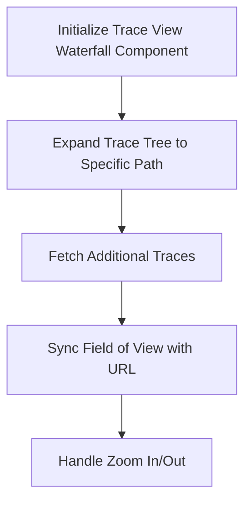

This document will cover the Trace View Waterfall Component, which includes:

1. Initializing the Trace View Waterfall Component
2. Expanding the Trace Tree to a Specific Path
3. Fetching Additional Traces
4. Synchronizing the Field of View with URL Query Parameters
5. Handling Zooming In and Out of Nodes

Technical document: <SwmLink doc-title="Trace View Waterfall Component">[Trace View Waterfall Component](/.swm/trace-view-waterfall-component.b3fyyq7y.sw.md)</SwmLink>

# [Initializing the Trace View Waterfall Component](https://app.swimm.io/repos/Z2l0aHViJTNBJTNBc2VudHJ5LWRlbW8tMSUzQSUzQVN3aW1tLURlbW8=/docs/b3fyyq7y#traceviewwaterfall-initialization)

The Trace View Waterfall Component is initialized to set up various hooks and states necessary for rendering the trace view. This includes setting up API calls, project data, organization context, and managing the trace state. This initialization ensures that the component is ready to handle user interactions and display the trace data accurately.

# [Expanding the Trace Tree to a Specific Path](https://app.swimm.io/repos/Z2l0aHViJTNBJTNBc2VudHJ5LWRlbW8tMSUzQSUzQVN3aW1tLURlbW8=/docs/b3fyyq7y#expandtopath-function)

The ExpandToPath function is responsible for expanding the trace tree to a specific path. It traverses the tree, expanding nodes as necessary, and ensures that the view is updated to reflect the expanded state. This allows users to navigate through the trace tree and view detailed information about specific nodes.

# [Fetching Additional Traces](https://app.swimm.io/repos/Z2l0aHViJTNBJTNBc2VudHJ5LWRlbW8tMSUzQSUzQVN3aW1tLURlbW8=/docs/b3fyyq7y#fetching-additional-traces)

The fetchAdditionalTraces function fetches additional trace data from the server. It handles the loading state, makes API calls to fetch trace data, and updates the trace tree with the new data. This ensures that users can view more detailed trace information as they navigate through the trace tree.

# [Synchronizing the Field of View with URL Query Parameters](https://app.swimm.io/repos/Z2l0aHViJTNBJTNBc2VudHJ5LWRlbW8tMSUzQSUzQVN3aW1tLURlbW8=/docs/b3fyyq7y#enqueue-fov-query-param-sync)

The enqueueFOVQueryParamSync function updates the URL query parameters to reflect the current field of view (FOV) in the trace view. This ensures that the URL is always in sync with the user's current view, allowing users to share specific views of the trace data with others via the URL.

# [Handling Zooming In and Out of Nodes](https://app.swimm.io/repos/Z2l0aHViJTNBJTNBc2VudHJ5LWRlbW8tMSUzQSUzQVN3aW1tLURlbW8=/docs/b3fyyq7y#zoomin-function)

The zoomIn function handles the zooming in and out of nodes in the trace tree. It checks if the node is already zoomed in or out and updates the node's state accordingly. If zooming in, it fetches transaction spans using the fetchTransactionSpans function and updates the tree with the resolved data. This allows users to focus on specific parts of the trace data for detailed analysis.

&nbsp;

*This is an auto-generated document by Swimm AI 🌊 and has not yet been verified by a human*

<SwmMeta version="3.0.0" repo-id="Z2l0aHViJTNBJTNBc2VudHJ5LWRlbW8tMSUzQSUzQVN3aW1tLURlbW8=" repo-name="sentry-demo-1" doc-type="product-flows">Powered by [Swimm](/)</SwmMeta>
