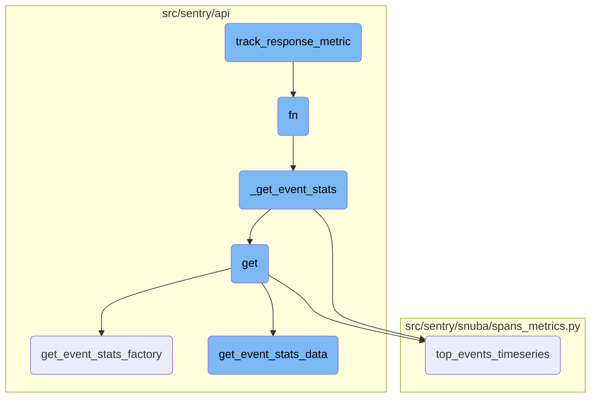
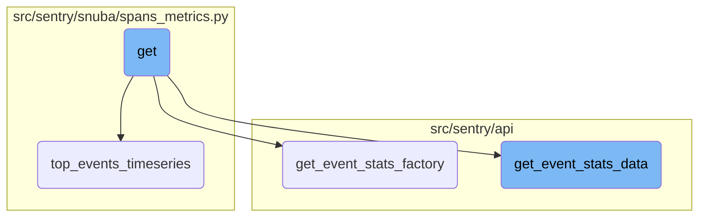

In this document, we will explain the purpose and functionality of the <SwmToken path="src/sentry_plugins/amazon_sqs/plugin.py" pos="29:2:2" line-data="def track_response_metric(fn):">`track_response_metric`</SwmToken> function. This function is designed to monitor the success or failure of HTTP responses by wrapping around other functions and incrementing a specific metric based on the outcome.

The <SwmToken path="src/sentry_plugins/amazon_sqs/plugin.py" pos="29:2:2" line-data="def track_response_metric(fn):">`track_response_metric`</SwmToken> function helps in tracking how well HTTP responses are performing. It wraps around another function and checks if that function runs successfully or fails. If it runs successfully, it increments a metric to indicate success. If it fails, it increments a metric to indicate failure. This way, it helps in monitoring and understanding the performance of HTTP responses.

Here is a high level diagram of the flow, showing only the most important functions:



# Flow drill down

First, we'll zoom into this section of the flow:

```mermaid
graph TD;
      subgraph src/sentry
f56f2b1071a7028f9d9f6001e6edbee5fb695b2211d1b131adf5bfdb5bdcc20f(track_response_metric):::mainFlowStyle --> 780bcbb7f1ba504427a19b761ba7a3bd49ed1d66d66daa8ef3d67ccaf80a796b(fn):::mainFlowStyle
end

subgraph src/sentry
780bcbb7f1ba504427a19b761ba7a3bd49ed1d66d66daa8ef3d67ccaf80a796b(fn):::mainFlowStyle --> ad78852d294414355cc4c1d586c85e1393b026807c627189ee95bfe783a81e9d(_get_event_stats):::mainFlowStyle
end

subgraph src/sentry
ad78852d294414355cc4c1d586c85e1393b026807c627189ee95bfe783a81e9d(_get_event_stats):::mainFlowStyle --> bc6d31d72bc18284a8d977c0ed48626395c14e576180df10f123120acbdabb9b(top_events_timeseries)
end

subgraph src/sentry
ad78852d294414355cc4c1d586c85e1393b026807c627189ee95bfe783a81e9d(_get_event_stats):::mainFlowStyle --> abc6480ff9e6702434a01780407f1b1b353e9678808b51b4270e726788e2f826(get):::mainFlowStyle
end

subgraph src/sentry
abc6480ff9e6702434a01780407f1b1b353e9678808b51b4270e726788e2f826(get):::mainFlowStyle --> 147wc(...)
end


      classDef mainFlowStyle color:#000000,fill:#7CB9F4
classDef rootsStyle color:#000000,fill:#00FFF4
classDef Style1 color:#000000,fill:#00FFAA
classDef Style2 color:#000000,fill:#FFFF00
classDef Style3 color:#000000,fill:#AA7CB9

%% Swimm:
%% graph TD;
%%       subgraph <SwmPath>[src/sentry/](src/sentry/)</SwmPath>
%% f56f2b1071a7028f9d9f6001e6edbee5fb695b2211d1b131adf5bfdb5bdcc20f(track_response_metric):::mainFlowStyle --> 780bcbb7f1ba504427a19b761ba7a3bd49ed1d66d66daa8ef3d67ccaf80a796b(fn):::mainFlowStyle
%% end
%% 
%% subgraph <SwmPath>[src/sentry/](src/sentry/)</SwmPath>
%% 780bcbb7f1ba504427a19b761ba7a3bd49ed1d66d66daa8ef3d67ccaf80a796b(fn):::mainFlowStyle --> ad78852d294414355cc4c1d586c85e1393b026807c627189ee95bfe783a81e9d(_get_event_stats):::mainFlowStyle
%% end
%% 
%% subgraph <SwmPath>[src/sentry/](src/sentry/)</SwmPath>
%% ad78852d294414355cc4c1d586c85e1393b026807c627189ee95bfe783a81e9d(_get_event_stats):::mainFlowStyle --> bc6d31d72bc18284a8d977c0ed48626395c14e576180df10f123120acbdabb9b(top_events_timeseries)
%% end
%% 
%% subgraph <SwmPath>[src/sentry/](src/sentry/)</SwmPath>
%% ad78852d294414355cc4c1d586c85e1393b026807c627189ee95bfe783a81e9d(_get_event_stats):::mainFlowStyle --> abc6480ff9e6702434a01780407f1b1b353e9678808b51b4270e726788e2f826(get):::mainFlowStyle
%% end
%% 
%% subgraph <SwmPath>[src/sentry/](src/sentry/)</SwmPath>
%% abc6480ff9e6702434a01780407f1b1b353e9678808b51b4270e726788e2f826(get):::mainFlowStyle --> 147wc(...)
%% end
%% 
%% 
%%       classDef mainFlowStyle color:#000000,fill:#7CB9F4
%% classDef rootsStyle color:#000000,fill:#00FFF4
%% classDef Style1 color:#000000,fill:#00FFAA
%% classDef Style2 color:#000000,fill:#FFFF00
%% classDef Style3 color:#000000,fill:#AA7CB9
```



<SwmSnippet path="/src/sentry_plugins/amazon_sqs/plugin.py" line="33">

---

## <SwmToken path="src/sentry_plugins/amazon_sqs/plugin.py" pos="29:2:2" line-data="def track_response_metric(fn):">`track_response_metric`</SwmToken>

The <SwmToken path="src/sentry_plugins/amazon_sqs/plugin.py" pos="29:2:2" line-data="def track_response_metric(fn):">`track_response_metric`</SwmToken> function is a decorator that wraps around another function to track the success or failure of an HTTP response. It increments a metric named <SwmToken path="src/sentry_plugins/amazon_sqs/plugin.py" pos="37:2:6" line-data="                &quot;data-forwarding.http_response&quot;, tags={&quot;plugin&quot;: &quot;amazon-sqs&quot;, &quot;success&quot;: success}">`data-forwarding.http_response`</SwmToken> with tags indicating whether the response was successful or not. This is determined by whether an exception was raised during the execution of the wrapped function.

```python
    def wrapper(*args, **kwargs):
        try:
            success = fn(*args, **kwargs)
            metrics.incr(
                "data-forwarding.http_response", tags={"plugin": "amazon-sqs", "success": success}
            )
        except Exception:
            metrics.incr(
                "data-forwarding.http_response", tags={"plugin": "amazon-sqs", "success": False}
            )
            raise
        return success
```

---

</SwmSnippet>

<SwmSnippet path="/src/sentry/api/endpoints/organization_events_stats.py" line="349">

---

## fn

The <SwmToken path="src/sentry_plugins/amazon_sqs/plugin.py" pos="35:5:5" line-data="            success = fn(*args, **kwargs)">`fn`</SwmToken> function is responsible for determining whether to call <SwmToken path="src/sentry/api/endpoints/organization_events_stats.py" pos="350:3:3" line-data="                    return _get_event_stats(">`_get_event_stats`</SwmToken> directly or to handle additional logic related to dashboard widgets. If certain conditions are not met, it simply calls <SwmToken path="src/sentry/api/endpoints/organization_events_stats.py" pos="350:3:3" line-data="                    return _get_event_stats(">`_get_event_stats`</SwmToken> with the provided parameters.

```python
                if not (metrics_enhanced and dashboard_widget_id):
                    return _get_event_stats(
                        scoped_dataset,
                        query_columns,
                        query,
                        snuba_params,
                        rollup,
                        zerofill_results,
                        comparison_delta,
                    )
```

---

</SwmSnippet>

<SwmSnippet path="/src/sentry/api/endpoints/organization_events_stats.py" line="360">

---

### Handling Dashboard Widgets

If the conditions are met, the function retrieves the relevant dashboard widget and checks if it has a split configuration. Depending on the type of split, it modifies the query and calls <SwmToken path="src/sentry/api/endpoints/organization_events_stats.py" pos="350:3:3" line-data="                    return _get_event_stats(">`_get_event_stats`</SwmToken> accordingly.

```python
                try:
                    widget = DashboardWidget.objects.get(id=dashboard_widget_id)
                    does_widget_have_split = widget.discover_widget_split is not None
                    has_override_feature = features.has(
                        "organizations:performance-discover-widget-split-override-save",
                        organization,
                        actor=request.user,
                    )

                    if does_widget_have_split and not has_override_feature:
                        # This is essentially cached behaviour and we skip the check
```

---

</SwmSnippet>

<SwmSnippet path="/src/sentry/api/endpoints/organization_events_stats.py" line="285">

---

## <SwmToken path="src/sentry/api/endpoints/organization_events_stats.py" pos="350:3:3" line-data="                    return _get_event_stats(">`_get_event_stats`</SwmToken>

The <SwmToken path="src/sentry/api/endpoints/organization_events_stats.py" pos="350:3:3" line-data="                    return _get_event_stats(">`_get_event_stats`</SwmToken> function is responsible for querying event statistics. If the <SwmToken path="src/sentry/api/endpoints/organization_events_stats.py" pos="285:3:3" line-data="            if top_events &gt; 0:">`top_events`</SwmToken> parameter is greater than zero, it calls <SwmToken path="src/sentry/api/endpoints/organization_events_stats.py" pos="286:5:5" line-data="                return scoped_dataset.top_events_timeseries(">`top_events_timeseries`</SwmToken> to get a timeseries of the top events. Otherwise, it performs a standard timeseries query.

```python
            if top_events > 0:
                return scoped_dataset.top_events_timeseries(
                    timeseries_columns=query_columns,
                    selected_columns=self.get_field_list(organization, request),
                    equations=self.get_equation_list(organization, request),
                    user_query=query,
                    snuba_params=snuba_params,
                    orderby=self.get_orderby(request),
                    rollup=rollup,
                    limit=top_events,
                    organization=organization,
                    referrer=referrer + ".find-topn",
                    allow_empty=False,
                    zerofill_results=zerofill_results,
                    on_demand_metrics_enabled=use_on_demand_metrics,
                    on_demand_metrics_type=on_demand_metrics_type,
                    include_other=include_other,
                    query_source=query_source,
                )
```

---

</SwmSnippet>

<SwmSnippet path="/src/sentry/snuba/spans_metrics.py" line="186">

---

## <SwmToken path="src/sentry/api/endpoints/organization_events_stats.py" pos="286:5:5" line-data="                return scoped_dataset.top_events_timeseries(">`top_events_timeseries`</SwmToken>

The <SwmToken path="src/sentry/api/endpoints/organization_events_stats.py" pos="286:5:5" line-data="                return scoped_dataset.top_events_timeseries(">`top_events_timeseries`</SwmToken> function performs a <SwmToken path="src/sentry/snuba/spans_metrics.py" pos="97:1:3" line-data="    High-level API for doing arbitrary user timeseries queries against events.">`High-level`</SwmToken> API query to fetch timeseries data for a limited number of top events. It first checks if <SwmToken path="src/sentry/snuba/spans_metrics.py" pos="187:3:3" line-data="    if top_events is None:">`top_events`</SwmToken> is provided; if not, it performs a query to find the top events based on the given parameters.

```python

    if top_events is None:
        top_events = query(
            selected_columns,
            query=user_query,
            snuba_params=snuba_params,
            equations=equations,
            orderby=orderby,
            limit=limit,
            referrer=referrer,
            auto_aggregations=True,
            use_aggregate_conditions=True,
            include_equation_fields=True,
            skip_tag_resolution=True,
            query_source=query_source,
        )
```

---

</SwmSnippet>

Now, lets zoom into this section of the flow:



<SwmSnippet path="/src/sentry/api/endpoints/organization_events_stats.py" line="183">

---

## The <SwmToken path="src/sentry/api/endpoints/organization_events_stats.py" pos="183:3:3" line-data="    def get(self, request: Request, organization: Organization) -&gt; Response:">`get`</SwmToken> Function

The <SwmToken path="src/sentry/api/endpoints/organization_events_stats.py" pos="183:3:3" line-data="    def get(self, request: Request, organization: Organization) -&gt; Response:">`get`</SwmToken> function handles the incoming request and organization data. It processes the request to fetch event statistics by calling helper functions like <SwmToken path="src/sentry/api/endpoints/organization_events_stats.py" pos="331:3:3" line-data="        def get_event_stats_factory(scoped_dataset):">`get_event_stats_factory`</SwmToken> and <SwmToken path="src/sentry/api/bases/organization_events.py" pos="388:3:3" line-data="    def get_event_stats_data(">`get_event_stats_data`</SwmToken>.

```python
    def get(self, request: Request, organization: Organization) -> Response:
        query_source = self.get_request_source(request)
        with sentry_sdk.start_span(op="discover.endpoint", description="filter_params") as span:
            span.set_data("organization", organization)

            top_events = 0

            if "topEvents" in request.GET:
                try:
                    top_events = int(request.GET.get("topEvents", 0))
                except ValueError:
                    return Response({"detail": "topEvents must be an integer"}, status=400)
                if top_events > MAX_TOP_EVENTS:
                    return Response(
                        {"detail": f"Can only get up to {MAX_TOP_EVENTS} top events"},
                        status=400,
                    )
                elif top_events <= 0:
                    return Response({"detail": "If topEvents needs to be at least 1"}, status=400)

            comparison_delta = None
```

---

</SwmSnippet>

<SwmSnippet path="/src/sentry/api/endpoints/organization_events_stats.py" line="331">

---

## The <SwmToken path="src/sentry/api/endpoints/organization_events_stats.py" pos="331:3:3" line-data="        def get_event_stats_factory(scoped_dataset):">`get_event_stats_factory`</SwmToken> Function

The <SwmToken path="src/sentry/api/endpoints/organization_events_stats.py" pos="331:3:3" line-data="        def get_event_stats_factory(scoped_dataset):">`get_event_stats_factory`</SwmToken> function creates a closure over the dataset to make additional requests to the errors dataset. It handles the logic for splitting the dataset based on dashboard widgets and ensures compatibility with different dataset types.

```python
        def get_event_stats_factory(scoped_dataset):
            """
            This factory closes over dataset in order to make an additional request to the errors dataset
            in the case that this request is from a dashboard widget and we're trying to split their discover dataset.

            This should be removed once the discover dataset is completely split in dashboards.
            """
            dashboard_widget_id = request.GET.get("dashboardWidgetId", None)

            def fn(
                query_columns: Sequence[str],
                query: str,
                snuba_params: SnubaParams,
                rollup: int,
                zerofill_results: bool,
                comparison_delta: datetime | None,
            ) -> SnubaTSResult | dict[str, SnubaTSResult]:

                if not (metrics_enhanced and dashboard_widget_id):
                    return _get_event_stats(
                        scoped_dataset,
```

---

</SwmSnippet>

<SwmSnippet path="/src/sentry/api/bases/organization_events.py" line="388">

---

## The <SwmToken path="src/sentry/api/bases/organization_events.py" pos="388:3:3" line-data="    def get_event_stats_data(">`get_event_stats_data`</SwmToken> Function

The <SwmToken path="src/sentry/api/bases/organization_events.py" pos="388:3:3" line-data="    def get_event_stats_data(">`get_event_stats_data`</SwmToken> function is responsible for querying event statistics data. It handles query creation, error handling, and serialization of the results. This function ensures that the correct data is fetched and formatted for the response.

```python
    def get_event_stats_data(
        self,
        request: Request,
        organization: Organization,
        get_event_stats: Callable[
            [Sequence[str], str, SnubaParams, int, bool, timedelta | None], SnubaTSResult
        ],
        top_events: int = 0,
        query_column: str = "count()",
        snuba_params: SnubaParams | None = None,
        query: str | None = None,
        allow_partial_buckets: bool = False,
        zerofill_results: bool = True,
        comparison_delta: timedelta | None = None,
        additional_query_column: str | None = None,
        dataset: Any | None = None,
    ) -> dict[str, Any]:
        with handle_query_errors():
            with sentry_sdk.start_span(
                op="discover.endpoint", description="base.stats_query_creation"
            ):
```

---

</SwmSnippet>

&nbsp;

*This is an auto-generated document by Swimm AI 🌊 and has not yet been verified by a human*

<SwmMeta version="3.0.0" repo-id="Z2l0aHViJTNBJTNBc2VudHJ5LWRlbW8tMSUzQSUzQVN3aW1tLURlbW8=" repo-name="sentry-demo-1" doc-type="flows"><sup>Powered by [Swimm](/)</sup></SwmMeta>
