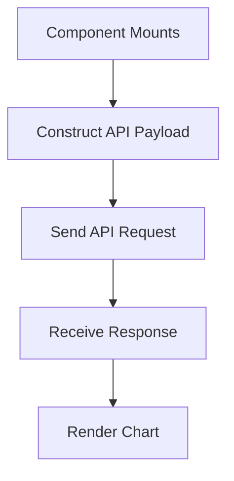

# Transaction Overview

Transaction overview refers to the detailed analysis and visualization of individual transactions within the application. It includes various charts and metrics that help in understanding the performance and behavior of transactions.

<SwmSnippet path="/static/app/views/performance/transactionSummary/transactionOverview/index.tsx" line="63">

---

## <SwmToken path="static/app/views/performance/transactionSummary/transactionOverview/index.tsx" pos="63:2:2" line-data="function TransactionOverview(props: Props) {">`TransactionOverview`</SwmToken> Component

The <SwmToken path="static/app/views/performance/transactionSummary/transactionOverview/index.tsx" pos="63:2:2" line-data="function TransactionOverview(props: Props) {">`TransactionOverview`</SwmToken> component initializes the necessary data and context for rendering the transaction summary. It uses hooks like <SwmToken path="static/app/views/performance/transactionSummary/transactionOverview/index.tsx" pos="68:1:1" line-data="  useEffect(() =&gt; {">`useEffect`</SwmToken> to load organization tags and track analytics for performance views.

```tsx
function TransactionOverview(props: Props) {
  const api = useApi();

  const {location, selection, organization, projects} = props;

  useEffect(() => {
    loadOrganizationTags(api, organization.slug, selection);
    addRoutePerformanceContext(selection);
    trackAnalytics('performance_views.transaction_summary.view', {
      organization,
    });
  }, [selection, organization, api]);

  return (
    <MEPSettingProvider>
      <PageLayout
        location={location}
        organization={organization}
        projects={projects}
        tab={Tab.TRANSACTION_SUMMARY}
        getDocumentTitle={getDocumentTitle}
```

---

</SwmSnippet>

<SwmSnippet path="/static/app/views/performance/transactionSummary/transactionOverview/index.tsx" line="101">

---

## <SwmToken path="static/app/views/performance/transactionSummary/transactionOverview/index.tsx" pos="101:2:2" line-data="function OverviewContentWrapper(props: ChildProps) {">`OverviewContentWrapper`</SwmToken> Component

The <SwmToken path="static/app/views/performance/transactionSummary/transactionOverview/index.tsx" pos="101:2:2" line-data="function OverviewContentWrapper(props: ChildProps) {">`OverviewContentWrapper`</SwmToken> component fetches and processes data related to transaction events and totals. It uses the <SwmToken path="static/app/views/performance/transactionSummary/transactionOverview/index.tsx" pos="121:7:7" line-data="  const queryData = useDiscoverQuery({">`useDiscoverQuery`</SwmToken> hook to execute queries and retrieve data for rendering charts and tables.

```tsx
function OverviewContentWrapper(props: ChildProps) {
  const {
    location,
    organization,
    eventView,
    projectId,
    transactionName,
    transactionThreshold,
    transactionThresholdMetric,
  } = props;

  const mepContext = useMEPDataContext();
  const mepSetting = useMEPSettingContext();
  const mepCardinalityContext = useMetricsCardinalityContext();
  const queryExtras = getTransactionMEPParamsIfApplicable(
    mepSetting,
    mepCardinalityContext,
    organization
  );

  const queryData = useDiscoverQuery({
```

---

</SwmSnippet>

<SwmSnippet path="/static/app/views/performance/transactionSummary/transactionOverview/content.tsx" line="91">

---

## <SwmToken path="static/app/views/performance/transactionSummary/transactionOverview/content.tsx" pos="91:2:2" line-data="function SummaryContent({">`SummaryContent`</SwmToken> Component

The <SwmToken path="static/app/views/performance/transactionSummary/transactionOverview/content.tsx" pos="91:2:2" line-data="function SummaryContent({">`SummaryContent`</SwmToken> component handles the rendering of various charts and tables based on the fetched data. It includes functionalities like search, filter, and sort to allow users to interact with the transaction data.

```tsx
function SummaryContent({
  eventView,
  location,
  totalValues,
  spanOperationBreakdownFilter,
  organization,
  projects,
  isLoading,
  error,
  projectId,
  transactionName,
  onChangeFilter,
}: Props) {
  const routes = useRoutes();
  const mepDataContext = useMEPDataContext();

  const handleSearch = useCallback(
    (query: string) => {
      const queryParams = normalizeDateTimeParams({
        ...(location.query || {}),
```

---

</SwmSnippet>

## Transaction Overview Endpoints

Transaction Overview Endpoints are used to fetch and render data for various charts. These endpoints send requests to the <SwmPath>[api-docs/paths/events/](api-docs/paths/events/)</SwmPath> endpoint with the specified query parameters to retrieve event data.

<SwmSnippet path="/static/app/views/performance/transactionSummary/transactionOverview/durationChart/index.tsx" line="136">

---

### <SwmToken path="static/app/views/performance/transactionSummary/transactionOverview/durationChart/index.tsx" pos="136:2:2" line-data="      &lt;EventsRequest">`EventsRequest`</SwmToken>

The <SwmToken path="static/app/views/performance/transactionSummary/transactionOverview/durationChart/index.tsx" pos="136:2:2" line-data="      &lt;EventsRequest">`EventsRequest`</SwmToken> component is used to fetch and render data for the duration chart. It sends a request to the <SwmPath>[api-docs/paths/events/](api-docs/paths/events/)</SwmPath> endpoint with the specified query parameters to retrieve event data. The response is then used to render the chart.

```tsx
      <EventsRequest
        {...requestCommonProps}
        organization={organization}
        showLoading={false}
        includePrevious={false}
        yAxis={yAxis}
        partial
        withoutZerofill={withoutZerofill}
        referrer="api.performance.transaction-summary.duration-chart"
        queryExtras={queryExtras}
      >
```

---

</SwmSnippet>

<SwmSnippet path="/static/app/views/performance/transactionSummary/transactionOverview/durationPercentileChart/content.tsx" line="73">

---

### <SwmToken path="static/app/views/performance/transactionSummary/transactionOverview/durationPercentileChart/content.tsx" pos="73:5:5" line-data="  } = useApiQuery&lt;{data: ApiResult[]}&gt;(">`useApiQuery`</SwmToken>

The <SwmToken path="static/app/views/performance/transactionSummary/transactionOverview/durationPercentileChart/content.tsx" pos="73:5:5" line-data="  } = useApiQuery&lt;{data: ApiResult[]}&gt;(">`useApiQuery`</SwmToken> hook is used to fetch data for the duration percentile chart. It sends a request to the <SwmPath>[api-docs/paths/events/](api-docs/paths/events/)</SwmPath> endpoint with the constructed API payload. The hook manages the loading, error, and data states for the request.

```tsx
  } = useApiQuery<{data: ApiResult[]}>(
    [`/organizations/${organization.slug}/events/`, {query: apiPayload}],
    {
      staleTime: 0,
    }
  );
```

---

</SwmSnippet>

&nbsp;

*This is an auto-generated document by Swimm AI 🌊 and has not yet been verified by a human*

<SwmMeta version="3.0.0" repo-id="Z2l0aHViJTNBJTNBc2VudHJ5LWRlbW8tMSUzQSUzQVN3aW1tLURlbW8=" repo-name="sentry-demo-1" doc-type="overview"><sup>Powered by [Swimm](/)</sup></SwmMeta>
