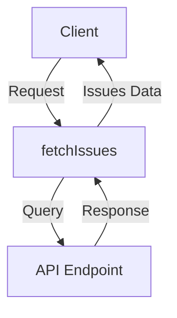

# Overview

Components are reusable UI elements that are used to build the user interface. They encapsulate the structure, style, and behavior of a part of the UI. Components in the `common` directory are shared across different parts of the application to ensure consistency and reduce code duplication.

# Defining Properties

The `Props` type in <SwmPath>[static/app/views/insights/common/components/samplesTable/common.tsx](static/app/views/insights/common/components/samplesTable/common.tsx)</SwmPath> defines the properties that the component expects, such as `compareToDuration` and `duration`.

# Using Components

The `ModulePageProviders` component in <SwmPath>[static/app/views/insights/common/components/modulePageProviders.tsx](static/app/views/insights/common/components/modulePageProviders.tsx)</SwmPath> uses props like `moduleName`, `pageTitle`, `children`, and `features` to render a page with specific configurations.

# Styling Components

The <SwmToken path="static/app/views/insights/common/components/issues.tsx" pos="33:2:2" line-data="    &lt;StyledPanelItem as=&quot;tr&quot;&gt;">`StyledPanelItem`</SwmToken> constant in <SwmPath>[static/app/views/insights/common/components/issues.tsx](static/app/views/insights/common/components/issues.tsx)</SwmPath> is a styled component that customizes the appearance of a <SwmToken path="static/app/views/insights/common/components/issues.tsx" pos="10:2:2" line-data="import PanelItem from &#39;sentry/components/panels/panelItem&#39;;">`PanelItem`</SwmToken>.

# Specialized Components

The `tableCells` directory contains various components for rendering different types of table cells, such as <SwmPath>[static/app/views/insights/common/components/tableCells/renderHeadCell.tsx](static/app/views/insights/common/components/tableCells/renderHeadCell.tsx)</SwmPath>, <SwmPath>[static/app/views/insights/common/components/tableCells/throughputCell.tsx](static/app/views/insights/common/components/tableCells/throughputCell.tsx)</SwmPath>, and <SwmPath>[static/app/views/insights/common/components/tableCells/resourceSizeCell.tsx](static/app/views/insights/common/components/tableCells/resourceSizeCell.tsx)</SwmPath>.

# Displaying Data

The `samplesTable` directory includes components like <SwmPath>[static/app/views/insights/common/components/samplesTable/common.tsx](static/app/views/insights/common/components/samplesTable/common.tsx)</SwmPath> and <SwmPath>[static/app/views/insights/cache/components/tables/spanSamplesTable.tsx](static/app/views/insights/cache/components/tables/spanSamplesTable.tsx)</SwmPath> for displaying sample data in a table format.

# Components Endpoints

Components Endpoints

# Fetching Issues

The <SwmToken path="static/app/views/insights/common/components/issues.tsx" pos="83:2:2" line-data="function fetchIssues(">`fetchIssues`</SwmToken> function is used to retrieve issues from the server. It constructs a query based on the provided issue types and message, and then uses the <SwmToken path="static/app/views/insights/common/components/issues.tsx" pos="96:15:15" line-data="  const {isPending, data: maybeMatchingIssues} = useApiQuery&lt;Group[]&gt;(">`useApiQuery`</SwmToken> hook to fetch the data from the <SwmPath>[src/sentry/api/endpoints/issues/](src/sentry/api/endpoints/issues/)</SwmPath> endpoint. The function returns an object containing the loading state and the fetched issues.

<SwmSnippet path="/static/app/views/insights/common/components/issues.tsx" line="83">

---

The <SwmToken path="static/app/views/insights/common/components/issues.tsx" pos="83:2:2" line-data="function fetchIssues(">`fetchIssues`</SwmToken> function constructs a query and uses the <SwmToken path="static/app/views/insights/common/components/issues.tsx" pos="96:15:15" line-data="  const {isPending, data: maybeMatchingIssues} = useApiQuery&lt;Group[]&gt;(">`useApiQuery`</SwmToken> hook to fetch data from the server. This function is crucial for retrieving issues based on specific criteria.

```tsx
function fetchIssues(
  issueTypes: string[],
  message?: string
): {isLoading: boolean; issues?: Group[]} {
  const organization = useOrganization();
  const {selection} = usePageFilters();

  let query = `issue.type:[${issueTypes.join(',')}]`;
  // note: backend supports a maximum number of characters for message (seems to vary).
  // so, we query the first 200 characters of `message`, then filter for exact `message`
  // matches in application code
  query += ` message:"${message?.slice(0, 200).replaceAll('"', '\\"')}"`;

  const {isPending, data: maybeMatchingIssues} = useApiQuery<Group[]>(
    [
      `/organizations/${organization.slug}/issues/`,
      {
        query: {
          expand: ['inbox', 'owners'],
          query,
          shortIdLookup: 1,
```

---

</SwmSnippet>

&nbsp;

*This is an auto-generated document by Swimm AI 🌊 and has not yet been verified by a human*

<SwmMeta version="3.0.0" repo-id="Z2l0aHViJTNBJTNBc2VudHJ5LWRlbW8tMSUzQSUzQVN3aW1tLURlbW8=" repo-name="sentry-demo-1" doc-type="overview"><sup>Powered by [Swimm](/)</sup></SwmMeta>
