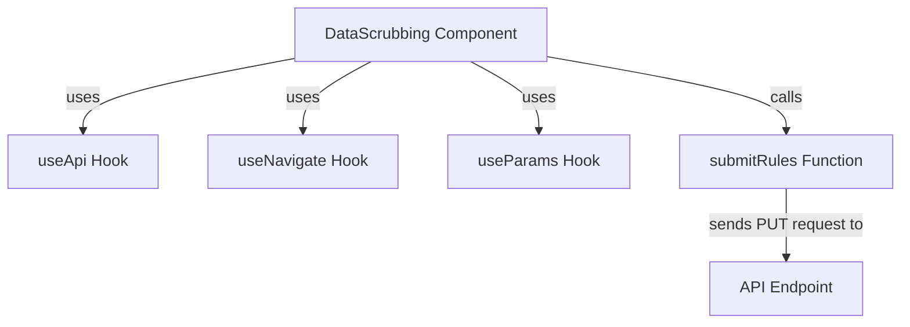

# Overview

Data scrubbing is a feature that allows users to define rules for modifying or removing sensitive information from data before it is stored or processed. In the <SwmToken path="static/app/views/settings/components/dataScrubbing/index.tsx" pos="32:22:22" line-data="  &#39;https://docs.sentry.io/product/data-management-settings/scrubbing/advanced-datascrubbing/&#39;;">`datascrubbing`</SwmToken> component, data scrubbing rules are managed and applied to ensure that sensitive information is handled according to the specified rules.

# Managing Data Scrubbing Rules

The <SwmToken path="static/app/views/settings/components/dataScrubbing/index.tsx" pos="32:22:22" line-data="  &#39;https://docs.sentry.io/product/data-management-settings/scrubbing/advanced-datascrubbing/&#39;;">`datascrubbing`</SwmToken> component uses the <SwmToken path="static/app/views/settings/components/dataScrubbing/index.tsx" pos="53:7:7" line-data="  const api = useApi();">`useApi`</SwmToken>, <SwmToken path="static/app/views/settings/components/dataScrubbing/index.tsx" pos="55:7:7" line-data="  const navigate = useNavigate();">`useNavigate`</SwmToken>, and <SwmToken path="static/app/views/settings/components/dataScrubbing/index.tsx" pos="56:7:7" line-data="  const params = useParams();">`useParams`</SwmToken> hooks to interact with the API, navigate between routes, and access route parameters, respectively.

<SwmSnippet path="/static/app/views/settings/components/dataScrubbing/index.tsx" line="53">

---

The <SwmToken path="static/app/views/settings/components/dataScrubbing/index.tsx" pos="53:7:7" line-data="  const api = useApi();">`useApi`</SwmToken>, <SwmToken path="static/app/views/settings/components/dataScrubbing/index.tsx" pos="55:7:7" line-data="  const navigate = useNavigate();">`useNavigate`</SwmToken>, and <SwmToken path="static/app/views/settings/components/dataScrubbing/index.tsx" pos="56:7:7" line-data="  const params = useParams();">`useParams`</SwmToken> hooks are initialized to handle API requests, navigation, and route parameters.

```tsx
  const api = useApi();
  const [rules, setRules] = useState<Rule[]>([]);
  const navigate = useNavigate();
  const params = useParams();
```

---

</SwmSnippet>

# State Management

The component maintains a state of rules using the <SwmToken path="static/app/views/settings/components/dataScrubbing/index.tsx" pos="54:12:12" line-data="  const [rules, setRules] = useState&lt;Rule[]&gt;([]);">`useState`</SwmToken> hook.

<SwmSnippet path="/static/app/views/settings/components/dataScrubbing/index.tsx" line="54">

---

The state of rules is initialized using the <SwmToken path="static/app/views/settings/components/dataScrubbing/index.tsx" pos="54:12:12" line-data="  const [rules, setRules] = useState&lt;Rule[]&gt;([]);">`useState`</SwmToken> hook.

```tsx
  const [rules, setRules] = useState<Rule[]>([]);
  const navigate = useNavigate();
```

---

</SwmSnippet>

# Saving Rules

When a rule is successfully saved, the <SwmToken path="static/app/views/settings/components/dataScrubbing/index.tsx" pos="58:3:3" line-data="  const successfullySaved = useCallback(">`successfullySaved`</SwmToken> callback updates the rules state and displays a success message.

<SwmSnippet path="/static/app/views/settings/components/dataScrubbing/index.tsx" line="58">

---

The <SwmToken path="static/app/views/settings/components/dataScrubbing/index.tsx" pos="58:3:3" line-data="  const successfullySaved = useCallback(">`successfullySaved`</SwmToken> callback updates the rules state and displays a success message upon successful saving of a rule.

```tsx
  const successfullySaved = useCallback(
    (response: {relayPiiConfig: string}, successMessage: string) => {
      setRules(convertRelayPiiConfig(response.relayPiiConfig));
      addSuccessMessage(successMessage);
      onSubmitSuccess?.(response);
    },
    [onSubmitSuccess]
  );
```

---

</SwmSnippet>

# Closing Modals

The <SwmToken path="static/app/views/settings/components/dataScrubbing/index.tsx" pos="67:3:3" line-data="  const handleCloseModal = useCallback(() =&gt; {">`handleCloseModal`</SwmToken> function navigates the user back to the security and privacy settings page after closing a modal.

<SwmSnippet path="/static/app/views/settings/components/dataScrubbing/index.tsx" line="67">

---

The <SwmToken path="static/app/views/settings/components/dataScrubbing/index.tsx" pos="67:3:3" line-data="  const handleCloseModal = useCallback(() =&gt; {">`handleCloseModal`</SwmToken> function is used to navigate back to the security and privacy settings page after closing a modal.

```tsx
  const handleCloseModal = useCallback(() => {
    const path = project?.slug
      ? `/settings/${organization.slug}/projects/${project.slug}/security-and-privacy/`
      : `/settings/${organization.slug}/security-and-privacy/`;

    navigate(path);
  }, [navigate, organization.slug, project?.slug]);
```

---

</SwmSnippet>

# Loading Rules

The <SwmToken path="static/app/views/settings/components/dataScrubbing/index.tsx" pos="115:3:3" line-data="    function loadRules() {">`loadRules`</SwmToken> function initializes the rules state by converting the relay PII configuration into a usable format.

<SwmSnippet path="/static/app/views/settings/components/dataScrubbing/index.tsx" line="115">

---

The <SwmToken path="static/app/views/settings/components/dataScrubbing/index.tsx" pos="115:3:3" line-data="    function loadRules() {">`loadRules`</SwmToken> function converts the relay PII configuration into a usable format to initialize the rules state.

```tsx
    function loadRules() {
      try {
        setRules(convertRelayPiiConfig(relayPiiConfig));
      } catch {
```

---

</SwmSnippet>

# Editing, Adding, and Deleting Rules

The <SwmToken path="static/app/views/settings/components/dataScrubbing/index.tsx" pos="126:3:3" line-data="  function handleEdit(id: Rule[&#39;id&#39;]) {">`handleEdit`</SwmToken>, <SwmToken path="static/app/views/settings/components/dataScrubbing/index.tsx" pos="134:3:3" line-data="  function handleAdd() {">`handleAdd`</SwmToken>, and <SwmToken path="static/app/views/settings/components/dataScrubbing/index.tsx" pos="150:5:5" line-data="  async function handleDelete(id: Rule[&#39;id&#39;]) {">`handleDelete`</SwmToken> functions manage the editing, adding, and deleting of data scrubbing rules, respectively.

<SwmSnippet path="/static/app/views/settings/components/dataScrubbing/index.tsx" line="126">

---

The <SwmToken path="static/app/views/settings/components/dataScrubbing/index.tsx" pos="126:3:3" line-data="  function handleEdit(id: Rule[&#39;id&#39;]) {">`handleEdit`</SwmToken>, <SwmToken path="static/app/views/settings/components/dataScrubbing/index.tsx" pos="134:3:3" line-data="  function handleAdd() {">`handleAdd`</SwmToken>, and <SwmToken path="static/app/views/settings/components/dataScrubbing/index.tsx" pos="150:5:5" line-data="  async function handleDelete(id: Rule[&#39;id&#39;]) {">`handleDelete`</SwmToken> functions are responsible for managing the editing, adding, and deleting of data scrubbing rules.

```tsx
  function handleEdit(id: Rule['id']) {
    const path = project
      ? `/settings/${organization.slug}/projects/${project.slug}/security-and-privacy/advanced-data-scrubbing/${id}/`
      : `/settings/${organization.slug}/security-and-privacy/advanced-data-scrubbing/${id}/`;

    navigate(path);
  }

  function handleAdd() {
    openModal(modalProps => (
      <Add
        {...modalProps}
        projectId={project?.id}
        savedRules={rules}
        api={api}
        endpoint={endpoint}
        orgSlug={organization.slug}
        onSubmitSuccess={response => {
          return successfullySaved(response, t('Successfully added data scrubbing rule'));
        }}
      />
```

---

</SwmSnippet>

# Organization Level Rules

The <SwmToken path="static/app/views/settings/components/dataScrubbing/organizationRules.tsx" pos="25:4:4" line-data="export class OrganizationRules extends Component&lt;Props, State&gt; {">`OrganizationRules`</SwmToken> component is used to display and manage data scrubbing rules at the organization level.

<SwmSnippet path="/static/app/views/settings/components/dataScrubbing/organizationRules.tsx" line="25">

---

The <SwmToken path="static/app/views/settings/components/dataScrubbing/organizationRules.tsx" pos="25:4:4" line-data="export class OrganizationRules extends Component&lt;Props, State&gt; {">`OrganizationRules`</SwmToken> component manages data scrubbing rules at the organization level, loading rules on component mount and update.

```tsx
export class OrganizationRules extends Component<Props, State> {
  state: State = {
    isCollapsed: true,
    rules: [],
  };

  componentDidMount() {
    this.loadRules();
  }

  componentDidUpdate(prevProps: Props) {
    if (
      prevProps.organization.relayPiiConfig !== this.props.organization.relayPiiConfig
    ) {
      this.loadRules();
      return;
    }

    this.loadContentHeight();
  }
```

---

</SwmSnippet>

# Data Scrubbing Endpoints

The <SwmToken path="static/app/views/settings/components/dataScrubbing/submitRules.tsx" pos="46:2:2" line-data="function submitRules(api: Client, endpoint: string, rules: Array&lt;Rule&gt;) {">`submitRules`</SwmToken> function sends a PUT request to the specified endpoint with the data scrubbing rules. It formats the rules using the <SwmToken path="static/app/views/settings/components/dataScrubbing/submitRules.tsx" pos="53:8:8" line-data="    submitFormatRules[ruleId] = getSubmitFormatRule(rule);">`getSubmitFormatRule`</SwmToken> function and constructs a PII configuration object. This object is then sent to the endpoint to update the data scrubbing rules.

<SwmSnippet path="/static/app/views/settings/components/dataScrubbing/submitRules.tsx" line="46">

---

The <SwmToken path="static/app/views/settings/components/dataScrubbing/submitRules.tsx" pos="46:2:2" line-data="function submitRules(api: Client, endpoint: string, rules: Array&lt;Rule&gt;) {">`submitRules`</SwmToken> function formats the rules and sends a PUT request to update the data scrubbing rules at the specified endpoint.

```tsx
function submitRules(api: Client, endpoint: string, rules: Array<Rule>) {
  const applications: Applications = {};
  const submitFormatRules: Record<string, PiiConfig> = {};

  for (let i = 0; i < rules.length; i++) {
    const rule = rules[i];
    const ruleId = String(i);
    submitFormatRules[ruleId] = getSubmitFormatRule(rule);

    if (!applications[rule.source]) {
      applications[rule.source] = [];
    }

    if (!applications[rule.source].includes(ruleId)) {
      applications[rule.source].push(ruleId);
    }
  }

  const piiConfig = {rules: submitFormatRules, applications};

  return api.requestPromise(endpoint, {
```

---

</SwmSnippet>

&nbsp;

*This is an auto-generated document by Swimm AI 🌊 and has not yet been verified by a human*

<SwmMeta version="3.0.0" repo-id="Z2l0aHViJTNBJTNBc2VudHJ5LWRlbW8tMSUzQSUzQVN3aW1tLURlbW8=" repo-name="sentry-demo-1" doc-type="overview"><sup>Powered by [Swimm](/)</sup></SwmMeta>
