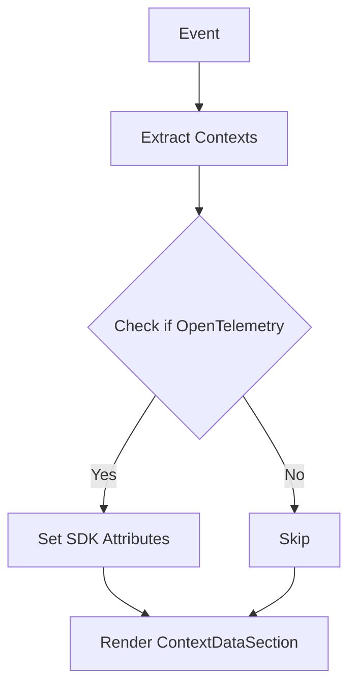

# Understanding Event Contexts

Event contexts are additional data attached to events that provide more information about the environment in which the event occurred. They can include details about the device, operating system, app, browser, and other relevant information.

## Extracting Contexts

In the <SwmToken path="static/app/components/events/contexts/index.tsx" pos="71:4:4" line-data="export function EventContexts({event, group}: Props) {">`EventContexts`</SwmToken> function, contexts are extracted from the event and used to determine if <SwmToken path="static/app/components/events/contexts/utils.tsx" pos="346:4:4" line-data="      return &#39;OpenTelemetry&#39;;">`OpenTelemetry`</SwmToken> (otel) is being used. If <SwmToken path="static/app/components/events/contexts/utils.tsx" pos="346:4:4" line-data="      return &#39;OpenTelemetry&#39;;">`OpenTelemetry`</SwmToken> is detected, attributes related to the SDK are set on the root span of the event. The <SwmToken path="static/app/components/events/contexts/index.tsx" pos="88:4:4" line-data="  return &lt;ContextDataSection event={event} group={group} project={project} /&gt;;">`ContextDataSection`</SwmToken> component is then rendered, which displays the context data in a structured format.

<SwmSnippet path="/static/app/components/events/contexts/index.tsx" line="71">

---

The <SwmToken path="static/app/components/events/contexts/index.tsx" pos="71:4:4" line-data="export function EventContexts({event, group}: Props) {">`EventContexts`</SwmToken> function extracts context data from an event and determines if <SwmToken path="static/app/components/events/contexts/utils.tsx" pos="346:4:4" line-data="      return &#39;OpenTelemetry&#39;;">`OpenTelemetry`</SwmToken> (otel) is being used. If <SwmToken path="static/app/components/events/contexts/utils.tsx" pos="346:4:4" line-data="      return &#39;OpenTelemetry&#39;;">`OpenTelemetry`</SwmToken> is detected, attributes related to the SDK are set on the root span of the event. The <SwmToken path="static/app/components/events/contexts/index.tsx" pos="88:4:4" line-data="  return &lt;ContextDataSection event={event} group={group} project={project} /&gt;;">`ContextDataSection`</SwmToken> component is then rendered to display the context data.

```tsx
export function EventContexts({event, group}: Props) {
  const {projects} = useProjects();
  const project = projects.find(p => p.id === event.projectID);
  const {contexts, sdk} = event;

  const usingOtel = useCallback(() => contexts.otel !== undefined, [contexts.otel]);

  useEffect(() => {
    const span = Sentry.getActiveSpan();
    if (usingOtel() && span) {
      const rootSpan = Sentry.getRootSpan(span);
      rootSpan.setAttribute('otel_event', true);
      rootSpan.setAttribute('otel_sdk', sdk?.name);
      rootSpan.setAttribute('otel_sdk_version', sdk?.version);
    }
  }, [usingOtel, sdk]);

  return <ContextDataSection event={event} group={group} project={project} />;
}
```

---

</SwmSnippet>

## Context Types

The <SwmToken path="static/app/components/events/contexts/utils.tsx" pos="98:2:2" line-data="const CONTEXT_TYPES = {">`CONTEXT_TYPES`</SwmToken> constant defines various types of contexts such as <SwmToken path="static/app/components/events/contexts/utils.tsx" pos="100:1:1" line-data="  app: AppEventContext,">`app`</SwmToken>, <SwmToken path="static/app/components/events/contexts/utils.tsx" pos="101:1:1" line-data="  device: DeviceEventContext,">`device`</SwmToken>, <SwmToken path="static/app/components/events/contexts/utils.tsx" pos="102:1:1" line-data="  memory_info: MemoryInfoEventContext,">`memory_info`</SwmToken>, <SwmToken path="static/app/components/events/contexts/utils.tsx" pos="103:1:1" line-data="  browser: BrowserEventContext,">`browser`</SwmToken>, <SwmToken path="static/app/components/events/contexts/utils.tsx" pos="104:1:1" line-data="  os: OperatingSystemEventContext,">`os`</SwmToken>, and more. These context types are used to categorize and handle different kinds of context data.

<SwmSnippet path="/static/app/components/events/contexts/utils.tsx" line="98">

---

The <SwmToken path="static/app/components/events/contexts/utils.tsx" pos="98:2:2" line-data="const CONTEXT_TYPES = {">`CONTEXT_TYPES`</SwmToken> constant defines various types of contexts such as <SwmToken path="static/app/components/events/contexts/utils.tsx" pos="100:1:1" line-data="  app: AppEventContext,">`app`</SwmToken>, <SwmToken path="static/app/components/events/contexts/utils.tsx" pos="101:1:1" line-data="  device: DeviceEventContext,">`device`</SwmToken>, <SwmToken path="static/app/components/events/contexts/utils.tsx" pos="102:1:1" line-data="  memory_info: MemoryInfoEventContext,">`memory_info`</SwmToken>, <SwmToken path="static/app/components/events/contexts/utils.tsx" pos="103:1:1" line-data="  browser: BrowserEventContext,">`browser`</SwmToken>, <SwmToken path="static/app/components/events/contexts/utils.tsx" pos="104:1:1" line-data="  os: OperatingSystemEventContext,">`os`</SwmToken>, and more. These context types are used to categorize and handle different kinds of context data.

```tsx
const CONTEXT_TYPES = {
  default: DefaultContext,
  app: AppEventContext,
  device: DeviceEventContext,
  memory_info: MemoryInfoEventContext,
  browser: BrowserEventContext,
  os: OperatingSystemEventContext,
  unity: UnityEventContext,
  runtime: RuntimeEventContext,
  user: UserEventContext,
  gpu: GPUEventContext,
  trace: TraceEventContext,
  threadpool_info: ThreadPoolInfoEventContext,
  state: StateEventContext,
  profile: ProfileEventContext,
  replay: ReplayEventContext,
  // 'redux.state' will be replaced with more generic context called 'state'
  'redux.state': ReduxContext,
  // 'ThreadPool Info' will be replaced with 'threadpool_info' but
  // we want to keep it here for now so it works for existing versions
  'ThreadPool Info': ThreadPoolInfoEventContext,
```

---

</SwmSnippet>

## Known Platform Contexts

The <SwmToken path="static/app/components/events/contexts/platform/index.tsx" pos="9:2:2" line-data="const KNOWN_PLATFORM_CONTEXT_KEYS: Record&lt;string, string[]&gt; = {">`KNOWN_PLATFORM_CONTEXT_KEYS`</SwmToken> constant maps platforms to their known context keys. This helps in identifying and processing <SwmToken path="static/app/components/events/contexts/platform/index.tsx" pos="7:19:21" line-data=" * Mapping of platform to known context keys for platform-specific context.">`platform-specific`</SwmToken> context data.

<SwmSnippet path="/static/app/components/events/contexts/platform/index.tsx" line="9">

---

The <SwmToken path="static/app/components/events/contexts/platform/index.tsx" pos="9:2:2" line-data="const KNOWN_PLATFORM_CONTEXT_KEYS: Record&lt;string, string[]&gt; = {">`KNOWN_PLATFORM_CONTEXT_KEYS`</SwmToken> constant maps platforms to their known context keys. This helps in identifying and processing <SwmToken path="static/app/components/events/contexts/platform/index.tsx" pos="7:19:21" line-data=" * Mapping of platform to known context keys for platform-specific context.">`platform-specific`</SwmToken> context data.

```tsx
const KNOWN_PLATFORM_CONTEXT_KEYS: Record<string, string[]> = {
  laravel: [],
};
```

---

</SwmSnippet>

## Main Functions

There are several main functions related to contexts. Some of them are <SwmToken path="static/app/components/events/contexts/utils.tsx" pos="175:4:4" line-data="export function getContextComponent(type: string) {">`getContextComponent`</SwmToken>, <SwmToken path="static/app/components/events/contexts/utils.tsx" pos="303:4:4" line-data="export function getContextTitle({">`getContextTitle`</SwmToken>, <SwmToken path="static/app/components/events/contexts/utils.tsx" pos="373:4:4" line-data="export function getContextMeta(event: Event, contextType: string): Record&lt;string, any&gt; {">`getContextMeta`</SwmToken>, <SwmToken path="static/app/components/events/contexts/utils.tsx" pos="389:4:4" line-data="export function getContextIcon({">`getContextIcon`</SwmToken>, <SwmToken path="static/app/components/events/contexts/utils.tsx" pos="440:4:4" line-data="export function getFormattedContextData({">`getFormattedContextData`</SwmToken>, <SwmToken path="static/app/components/events/contexts/utils.tsx" pos="554:4:4" line-data="export function getContextSummary({">`getContextSummary`</SwmToken>, <SwmToken path="static/app/components/events/contexts/contextCard.tsx" pos="47:4:4" line-data="export function ContextCardContent({">`ContextCardContent`</SwmToken>, <SwmToken path="static/app/components/events/contexts/contextCard.tsx" pos="74:6:6" line-data="export default function ContextCard({">`ContextCard`</SwmToken>, <SwmToken path="static/app/components/events/contexts/index.tsx" pos="32:4:4" line-data="export function getOrderedContextItems(event: Event): ContextItem[] {">`getOrderedContextItems`</SwmToken>, <SwmToken path="static/app/components/events/contexts/index.tsx" pos="71:4:4" line-data="export function EventContexts({event, group}: Props) {">`EventContexts`</SwmToken>, and <SwmToken path="static/app/components/events/contexts/index.tsx" pos="88:4:4" line-data="  return &lt;ContextDataSection event={event} group={group} project={project} /&gt;;">`ContextDataSection`</SwmToken>.

### <SwmToken path="static/app/components/events/contexts/utils.tsx" pos="175:4:4" line-data="export function getContextComponent(type: string) {">`getContextComponent`</SwmToken>

The function <SwmToken path="static/app/components/events/contexts/utils.tsx" pos="175:4:4" line-data="export function getContextComponent(type: string) {">`getContextComponent`</SwmToken> returns the appropriate context component based on the provided type. It first checks the <SwmToken path="static/app/components/events/contexts/utils.tsx" pos="98:2:2" line-data="const CONTEXT_TYPES = {">`CONTEXT_TYPES`</SwmToken> object, then the <SwmToken path="static/app/components/events/contexts/utils.tsx" pos="176:10:12" line-data="  return CONTEXT_TYPES[type] || plugins.contexts[type] || CONTEXT_TYPES.default;">`plugins.contexts`</SwmToken>, and defaults to <SwmToken path="static/app/components/events/contexts/utils.tsx" pos="176:19:21" line-data="  return CONTEXT_TYPES[type] || plugins.contexts[type] || CONTEXT_TYPES.default;">`CONTEXT_TYPES.default`</SwmToken> if no match is found.

<SwmSnippet path="/static/app/components/events/contexts/utils.tsx" line="175">

---

The function <SwmToken path="static/app/components/events/contexts/utils.tsx" pos="175:4:4" line-data="export function getContextComponent(type: string) {">`getContextComponent`</SwmToken> returns the appropriate context component based on the provided type. It first checks the <SwmToken path="static/app/components/events/contexts/utils.tsx" pos="176:3:3" line-data="  return CONTEXT_TYPES[type] || plugins.contexts[type] || CONTEXT_TYPES.default;">`CONTEXT_TYPES`</SwmToken> object, then the <SwmToken path="static/app/components/events/contexts/utils.tsx" pos="176:10:12" line-data="  return CONTEXT_TYPES[type] || plugins.contexts[type] || CONTEXT_TYPES.default;">`plugins.contexts`</SwmToken>, and defaults to <SwmToken path="static/app/components/events/contexts/utils.tsx" pos="176:19:21" line-data="  return CONTEXT_TYPES[type] || plugins.contexts[type] || CONTEXT_TYPES.default;">`CONTEXT_TYPES.default`</SwmToken> if no match is found.

```tsx
export function getContextComponent(type: string) {
  return CONTEXT_TYPES[type] || plugins.contexts[type] || CONTEXT_TYPES.default;
}
```

---

</SwmSnippet>

### <SwmToken path="static/app/components/events/contexts/utils.tsx" pos="303:4:4" line-data="export function getContextTitle({">`getContextTitle`</SwmToken>

The function <SwmToken path="static/app/components/events/contexts/utils.tsx" pos="303:4:4" line-data="export function getContextTitle({">`getContextTitle`</SwmToken> generates a title for the context based on the provided alias, type, and value. It uses predefined titles for known context types and falls back to the alias if the type is not defined.

<SwmSnippet path="/static/app/components/events/contexts/utils.tsx" line="303">

---

The function <SwmToken path="static/app/components/events/contexts/utils.tsx" pos="303:4:4" line-data="export function getContextTitle({">`getContextTitle`</SwmToken> generates a title for the context based on the provided alias, type, and value. It uses predefined titles for known context types and falls back to the alias if the type is not defined.

```tsx
export function getContextTitle({
  alias,
  type,
  value = {},
}: {
  alias: string;
  type: string;
  value?: Record<string, any>;
}) {
  if (defined(value.title) && typeof value.title !== 'object') {
    return value.title;
  }

  if (!defined(type)) {
    return alias;
  }

  switch (type) {
```

---

</SwmSnippet>

### <SwmToken path="static/app/components/events/contexts/utils.tsx" pos="373:4:4" line-data="export function getContextMeta(event: Event, contextType: string): Record&lt;string, any&gt; {">`getContextMeta`</SwmToken>

The function <SwmToken path="static/app/components/events/contexts/utils.tsx" pos="373:4:4" line-data="export function getContextMeta(event: Event, contextType: string): Record&lt;string, any&gt; {">`getContextMeta`</SwmToken> retrieves metadata for the specified context type from the event. It handles legacy values for certain context types and defaults to an empty object if no metadata is found.

<SwmSnippet path="/static/app/components/events/contexts/utils.tsx" line="373">

---

The function <SwmToken path="static/app/components/events/contexts/utils.tsx" pos="373:4:4" line-data="export function getContextMeta(event: Event, contextType: string): Record&lt;string, any&gt; {">`getContextMeta`</SwmToken> retrieves metadata for the specified context type from the event. It handles legacy values for certain context types and defaults to an empty object if no metadata is found.

```tsx
export function getContextMeta(event: Event, contextType: string): Record<string, any> {
  const defaultMeta = event._meta?.contexts?.[contextType] ?? {};
  switch (contextType) {
    case 'memory_info': // Current
    case 'Memory Info': // Legacy
      return event._meta?.contexts?.['Memory Info'] ?? defaultMeta;
    case 'threadpool_info': // Current
    case 'ThreadPool Info': // Legacy
      return event._meta?.contexts?.['ThreadPool Info'] ?? defaultMeta;
    case 'user':
      return event._meta?.user ?? defaultMeta;
    default:
      return defaultMeta;
  }
}
```

---

</SwmSnippet>

### <SwmToken path="static/app/components/events/contexts/utils.tsx" pos="389:4:4" line-data="export function getContextIcon({">`getContextIcon`</SwmToken>

The function <SwmToken path="static/app/components/events/contexts/utils.tsx" pos="389:4:4" line-data="export function getContextIcon({">`getContextIcon`</SwmToken> returns the appropriate icon for the context based on the provided alias, type, and value. It uses predefined icons for known context types and falls back to a default icon if no match is found.

<SwmSnippet path="/static/app/components/events/contexts/utils.tsx" line="389">

---

The function <SwmToken path="static/app/components/events/contexts/utils.tsx" pos="389:4:4" line-data="export function getContextIcon({">`getContextIcon`</SwmToken> returns the appropriate icon for the context based on the provided alias, type, and value. It uses predefined icons for known context types and falls back to a default icon if no match is found.

```tsx
export function getContextIcon({
  alias,
  type,
  value = {},
  contextIconProps = {},
}: {
  alias: string;
  type: string;
  contextIconProps?: Partial<ContextIconProps>;
  value?: Record<string, any>;
}): React.ReactNode {
  if (KNOWN_PLATFORM_CONTEXTS.has(alias)) {
    return getPlatformContextIcon({
      platform: alias,
      size: contextIconProps?.size ?? 'xl',
    });
  }
  let iconName = '';
  switch (type) {
    case 'device':
      iconName = generateIconName(value?.model);
```

---

</SwmSnippet>

### <SwmToken path="static/app/components/events/contexts/utils.tsx" pos="440:4:4" line-data="export function getFormattedContextData({">`getFormattedContextData`</SwmToken>

The function <SwmToken path="static/app/components/events/contexts/utils.tsx" pos="440:4:4" line-data="export function getFormattedContextData({">`getFormattedContextData`</SwmToken> formats the context data for display. It retrieves metadata for the context type and uses specific formatting functions for known context types.

<SwmSnippet path="/static/app/components/events/contexts/utils.tsx" line="440">

---

The function <SwmToken path="static/app/components/events/contexts/utils.tsx" pos="440:4:4" line-data="export function getFormattedContextData({">`getFormattedContextData`</SwmToken> formats the context data for display. It retrieves metadata for the context type and uses specific formatting functions for known context types.

```tsx
export function getFormattedContextData({
  event,
  contextType,
  contextValue,
  organization,
  project,
  location,
}: {
  contextType: string;
  contextValue: any;
  event: Event;
  location: Location;
  organization: Organization;
  project?: Project;
}): KeyValueListData {
  const meta = getContextMeta(event, contextType);

  if (KNOWN_PLATFORM_CONTEXTS.has(contextType)) {
    return [
      ...getKnownPlatformContextData({platform: contextType, data: contextValue, meta}),
      ...getUnknownPlatformContextData({platform: contextType, data: contextValue, meta}),
```

---

</SwmSnippet>

### <SwmToken path="static/app/components/events/contexts/utils.tsx" pos="554:4:4" line-data="export function getContextSummary({">`getContextSummary`</SwmToken>

The function <SwmToken path="static/app/components/events/contexts/utils.tsx" pos="554:4:4" line-data="export function getContextSummary({">`getContextSummary`</SwmToken> generates a summary for the context based on the provided type and value. It creates a title and subtitle for known context types and handles specific formatting for each type.

<SwmSnippet path="/static/app/components/events/contexts/utils.tsx" line="549">

---

The function <SwmToken path="static/app/components/events/contexts/utils.tsx" pos="554:4:4" line-data="export function getContextSummary({">`getContextSummary`</SwmToken> generates a summary for the context based on the provided type and value. It creates a title and subtitle for known context types and handles specific formatting for each type.

```tsx
/**
 * Reimplemented as util function from legacy summaries deleted in this PR - https://github.com/getsentry/sentry/pull/71695/files
 * Consildated into one function and neglects any meta annotations since those will be rendered in the proper contexts section.
 * The only difference is we don't render 'unknown' values, since that doesn't help the user.
 */
export function getContextSummary({
  type,
  value: data,
}: {
  type: string;
  value?: Record<string, any>;
}): {
  subtitle: React.ReactNode;
  title: React.ReactNode;
} {
  let title: React.ReactNode = null;
  let subtitle: React.ReactNode = null;
  switch (type) {
    case 'device':
      title = (
        <DeviceName value={data?.model ?? ''}>
```

---

</SwmSnippet>

### <SwmToken path="static/app/components/events/contexts/contextCard.tsx" pos="47:4:4" line-data="export function ContextCardContent({">`ContextCardContent`</SwmToken>

The function <SwmToken path="static/app/components/events/contexts/contextCard.tsx" pos="47:4:4" line-data="export function ContextCardContent({">`ContextCardContent`</SwmToken> renders the content of a context card. It retrieves metadata and errors for the context item and displays the context data using the <SwmToken path="static/app/components/events/contexts/contextCard.tsx" pos="64:2:4" line-data="    &lt;KeyValueData.Content">`KeyValueData.Content`</SwmToken> component.

<SwmSnippet path="/static/app/components/events/contexts/contextCard.tsx" line="47">

---

The function <SwmToken path="static/app/components/events/contexts/contextCard.tsx" pos="47:4:4" line-data="export function ContextCardContent({">`ContextCardContent`</SwmToken> renders the content of a context card. It retrieves metadata and errors for the context item and displays the context data using the <SwmToken path="static/app/components/events/contexts/contextCard.tsx" pos="64:2:4" line-data="    &lt;KeyValueData.Content">`KeyValueData.Content`</SwmToken> component.

```tsx
export function ContextCardContent({
  item,
  alias,
  meta,
  config,
  ...props
}: ContextCardContentProps) {
  const {key: contextKey, subject} = item;
  if (contextKey === 'type') {
    return null;
  }
  const contextMeta = meta?.[contextKey];
  const contextErrors = contextMeta?.['']?.err ?? [];
  const contextSubject =
    config?.includeAliasInSubject && alias ? `${startCase(alias)}: ${subject}` : subject;

  return (
    <KeyValueData.Content
      item={{...item, subject: contextSubject}}
      meta={contextMeta}
      errors={config?.disableErrors ? [] : contextErrors}
```

---

</SwmSnippet>

### <SwmToken path="static/app/components/events/contexts/contextCard.tsx" pos="74:6:6" line-data="export default function ContextCard({">`ContextCard`</SwmToken>

The function <SwmToken path="static/app/components/events/contexts/contextCard.tsx" pos="74:6:6" line-data="export default function ContextCard({">`ContextCard`</SwmToken> renders a context card for the specified context type, alias, and value. It retrieves metadata and formatted context data, and displays the context data using the <SwmToken path="static/app/components/events/contexts/contextCard.tsx" pos="108:2:4" line-data="    &lt;KeyValueData.Card">`KeyValueData.Card`</SwmToken> component.

&nbsp;

*This is an auto-generated document by Swimm AI 🌊 and has not yet been verified by a human*

<SwmMeta version="3.0.0" repo-id="Z2l0aHViJTNBJTNBc2VudHJ5LWRlbW8tMSUzQSUzQVN3aW1tLURlbW8=" repo-name="sentry-demo-1" doc-type="overview"><sup>Powered by [Swimm](/)</sup></SwmMeta>
