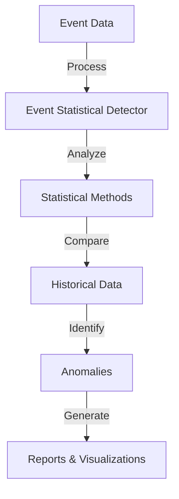

# Overview

The Event Statistical Detector is a component used to analyze and detect statistical anomalies in event data. It processes event data to identify significant changes or regressions in performance metrics, such as duration or throughput. The detector uses various statistical methods to compare current event data against historical data to pinpoint deviations.

# Detailed Insights

The Event Statistical Detector provides detailed insights into the nature of anomalies, including the affected functions, packages, and transactions. These insights help developers understand the root cause of performance issues and take corrective actions.

# Main Functions

There are several main functions in this folder. Some of them are <SwmToken path="static/app/components/events/eventStatisticalDetector/regressionMessage.tsx" pos="31:2:2" line-data="function EventStatisticalDetectorMessage({">`EventStatisticalDetectorMessage`</SwmToken>, <SwmToken path="static/app/components/events/eventStatisticalDetector/regressionMessage.tsx" pos="39:2:2" line-data="        &lt;EventStatisticalDetectorRegressedPerformanceMessage">`EventStatisticalDetectorRegressedPerformanceMessage`</SwmToken>, and <SwmToken path="static/app/components/events/eventStatisticalDetector/regressionMessage.tsx" pos="48:2:2" line-data="        &lt;EventStatisticalDetectorRegressedFunctionMessage event={event} group={group} /&gt;">`EventStatisticalDetectorRegressedFunctionMessage`</SwmToken>. We will dive a little into <SwmToken path="static/app/components/events/eventStatisticalDetector/regressionMessage.tsx" pos="31:2:2" line-data="function EventStatisticalDetectorMessage({">`EventStatisticalDetectorMessage`</SwmToken> and <SwmToken path="static/app/components/events/eventStatisticalDetector/regressionMessage.tsx" pos="39:2:2" line-data="        &lt;EventStatisticalDetectorRegressedPerformanceMessage">`EventStatisticalDetectorRegressedPerformanceMessage`</SwmToken>.

<SwmSnippet path="/static/app/components/events/eventStatisticalDetector/regressionMessage.tsx" line="31">

---

## <SwmToken path="static/app/components/events/eventStatisticalDetector/regressionMessage.tsx" pos="31:2:2" line-data="function EventStatisticalDetectorMessage({">`EventStatisticalDetectorMessage`</SwmToken>

The <SwmToken path="static/app/components/events/eventStatisticalDetector/regressionMessage.tsx" pos="31:2:2" line-data="function EventStatisticalDetectorMessage({">`EventStatisticalDetectorMessage`</SwmToken> function is responsible for determining the type of performance issue and rendering the appropriate message component. It switches between different issue types like <SwmToken path="static/app/components/events/eventStatisticalDetector/regressionMessage.tsx" pos="36:5:5" line-data="    case IssueType.PERFORMANCE_DURATION_REGRESSION:">`PERFORMANCE_DURATION_REGRESSION`</SwmToken> and <SwmToken path="static/app/components/events/eventStatisticalDetector/regressionMessage.tsx" pos="37:5:5" line-data="    case IssueType.PERFORMANCE_ENDPOINT_REGRESSION: {">`PERFORMANCE_ENDPOINT_REGRESSION`</SwmToken> to display relevant messages.

```tsx
function EventStatisticalDetectorMessage({
  event,
  group,
}: EventStatisticalDetectorMessageProps) {
  switch (group.issueType) {
    case IssueType.PERFORMANCE_DURATION_REGRESSION:
    case IssueType.PERFORMANCE_ENDPOINT_REGRESSION: {
      return (
        <EventStatisticalDetectorRegressedPerformanceMessage
          event={event}
          group={group}
        />
      );
    }
    case IssueType.PROFILE_FUNCTION_REGRESSION_EXPERIMENTAL:
    case IssueType.PROFILE_FUNCTION_REGRESSION: {
      return (
        <EventStatisticalDetectorRegressedFunctionMessage event={event} group={group} />
      );
    }
    default: {
```

---

</SwmSnippet>

<SwmSnippet path="/static/app/components/events/eventStatisticalDetector/regressionMessage.tsx" line="57">

---

## <SwmToken path="static/app/components/events/eventStatisticalDetector/regressionMessage.tsx" pos="57:2:2" line-data="function EventStatisticalDetectorRegressedPerformanceMessage({">`EventStatisticalDetectorRegressedPerformanceMessage`</SwmToken>

The <SwmToken path="static/app/components/events/eventStatisticalDetector/regressionMessage.tsx" pos="57:2:2" line-data="function EventStatisticalDetectorRegressedPerformanceMessage({">`EventStatisticalDetectorRegressedPerformanceMessage`</SwmToken> function generates a detailed message about performance regressions. It uses various hooks and utility functions to format and display information about the regression, such as the transaction name, duration changes, and the time of detection.

```tsx
function EventStatisticalDetectorRegressedPerformanceMessage({
  event,
}: EventStatisticalDetectorMessageProps) {
  const now = useMemo(() => new Date(), []);

  const organization = useOrganization();

  const {transaction, breakpoint, aggregateRange1, aggregateRange2, trendPercentage} =
    event?.occurrence?.evidenceData ?? {};

  const {end: afterDateTime} = useRelativeDateTime({
    anchor: breakpoint,
    relativeDays: 14,
  });

  const transactionSummaryLink = transactionSummaryRouteWithQuery({
    orgSlug: organization.slug,
    transaction,
    query: {},
    trendFunction: 'p95',
```

---

</SwmSnippet>

# Event Statistical Detector Endpoints

The Event Statistical Detector includes several endpoints that provide access to various data and functionalities.

<SwmSnippet path="/static/app/components/events/eventStatisticalDetector/transactionsDeltaProvider.tsx" line="20">

---

## <SwmToken path="static/app/components/events/eventStatisticalDetector/transactionsDeltaProvider.tsx" pos="20:4:4" line-data="export function useTransactionsDelta(): UseApiQueryResult&lt;">`useTransactionsDelta`</SwmToken>

The <SwmToken path="static/app/components/events/eventStatisticalDetector/transactionsDeltaProvider.tsx" pos="20:4:4" line-data="export function useTransactionsDelta(): UseApiQueryResult&lt;">`useTransactionsDelta`</SwmToken> function is a custom hook that provides access to the transactions delta data. It uses the context <SwmToken path="static/app/components/events/eventStatisticalDetector/transactionsDeltaProvider.tsx" pos="24:9:9" line-data="  const ctx = useContext(TransactionsDeltaProviderContext);">`TransactionsDeltaProviderContext`</SwmToken> to fetch the data and throws an error if called outside of its provider.

```tsx
export function useTransactionsDelta(): UseApiQueryResult<
  EventsResults<string>,
  RequestError
> {
  const ctx = useContext(TransactionsDeltaProviderContext);
  if (!ctx) {
    throw new Error(
      'useTransactionsDelta called outside of TransactionsDeltaProviderProvider'
    );
  }
  return ctx;
```

---

</SwmSnippet>

<SwmSnippet path="/static/app/components/events/eventStatisticalDetector/eventAffectedTransactions.tsx" line="105">

---

## <SwmToken path="static/app/components/events/eventStatisticalDetector/transactionsDeltaProvider.tsx" pos="8:3:3" line-data="import {useProfileFunctions} from &#39;sentry/utils/profiling/hooks/useProfileFunctions&#39;;">`useProfileFunctions`</SwmToken>

The <SwmToken path="static/app/components/events/eventStatisticalDetector/transactionsDeltaProvider.tsx" pos="8:3:3" line-data="import {useProfileFunctions} from &#39;sentry/utils/profiling/hooks/useProfileFunctions&#39;;">`useProfileFunctions`</SwmToken> function is used to query profile functions data. It constructs a query based on the provided <SwmToken path="static/app/components/events/eventStatisticalDetector/eventAffectedTransactions.tsx" pos="119:6:6" line-data="    conditions.addFilterValue(&#39;fingerprint&#39;, String(fingerprint), true);">`fingerprint`</SwmToken> and <SwmToken path="static/app/components/events/eventStatisticalDetector/eventAffectedTransactions.tsx" pos="107:22:22" line-data="  const percentileBefore = `percentile_before(function.duration, 0.95, ${breakpoint})`;">`breakpoint`</SwmToken>, and fetches the relevant statistics for the profile functions.

```tsx
  const transactionsDeltaQuery = useTransactionsDelta();

  const percentileBefore = `percentile_before(function.duration, 0.95, ${breakpoint})`;
  const percentileAfter = `percentile_after(function.duration, 0.95, ${breakpoint})`;
  const throughputBefore = `cpm_before(${breakpoint})`;
  const throughputAfter = `cpm_after(${breakpoint})`;

  const query = useMemo(() => {
    const data = transactionsDeltaQuery.data?.data ?? [];
    if (!data.length) {
      return null;
    }

    const conditions = new MutableSearch('');
    conditions.addFilterValue('fingerprint', String(fingerprint), true);
    conditions.addOp('(');
    for (let i = 0; i < data.length; i++) {
      if (i > 0) {
        conditions.addOp('OR');
      }
      conditions.addFilterValue('transaction', data[i].transaction as string, true);
```

---

</SwmSnippet>

&nbsp;

*This is an auto-generated document by Swimm AI 🌊 and has not yet been verified by a human*

<SwmMeta version="3.0.0" repo-id="Z2l0aHViJTNBJTNBc2VudHJ5LWRlbW8tMSUzQSUzQVN3aW1tLURlbW8=" repo-name="sentry-demo-1" doc-type="overview"><sup>Powered by [Swimm](/)</sup></SwmMeta>
