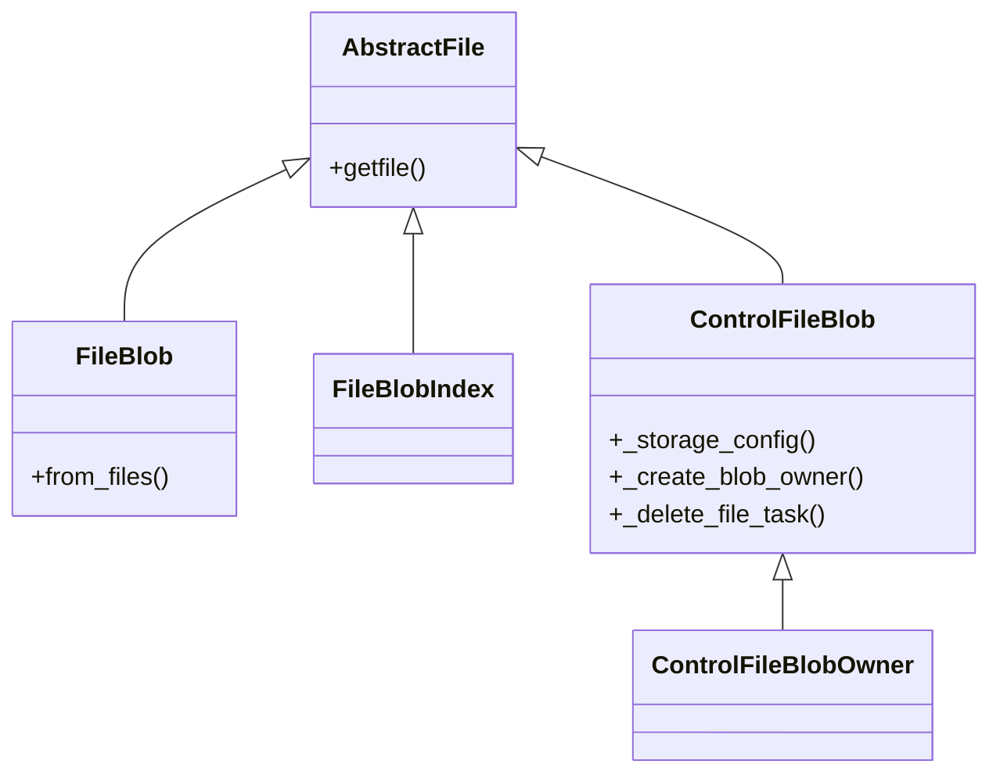

# Overview

Files are entities that represent various types of file data within the application. They are used to manage and store file-related information, such as file blobs and their metadata. This document will cover the key classes and functions involved in handling files in models.

# AbstractFile Class

The `AbstractFile` class serves as a base class for file-related models, providing common functionality and attributes.

# <SwmToken path="src/sentry/models/files/abstractfileblob.py" pos="77:6:6" line-data="        logger.debug(&quot;FileBlob.from_files.start&quot;)">`FileBlob`</SwmToken> Class

The <SwmToken path="src/sentry/models/files/abstractfileblob.py" pos="77:6:6" line-data="        logger.debug(&quot;FileBlob.from_files.start&quot;)">`FileBlob`</SwmToken> class is used to handle the actual binary data of the files.

# FileBlobIndex Class

The `FileBlobIndex` class is used to index the file blobs for efficient retrieval.

# FileModelT Type Variable

The `FileModelT` type variable is used to define a type that is bound to the <SwmToken path="src/sentry/models/files/control_fileblob.py" pos="41:4:4" line-data="class ControlFileBlob(AbstractFileBlob[ControlFileBlobOwner]):">`AbstractFileBlob`</SwmToken> class.

# <SwmToken path="src/sentry/models/files/abstractfileblob.py" pos="18:1:1" line-data="    get_and_optionally_update_blob,">`get_and_optionally_update_blob`</SwmToken> Function

The <SwmToken path="src/sentry/models/files/abstractfileblob.py" pos="18:1:1" line-data="    get_and_optionally_update_blob,">`get_and_optionally_update_blob`</SwmToken> function is used to retrieve and optionally update a file blob based on its checksum.

<SwmSnippet path="/src/sentry/models/files/abstractfileblob.py" line="239">

---

# getfile Function

The <SwmToken path="src/sentry/models/files/abstractfileblob.py" pos="239:3:3" line-data="    def getfile(self):">`getfile`</SwmToken> function returns a <SwmToken path="src/sentry/models/files/abstractfileblob.py" pos="241:5:7" line-data="        Return a file-like object for this File&#39;s content.">`file-like`</SwmToken> object for the file's content, allowing for operations such as reading chunks of data.

```python
    def getfile(self):
        """
        Return a file-like object for this File's content.

        >>> with blob.getfile() as src, open('/tmp/localfile', 'wb') as dst:
        >>>     for chunk in src.chunks():
        >>>         dst.write(chunk)
        """
        assert self.path

        storage = get_storage(self._storage_config())
        return storage.open(self.path)
```

---

</SwmSnippet>

<SwmSnippet path="/src/sentry/models/files/abstractfileblob.py" line="69">

---

# <SwmToken path="src/sentry/models/files/abstractfileblob.py" pos="69:3:3" line-data="    def from_files(cls, files, organization=None, logger=nooplogger):">`from_files`</SwmToken> Function

The <SwmToken path="src/sentry/models/files/abstractfileblob.py" pos="69:3:3" line-data="    def from_files(cls, files, organization=None, logger=nooplogger):">`from_files`</SwmToken> function is used to create <SwmToken path="src/sentry/models/files/abstractfileblob.py" pos="77:6:6" line-data="        logger.debug(&quot;FileBlob.from_files.start&quot;)">`FileBlob`</SwmToken> instances from a list of files, handling tasks such as uploading and saving the blobs.

```python
    def from_files(cls, files, organization=None, logger=nooplogger):
        """A faster version of `from_file` for multiple files at the time.
        If an organization is provided it will also create `FileBlobOwner`
        entries.  Files can be a list of files or tuples of file and checksum.
        If both are provided then a checksum check is performed.

        If the checksums mismatch an `IOError` is raised.
        """
        logger.debug("FileBlob.from_files.start")

        files_with_checksums = []
        for fileobj in files:
            if isinstance(fileobj, tuple):
                files_with_checksums.append(fileobj)
            else:
                files_with_checksums.append((fileobj, None))

        checksums_seen = set()
        blobs_to_save = []
        semaphore = Semaphore(value=MULTI_BLOB_UPLOAD_CONCURRENCY)
```

---

</SwmSnippet>

# Files APIs

Files APIs provide various functions to manage file storage and retrieval.

<SwmSnippet path="/src/sentry/models/files/control_fileblob.py" line="14">

---

# <SwmToken path="src/sentry/models/files/control_fileblob.py" pos="14:2:2" line-data="def control_file_storage_config() -&gt; dict[str, Any] | None:">`control_file_storage_config`</SwmToken> Function

The <SwmToken path="src/sentry/models/files/control_fileblob.py" pos="14:2:2" line-data="def control_file_storage_config() -&gt; dict[str, Any] | None:">`control_file_storage_config`</SwmToken> function is used to configure the storage settings for control file blobs. It checks for specific storage backend and options, and if they exist, it returns them in a dictionary. Otherwise, it falls back to the default storage options.

```python
def control_file_storage_config() -> dict[str, Any] | None:
    """
    When sentry is deployed in a siloed mode file relations
    used by control silo models are stored separately from
    region silo resources.

    While we consistently write to the ControlFile django
    model for control silo resources, we can't ensure
    that each deployment has separate control + region storage
    backends. We coalesce those options here. None means use the
    global default storage options.
    """
    try:
        # If these options exist, use them. Otherwise fallback to default behavior
        storage_backend = options.get("filestore.control.backend")
        storage_options = options.get("filestore.control.options")
        if storage_backend:
            return {
                "backend": storage_backend,
                "options": storage_options,
            }
```

---

</SwmSnippet>

<SwmSnippet path="/src/sentry/models/files/control_fileblob.py" line="40">

---

# <SwmToken path="src/sentry/models/files/control_fileblob.py" pos="41:2:2" line-data="class ControlFileBlob(AbstractFileBlob[ControlFileBlobOwner]):">`ControlFileBlob`</SwmToken> Class

The <SwmToken path="src/sentry/models/files/control_fileblob.py" pos="41:2:2" line-data="class ControlFileBlob(AbstractFileBlob[ControlFileBlobOwner]):">`ControlFileBlob`</SwmToken> class is a model that represents file blobs used by control silo models. It inherits from <SwmToken path="src/sentry/models/files/control_fileblob.py" pos="41:4:4" line-data="class ControlFileBlob(AbstractFileBlob[ControlFileBlobOwner]):">`AbstractFileBlob`</SwmToken> and provides specific storage configuration and deletion task for control file blobs.

```python
@control_silo_model
class ControlFileBlob(AbstractFileBlob[ControlFileBlobOwner]):
    class Meta:
        app_label = "sentry"
        db_table = "sentry_controlfileblob"

    @classmethod
    def _storage_config(cls) -> dict[str, Any] | None:
        return control_file_storage_config()

    def _create_blob_owner(self, organization_id: int) -> ControlFileBlobOwner:
        return ControlFileBlobOwner.objects.create(organization_id=organization_id, blob=self)

    def _delete_file_task(self) -> SentryTask:
        return delete_file_control
```

---

</SwmSnippet>

&nbsp;

*This is an auto-generated document by Swimm AI 🌊 and has not yet been verified by a human*

<SwmMeta version="3.0.0" repo-id="Z2l0aHViJTNBJTNBc2VudHJ5LWRlbW8tMSUzQSUzQVN3aW1tLURlbW8=" repo-name="sentry-demo-1" doc-type="overview"><sup>Powered by [Swimm](/)</sup></SwmMeta>
