```mermaid
classDiagram
 OrganizationIncidentIndexEndpoint --|> OrganizationEndpoint
 OrganizationIncidentSeenEndpoint --|> IncidentEndpoint
 OrganizationIncidentDetailsEndpoint --|> IncidentEndpoint
 OrganizationIncidentActivityIndexEndpoint --|> IncidentEndpoint
 OrganizationIncidentCommentIndexEndpoint --|> IncidentEndpoint
 OrganizationIncidentCommentDetailsEndpoint --|> CommentDetailsEndpoint

%% Swimm:
%% classDiagram
%%  <SwmToken path="src/sentry/incidents/endpoints/organization_incident_index.py" pos="27:2:2" line-data="class OrganizationIncidentIndexEndpoint(OrganizationEndpoint):">`OrganizationIncidentIndexEndpoint`</SwmToken> --|> <SwmToken path="src/sentry/incidents/endpoints/organization_incident_index.py" pos="27:4:4" line-data="class OrganizationIncidentIndexEndpoint(OrganizationEndpoint):">`OrganizationEndpoint`</SwmToken>
%%  <SwmToken path="src/sentry/incidents/endpoints/organization_incident_seen.py" pos="12:2:2" line-data="class OrganizationIncidentSeenEndpoint(IncidentEndpoint):">`OrganizationIncidentSeenEndpoint`</SwmToken> --|> <SwmToken path="src/sentry/incidents/endpoints/organization_incident_seen.py" pos="12:4:4" line-data="class OrganizationIncidentSeenEndpoint(IncidentEndpoint):">`IncidentEndpoint`</SwmToken>
%%  <SwmToken path="src/sentry/incidents/endpoints/organization_incident_details.py" pos="32:2:2" line-data="class OrganizationIncidentDetailsEndpoint(IncidentEndpoint):">`OrganizationIncidentDetailsEndpoint`</SwmToken> --|> <SwmToken path="src/sentry/incidents/endpoints/organization_incident_seen.py" pos="12:4:4" line-data="class OrganizationIncidentSeenEndpoint(IncidentEndpoint):">`IncidentEndpoint`</SwmToken>
%%  <SwmToken path="src/sentry/incidents/endpoints/organization_incident_activity_index.py" pos="14:2:2" line-data="class OrganizationIncidentActivityIndexEndpoint(IncidentEndpoint):">`OrganizationIncidentActivityIndexEndpoint`</SwmToken> --|> <SwmToken path="src/sentry/incidents/endpoints/organization_incident_seen.py" pos="12:4:4" line-data="class OrganizationIncidentSeenEndpoint(IncidentEndpoint):">`IncidentEndpoint`</SwmToken>
%%  <SwmToken path="src/sentry/incidents/endpoints/organization_incident_comment_index.py" pos="26:2:2" line-data="class OrganizationIncidentCommentIndexEndpoint(IncidentEndpoint):">`OrganizationIncidentCommentIndexEndpoint`</SwmToken> --|> <SwmToken path="src/sentry/incidents/endpoints/organization_incident_seen.py" pos="12:4:4" line-data="class OrganizationIncidentSeenEndpoint(IncidentEndpoint):">`IncidentEndpoint`</SwmToken>
%%  <SwmToken path="src/sentry/incidents/endpoints/organization_incident_comment_details.py" pos="50:2:2" line-data="class OrganizationIncidentCommentDetailsEndpoint(CommentDetailsEndpoint):">`OrganizationIncidentCommentDetailsEndpoint`</SwmToken> --|> <SwmToken path="src/sentry/incidents/endpoints/organization_incident_comment_details.py" pos="20:2:2" line-data="class CommentDetailsEndpoint(IncidentEndpoint):">`CommentDetailsEndpoint`</SwmToken>
```

# Overview

Endpoints are specific routes defined within the application to handle various operations related to incidents. This document provides an overview of the key incident endpoints in the application, detailing their responsibilities and functionalities.

# <SwmToken path="src/sentry/incidents/endpoints/organization_incident_index.py" pos="27:2:2" line-data="class OrganizationIncidentIndexEndpoint(OrganizationEndpoint):">`OrganizationIncidentIndexEndpoint`</SwmToken>

The <SwmToken path="src/sentry/incidents/endpoints/organization_incident_index.py" pos="27:2:2" line-data="class OrganizationIncidentIndexEndpoint(OrganizationEndpoint):">`OrganizationIncidentIndexEndpoint`</SwmToken> class is responsible for listing incidents that a user can access within an organization. It includes filtering capabilities based on parameters like title, status, and team.

<SwmSnippet path="/src/sentry/incidents/endpoints/organization_incident_index.py" line="27">

---

This code snippet shows the implementation of the <SwmToken path="src/sentry/incidents/endpoints/organization_incident_index.py" pos="27:2:2" line-data="class OrganizationIncidentIndexEndpoint(OrganizationEndpoint):">`OrganizationIncidentIndexEndpoint`</SwmToken> class, which lists incidents accessible to a user within an organization. It includes filtering capabilities and checks for necessary features.

`````````````````````````````````````````````````````````````python
class OrganizationIncidentIndexEndpoint(OrganizationEndpoint):
    owner = ApiOwner.ISSUES
    publish_status = {
        "GET": ApiPublishStatus.UNKNOWN,
    }
    permission_classes = (IncidentPermission,)

    def get(self, request: Request, organization) -> Response:
        """
        List Incidents that a User can access within an Organization
        ````````````````````````````````````````````````````````````
        Returns a paginated list of Incidents that a user can access.

        :auth: required
        """
        if not features.has("organizations:incidents", organization, actor=request.user):
            raise ResourceDoesNotExist

        incidents = Incident.objects.fetch_for_organization(
            organization, self.get_projects(request, organization)
        )
`````````````````````````````````````````````````````````````

---

</SwmSnippet>

# <SwmToken path="src/sentry/incidents/endpoints/organization_incident_seen.py" pos="12:2:2" line-data="class OrganizationIncidentSeenEndpoint(IncidentEndpoint):">`OrganizationIncidentSeenEndpoint`</SwmToken>

The <SwmToken path="src/sentry/incidents/endpoints/organization_incident_seen.py" pos="12:2:2" line-data="class OrganizationIncidentSeenEndpoint(IncidentEndpoint):">`OrganizationIncidentSeenEndpoint`</SwmToken> class marks an incident as seen by the user, ensuring that the incident is acknowledged.

<SwmSnippet path="/src/sentry/incidents/endpoints/organization_incident_seen.py" line="12">

---

This code snippet shows the implementation of the <SwmToken path="src/sentry/incidents/endpoints/organization_incident_seen.py" pos="12:2:2" line-data="class OrganizationIncidentSeenEndpoint(IncidentEndpoint):">`OrganizationIncidentSeenEndpoint`</SwmToken> class, which marks an incident as seen by the user.

`````````````````````````````````````python
class OrganizationIncidentSeenEndpoint(IncidentEndpoint):
    owner = ApiOwner.ISSUES
    publish_status = {
        "POST": ApiPublishStatus.UNKNOWN,
    }
    permission_classes = (IncidentPermission,)

    def post(self, request: Request, organization, incident) -> Response:
        """
        Mark an incident as seen by the user
        ````````````````````````````````````

        :auth: required
        """

        set_incident_seen(incident=incident, user=request.user)
        return Response({}, status=201)
`````````````````````````````````````

---

</SwmSnippet>

# <SwmToken path="src/sentry/incidents/endpoints/organization_incident_details.py" pos="32:2:2" line-data="class OrganizationIncidentDetailsEndpoint(IncidentEndpoint):">`OrganizationIncidentDetailsEndpoint`</SwmToken>

The <SwmToken path="src/sentry/incidents/endpoints/organization_incident_details.py" pos="32:2:2" line-data="class OrganizationIncidentDetailsEndpoint(IncidentEndpoint):">`OrganizationIncidentDetailsEndpoint`</SwmToken> class fetches detailed information about a specific incident and allows updating its status.

<SwmSnippet path="/src/sentry/incidents/endpoints/organization_incident_details.py" line="1">

---

This code snippet shows the implementation of the <SwmToken path="src/sentry/incidents/endpoints/organization_incident_details.py" pos="32:2:2" line-data="class OrganizationIncidentDetailsEndpoint(IncidentEndpoint):">`OrganizationIncidentDetailsEndpoint`</SwmToken> class, which fetches detailed information about a specific incident and allows updating its status.

```python
from rest_framework import serializers
from rest_framework.request import Request
from rest_framework.response import Response

from sentry.api.api_owners import ApiOwner
from sentry.api.api_publish_status import ApiPublishStatus
from sentry.api.base import region_silo_endpoint
from sentry.api.bases.incident import IncidentEndpoint, IncidentPermission
from sentry.api.serializers import serialize
from sentry.incidents.endpoints.serializers.incident import DetailedIncidentSerializer
from sentry.incidents.logic import update_incident_status
from sentry.incidents.models.incident import IncidentStatus, IncidentStatusMethod


class IncidentSerializer(serializers.Serializer):
    status = serializers.IntegerField()
    comment = serializers.CharField(required=False, allow_null=True)

    def validate_status(self, value):
        try:
```

---

</SwmSnippet>

# <SwmToken path="src/sentry/incidents/endpoints/organization_incident_activity_index.py" pos="14:2:2" line-data="class OrganizationIncidentActivityIndexEndpoint(IncidentEndpoint):">`OrganizationIncidentActivityIndexEndpoint`</SwmToken>

The <SwmToken path="src/sentry/incidents/endpoints/organization_incident_activity_index.py" pos="14:2:2" line-data="class OrganizationIncidentActivityIndexEndpoint(IncidentEndpoint):">`OrganizationIncidentActivityIndexEndpoint`</SwmToken> class retrieves the activity log of a specific incident, providing a chronological list of actions taken.

<SwmSnippet path="/src/sentry/incidents/endpoints/organization_incident_activity_index.py" line="1">

---

This code snippet shows the implementation of the <SwmToken path="src/sentry/incidents/endpoints/organization_incident_activity_index.py" pos="14:2:2" line-data="class OrganizationIncidentActivityIndexEndpoint(IncidentEndpoint):">`OrganizationIncidentActivityIndexEndpoint`</SwmToken> class, which retrieves the activity log of a specific incident.

```python
from rest_framework.request import Request
from rest_framework.response import Response

from sentry.api.api_owners import ApiOwner
from sentry.api.api_publish_status import ApiPublishStatus
from sentry.api.base import region_silo_endpoint
from sentry.api.bases.incident import IncidentEndpoint, IncidentPermission
from sentry.api.paginator import OffsetPaginator
from sentry.api.serializers import serialize
from sentry.incidents.logic import get_incident_activity


@region_silo_endpoint
class OrganizationIncidentActivityIndexEndpoint(IncidentEndpoint):
    owner = ApiOwner.ISSUES
    publish_status = {
        "GET": ApiPublishStatus.UNKNOWN,
    }
    permission_classes = (IncidentPermission,)
```

---

</SwmSnippet>

# <SwmToken path="src/sentry/incidents/endpoints/organization_incident_comment_index.py" pos="26:2:2" line-data="class OrganizationIncidentCommentIndexEndpoint(IncidentEndpoint):">`OrganizationIncidentCommentIndexEndpoint`</SwmToken>

The <SwmToken path="src/sentry/incidents/endpoints/organization_incident_comment_index.py" pos="26:2:2" line-data="class OrganizationIncidentCommentIndexEndpoint(IncidentEndpoint):">`OrganizationIncidentCommentIndexEndpoint`</SwmToken> class handles the addition of comments to an incident, including the extraction of user mentions.

<SwmSnippet path="/src/sentry/incidents/endpoints/organization_incident_comment_index.py" line="1">

---

This code snippet shows the implementation of the <SwmToken path="src/sentry/incidents/endpoints/organization_incident_comment_index.py" pos="26:2:2" line-data="class OrganizationIncidentCommentIndexEndpoint(IncidentEndpoint):">`OrganizationIncidentCommentIndexEndpoint`</SwmToken> class, which handles the addition of comments to an incident.

```python
from rest_framework import serializers
from rest_framework.request import Request
from rest_framework.response import Response

from sentry.api.api_owners import ApiOwner
from sentry.api.api_publish_status import ApiPublishStatus
from sentry.api.base import region_silo_endpoint
from sentry.api.bases.incident import IncidentEndpoint, IncidentPermission
from sentry.api.fields.actor import ActorField
from sentry.api.serializers import serialize
from sentry.api.serializers.rest_framework.mentions import (
    MentionsMixin,
    extract_user_ids_from_mentions,
)
from sentry.incidents.logic import create_incident_activity
from sentry.incidents.models.incident import IncidentActivityType


class CommentSerializer(serializers.Serializer, MentionsMixin):
    comment = serializers.CharField(required=True)
```

---

</SwmSnippet>

# <SwmToken path="src/sentry/incidents/endpoints/organization_incident_comment_details.py" pos="50:2:2" line-data="class OrganizationIncidentCommentDetailsEndpoint(CommentDetailsEndpoint):">`OrganizationIncidentCommentDetailsEndpoint`</SwmToken>

The <SwmToken path="src/sentry/incidents/endpoints/organization_incident_comment_details.py" pos="50:2:2" line-data="class OrganizationIncidentCommentDetailsEndpoint(CommentDetailsEndpoint):">`OrganizationIncidentCommentDetailsEndpoint`</SwmToken> class manages the details of individual comments on incidents, including permissions for modifying or deleting comments.

<SwmSnippet path="/src/sentry/incidents/endpoints/organization_incident_comment_details.py" line="1">

---

This code snippet shows the implementation of the <SwmToken path="src/sentry/incidents/endpoints/organization_incident_comment_details.py" pos="50:2:2" line-data="class OrganizationIncidentCommentDetailsEndpoint(CommentDetailsEndpoint):">`OrganizationIncidentCommentDetailsEndpoint`</SwmToken> class, which manages the details of individual comments on incidents.

```python
from rest_framework import serializers
from rest_framework.exceptions import PermissionDenied
from rest_framework.request import Request
from rest_framework.response import Response

from sentry.api.api_owners import ApiOwner
from sentry.api.api_publish_status import ApiPublishStatus
from sentry.api.base import region_silo_endpoint
from sentry.api.bases.incident import IncidentEndpoint, IncidentPermission
from sentry.api.exceptions import ResourceDoesNotExist
from sentry.api.serializers import serialize
from sentry.incidents.logic import delete_comment, update_comment
from sentry.incidents.models.incident import IncidentActivity, IncidentActivityType


class CommentSerializer(serializers.Serializer):
    comment = serializers.CharField(required=True)


class CommentDetailsEndpoint(IncidentEndpoint):
```

---

</SwmSnippet>

&nbsp;

*This is an auto-generated document by Swimm AI 🌊 and has not yet been verified by a human*

<SwmMeta version="3.0.0" repo-id="Z2l0aHViJTNBJTNBc2VudHJ5LWRlbW8tMSUzQSUzQVN3aW1tLURlbW8=" repo-name="sentry-demo-1" doc-type="overview"><sup>Powered by [Swimm](/)</sup></SwmMeta>
