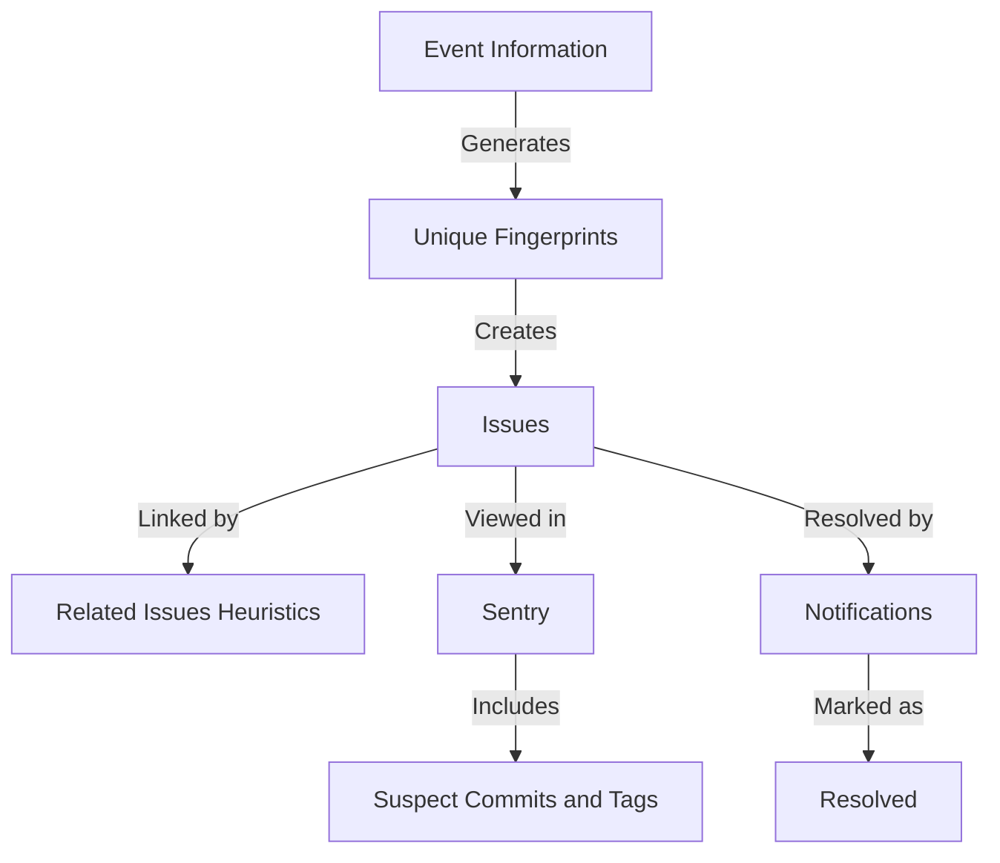

## Issues Creation

Issues are created based on unique fingerprints derived from event information such as stack traces or messages. This ensures that each issue is uniquely identifiable and can be tracked effectively.

## Related Issues

The Related Issues feature associates different issues based on specific heuristics, allowing users to act on various issues collectively. This helps in managing and resolving issues that are interconnected.

## Viewing Issue Details

Details about issues can be viewed on Sentry, including suspect commits and tags, which help in identifying the root cause and context of the issue. This information is crucial for developers to understand and address the issues effectively.

## Issue Resolution

When an issue is resolved, notifications are sent out, and the issue is marked as resolved in the system. This ensures that all stakeholders are informed about the resolution status.

## Issues Endpoints

Sentry provides various endpoints to interact with issues. These endpoints allow developers to list, view, and update issues based on different parameters.

<SwmSnippet path="/src/sentry/issues/endpoints/organization_group_index.py" line="203">

---

### Listing Issues

The <SwmToken path="src/sentry/issues/endpoints/organization_group_index.py" pos="203:3:3" line-data="    def get(self, request: Request, organization) -&gt; Response:">`get`</SwmToken> method in the <SwmPath>[src/sentry/issues/endpoints/organization_group_index.py](src/sentry/issues/endpoints/organization_group_index.py)</SwmPath> file lists an organization's issues. Developers can filter and view issues based on various parameters such as status, priority, and date range.

``````````````````````````````python
    def get(self, request: Request, organization) -> Response:
        """
        List an Organization's Issues
        `````````````````````````````

        Return a list of issues (groups) bound to an organization.  All parameters are
        supplied as query string parameters.

        A default query of ``is:unresolved issue.priority:[high,medium]`` is applied.
        To return results with other statuses send a new query value
        (i.e. ``?query=`` for all results).

        The ``groupStatsPeriod`` parameter can be used to select the timeline
        stats which should be present. Possible values are: '' (disable),
        '24h', '14d'

        The ``statsPeriod`` parameter can be used to select a date window starting
        from now. Ex. ``14d``.

        The ``start`` and ``end`` parameters can be used to select an absolute
        date period to fetch issues from.
``````````````````````````````

---

</SwmSnippet>

<SwmSnippet path="/src/sentry/issues/endpoints/project_stacktrace_link.py" line="100">

---

### <SwmToken path="src/sentry/issues/endpoints/project_stacktrace_link.py" pos="101:2:2" line-data="class ProjectStacktraceLinkEndpoint(ProjectEndpoint):">`ProjectStacktraceLinkEndpoint`</SwmToken>

The <SwmToken path="src/sentry/issues/endpoints/project_stacktrace_link.py" pos="101:2:2" line-data="class ProjectStacktraceLinkEndpoint(ProjectEndpoint):">`ProjectStacktraceLinkEndpoint`</SwmToken> class provides an endpoint to return valid links for source code providers. This allows users to navigate from a file in the stack trace to their chosen provider.

```python
@region_silo_endpoint
class ProjectStacktraceLinkEndpoint(ProjectEndpoint):
    publish_status = {
        "GET": ApiPublishStatus.PRIVATE,
    }
    """
    Returns valid links for source code providers so that
    users can go from the file in the stack trace to the
    provider of their choice.

    `file`: The file path from the stack trace
    `commitId` (optional): The commit_id for the last commit of the
                           release associated to the stack trace's event
    `sdkName` (optional): The sdk.name associated with the event
    `absPath` (optional): The abs_path field value of the relevant stack frame
    `module`   (optional): The module field value of the relevant stack frame
    `package`  (optional): The package field value of the relevant stack frame
    `groupId`   (optional): The Issue's id.
    """

    owner = ApiOwner.ISSUES
```

---

</SwmSnippet>

<SwmSnippet path="/src/sentry/issues/endpoints/organization_group_search_views.py" line="42">

---

### <SwmToken path="src/sentry/issues/endpoints/organization_group_search_views.py" pos="43:2:2" line-data="class OrganizationGroupSearchViewsEndpoint(OrganizationEndpoint):">`OrganizationGroupSearchViewsEndpoint`</SwmToken>

The <SwmToken path="src/sentry/issues/endpoints/organization_group_search_views.py" pos="43:2:2" line-data="class OrganizationGroupSearchViewsEndpoint(OrganizationEndpoint):">`OrganizationGroupSearchViewsEndpoint`</SwmToken> class provides endpoints to list and update custom views for an organization's members. The <SwmToken path="src/sentry/issues/endpoints/organization_group_search_views.py" pos="45:2:2" line-data="        &quot;GET&quot;: ApiPublishStatus.EXPERIMENTAL,">`GET`</SwmToken> method retrieves a list of custom views, and the <SwmToken path="src/sentry/issues/endpoints/organization_group_search_views.py" pos="46:2:2" line-data="        &quot;PUT&quot;: ApiPublishStatus.EXPERIMENTAL,">`PUT`</SwmToken> method allows bulk updates to these views.

``````````````````````````````````````````python
@region_silo_endpoint
class OrganizationGroupSearchViewsEndpoint(OrganizationEndpoint):
    publish_status = {
        "GET": ApiPublishStatus.EXPERIMENTAL,
        "PUT": ApiPublishStatus.EXPERIMENTAL,
    }
    owner = ApiOwner.ISSUES
    permission_classes = (MemberPermission,)

    def get(self, request: Request, organization: Organization) -> Response:
        """
        List the current organization member's custom views
        `````````````````````````````````````````

        Retrieve a list of custom views for the current organization member.
        """
        if not features.has(
            "organizations:issue-stream-custom-views", organization, actor=request.user
        ):
            return Response(status=status.HTTP_404_NOT_FOUND)
``````````````````````````````````````````

---

</SwmSnippet>

&nbsp;

*This is an auto-generated document by Swimm AI 🌊 and has not yet been verified by a human*

<SwmMeta version="3.0.0" repo-id="Z2l0aHViJTNBJTNBc2VudHJ5LWRlbW8tMSUzQSUzQVN3aW1tLURlbW8=" repo-name="sentry-demo-1" doc-type="overview"><sup>Powered by [Swimm](/)</sup></SwmMeta>
