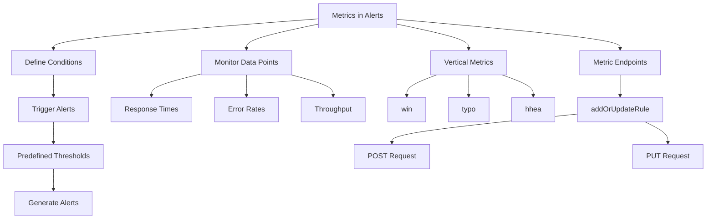

# Understanding Metrics in Alerts

Metrics in alerts are used to define the conditions under which an alert is triggered. They represent specific data points or measurements that are monitored to detect anomalies or issues. Metrics can include various types of data such as response times, error rates, or throughput. These metrics are continuously monitored, and when they meet certain predefined thresholds, an alert is generated.

## Importance of Metrics

In the alerting system, metrics are essential for identifying performance issues or errors in real-time. They help in proactively managing and resolving potential problems before they impact users. Metrics are configured within the alert rules, where specific conditions and thresholds are set. These rules determine when an alert should be triggered based on the monitored metrics.

## Vertical Metrics

For historical reasons, font files include three different sets of metrics (`win`, `typo`, and `hhea`). These metrics have been modified to standardize rendering across operating systems and browsers.

<SwmSnippet path="/static/app/views/alerts/rules/metric/details/metricChart.tsx" line="653">

---

The file contains styled components for rendering the metric chart, such as <SwmToken path="static/app/views/alerts/rules/metric/details/metricChart.tsx" pos="653:2:2" line-data="const ChartPanel = styled(Panel)`">`ChartPanel`</SwmToken>, <SwmToken path="static/app/views/alerts/rules/metric/details/metricChart.tsx" pos="657:2:2" line-data="const ChartHeader = styled(&#39;div&#39;)`">`ChartHeader`</SwmToken>, and <SwmToken path="static/app/views/alerts/rules/metric/details/metricChart.tsx" pos="661:2:2" line-data="const StyledChartControls = styled(ChartControls)`">`StyledChartControls`</SwmToken>, which are used to display and control the chart's appearance.

```tsx
const ChartPanel = styled(Panel)`
  margin-top: ${space(2)};
`;

const ChartHeader = styled('div')`
  margin-bottom: ${space(3)};
`;

const StyledChartControls = styled(ChartControls)`
  display: flex;
  justify-content: space-between;
  flex-wrap: wrap;
`;

const StyledInlineContainer = styled(InlineContainer)`
  grid-auto-flow: column;
  grid-column-gap: ${space(1)};
`;

const StyledCircleIndicator = styled(CircleIndicator)`
  background: ${p => p.theme.formText};
```

---

</SwmSnippet>

<SwmSnippet path="/static/app/views/alerts/rules/metric/details/metricHistory.tsx" line="21">

---

The <SwmToken path="static/app/views/alerts/rules/metric/details/metricHistory.tsx" pos="23:2:2" line-data="function MetricHistory({incidents}: Props) {">`MetricHistory`</SwmToken> function uses the <SwmToken path="static/app/views/alerts/rules/metric/details/metricHistory.tsx" pos="24:3:3" line-data="  const organization = useOrganization();">`organization`</SwmToken> constant to filter and sort incident activities, which are then used to display the metric history.

```tsx
};

function MetricHistory({incidents}: Props) {
  const organization = useOrganization();
  const sortedActivity = useMemo(() => {
    const filteredIncidents = (incidents ?? []).filter(
      incident => incident.activities?.length
    );
    const activationTriggers: ActivationTriggerActivity[] = [];
    // NOTE: disabling start/finish trigger rows for now until we've determined whether its
    // valuable during EA

    // activations?.forEach(activation => {
    //   activationTriggers.push({
    //     type: ActivationTrigger.ACTIVATED,
    //     activator: activation.activator,
    //     conditionType: activation.conditionType,
    //     dateCreated: activation.dateCreated,
    //   });
    //   if (activation.isComplete) {
    //     activationTriggers.push({
```

---

</SwmSnippet>

## Metric Endpoints

Metric endpoints are used to add or update alert rules. The <SwmToken path="static/app/views/alerts/rules/metric/actions.tsx" pos="17:4:4" line-data="export function addOrUpdateRule(">`addOrUpdateRule`</SwmToken> function determines whether the rule is new or existing by checking if the rule has an ID. If the rule is new, it sends a POST request to the `/organizations/${orgId}/alert-rules/` endpoint. If the rule is existing, it sends a PUT request to the `/organizations/${orgId}/alert-rules/${rule.id}/` endpoint.

<SwmSnippet path="/static/app/views/alerts/rules/metric/actions.tsx" line="17">

---

The <SwmToken path="static/app/views/alerts/rules/metric/actions.tsx" pos="17:4:4" line-data="export function addOrUpdateRule(">`addOrUpdateRule`</SwmToken> function is used to add a new alert rule or update an existing one. It determines whether the rule is new or existing by checking if the rule has an ID.

```tsx
export function addOrUpdateRule(
  api: Client,
  orgId: string, // organization slug
  rule: MetricRule,
  query?: object | any
) {
  const isExisting = isSavedRule(rule);
  const endpoint = isExisting
    ? `/organizations/${orgId}/alert-rules/${rule.id}/`
    : `/organizations/${orgId}/alert-rules/`;
  const method = isExisting ? 'PUT' : 'POST';

  return api.requestPromise(endpoint, {
    method,
    data: rule,
    query,
    includeAllArgs: true,
  });
}
```

---

</SwmSnippet>

&nbsp;

*This is an auto-generated document by Swimm AI 🌊 and has not yet been verified by a human*

<SwmMeta version="3.0.0" repo-id="Z2l0aHViJTNBJTNBc2VudHJ5LWRlbW8tMSUzQSUzQVN3aW1tLURlbW8=" repo-name="sentry-demo-1" doc-type="overview"><sup>Powered by [Swimm](/)</sup></SwmMeta>
