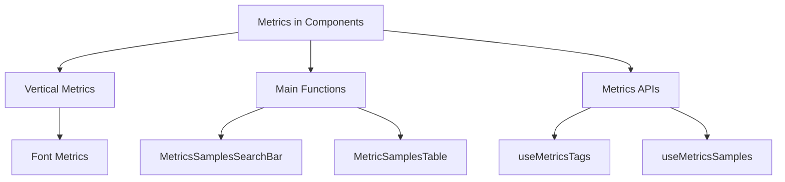

# Metrics in Components

Metrics in the components directory are used to track and display various performance and operational data points within the application. These metrics include fields such as project, span duration, timestamp, and transaction details, which are essential for monitoring and analyzing the application's performance. The metrics are displayed in tables and charts, allowing users to visualize and interact with the data effectively. They are also used to generate links to detailed views of specific transactions and spans, providing deeper insights into the application's behavior.

# Vertical Metrics

For historical reasons, font files include three different sets of metrics (`win`, `typo`, and `hhea`). These metrics have been modified to standardize rendering across operating systems and browsers. The modified metrics are: `win` ascent: 840, `win` descent: 250, `typo` ascent: 840, `typo` descent: -250, `hhea` ascent: 935, `hhea` descent: -230.

<SwmSnippet path="/static/app/components/metrics/chart/useMetricChartSamples.tsx" line="27">

---

The constant <SwmToken path="static/app/components/metrics/chart/useMetricChartSamples.tsx" pos="27:4:4" line-data="export const SAMPLES_X_AXIS_ID = &#39;xAxisSamples&#39;;">`SAMPLES_X_AXIS_ID`</SwmToken> is used to identify the X-axis for samples in metric charts.

```tsx
export const SAMPLES_X_AXIS_ID = 'xAxisSamples';
```

---

</SwmSnippet>

<SwmSnippet path="/static/app/components/metrics/chart/useMetricChartSamples.tsx" line="22">

---

The type <SwmToken path="static/app/components/metrics/chart/useMetricChartSamples.tsx" pos="24:3:3" line-data="  type MetricsSamplesResults,">`MetricsSamplesResults`</SwmToken> is imported from <SwmToken path="static/app/components/metrics/chart/useMetricChartSamples.tsx" pos="25:5:11" line-data="} from &#39;sentry/utils/metrics/useMetricsSamples&#39;;">`sentry/utils/metrics/useMetricsSamples`</SwmToken> and is used to define the structure of metric samples results.

```tsx
import {
  getSummaryValueForAggregation,
  type MetricsSamplesResults,
} from 'sentry/utils/metrics/useMetricsSamples';
```

---

</SwmSnippet>

<SwmSnippet path="/static/app/components/metrics/chart/useMetricChartSamples.tsx" line="270">

---

The type <SwmToken path="static/app/components/metrics/chart/useMetricChartSamples.tsx" pos="272:4:4" line-data="export type UseMetricSamplesResult = ReturnType&lt;typeof useMetricChartSamples&gt;;">`UseMetricSamplesResult`</SwmToken> is defined as the return type of the <SwmToken path="static/app/components/metrics/chart/useMetricChartSamples.tsx" pos="272:12:12" line-data="export type UseMetricSamplesResult = ReturnType&lt;typeof useMetricChartSamples&gt;;">`useMetricChartSamples`</SwmToken> function.

```tsx
}

export type UseMetricSamplesResult = ReturnType<typeof useMetricChartSamples>;
```

---

</SwmSnippet>

<SwmSnippet path="/static/app/components/metrics/metricSamplesTable.tsx" line="222">

---

The constant <SwmToken path="static/app/components/metrics/metricSamplesTable.tsx" pos="222:3:3" line-data="  const result = useMetricsSamples({">`result`</SwmToken> is used to store the result of the <SwmToken path="static/app/components/metrics/metricSamplesTable.tsx" pos="222:7:7" line-data="  const result = useMetricsSamples({">`useMetricsSamples`</SwmToken> hook, which fetches metric samples based on various parameters such as fields, datetime, and aggregation.

```tsx
  const result = useMetricsSamples({
    fields,
    datetime,
    max: focusArea?.max,
    min: focusArea?.min,
    mri: resolvedMRI,
    aggregation: resolvedAggregation,
    query,
    referrer: 'api.organization.metrics-samples',
    enabled,
    sort: sortQuery,
    limit: 20,
  });
```

---

</SwmSnippet>

<SwmSnippet path="/static/app/components/metrics/mriSelect/index.tsx" line="205">

---

The constant <SwmToken path="static/app/components/metrics/mriSelect/index.tsx" pos="205:3:3" line-data="    const result = metricsMeta">`result`</SwmToken> is used to filter and sort metrics metadata, ensuring that the selected metric is displayed at the top of the list if it's not already there.

```tsx
    const result = metricsMeta
      .filter(metric => isShownByDefault(metric) || isSelected(metric))
      .sort(metric => (isSelected(metric) ? -1 : 1));

    // Add the selected metric to the top of the list if it's not already there
    if (result[0]?.mri !== value) {
      const parsedMri = parseMRI(value);
      return [
        {
          mri: value,
          type: parsedMri.type,
          unit: parsedMri.unit,
          operations: [],
          projectIds: [],
          blockingStatus: [],
        } satisfies MetricMeta,
        ...result,
      ];
    }

    return result;
```

---

</SwmSnippet>

<SwmSnippet path="/static/app/components/metrics/metricSamplesTable.tsx" line="237">

---

The <SwmToken path="static/app/components/metrics/metricSamplesTable.tsx" pos="237:1:1" line-data="  useEffect(() =&gt; {">`useEffect`</SwmToken> hook is used to propagate the metrics samples up as needed, and the <SwmToken path="static/app/components/metrics/metricSamplesTable.tsx" pos="241:7:7" line-data="  const supportedMRI = useMemo(() =&gt; {">`useMemo`</SwmToken> hook is used to determine if the MRI is supported based on the response JSON.

```tsx
  useEffect(() => {
    setMetricsSamples?.(result.data?.data ?? []);
  }, [result?.data?.data, setMetricsSamples]);

  const supportedMRI = useMemo(() => {
    const responseJSON = result.error?.responseJSON;
    if (typeof responseJSON?.detail !== 'string') {
      return true;
    }

    return !responseJSON?.detail?.startsWith('Unsupported MRI: ');
  }, [result]);
```

---

</SwmSnippet>

<SwmSnippet path="/static/app/components/metrics/querySymbol.tsx" line="10">

---

The function <SwmToken path="static/app/components/metrics/querySymbol.tsx" pos="10:4:4" line-data="export const getQuerySymbol = (index: number, uppercaseChar?: boolean) =&gt; {">`getQuerySymbol`</SwmToken> generates a query symbol based on the provided index and optional uppercase character flag.

```tsx
export const getQuerySymbol = (index: number, uppercaseChar?: boolean) => {
  let result = '';
  let i = index;
  do {
    result = indexToChar[i % indexToChar.length] + result;
    i = Math.floor(i / indexToChar.length) - 1;
  } while (i >= 0);
  return uppercaseChar ? result.toUpperCase() : result;
};
```

---

</SwmSnippet>

<SwmSnippet path="/static/app/components/metrics/mriSelect/metricListItemDetails.tsx" line="41">

---

The <SwmToken path="static/app/components/metrics/mriSelect/metricListItemDetails.tsx" pos="41:4:4" line-data="export function MetricListItemDetails({">`MetricListItemDetails`</SwmToken> function displays detailed information about a metric, including its name, associated projects, and tags. It uses various hooks such as <SwmToken path="static/app/components/metrics/mriSelect/metricListItemDetails.tsx" pos="52:7:7" line-data="  const router = useRouter();">`useRouter`</SwmToken>, <SwmToken path="static/app/components/metrics/mriSelect/metricListItemDetails.tsx" pos="53:7:7" line-data="  const organization = useOrganization();">`useOrganization`</SwmToken>, and <SwmToken path="static/app/components/metrics/mriSelect/metricListItemDetails.tsx" pos="55:9:9" line-data="  const {getExtractionRules} = useVirtualMetricsContext();">`useVirtualMetricsContext`</SwmToken> to fetch and manage the necessary data.

```tsx
export function MetricListItemDetails({
  metric,
  selectedProjects,
  onTagClick,
  isDuplicateWithDifferentUnit,
}: {
  isDuplicateWithDifferentUnit: boolean;
  metric: MetricMeta;
  onTagClick: (mri: MRI, tag: string) => void;
  selectedProjects: Project[];
}) {
  const router = useRouter();
  const organization = useOrganization();
  const queryClient = useQueryClient();
  const {getExtractionRules} = useVirtualMetricsContext();
  const parsedMRI = parseMRI(metric.mri);
  const isCustomMetric = parsedMRI.useCase === 'custom';
  const isVirtualMetric = parsedMRI.type === 'v';

  const [showAllTags, setShowAllTags] = useState(false);
  const [showAllProjects, setShowAllProjects] = useState(false);
```

---

</SwmSnippet>

<SwmSnippet path="/static/app/utils/useRouter.tsx" line="14">

---

The <SwmToken path="static/app/utils/useRouter.tsx" pos="20:2:2" line-data="function useRouter() {">`useRouter`</SwmToken> hook provides routing functionality, including navigation, location, parameters, and routes.

```tsx
/**
 * @deprecated Please do not use this. Use a specific hook instead. Including
 * use{Location,Params,Routes,Navigate}.
 *
 * react-router 6 does not include this hook.
 */
function useRouter() {
  // When running in test mode we still read from the legacy route context to
  // keep test compatability while we fully migrate to react router 6
  const useReactRouter6 = window.__SENTRY_USING_REACT_ROUTER_SIX && NODE_ENV !== 'test';

  if (!useReactRouter6) {
    // biome-ignore lint/correctness/useHookAtTopLevel: react-router 6 migration
    return useRouteContext().router;
  }

  // biome-ignore lint/correctness/useHookAtTopLevel: react-router 6 migration
  const navigate = useNavigate();
  // biome-ignore lint/correctness/useHookAtTopLevel: react-router 6 migration
  const location = useLocation();
  // biome-ignore lint/correctness/useHookAtTopLevel: react-router 6 migration
```

---

</SwmSnippet>

<SwmSnippet path="/static/app/utils/useOrganization.tsx" line="16">

---

The <SwmToken path="static/app/utils/useOrganization.tsx" pos="19:2:2" line-data="function useOrganization(opts?: Options&lt;false&gt;): Organization;">`useOrganization`</SwmToken> hook provides the current organization context.

```tsx
// The additional signatures provide proper type hints for when we set
// `allowNull` to true.

function useOrganization(opts?: Options<false>): Organization;
```

---

</SwmSnippet>

<SwmSnippet path="/static/app/utils/metrics/virtualMetricsContext.tsx" line="64">

---

The <SwmToken path="static/app/utils/metrics/virtualMetricsContext.tsx" pos="64:4:4" line-data="export function useVirtualMetricsContext() {">`useVirtualMetricsContext`</SwmToken> hook provides the context for virtual metrics.

```tsx
export function useVirtualMetricsContext() {
  return useContext(Context);
}
```

---

</SwmSnippet>

<SwmSnippet path="/static/app/components/metrics/chart/useMetricReleases.tsx" line="19">

---

The <SwmToken path="static/app/components/metrics/chart/useMetricReleases.tsx" pos="19:2:2" line-data="interface Release {">`Release`</SwmToken> and <SwmToken path="static/app/components/metrics/chart/useMetricReleases.tsx" pos="24:2:2" line-data="interface ReleaseQuery {">`ReleaseQuery`</SwmToken> interfaces define the structure of release data and query parameters, respectively. The <SwmToken path="static/app/components/metrics/chart/useMetricReleases.tsx" pos="34:2:2" line-data="function getQuery(conditions) {">`getQuery`</SwmToken> function constructs a query object based on the provided conditions.

```tsx
interface Release {
  date: string;
  version: string;
}

interface ReleaseQuery {
  end: DateString;
  environment: Readonly<string[]>;
  project: Readonly<number[]>;
  start: DateString;
  cursor?: string;
  query?: string;
  statsPeriod?: string | null;
}

function getQuery(conditions) {
  const query = {};
  Object.keys(conditions).forEach(key => {
    let value = conditions[key];
    if (value && (key === 'start' || key === 'end')) {
      value = getUtcDateString(value);
```

---

</SwmSnippet>

<SwmSnippet path="/static/app/components/metrics/chart/useMetricReleases.tsx" line="135">

---

The <SwmToken path="static/app/components/metrics/chart/useMetricReleases.tsx" pos="135:1:1" line-data="        onClick: () =&gt; {">`onClick`</SwmToken> function navigates to the detailed view of a specific release using the <SwmToken path="static/app/components/metrics/chart/useMetricReleases.tsx" pos="137:1:1" line-data="            normalizeUrl({">`normalizeUrl`</SwmToken> function.

```tsx
        onClick: () => {
          router.push(
            normalizeUrl({
              pathname: `/organizations/${
                organization.slug
              }/releases/${encodeURIComponent(release.version)}/`,
              query,
            })
          );
        },
```

---

</SwmSnippet>

<SwmSnippet path="/static/app/components/charts/components/markLine.tsx" line="5">

---

The <SwmToken path="static/app/components/charts/components/markLine.tsx" pos="6:5:5" line-data=" * eCharts markLine">`markLine`</SwmToken> component is used to create a mark line in <SwmToken path="static/app/components/charts/components/markLine.tsx" pos="6:3:3" line-data=" * eCharts markLine">`eCharts`</SwmToken>, with customized properties such as symbol and color.

```tsx
/**
 * eCharts markLine
 *
 * See https://echarts.apache.org/en/option.html#series-line.markLine
 */
export default function MarkLine(
  props: LineSeriesOption['markLine']
): LineSeriesOption['markLine'] {
  return {
    // The second symbol is a very ugly arrow, we don't want it
    symbol: ['none', 'none'],
    ...props,
  };
}
```

---

</SwmSnippet>

<SwmSnippet path="/static/app/utils/url/normalizeUrl.tsx" line="31">

---

The <SwmToken path="static/app/utils/url/normalizeUrl.tsx" pos="35:6:6" line-data="export default function normalizeUrl(path: string, options?: NormalizeUrlOptions): string;">`normalizeUrl`</SwmToken> function normalizes a URL based on the organization present in the initial page load.

```tsx
/**
 * Normalize a URL for customer domains based on the organization that was
 * present in the initial page load.
 */
export default function normalizeUrl(path: string, options?: NormalizeUrlOptions): string;
```

---

</SwmSnippet>

<SwmSnippet path="/static/app/components/metrics/chart/useMetricChartSamples.tsx" line="62">

---

The <SwmToken path="static/app/components/metrics/chart/useMetricChartSamples.tsx" pos="62:2:2" line-data="interface UseMetricChartSamplesOptions {">`UseMetricChartSamplesOptions`</SwmToken> interface defines the options for the <SwmToken path="static/app/components/metrics/chart/useMetricChartSamples.tsx" pos="272:12:12" line-data="export type UseMetricSamplesResult = ReturnType&lt;typeof useMetricChartSamples&gt;;">`useMetricChartSamples`</SwmToken> hook, including timeseries, aggregation, highlighted sample ID, and unit.

```tsx
interface UseMetricChartSamplesOptions {
  timeseries: Series[];
  aggregation?: MetricAggregation;
  highlightedSampleId?: string;
  onSampleClick?: (sample: MetricsSamplesResults<Field>['data'][number]) => void;
  samples?: MetricsSamplesResults<Field>['data'];
  unit?: string;
}
```

---

</SwmSnippet>

<SwmSnippet path="/static/app/components/metrics/chart/useMetricChartSamples.tsx" line="121">

---

The <SwmToken path="static/app/components/metrics/chart/useMetricChartSamples.tsx" pos="124:3:3" line-data="  const formatterOptions = useMemo(() =&gt; {">`formatterOptions`</SwmToken> constant defines the options for formatting metric chart samples, including date grouping, time format, and value formatting.

```tsx
    };
  }, [valueRect.yMin, valueRect.yMax]);

  const formatterOptions = useMemo(() => {
    return {
      isGroupedByDate: true,
      limit: 1,
      showTimeInTooltip: true,
      addSecondsToTimeFormat: true,
      nameFormatter: (name: string) => {
        return t('Span %s', name.substring(0, 8));
      },
      valueFormatter: (_, label?: string) => {
        // We need to access the sample as the charts datapoints are fit to the charts viewport
        const sample = samplesById[label ?? ''];
        const yValue = getSummaryValueForAggregation(sample.summary, aggregation);
        return formatMetricUsingUnit(yValue, unit);
      },
    };
  }, [aggregation, samplesById, unit]);
```

---

</SwmSnippet>

<SwmSnippet path="/static/app/components/metrics/chart/useMetricChartSamples.tsx" line="76">

---

The <SwmToken path="static/app/components/metrics/chart/useMetricChartSamples.tsx" pos="79:3:3" line-data="  const theme = useTheme();">`theme`</SwmToken> constant is used to access the application's theme properties, such as colors, which are applied to the metric chart samples.

```tsx
  samples,
  unit = '',
}: UseMetricChartSamplesOptions) {
  const theme = useTheme();
  const chartRef = useRef<ReactEchartsRef>(null);

  const [valueRect, setValueRect] = useState(() => getValueRectFromSeries(timeseries));

  const samplesById = useMemo(() => {
    return (samples ?? []).reduce((acc, sample) => {
      acc[sample.id] = sample;
      return acc;
    }, {});
  }, [samples]);

  useEffect(() => {
    // Changes in timeseries change the valueRect since the timeseries yAxis auto scales
    // and scatter yAxis needs to match the scale
    setValueRect(getValueRectFromSeries(timeseries));
  }, [timeseries]);
```

---

</SwmSnippet>

# Main Functions

There are several main functions related to metrics. Some of them are <SwmToken path="static/app/components/metrics/metricSamplesTable.tsx" pos="86:4:4" line-data="export function SearchableMetricSamplesTable({">`SearchableMetricSamplesTable`</SwmToken>, <SwmToken path="static/app/components/metrics/metricSamplesTable.tsx" pos="122:4:4" line-data="export function MetricsSamplesSearchBar({">`MetricsSamplesSearchBar`</SwmToken>, and <SwmToken path="static/app/components/metrics/metricSamplesTable.tsx" pos="150:4:4" line-data="export function MetricSamplesTable({">`MetricSamplesTable`</SwmToken>. We will dive a little into <SwmToken path="static/app/components/metrics/metricSamplesTable.tsx" pos="122:4:4" line-data="export function MetricsSamplesSearchBar({">`MetricsSamplesSearchBar`</SwmToken> and <SwmToken path="static/app/components/metrics/metricSamplesTable.tsx" pos="150:4:4" line-data="export function MetricSamplesTable({">`MetricSamplesTable`</SwmToken>.

## <SwmToken path="static/app/components/metrics/metricSamplesTable.tsx" pos="122:4:4" line-data="export function MetricsSamplesSearchBar({">`MetricsSamplesSearchBar`</SwmToken>

The <SwmToken path="static/app/components/metrics/metricSamplesTable.tsx" pos="122:4:4" line-data="export function MetricsSamplesSearchBar({">`MetricsSamplesSearchBar`</SwmToken> function is used to render a search bar for filtering metric samples. It uses the <SwmToken path="static/app/components/metrics/metricSamplesTable.tsx" pos="131:3:3" line-data="    return parseMRI(mri);">`parseMRI`</SwmToken> function to parse the MRI and determine if the search functionality should be enabled based on the use case.

<SwmSnippet path="/static/app/components/metrics/metricSamplesTable.tsx" line="122">

---

The <SwmToken path="static/app/components/metrics/metricSamplesTable.tsx" pos="122:4:4" line-data="export function MetricsSamplesSearchBar({">`MetricsSamplesSearchBar`</SwmToken> function uses the <SwmToken path="static/app/components/metrics/metricSamplesTable.tsx" pos="131:3:3" line-data="    return parseMRI(mri);">`parseMRI`</SwmToken> function to parse the MRI and determine if the search functionality should be enabled based on the use case.

```tsx
export function MetricsSamplesSearchBar({
  handleSearch,
  mri,
  query,
}: MetricsSamplesSearchBarProps) {
  const parsedMRI = useMemo(() => {
    if (!defined(mri)) {
      return null;
    }
    return parseMRI(mri);
  }, [mri]);

  const enabled = useMemo(() => {
    return parsedMRI?.useCase === 'transactions' || parsedMRI?.useCase === 'spans';
  }, [parsedMRI]);

  return (
    <SearchBar
      disabled={!enabled}
      query={query}
      onSearch={handleSearch}
```

---

</SwmSnippet>

## <SwmToken path="static/app/components/metrics/metricSamplesTable.tsx" pos="150:4:4" line-data="export function MetricSamplesTable({">`MetricSamplesTable`</SwmToken>

The <SwmToken path="static/app/components/metrics/metricSamplesTable.tsx" pos="150:4:4" line-data="export function MetricSamplesTable({">`MetricSamplesTable`</SwmToken> function is responsible for displaying a table of metric samples. It resolves virtual <SwmToken path="static/app/components/metrics/mriSelect/index.tsx" pos="75:11:11" line-data=" * Returns a set of MRIs that have duplicate names but different units">`MRIs`</SwmToken>, parses the MRI, and sets up the sorting and filtering of the metrics data. It also uses hooks like <SwmToken path="static/app/components/metrics/metricSamplesTable.tsx" pos="161:7:7" line-data="  const location = useLocation();">`useLocation`</SwmToken> and <SwmToken path="static/app/components/metrics/metricSamplesTable.tsx" pos="162:9:9" line-data="  const {resolveVirtualMRI} = useVirtualMetricsContext();">`useVirtualMetricsContext`</SwmToken> to manage the state and context of the metrics data.

<SwmSnippet path="/static/app/components/metrics/metricSamplesTable.tsx" line="150">

---

The <SwmToken path="static/app/components/metrics/metricSamplesTable.tsx" pos="150:4:4" line-data="export function MetricSamplesTable({">`MetricSamplesTable`</SwmToken> function resolves virtual <SwmToken path="static/app/components/metrics/mriSelect/index.tsx" pos="75:11:11" line-data=" * Returns a set of MRIs that have duplicate names but different units">`MRIs`</SwmToken>, parses the MRI, and sets up the sorting and filtering of the metrics data.

```tsx
export function MetricSamplesTable({
  focusArea,
  mri,
  onRowHover,
  aggregation,
  condition,
  query,
  setMetricsSamples,
  sortKey = 'sort',
  hasPerformance = true,
}: MetricsSamplesTableProps) {
  const location = useLocation();
  const {resolveVirtualMRI} = useVirtualMetricsContext();

  let resolvedMRI = mri;
  let resolvedAggregation = aggregation;
  if (mri && isVirtualMetric({mri}) && condition && aggregation) {
    const resolved = resolveVirtualMRI(mri, condition, aggregation);
    resolvedMRI = resolved.mri;
    resolvedAggregation = resolved.aggregation;
  }
```

---

</SwmSnippet>

&nbsp;

*This is an auto-generated document by Swimm AI 🌊 and has not yet been verified by a human*

<SwmMeta version="3.0.0" repo-id="Z2l0aHViJTNBJTNBc2VudHJ5LWRlbW8tMSUzQSUzQVN3aW1tLURlbW8=" repo-name="sentry-demo-1" doc-type="overview"><sup>Powered by [Swimm](/)</sup></SwmMeta>
