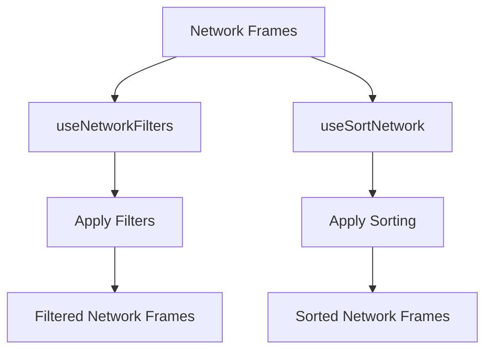

# Overview

Network refers to the components and functionalities related to network activities within the application. This document provides an in-depth look at how network details are managed, filtered, and sorted within the application.

# Network Details Function

The `NetworkDetails` function is responsible for rendering the network details view, including tabs and content based on the selected tab. It utilizes the <SwmToken path="static/app/views/replays/detail/network/useSortNetwork.tsx" pos="28:18:18" line-data="  const {getParamValue: getSortAsc, setParamValue: setSortAsc} = useUrlParams(">`useUrlParams`</SwmToken> hook to manage URL parameters, specifically for determining the active tab in the network details view.

<SwmSnippet path="/static/app/views/replays/detail/network/useNetworkFilters.tsx" line="61">

---

The <SwmToken path="static/app/views/replays/detail/network/useNetworkFilters.tsx" pos="61:2:2" line-data="function useNetworkFilters({networkFrames}: Options): Return {">`useNetworkFilters`</SwmToken> function provides methods for filtering network frames based on method types, resource types, and status types. It uses the <SwmToken path="static/app/views/replays/detail/network/useNetworkFilters.tsx" pos="62:12:12" line-data="  const {setFilter, query} = useFiltersInLocationQuery&lt;FilterFields&gt;();">`useFiltersInLocationQuery`</SwmToken> hook to manage filter states in the URL query parameters. The function returns filtered items and methods to set filters and search terms.

```tsx
function useNetworkFilters({networkFrames}: Options): Return {
  const {setFilter, query} = useFiltersInLocationQuery<FilterFields>();

  const method = useMemo(() => decodeList(query.f_n_method), [query.f_n_method]);
  const status = useMemo(() => decodeList(query.f_n_status), [query.f_n_status]);
  const type = useMemo(() => decodeList(query.f_n_type), [query.f_n_type]);
  const searchTerm = decodeScalar(query.f_n_search, '').toLowerCase();

  // Need to clear Network Details URL params when we filter, otherwise you can
  // get into a state where it is trying to load details for a non fetch/xhr
  // request.
  const setFilterAndClearDetails = useCallback(
    arg => {
      setFilter({
        ...arg,
        n_detail_row: undefined,
        n_detail_tab: undefined,
      });
    },
    [setFilter]
  );
```

---

</SwmSnippet>

# Sorting Network Data

The <SwmToken path="static/app/views/replays/detail/network/useSortNetwork.tsx" pos="27:2:2" line-data="function useSortNetwork({items}: Opts) {">`useSortNetwork`</SwmToken> function sorts network frames based on specified criteria such as method, status, description, operation, size, duration, and start timestamp. It uses URL parameters to manage the sorting state and returns sorted items.

<SwmSnippet path="/static/app/views/replays/detail/network/useSortNetwork.tsx" line="27">

---

The <SwmToken path="static/app/views/replays/detail/network/useSortNetwork.tsx" pos="27:2:2" line-data="function useSortNetwork({items}: Opts) {">`useSortNetwork`</SwmToken> function sorts network frames based on specified criteria. It uses the <SwmToken path="static/app/views/replays/detail/network/useSortNetwork.tsx" pos="28:18:18" line-data="  const {getParamValue: getSortAsc, setParamValue: setSortAsc} = useUrlParams(">`useUrlParams`</SwmToken> hook to manage sorting states in the URL query parameters. The function returns sorted items and a method to handle sorting based on different fields.

```tsx
function useSortNetwork({items}: Opts) {
  const {getParamValue: getSortAsc, setParamValue: setSortAsc} = useUrlParams(
    's_n_asc',
    DEFAULT_ASC
  );
  const {getParamValue: getSortBy, setParamValue: setSortBy} = useUrlParams(
    's_n_by',
    DEFAULT_BY
  );
  const {setParamValue: setDetailRow} = useUrlParams('n_detail_row', '');

  const sortAsc = getSortAsc();
  const sortBy = getSortBy();

  const sortConfig = useMemo(
    () =>
      ({
        asc: sortAsc === 'true',
        by: sortBy,
        getValue: SortStrategies[sortBy],
      }) as SortConfig,
```

---

</SwmSnippet>

# Filter Constants

The <SwmToken path="static/app/views/replays/detail/network/useNetworkFilters.tsx" pos="46:2:2" line-data="const FILTERS = {">`FILTERS`</SwmToken> constant defines the filtering logic for network frames based on method, status, type, and search term. These filters are applied to the network frames to narrow down the results.

<SwmSnippet path="/static/app/views/replays/detail/network/useNetworkFilters.tsx" line="46">

---

The <SwmToken path="static/app/views/replays/detail/network/useNetworkFilters.tsx" pos="46:2:2" line-data="const FILTERS = {">`FILTERS`</SwmToken> constant defines the filtering logic for network frames based on method, status, type, and search term. These filters are applied to the network frames to narrow down the results.

```tsx
const FILTERS = {
  method: (item: SpanFrame, method: string[]) =>
    method.length === 0 || method.includes(String(getFrameMethod(item))),
  status: (item: SpanFrame, status: string[]) =>
    status.length === 0 ||
    status.includes(String(getFrameStatus(item))) ||
    (status.includes(UNKNOWN_STATUS) && getFrameStatus(item) === undefined),

  type: (item: SpanFrame, types: string[]) =>
    types.length === 0 || types.includes(item.op),

  searchTerm: (item: SpanFrame, searchTerm: string) =>
    JSON.stringify(item.description).toLowerCase().includes(searchTerm),
};
```

---

</SwmSnippet>

# Network Endpoints

Network endpoints are used to fetch or link resources. Below are examples of how different endpoints are used within the application.

## <SwmToken path="static/app/views/replays/detail/network/useSortNetwork.spec.tsx" pos="64:5:7" line-data="    op: &#39;resource.fetch&#39;,">`resource.fetch`</SwmToken>

The <SwmToken path="static/app/views/replays/detail/network/useSortNetwork.spec.tsx" pos="64:5:7" line-data="    op: &#39;resource.fetch&#39;,">`resource.fetch`</SwmToken> endpoint is used to fetch data from a specified URL. For example, the endpoint '<https://pokeapi.co/api/v2/pokemon>' is used to fetch Pokémon data with a GET request, returning a status code of 200.

<SwmSnippet path="/static/app/views/replays/detail/network/useSortNetwork.spec.tsx" line="64">

---

The <SwmToken path="static/app/views/replays/detail/network/useSortNetwork.spec.tsx" pos="64:5:7" line-data="    op: &#39;resource.fetch&#39;,">`resource.fetch`</SwmToken> endpoint is used to fetch data from a specified URL. For example, the endpoint '<https://pokeapi.co/api/v2/pokemon>' is used to fetch Pokémon data with a GET request, returning a status code of 200.

```tsx
    op: 'resource.fetch',
    description: 'https://pokeapi.co/api/v2/pokemon',
    startTimestamp: new Date(1663131080.641),
    endTimestamp: new Date(1663131080.65),
    data: {
      method: 'GET',
      statusCode: 200,
    },
  }),
```

---

</SwmSnippet>

## <SwmToken path="static/app/views/replays/detail/network/useSortNetwork.spec.tsx" pos="52:5:7" line-data="    op: &#39;resource.link&#39;,">`resource.link`</SwmToken>

The <SwmToken path="static/app/views/replays/detail/network/useSortNetwork.spec.tsx" pos="52:5:7" line-data="    op: &#39;resource.link&#39;,">`resource.link`</SwmToken> endpoint is used to link to a resource, such as a CSS file. For example, the endpoint '<http://localhost:3000/static/css/main.1856e8e3.chunk.css>' is used to link to a CSS file, with timestamps indicating the start and end of the request.

<SwmSnippet path="/static/app/views/replays/detail/network/useSortNetwork.spec.tsx" line="51">

---

The <SwmToken path="static/app/views/replays/detail/network/useSortNetwork.spec.tsx" pos="52:5:7" line-data="    op: &#39;resource.link&#39;,">`resource.link`</SwmToken> endpoint is used to link to a resource, such as a CSS file. For example, the endpoint '<http://localhost:3000/static/css/main.1856e8e3.chunk.css>' is used to link to a CSS file, with timestamps indicating the start and end of the request.

```tsx
  ReplayResourceFrameFixture({
    op: 'resource.link',
    description: 'http://localhost:3000/static/css/main.1856e8e3.chunk.css',
    startTimestamp: new Date(1663131080.5767),
    endTimestamp: new Date(1663131080.5951),
  }),
```

---

</SwmSnippet>

## Sequence Diagram

The following sequence diagram illustrates the flow of network requests and responses within the application.

sequenceDiagram participant User participant App participant Server User->>App: Request <SwmToken path="static/app/views/replays/detail/network/useSortNetwork.spec.tsx" pos="64:5:7" line-data="    op: &#39;resource.fetch&#39;,">`resource.fetch`</SwmToken> App->>Server: Fetch data from URL Server-->>App: Return data App-->>User: Display data User->>App: Request <SwmToken path="static/app/views/replays/detail/network/useSortNetwork.spec.tsx" pos="52:5:7" line-data="    op: &#39;resource.link&#39;,">`resource.link`</SwmToken> App->>Server: Link to resource Server-->>App: Confirm link App-->>User: Display resource

&nbsp;

*This is an auto-generated document by Swimm AI 🌊 and has not yet been verified by a human*

<SwmMeta version="3.0.0" repo-id="Z2l0aHViJTNBJTNBc2VudHJ5LWRlbW8tMSUzQSUzQVN3aW1tLURlbW8=" repo-name="sentry-demo-1" doc-type="overview"><sup>Powered by [Swimm](/)</sup></SwmMeta>
