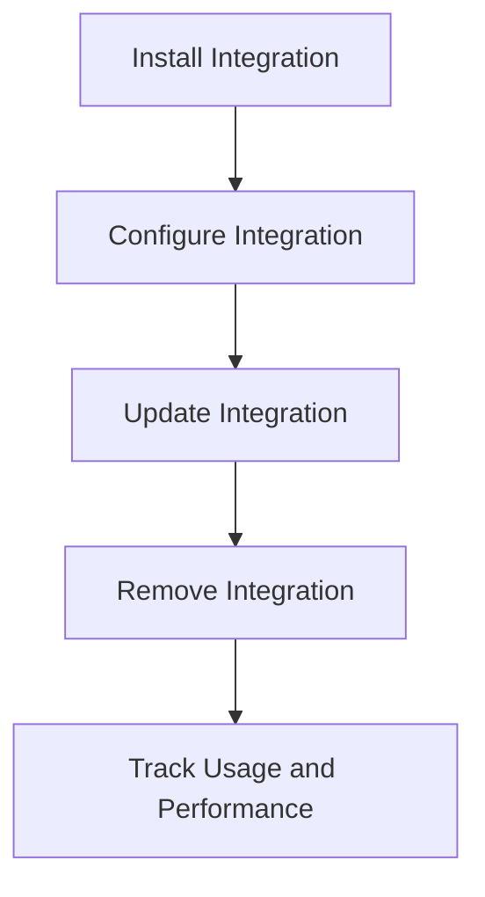

# Overview

Organization integrations refer to the tools and services that can be connected to an organization to enhance its functionality and streamline workflows. In the settings, organization integrations allow users to install, configure, and manage these external tools and services. The integration settings include options to add new integrations, update existing ones, and remove those that are no longer needed. These integrations can provide additional context, automate tasks, and improve the overall efficiency of the organization. Users can also track the usage and performance of these integrations through analytics provided in the settings.

# Installation and Configuration

This section explains how to install and configure an integration. It includes a message from the requester and a link to install the provider.

<SwmSnippet path="/static/app/views/settings/organizationIntegrations/addIntegration.tsx" line="13">

---

The code snippet shows how to handle the addition of new integrations, including event listeners for messages and dialog handling.

```tsx
    openDialog: (urlParams?: {[key: string]: string}) => void
  ) => React.ReactNode;
  onInstall: (data: IntegrationWithConfig) => void;
  organization: Organization;
  provider: IntegrationProvider;
  account?: string | null; // for analytics
  analyticsParams?: {
    already_installed: boolean;
    view:
      | 'integrations_directory_integration_detail'
      | 'integrations_directory'
      | 'messaging_integration_onboarding'
      | 'onboarding'
      | 'project_creation';
  };
  modalParams?: {[key: string]: string};
};

export default class AddIntegration extends Component<Props> {
  componentDidMount() {
    window.addEventListener('message', this.didReceiveMessage);
```

---

</SwmSnippet>

# Managing Integrations

Managing integrations involves handling the addition, updating, and removal of integrations. Below are the steps and code snippets for each of these actions.

## Adding Integrations

To add a new integration, you need to handle event listeners for messages and dialog handling.

<SwmSnippet path="/static/app/views/settings/organizationIntegrations/addIntegration.tsx" line="13">

---

The code snippet shows how to handle the addition of new integrations, including event listeners for messages and dialog handling.

```tsx
    openDialog: (urlParams?: {[key: string]: string}) => void
  ) => React.ReactNode;
  onInstall: (data: IntegrationWithConfig) => void;
  organization: Organization;
  provider: IntegrationProvider;
  account?: string | null; // for analytics
  analyticsParams?: {
    already_installed: boolean;
    view:
      | 'integrations_directory_integration_detail'
      | 'integrations_directory'
      | 'messaging_integration_onboarding'
      | 'onboarding'
      | 'project_creation';
  };
  modalParams?: {[key: string]: string};
};

export default class AddIntegration extends Component<Props> {
  componentDidMount() {
    window.addEventListener('message', this.didReceiveMessage);
```

---

</SwmSnippet>

## Updating Integrations

This section demonstrates how to update an existing integration and handle the success message.

<SwmSnippet path="/static/app/views/settings/organizationIntegrations/integrationMainSettings.tsx" line="11">

---

The code snippet shows how to update an existing integration and handle the success message.

```tsx
type Props = {
  integration: Integration;
  onUpdate: () => void;
  organization: Organization;
};

type State = {
  integration: Integration;
};

class IntegrationMainSettings extends Component<Props, State> {
  state: State = {
    integration: this.props.integration,
  };

  handleSubmitSuccess = (data: Integration) => {
    addSuccessMessage(t('Integration updated.'));
    this.props.onUpdate();
    this.setState({integration: data});
  };
```

---

</SwmSnippet>

## Removing Integrations

This section explains how to handle the removal of an integration, including confirmation dialogs and analytics tracking.

<SwmSnippet path="/static/app/views/settings/organizationIntegrations/installedIntegration.tsx" line="24">

---

The code snippet shows how to handle the removal of an integration, including confirmation dialogs and analytics tracking.

```tsx
  integration: Integration;
  onDisable: (integration: Integration) => void;
  onRemove: (integration: Integration) => void;
  organization: Organization;
  provider: IntegrationProvider;
  trackIntegrationAnalytics: (eventKey: IntegrationAnalyticsKey) => void; // analytics callback
  requiresUpgrade?: boolean;
};

export default class InstalledIntegration extends Component<Props> {
  handleUninstallClick = () => {
    this.props.trackIntegrationAnalytics('integrations.uninstall_clicked');
  };

  getRemovalBodyAndText(aspects: Integration['provider']['aspects']) {
    if (aspects?.removal_dialog) {
      return {
        body: aspects.removal_dialog.body,
        actionText: aspects.removal_dialog.actionText,
      };
    }
```

---

</SwmSnippet>

# Tracking and Analytics

This section explains how to track the usage and performance of integrations using analytics parameters.

<SwmSnippet path="/static/app/views/settings/organizationIntegrations/integrationButton.tsx" line="30">

---

The code snippet shows how to track the usage and performance of integrations using analytics parameters.

```tsx
  externalInstallText,
  buttonProps,
}: Props) {
  const organization = useOrganization();
  const {provider, type, installStatus, analyticsParams, modalParams} =
    useContext(IntegrationContext) ?? {};
  if (!provider || !type) return null;
  const {metadata} = provider;

  if (!userHasAccess) {
    return (
      <RequestIntegrationButton
        organization={organization}
        name={provider.name}
        slug={provider.slug}
        type={type}
      />
    );
  }
  if (provider.canAdd) {
    return (
```

---

</SwmSnippet>

# Main Functions

There are several main functions in this folder. Some of them are <SwmToken path="static/app/views/settings/organizationIntegrations/installedIntegration.tsx" pos="34:1:1" line-data="  handleUninstallClick = () =&gt; {">`handleUninstallClick`</SwmToken>, <SwmToken path="static/app/views/settings/organizationIntegrations/installedIntegration.tsx" pos="38:1:1" line-data="  getRemovalBodyAndText(aspects: Integration[&#39;provider&#39;][&#39;aspects&#39;]) {">`getRemovalBodyAndText`</SwmToken>, <SwmToken path="static/app/views/settings/organizationIntegrations/installedIntegration.tsx" pos="207:2:2" line-data="function IntegrationStatus(">`IntegrationStatus`</SwmToken>, <SwmToken path="static/app/views/settings/organizationIntegrations/integrationListDirectory.tsx" pos="402:1:1" line-data="  renderProvider = (provider: IntegrationProvider) =&gt; {">`renderProvider`</SwmToken>, <SwmToken path="static/app/views/settings/organizationIntegrations/integrationRow.tsx" pos="78:3:3" line-data="  const renderDetails = () =&gt; {">`renderDetails`</SwmToken>, <SwmToken path="static/app/views/settings/organizationIntegrations/integrationRepos.tsx" pos="43:1:1" line-data="  getEndpoints(): ReturnType&lt;DeprecatedAsyncComponent[&#39;getEndpoints&#39;]&gt; {">`getEndpoints`</SwmToken>, <SwmToken path="static/app/views/settings/organizationIntegrations/integrationMainSettings.tsx" pos="26:1:1" line-data="  handleSubmitSuccess = (data: Integration) =&gt; {">`handleSubmitSuccess`</SwmToken>, <SwmToken path="static/app/views/settings/organizationIntegrations/abstractIntegrationDetailedView.tsx" pos="187:3:3" line-data="  abstract renderConfigurations(): React.ReactNode;">`renderConfigurations`</SwmToken>, `openRequestModal`, and `searchRepositoriesRequest`. We will dive a little into <SwmToken path="static/app/views/settings/organizationIntegrations/installedIntegration.tsx" pos="34:1:1" line-data="  handleUninstallClick = () =&gt; {">`handleUninstallClick`</SwmToken> and <SwmToken path="static/app/views/settings/organizationIntegrations/installedIntegration.tsx" pos="38:1:1" line-data="  getRemovalBodyAndText(aspects: Integration[&#39;provider&#39;][&#39;aspects&#39;]) {">`getRemovalBodyAndText`</SwmToken>.

## <SwmToken path="static/app/views/settings/organizationIntegrations/installedIntegration.tsx" pos="34:1:1" line-data="  handleUninstallClick = () =&gt; {">`handleUninstallClick`</SwmToken>

The <SwmToken path="static/app/views/settings/organizationIntegrations/installedIntegration.tsx" pos="34:1:1" line-data="  handleUninstallClick = () =&gt; {">`handleUninstallClick`</SwmToken> function is used to track when the uninstall button is clicked for an integration. It calls the <SwmToken path="static/app/views/settings/organizationIntegrations/installedIntegration.tsx" pos="29:1:1" line-data="  trackIntegrationAnalytics: (eventKey: IntegrationAnalyticsKey) =&gt; void; // analytics callback">`trackIntegrationAnalytics`</SwmToken> function with the event key <SwmToken path="static/app/views/settings/organizationIntegrations/installedIntegration.tsx" pos="35:8:10" line-data="    this.props.trackIntegrationAnalytics(&#39;integrations.uninstall_clicked&#39;);">`integrations.uninstall_clicked`</SwmToken>.

<SwmSnippet path="/static/app/views/settings/organizationIntegrations/installedIntegration.tsx" line="34">

---

The code snippet shows how to track when the uninstall button is clicked for an integration.

```tsx
  handleUninstallClick = () => {
    this.props.trackIntegrationAnalytics('integrations.uninstall_clicked');
  };
```

---

</SwmSnippet>

## <SwmToken path="static/app/views/settings/organizationIntegrations/installedIntegration.tsx" pos="38:1:1" line-data="  getRemovalBodyAndText(aspects: Integration[&#39;provider&#39;][&#39;aspects&#39;]) {">`getRemovalBodyAndText`</SwmToken>

The <SwmToken path="static/app/views/settings/organizationIntegrations/installedIntegration.tsx" pos="38:1:1" line-data="  getRemovalBodyAndText(aspects: Integration[&#39;provider&#39;][&#39;aspects&#39;]) {">`getRemovalBodyAndText`</SwmToken> function is used to get the body text and action text for the removal dialog of an integration. It checks if the <SwmToken path="static/app/views/settings/organizationIntegrations/installedIntegration.tsx" pos="39:6:6" line-data="    if (aspects?.removal_dialog) {">`removal_dialog`</SwmToken> aspect is present in the integration's provider aspects and returns the corresponding body and action text. If not present, it returns default text indicating that deleting the integration will remove associated project data and cannot be undone.

<SwmSnippet path="/static/app/views/settings/organizationIntegrations/installedIntegration.tsx" line="38">

---

The code snippet shows how to get the body text and action text for the removal dialog of an integration.

```tsx
  getRemovalBodyAndText(aspects: Integration['provider']['aspects']) {
    if (aspects?.removal_dialog) {
      return {
        body: aspects.removal_dialog.body,
        actionText: aspects.removal_dialog.actionText,
      };
    }
    return {
      body: t(
        'Deleting this integration will remove any project associated data. This action cannot be undone. Are you sure you want to delete this integration?'
      ),
      actionText: t('Delete'),
```

---

</SwmSnippet>

## <SwmToken path="static/app/views/settings/organizationIntegrations/installedIntegration.tsx" pos="207:2:2" line-data="function IntegrationStatus(">`IntegrationStatus`</SwmToken>

The <SwmToken path="static/app/views/settings/organizationIntegrations/installedIntegration.tsx" pos="207:2:2" line-data="function IntegrationStatus(">`IntegrationStatus`</SwmToken> function is used to display the status of an integration. It shows different statuses such as 'enabled', 'pending deletion', 'disabled', or 'unknown' based on the integration's status. It also includes a tooltip with additional information about the status.

<SwmSnippet path="/static/app/views/settings/organizationIntegrations/installedIntegration.tsx" line="207">

---

The code snippet shows how to display the status of an integration.

```tsx
function IntegrationStatus(
  props: React.HTMLAttributes<HTMLDivElement> & {
    status: ObjectStatus;
    hideTooltip?: boolean;
  }
) {
  const theme = useTheme();
  const {status, hideTooltip, ...p} = props;
  const color = status === 'active' ? theme.success : theme.gray300;
  const inner = (
    <div {...p}>
      <CircleIndicator size={6} color={color} />
      <IntegrationStatusText data-test-id="integration-status">{`${
        status === 'active'
          ? t('enabled')
          : status === 'pending_deletion'
            ? t('pending deletion')
            : status === 'disabled'
              ? t('disabled')
              : t('unknown')
      }`}</IntegrationStatusText>
```

---

</SwmSnippet>

## <SwmToken path="static/app/views/settings/organizationIntegrations/integrationListDirectory.tsx" pos="402:1:1" line-data="  renderProvider = (provider: IntegrationProvider) =&gt; {">`renderProvider`</SwmToken>

The <SwmToken path="static/app/views/settings/organizationIntegrations/integrationListDirectory.tsx" pos="402:1:1" line-data="  renderProvider = (provider: IntegrationProvider) =&gt; {">`renderProvider`</SwmToken> function is used to render the integration row for a given provider. It filters the integration installations for that provider and passes the necessary props to the <SwmToken path="static/app/views/settings/organizationIntegrations/integrationListDirectory.tsx" pos="409:2:2" line-data="      &lt;IntegrationRow">`IntegrationRow`</SwmToken> component, including the organization, type, slug, display name, status, publish status, configurations, categories, alert text, resolve text, and custom alert.

<SwmSnippet path="/static/app/views/settings/organizationIntegrations/integrationListDirectory.tsx" line="402">

---

The code snippet shows how to render the integration row for a given provider.

```tsx
  renderProvider = (provider: IntegrationProvider) => {
    const {organization} = this.props;
    // find the integration installations for that provider
    const integrations =
      this.state.integrations?.filter(i => i.provider.key === provider.key) ?? [];

    return (
      <IntegrationRow
        key={`row-${provider.key}`}
        data-test-id="integration-row"
        organization={organization}
        type="firstParty"
        slug={provider.slug}
        displayName={provider.name}
        status={this.getInstallStatuses(integrations)}
        publishStatus="published"
        configurations={integrations.length}
        categories={getCategoriesForIntegration(provider)}
        alertText={getAlertText(integrations)}
        resolveText={t('Update Now')}
        customAlert={
```

---

</SwmSnippet>

## <SwmToken path="static/app/views/settings/organizationIntegrations/integrationRow.tsx" pos="78:3:3" line-data="  const renderDetails = () =&gt; {">`renderDetails`</SwmToken>

The <SwmToken path="static/app/views/settings/organizationIntegrations/integrationRow.tsx" pos="78:3:3" line-data="  const renderDetails = () =&gt; {">`renderDetails`</SwmToken> function is used to render the details of an integration. It checks the type of the integration and returns the appropriate details. For <SwmToken path="static/app/views/settings/organizationIntegrations/integrationRow.tsx" pos="79:9:9" line-data="    if (type === &#39;sentryApp&#39;) {">`sentryApp`</SwmToken> type, it returns the publish status if it is not 'published'. For other types, it returns the number of configurations with a link to the configurations tab.

<SwmSnippet path="/static/app/views/settings/organizationIntegrations/integrationRow.tsx" line="78">

---

The code snippet shows how to render the details of an integration.

```tsx
  const renderDetails = () => {
    if (type === 'sentryApp') {
      return publishStatus !== 'published' && <PublishStatus status={publishStatus} />;
    }
    // TODO: Use proper translations
    return configurations > 0 ? (
      <StyledLink to={`${baseUrl}?tab=configurations`}>{`${configurations} Configuration${
        configurations > 1 ? 's' : ''
      }`}</StyledLink>
    ) : null;
```

---

</SwmSnippet>

## <SwmToken path="static/app/views/settings/organizationIntegrations/integrationRepos.tsx" pos="43:1:1" line-data="  getEndpoints(): ReturnType&lt;DeprecatedAsyncComponent[&#39;getEndpoints&#39;]&gt; {">`getEndpoints`</SwmToken>

The <SwmToken path="static/app/views/settings/organizationIntegrations/integrationRepos.tsx" pos="43:1:1" line-data="  getEndpoints(): ReturnType&lt;DeprecatedAsyncComponent[&#39;getEndpoints&#39;]&gt; {">`getEndpoints`</SwmToken> function is used to define the API endpoints for fetching the integration repositories. It returns an array with the endpoint for fetching the item list of repositories for the given organization and integration.

<SwmSnippet path="/static/app/views/settings/organizationIntegrations/integrationRepos.tsx" line="43">

---

The code snippet shows how to define the API endpoints for fetching the integration repositories.

```tsx
  getEndpoints(): ReturnType<DeprecatedAsyncComponent['getEndpoints']> {
    const {organization, integration} = this.props;
    return [
      [
        'itemList',
        `/organizations/${organization.slug}/repos/`,
        {query: {status: 'active', integration_id: integration.id}},
      ],
    ];
```

---

</SwmSnippet>

## <SwmToken path="static/app/views/settings/organizationIntegrations/integrationMainSettings.tsx" pos="26:1:1" line-data="  handleSubmitSuccess = (data: Integration) =&gt; {">`handleSubmitSuccess`</SwmToken>

The <SwmToken path="static/app/views/settings/organizationIntegrations/integrationMainSettings.tsx" pos="26:1:1" line-data="  handleSubmitSuccess = (data: Integration) =&gt; {">`handleSubmitSuccess`</SwmToken> function is used to handle the success response of the integration update form submission. It shows a success message, calls the <SwmToken path="static/app/views/settings/organizationIntegrations/integrationMainSettings.tsx" pos="13:1:1" line-data="  onUpdate: () =&gt; void;">`onUpdate`</SwmToken> prop function, and updates the state with the new integration data.

<SwmSnippet path="/static/app/views/settings/organizationIntegrations/integrationMainSettings.tsx" line="26">

---

The code snippet shows how to handle the success response of the integration update form submission.

```tsx
  handleSubmitSuccess = (data: Integration) => {
    addSuccessMessage(t('Integration updated.'));
    this.props.onUpdate();
    this.setState({integration: data});
  };
```

---

</SwmSnippet>

## <SwmToken path="static/app/views/settings/organizationIntegrations/abstractIntegrationDetailedView.tsx" pos="187:3:3" line-data="  abstract renderConfigurations(): React.ReactNode;">`renderConfigurations`</SwmToken>

The <SwmToken path="static/app/views/settings/organizationIntegrations/abstractIntegrationDetailedView.tsx" pos="187:3:3" line-data="  abstract renderConfigurations(): React.ReactNode;">`renderConfigurations`</SwmToken> function is an abstract function that returns the list of configurations for the integration. It is meant to be implemented by subclasses of the <SwmToken path="static/app/views/settings/organizationIntegrations/abstractIntegrationDetailedView.tsx" pos="55:4:4" line-data="abstract class AbstractIntegrationDetailedView&lt;">`AbstractIntegrationDetailedView`</SwmToken> class.

<SwmSnippet path="/static/app/views/settings/organizationIntegrations/abstractIntegrationDetailedView.tsx" line="186">

---

The code snippet shows how to return the list of configurations for the integration.

```tsx
  // Returns the list of configurations for the integration
  abstract renderConfigurations(): React.ReactNode;
```

---

</SwmSnippet>

&nbsp;

*This is an auto-generated document by Swimm AI 🌊 and has not yet been verified by a human*

<SwmMeta version="3.0.0" repo-id="Z2l0aHViJTNBJTNBc2VudHJ5LWRlbW8tMSUzQSUzQVN3aW1tLURlbW8=" repo-name="sentry-demo-1" doc-type="overview"><sup>Powered by [Swimm](/)</sup></SwmMeta>
