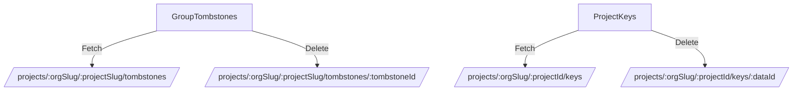

# Overview

A project in the settings is a core entity that represents a collection of configurations, settings, and data specific to a particular application or service being monitored. It includes various settings such as filters, keys, and other configurations that help in managing and monitoring the application's performance and errors. Projects are used to organize and isolate data, making it easier to manage and analyze issues specific to that application or service. Each project has a unique identifier and can be configured with specific settings to tailor the monitoring and error tracking to the needs of the application.

<SwmSnippet path="/static/app/views/settings/project/projectTeams.tsx" line="21">

---

## Project Settings

The <SwmToken path="static/app/views/settings/project/projectTeams.tsx" pos="21:2:2" line-data="type ProjectTeamsProps = {">`ProjectTeamsProps`</SwmToken> type defines the properties for the project teams, including the organization and project.

```tsx
type ProjectTeamsProps = {
  organization: Organization;
  project: Project;
};
```

---

</SwmSnippet>

<SwmSnippet path="/static/app/views/settings/project/projectTeams.tsx" line="56">

---

## Project Management

The <SwmToken path="static/app/views/settings/project/projectTeams.tsx" pos="56:2:2" line-data="    &lt;SentryDocumentTitle title={routeTitleGen(t(&#39;Project Teams&#39;), project.slug, false)}&gt;">`SentryDocumentTitle`</SwmToken> and <SwmToken path="static/app/views/settings/project/projectTeams.tsx" pos="58:2:2" line-data="        &lt;SettingsPageHeader title={t(&#39;Project Teams for %s&#39;, project.slug)} /&gt;">`SettingsPageHeader`</SwmToken> components are used to manage and display project teams, making it easier to organize and isolate data.

```tsx
    <SentryDocumentTitle title={routeTitleGen(t('Project Teams'), project.slug, false)}>
      <div>
        <SettingsPageHeader title={t('Project Teams for %s', project.slug)} />
        <TextBlock>
          {t(
            'These teams and their members have access to this project. They can be assigned to issues and alerts created in it.'
          )}
        </TextBlock>
```

---

</SwmSnippet>

<SwmSnippet path="/static/app/views/settings/project/projectKeys/details/keySettings.tsx" line="33">

---

## Unique Identifier

Each project has a unique identifier, as defined by the <SwmToken path="static/app/views/settings/project/projectKeys/details/keySettings.tsx" pos="33:1:1" line-data="    keyId: string;">`keyId`</SwmToken> and <SwmToken path="static/app/views/settings/project/projectKeys/details/keySettings.tsx" pos="34:1:1" line-data="    projectId: string;">`projectId`</SwmToken> properties.

```tsx
    keyId: string;
    projectId: string;
  };
  project: Project;
```

---

</SwmSnippet>

# Project APIs

Project APIs provide endpoints to manage various aspects of a project, such as tombstones and keys.

<SwmSnippet path="/static/app/views/settings/project/projectFilters/groupTombstones.tsx" line="84">

---

### Project Tombstones

The <SwmToken path="static/app/views/settings/project/projectFilters/groupTombstones.tsx" pos="84:2:2" line-data="function GroupTombstones({project}: GroupTombstonesProps) {">`GroupTombstones`</SwmToken> component fetches and displays tombstone data for a project. It uses the endpoint `/projects/${organization.slug}/${project.slug}/tombstones/` to retrieve the data and the endpoint `/projects/${organization.slug}/${project.slug}/tombstones/${tombstoneId}/` to delete a tombstone.

```tsx
function GroupTombstones({project}: GroupTombstonesProps) {
  const api = useApi();
  const location = useLocation();
  const organization = useOrganization();
  const {
    data: tombstones,
    isPending,
    isError,
    refetch,
    getResponseHeader,
  } = useApiQuery<GroupTombstone[]>(
    [
      `/projects/${organization.slug}/${project.slug}/tombstones/`,
      {query: {...location.query}},
    ],
    {staleTime: 0}
  );
  const tombstonesPageLinks = getResponseHeader?.('Link');

  const handleUndiscard = (tombstoneId: GroupTombstone['id']) => {
    api
```

---

</SwmSnippet>

<SwmSnippet path="/static/app/views/settings/project/projectKeys/list/index.tsx" line="43">

---

### Project Keys

The <SwmToken path="static/app/views/settings/project/projectKeys/details/keySettings.tsx" pos="24:15:15" line-data="import KeyRateLimitsForm from &#39;sentry/views/settings/project/projectKeys/details/keyRateLimitsForm&#39;;">`projectKeys`</SwmToken> component manages the keys associated with a project. It uses the endpoint `/projects/${organization.slug}/${projectId}/keys/` to fetch the list of keys and the endpoint `/projects/${organization.slug}/${projectId}/keys/${data.id}/` to delete a key.

```tsx
  getEndpoints(): ReturnType<DeprecatedAsyncView['getEndpoints']> {
    const {organization} = this.props;
    const {projectId} = this.props.params;
    return [['keyList', `/projects/${organization.slug}/${projectId}/keys/`]];
  }

  /**
   * Optimistically remove key
   */
  handleRemoveKey = async (data: ProjectKey) => {
    const oldKeyList = [...this.state.keyList];

    addLoadingMessage(t('Revoking key\u2026'));

    this.setState(state => ({
      keyList: state.keyList.filter(key => key.id !== data.id),
    }));

    const {organization} = this.props;
    const {projectId} = this.props.params;
```

---

</SwmSnippet>

&nbsp;

*This is an auto-generated document by Swimm AI 🌊 and has not yet been verified by a human*

<SwmMeta version="3.0.0" repo-id="Z2l0aHViJTNBJTNBc2VudHJ5LWRlbW8tMSUzQSUzQVN3aW1tLURlbW8=" repo-name="sentry-demo-1" doc-type="overview"><sup>Powered by [Swimm](/)</sup></SwmMeta>
