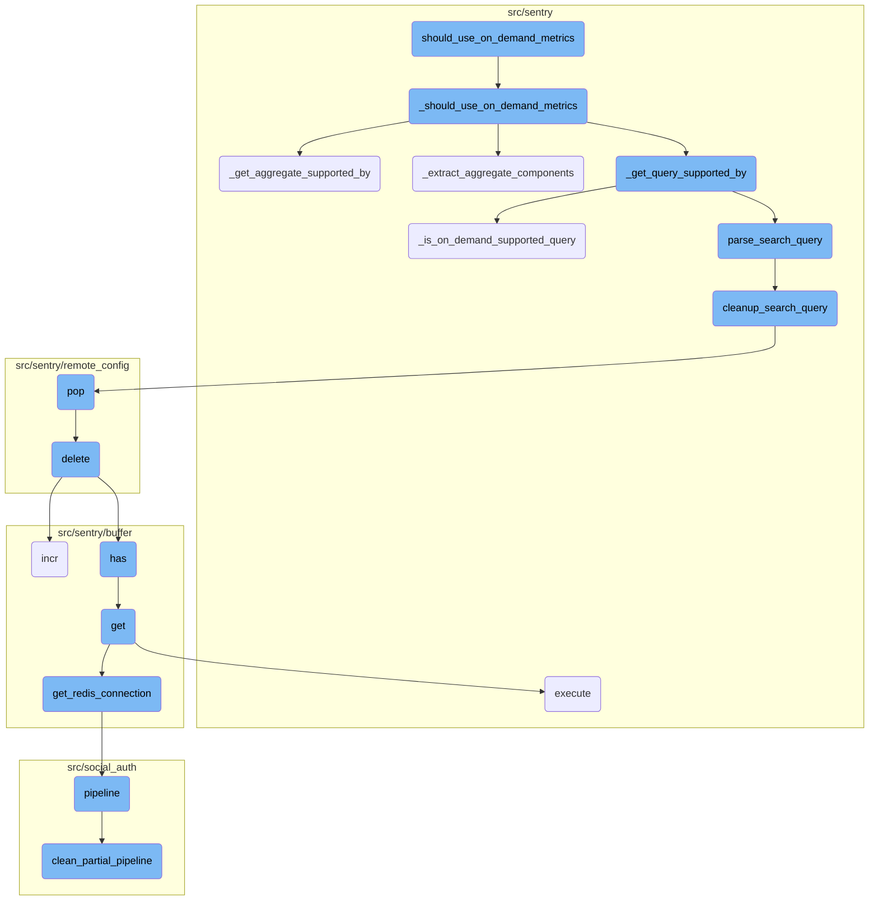
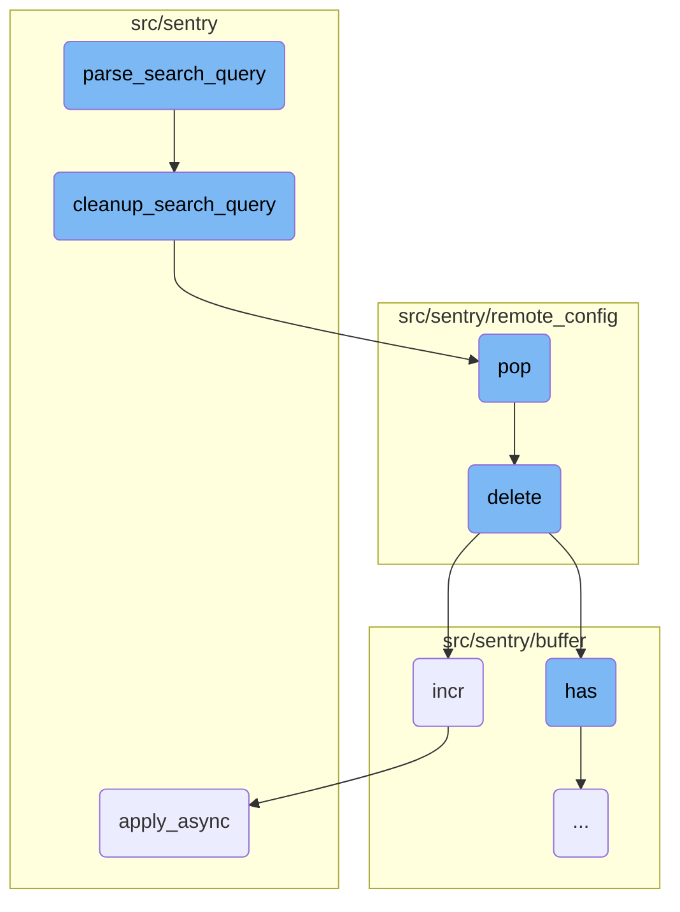
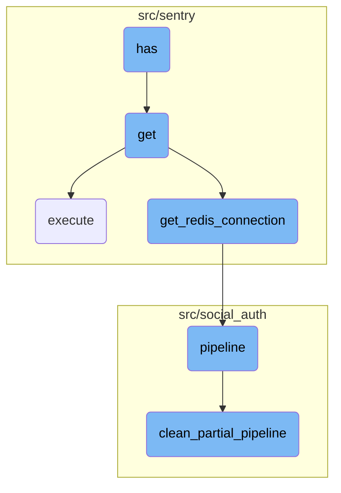

```mermaid
graph TD;
      subgraph src/sentry/snuba/metrics/extraction.py
2dd9769df7ed6781f574d0d324f29c0f9d7ae75de68b25bc343fd3c6fbf19de1(_get_query_supported_by):::mainFlowStyle --> 459eb3218fcb28973f33b9a65befbd1ab771318583adbae888da453ec5e082db(_is_on_demand_supported_query)
end

subgraph src/sentry/snuba/metrics/extraction.py
2dd9769df7ed6781f574d0d324f29c0f9d7ae75de68b25bc343fd3c6fbf19de1(_get_query_supported_by):::mainFlowStyle --> 712fe28b090797714ccd9c9789f200ea0ced57d85a3d9512c05181388822043b(parse_search_query):::mainFlowStyle
end

subgraph src/sentry/snuba/metrics/extraction.py
712fe28b090797714ccd9c9789f200ea0ced57d85a3d9512c05181388822043b(parse_search_query):::mainFlowStyle --> pupxy(...)
end

subgraph src/sentry/snuba/metrics/extraction.py
459eb3218fcb28973f33b9a65befbd1ab771318583adbae888da453ec5e082db(_is_on_demand_supported_query) --> f1b6be3898a667439ff3fcbaa89202fff871dc749bd4ce7707fb8cd99aa04829(_is_on_demand_supported_search_filter)
end


      classDef mainFlowStyle color:#000000,fill:#7CB9F4
classDef rootsStyle color:#000000,fill:#00FFF4
classDef Style1 color:#000000,fill:#00FFAA
classDef Style2 color:#000000,fill:#FFFF00
classDef Style3 color:#000000,fill:#AA7CB9

%% Swimm:
%% graph TD;
%%       subgraph <SwmPath>[src/sentry/snuba/metrics/extraction.py](src/sentry/snuba/metrics/extraction.py)</SwmPath>
%% 2dd9769df7ed6781f574d0d324f29c0f9d7ae75de68b25bc343fd3c6fbf19de1(_get_query_supported_by):::mainFlowStyle --> 459eb3218fcb28973f33b9a65befbd1ab771318583adbae888da453ec5e082db(_is_on_demand_supported_query)
%% end
%% 
%% subgraph <SwmPath>[src/sentry/snuba/metrics/extraction.py](src/sentry/snuba/metrics/extraction.py)</SwmPath>
%% 2dd9769df7ed6781f574d0d324f29c0f9d7ae75de68b25bc343fd3c6fbf19de1(_get_query_supported_by):::mainFlowStyle --> 712fe28b090797714ccd9c9789f200ea0ced57d85a3d9512c05181388822043b(parse_search_query):::mainFlowStyle
%% end
%% 
%% subgraph <SwmPath>[src/sentry/snuba/metrics/extraction.py](src/sentry/snuba/metrics/extraction.py)</SwmPath>
%% 712fe28b090797714ccd9c9789f200ea0ced57d85a3d9512c05181388822043b(parse_search_query):::mainFlowStyle --> pupxy(...)
%% end
%% 
%% subgraph <SwmPath>[src/sentry/snuba/metrics/extraction.py](src/sentry/snuba/metrics/extraction.py)</SwmPath>
%% 459eb3218fcb28973f33b9a65befbd1ab771318583adbae888da453ec5e082db(_is_on_demand_supported_query) --> f1b6be3898a667439ff3fcbaa89202fff871dc749bd4ce7707fb8cd99aa04829(_is_on_demand_supported_search_filter)
%% end
%% 
%% 
%%       classDef mainFlowStyle color:#000000,fill:#7CB9F4
%% classDef rootsStyle color:#000000,fill:#00FFF4
%% classDef Style1 color:#000000,fill:#00FFAA
%% classDef Style2 color:#000000,fill:#FFFF00
%% classDef Style3 color:#000000,fill:#AA7CB9
```

In this document, we will explore the purpose and functionality of the <SwmToken path="src/sentry/snuba/metrics/extraction.py" pos="672:8:8" line-data="            metrics.incr(&quot;on_demand_metrics.should_use_on_demand_metrics.cache_hit&quot;)">`should_use_on_demand_metrics`</SwmToken> function. This function is crucial for determining whether <SwmToken path="src/sentry/snuba/metrics/extraction.py" pos="615:4:6" line-data="    &quot;&quot;&quot;On-demand metrics are used if the aggregate and query are supported by on-demand metrics but not standard&quot;&quot;&quot;">`On-demand`</SwmToken> metrics should be used based on various conditions and support checks.

The <SwmToken path="src/sentry/snuba/metrics/extraction.py" pos="672:8:8" line-data="            metrics.incr(&quot;on_demand_metrics.should_use_on_demand_metrics.cache_hit&quot;)">`should_use_on_demand_metrics`</SwmToken> function first checks if the result is already cached to improve performance. If a cached result is found, it is returned immediately. If not, it logs a cache miss and proceeds to compute the result using <SwmToken path="src/sentry/snuba/metrics/extraction.py" pos="608:2:2" line-data="def _should_use_on_demand_metrics(">`_should_use_on_demand_metrics`</SwmToken>. This involves checking if the dataset, aggregate, query, and groupbys are supported. The function <SwmToken path="src/sentry/snuba/metrics/extraction.py" pos="626:5:5" line-data="    components = _extract_aggregate_components(aggregate)">`_extract_aggregate_components`</SwmToken> parses the aggregate string to extract its components, which are then used to determine support for <SwmToken path="src/sentry/snuba/metrics/extraction.py" pos="615:4:6" line-data="    &quot;&quot;&quot;On-demand metrics are used if the aggregate and query are supported by on-demand metrics but not standard&quot;&quot;&quot;">`On-demand`</SwmToken> metrics. The function <SwmToken path="src/sentry/snuba/metrics/extraction.py" pos="717:2:2" line-data="def _get_aggregate_supported_by(function: str, args: list[str]) -&gt; SupportedBy:">`_get_aggregate_supported_by`</SwmToken> checks if the aggregate function and its arguments are supported. Similarly, <SwmToken path="src/sentry/snuba/metrics/extraction.py" pos="798:2:2" line-data="def _get_query_supported_by(query: str | None) -&gt; SupportedBy:">`_get_query_supported_by`</SwmToken> determines which type of metrics a given query supports by parsing the query and checking its support for standard and <SwmToken path="src/sentry/snuba/metrics/extraction.py" pos="615:4:6" line-data="    &quot;&quot;&quot;On-demand metrics are used if the aggregate and query are supported by on-demand metrics but not standard&quot;&quot;&quot;">`On-demand`</SwmToken> metrics.

Here is a high level diagram of the flow, showing only the most important functions:



# Flow drill down

First, we'll zoom into this section of the flow:

```mermaid
graph TD;
      subgraph src/sentry/snuba/metrics/extraction.py
a387d093f4b84931ff673b623159691f5f7f963a49589b7710cee78ef3d0e9da(should_use_on_demand_metrics):::mainFlowStyle --> 5473b7fd726bfa01c35a1ff5253809ff8cb35969b40cadc63098b78880d3d6e6(_should_use_on_demand_metrics):::mainFlowStyle
end

subgraph src/sentry/snuba/metrics/extraction.py
5473b7fd726bfa01c35a1ff5253809ff8cb35969b40cadc63098b78880d3d6e6(_should_use_on_demand_metrics):::mainFlowStyle --> 8e867af4503cd682c4140e9d9cd02685ce7209d0a7176fa29e32877cad22ae77(_get_aggregate_supported_by)
end

subgraph src/sentry/snuba/metrics/extraction.py
5473b7fd726bfa01c35a1ff5253809ff8cb35969b40cadc63098b78880d3d6e6(_should_use_on_demand_metrics):::mainFlowStyle --> 84b742783572d01793b053f63f7069bfe5e528b14e4a88e848f5668ddf147d98(_extract_aggregate_components)
end

subgraph src/sentry/snuba/metrics/extraction.py
5473b7fd726bfa01c35a1ff5253809ff8cb35969b40cadc63098b78880d3d6e6(_should_use_on_demand_metrics):::mainFlowStyle --> 2dd9769df7ed6781f574d0d324f29c0f9d7ae75de68b25bc343fd3c6fbf19de1(_get_query_supported_by):::mainFlowStyle
end

subgraph src/sentry/snuba/metrics/extraction.py
2dd9769df7ed6781f574d0d324f29c0f9d7ae75de68b25bc343fd3c6fbf19de1(_get_query_supported_by):::mainFlowStyle --> qwbey(...)
end

subgraph src/sentry/snuba/metrics/extraction.py
84b742783572d01793b053f63f7069bfe5e528b14e4a88e848f5668ddf147d98(_extract_aggregate_components) --> 53412ab5b2580a5f2ec9c494f4aef9bb0e50aee3d80c76203f5d3aa1855fd22e(_parse_function)
end

subgraph src/sentry/snuba/metrics/extraction.py
8e867af4503cd682c4140e9d9cd02685ce7209d0a7176fa29e32877cad22ae77(_get_aggregate_supported_by) --> aa869ac41486c34405f39c2304612809eb07d3541a586fbfda0ca6df08581d09(_get_args_support)
end


      classDef mainFlowStyle color:#000000,fill:#7CB9F4
classDef rootsStyle color:#000000,fill:#00FFF4
classDef Style1 color:#000000,fill:#00FFAA
classDef Style2 color:#000000,fill:#FFFF00
classDef Style3 color:#000000,fill:#AA7CB9

%% Swimm:
%% graph TD;
%%       subgraph <SwmPath>[src/sentry/snuba/metrics/extraction.py](src/sentry/snuba/metrics/extraction.py)</SwmPath>
%% a387d093f4b84931ff673b623159691f5f7f963a49589b7710cee78ef3d0e9da(should_use_on_demand_metrics):::mainFlowStyle --> 5473b7fd726bfa01c35a1ff5253809ff8cb35969b40cadc63098b78880d3d6e6(_should_use_on_demand_metrics):::mainFlowStyle
%% end
%% 
%% subgraph <SwmPath>[src/sentry/snuba/metrics/extraction.py](src/sentry/snuba/metrics/extraction.py)</SwmPath>
%% 5473b7fd726bfa01c35a1ff5253809ff8cb35969b40cadc63098b78880d3d6e6(_should_use_on_demand_metrics):::mainFlowStyle --> 8e867af4503cd682c4140e9d9cd02685ce7209d0a7176fa29e32877cad22ae77(_get_aggregate_supported_by)
%% end
%% 
%% subgraph <SwmPath>[src/sentry/snuba/metrics/extraction.py](src/sentry/snuba/metrics/extraction.py)</SwmPath>
%% 5473b7fd726bfa01c35a1ff5253809ff8cb35969b40cadc63098b78880d3d6e6(_should_use_on_demand_metrics):::mainFlowStyle --> 84b742783572d01793b053f63f7069bfe5e528b14e4a88e848f5668ddf147d98(_extract_aggregate_components)
%% end
%% 
%% subgraph <SwmPath>[src/sentry/snuba/metrics/extraction.py](src/sentry/snuba/metrics/extraction.py)</SwmPath>
%% 5473b7fd726bfa01c35a1ff5253809ff8cb35969b40cadc63098b78880d3d6e6(_should_use_on_demand_metrics):::mainFlowStyle --> 2dd9769df7ed6781f574d0d324f29c0f9d7ae75de68b25bc343fd3c6fbf19de1(_get_query_supported_by):::mainFlowStyle
%% end
%% 
%% subgraph <SwmPath>[src/sentry/snuba/metrics/extraction.py](src/sentry/snuba/metrics/extraction.py)</SwmPath>
%% 2dd9769df7ed6781f574d0d324f29c0f9d7ae75de68b25bc343fd3c6fbf19de1(_get_query_supported_by):::mainFlowStyle --> qwbey(...)
%% end
%% 
%% subgraph <SwmPath>[src/sentry/snuba/metrics/extraction.py](src/sentry/snuba/metrics/extraction.py)</SwmPath>
%% 84b742783572d01793b053f63f7069bfe5e528b14e4a88e848f5668ddf147d98(_extract_aggregate_components) --> 53412ab5b2580a5f2ec9c494f4aef9bb0e50aee3d80c76203f5d3aa1855fd22e(_parse_function)
%% end
%% 
%% subgraph <SwmPath>[src/sentry/snuba/metrics/extraction.py](src/sentry/snuba/metrics/extraction.py)</SwmPath>
%% 8e867af4503cd682c4140e9d9cd02685ce7209d0a7176fa29e32877cad22ae77(_get_aggregate_supported_by) --> aa869ac41486c34405f39c2304612809eb07d3541a586fbfda0ca6df08581d09(_get_args_support)
%% end
%% 
%% 
%%       classDef mainFlowStyle color:#000000,fill:#7CB9F4
%% classDef rootsStyle color:#000000,fill:#00FFF4
%% classDef Style1 color:#000000,fill:#00FFAA
%% classDef Style2 color:#000000,fill:#FFFF00
%% classDef Style3 color:#000000,fill:#AA7CB9
```



<SwmSnippet path="/src/sentry/snuba/metrics/extraction.py" line="657">

---

## Caching Mechanism

The function <SwmToken path="src/sentry/snuba/metrics/extraction.py" pos="672:8:8" line-data="            metrics.incr(&quot;on_demand_metrics.should_use_on_demand_metrics.cache_hit&quot;)">`should_use_on_demand_metrics`</SwmToken> first checks if the result is already cached. If a cached result is found, it is returned immediately, improving performance by avoiding redundant calculations. If not, it logs a cache miss and proceeds to compute the result using <SwmToken path="src/sentry/snuba/metrics/extraction.py" pos="608:2:2" line-data="def _should_use_on_demand_metrics(">`_should_use_on_demand_metrics`</SwmToken>.

```python
    if in_random_rollout("on_demand_metrics.cache_should_use_on_demand"):
        if organization_bulk_query_cache is None:
            organization_bulk_query_cache = defaultdict(dict)

        dataset_str = dataset.value if isinstance(dataset, Enum) else str(dataset or "")
        groupbys_str = ",".join(sorted(groupbys)) if groupbys else ""
        local_cache_md5 = md5_text(
            f"{dataset_str}-{aggregate}-{query or ''}-{groupbys_str}-prefilling={prefilling}"
        )
        local_cache_digest_chunk = local_cache_md5.digest()[0] % WIDGET_QUERY_CACHE_MAX_CHUNKS
        local_cache_key = local_cache_md5.hexdigest()
        cached_result = organization_bulk_query_cache.get(local_cache_digest_chunk, {}).get(
            local_cache_key, None
        )
        if cached_result:
            metrics.incr("on_demand_metrics.should_use_on_demand_metrics.cache_hit")
            return cached_result
        else:
            logger.info(
                "should_use_on_demand_metrics.cache_miss",
                extra={
```

---

</SwmSnippet>

<SwmSnippet path="/src/sentry/snuba/metrics/extraction.py" line="608">

---

## Support Checks for <SwmToken path="src/sentry/snuba/metrics/extraction.py" pos="615:4:6" line-data="    &quot;&quot;&quot;On-demand metrics are used if the aggregate and query are supported by on-demand metrics but not standard&quot;&quot;&quot;">`On-demand`</SwmToken> Metrics

The function <SwmToken path="src/sentry/snuba/metrics/extraction.py" pos="608:2:2" line-data="def _should_use_on_demand_metrics(">`_should_use_on_demand_metrics`</SwmToken> determines if <SwmToken path="src/sentry/snuba/metrics/extraction.py" pos="615:4:6" line-data="    &quot;&quot;&quot;On-demand metrics are used if the aggregate and query are supported by on-demand metrics but not standard&quot;&quot;&quot;">`On-demand`</SwmToken> metrics should be used by checking if the dataset, aggregate, query, and groupbys are supported. It combines the support checks for the aggregate, query, and groupbys to make the final decision.

```python
def _should_use_on_demand_metrics(
    dataset: str | Dataset | None,
    aggregate: str,
    query: str | None,
    groupbys: Sequence[str] | None = None,
    prefilling: bool = False,
) -> bool:
    """On-demand metrics are used if the aggregate and query are supported by on-demand metrics but not standard"""
    groupbys = groupbys or []
    supported_datasets = [Dataset.PerformanceMetrics]
    # In case we are running a prefill, we want to support also transactions, since our goal is to start extracting
    # metrics that will be needed after a query is converted from using transactions to metrics.
    if prefilling:
        supported_datasets.append(Dataset.Transactions)

    if not dataset or Dataset(dataset) not in supported_datasets:
        return False

    components = _extract_aggregate_components(aggregate)
    if components is None:
        return False
```

---

</SwmSnippet>

<SwmSnippet path="/src/sentry/snuba/metrics/extraction.py" line="697">

---

### Extracting Aggregate Components

The function <SwmToken path="src/sentry/snuba/metrics/extraction.py" pos="697:2:2" line-data="def _extract_aggregate_components(aggregate: str) -&gt; tuple[str, list[str]] | None:">`_extract_aggregate_components`</SwmToken> parses the aggregate string to extract its components, which are then used to determine support for <SwmToken path="src/sentry/snuba/metrics/extraction.py" pos="615:4:6" line-data="    &quot;&quot;&quot;On-demand metrics are used if the aggregate and query are supported by on-demand metrics but not standard&quot;&quot;&quot;">`On-demand`</SwmToken> metrics.

```python
def _extract_aggregate_components(aggregate: str) -> tuple[str, list[str]] | None:
    try:
        if is_equation(aggregate):
            return None

        function, args, _ = _parse_function(aggregate)
        return function, args
    except InvalidSearchQuery:
        logger.exception("Failed to parse aggregate: %s", aggregate)

    return None
```

---

</SwmSnippet>

<SwmSnippet path="/src/sentry/snuba/metrics/extraction.py" line="537">

---

### Parsing Function

The function <SwmToken path="src/sentry/snuba/metrics/extraction.py" pos="537:2:2" line-data="def _parse_function(aggregate: str) -&gt; tuple[str, list[str], str]:">`_parse_function`</SwmToken> is used by <SwmToken path="src/sentry/snuba/metrics/extraction.py" pos="626:5:5" line-data="    components = _extract_aggregate_components(aggregate)">`_extract_aggregate_components`</SwmToken> to parse the aggregate string and return its function and arguments.

```python
def _parse_function(aggregate: str) -> tuple[str, list[str], str]:
    """
    Parses an aggregate and returns its components.

    This function is a slightly modified version of the `parse_function` method of the query builders.
    """
    match = fields.is_function(aggregate)
    if not match:
        raise InvalidSearchQuery(f"Invalid characters in field {aggregate}")

    function = match.group("function")
    arguments = fields.parse_arguments(function, match.group("columns"))
    alias = match.group("alias")

    if alias is None:
        alias = fields.get_function_alias_with_columns(function, arguments)

    return function, arguments, alias
```

---

</SwmSnippet>

<SwmSnippet path="/src/sentry/snuba/metrics/extraction.py" line="717">

---

### Aggregate Support Check

The function <SwmToken path="src/sentry/snuba/metrics/extraction.py" pos="717:2:2" line-data="def _get_aggregate_supported_by(function: str, args: list[str]) -&gt; SupportedBy:">`_get_aggregate_supported_by`</SwmToken> checks if the aggregate function and its arguments are supported by <SwmToken path="src/sentry/snuba/metrics/extraction.py" pos="615:4:6" line-data="    &quot;&quot;&quot;On-demand metrics are used if the aggregate and query are supported by on-demand metrics but not standard&quot;&quot;&quot;">`On-demand`</SwmToken> metrics.

```python
def _get_aggregate_supported_by(function: str, args: list[str]) -> SupportedBy:
    function_support = _get_function_support(function, args)
    args_support = _get_args_support(args, function)

    return SupportedBy.combine(function_support, args_support)
```

---

</SwmSnippet>

<SwmSnippet path="/src/sentry/snuba/metrics/extraction.py" line="776">

---

### Argument Support Check

The function <SwmToken path="src/sentry/snuba/metrics/extraction.py" pos="776:2:2" line-data="def _get_args_support(fields: Sequence[str], used_in_function: str | None = None) -&gt; SupportedBy:">`_get_args_support`</SwmToken> checks if the arguments used in the aggregate function are supported by <SwmToken path="src/sentry/snuba/metrics/extraction.py" pos="615:4:6" line-data="    &quot;&quot;&quot;On-demand metrics are used if the aggregate and query are supported by on-demand metrics but not standard&quot;&quot;&quot;">`On-demand`</SwmToken> metrics.

```python
def _get_args_support(fields: Sequence[str], used_in_function: str | None = None) -> SupportedBy:
    if len(fields) == 0:
        return SupportedBy.both()

    if used_in_function == "apdex":
        # apdex can have two variations, either apdex() or apdex(value).
        return SupportedBy(on_demand_metrics=True, standard_metrics=False)

    if used_in_function in ["epm", "eps"]:
        return SupportedBy.both()

    arg = fields[0]
    return _get_field_support(arg)
```

---

</SwmSnippet>

Now, lets zoom into this section of the flow:



<SwmSnippet path="/src/sentry/snuba/metrics/extraction.py" line="798">

---

## <SwmToken path="src/sentry/snuba/metrics/extraction.py" pos="798:2:2" line-data="def _get_query_supported_by(query: str | None) -&gt; SupportedBy:">`_get_query_supported_by`</SwmToken>

The function <SwmToken path="src/sentry/snuba/metrics/extraction.py" pos="798:2:2" line-data="def _get_query_supported_by(query: str | None) -&gt; SupportedBy:">`_get_query_supported_by`</SwmToken> is responsible for determining which type of metrics (standard or <SwmToken path="src/sentry/snuba/metrics/extraction.py" pos="615:4:6" line-data="    &quot;&quot;&quot;On-demand metrics are used if the aggregate and query are supported by on-demand metrics but not standard&quot;&quot;&quot;">`On-demand`</SwmToken>) a given query supports. It first parses the query using <SwmToken path="src/sentry/snuba/metrics/extraction.py" pos="800:5:5" line-data="        parsed_query = parse_search_query(query=query, removed_blacklisted=False)">`parse_search_query`</SwmToken>. Then, it checks if the parsed query supports standard metrics using <SwmToken path="src/sentry/snuba/metrics/extraction.py" pos="802:5:5" line-data="        standard_metrics = _is_standard_metrics_query(parsed_query)">`_is_standard_metrics_query`</SwmToken> and <SwmToken path="src/sentry/snuba/metrics/extraction.py" pos="615:4:6" line-data="    &quot;&quot;&quot;On-demand metrics are used if the aggregate and query are supported by on-demand metrics but not standard&quot;&quot;&quot;">`On-demand`</SwmToken> metrics using <SwmToken path="src/sentry/snuba/metrics/extraction.py" pos="803:5:5" line-data="        on_demand_metrics = _is_on_demand_supported_query(parsed_query)">`_is_on_demand_supported_query`</SwmToken>. If the query parsing fails, it logs an exception and returns <SwmToken path="src/sentry/snuba/metrics/extraction.py" pos="808:3:7" line-data="        return SupportedBy.neither()">`SupportedBy.neither()`</SwmToken>.

```python
def _get_query_supported_by(query: str | None) -> SupportedBy:
    try:
        parsed_query = parse_search_query(query=query, removed_blacklisted=False)

        standard_metrics = _is_standard_metrics_query(parsed_query)
        on_demand_metrics = _is_on_demand_supported_query(parsed_query)

        return SupportedBy(standard_metrics=standard_metrics, on_demand_metrics=on_demand_metrics)
    except InvalidSearchQuery:
        logger.exception("Failed to parse search query: %s", query)
        return SupportedBy.neither()
```

---

</SwmSnippet>

<SwmSnippet path="/src/sentry/snuba/metrics/extraction.py" line="832">

---

### <SwmToken path="src/sentry/snuba/metrics/extraction.py" pos="832:2:2" line-data="def _is_on_demand_supported_query(tokens: Sequence[QueryToken]) -&gt; bool:">`_is_on_demand_supported_query`</SwmToken>

The function <SwmToken path="src/sentry/snuba/metrics/extraction.py" pos="832:2:2" line-data="def _is_on_demand_supported_query(tokens: Sequence[QueryToken]) -&gt; bool:">`_is_on_demand_supported_query`</SwmToken> checks if any of the tokens in the parsed query contain search filters that cannot be handled by standard metrics. It iterates through each token and uses <SwmToken path="src/sentry/snuba/metrics/extraction.py" pos="837:5:5" line-data="        if not _is_on_demand_supported_search_filter(token):">`_is_on_demand_supported_search_filter`</SwmToken> to determine if the token is supported.

```python
def _is_on_demand_supported_query(tokens: Sequence[QueryToken]) -> bool:
    """
    Recursively checks if any of the supplied token contain search filters that can't be handled by standard metrics.
    """
    for token in tokens:
        if not _is_on_demand_supported_search_filter(token):
            return False

    return True
```

---

</SwmSnippet>

<SwmSnippet path="/src/sentry/snuba/metrics/extraction.py" line="843">

---

### <SwmToken path="src/sentry/snuba/metrics/extraction.py" pos="843:2:2" line-data="def _is_on_demand_supported_search_filter(token: QueryToken) -&gt; bool:">`_is_on_demand_supported_search_filter`</SwmToken>

The function <SwmToken path="src/sentry/snuba/metrics/extraction.py" pos="843:2:2" line-data="def _is_on_demand_supported_search_filter(token: QueryToken) -&gt; bool:">`_is_on_demand_supported_search_filter`</SwmToken> evaluates individual tokens to determine if they are supported by <SwmToken path="src/sentry/snuba/metrics/extraction.py" pos="615:4:6" line-data="    &quot;&quot;&quot;On-demand metrics are used if the aggregate and query are supported by on-demand metrics but not standard&quot;&quot;&quot;">`On-demand`</SwmToken> metrics. It checks the type of token and applies various conditions, such as whether the token is an <SwmToken path="src/sentry/snuba/metrics/extraction.py" pos="844:8:8" line-data="    if isinstance(token, AggregateFilter):">`AggregateFilter`</SwmToken>, <SwmToken path="src/sentry/snuba/metrics/extraction.py" pos="847:8:8" line-data="    if isinstance(token, SearchFilter):">`SearchFilter`</SwmToken>, or <SwmToken path="src/sentry/snuba/metrics/extraction.py" pos="857:8:8" line-data="    if isinstance(token, ParenExpression):">`ParenExpression`</SwmToken>. It ensures that the token's operator is supported, and that it does not exclude transactions or reference error fields, while confirming that the field is supported by <SwmToken path="src/sentry/snuba/metrics/extraction.py" pos="615:4:6" line-data="    &quot;&quot;&quot;On-demand metrics are used if the aggregate and query are supported by on-demand metrics but not standard&quot;&quot;&quot;">`On-demand`</SwmToken> metrics.

```python
def _is_on_demand_supported_search_filter(token: QueryToken) -> bool:
    if isinstance(token, AggregateFilter):
        return False

    if isinstance(token, SearchFilter):
        if not _SEARCH_TO_RELAY_OPERATORS.get(token.operator):
            return False

        return (
            not _is_excluding_transactions(token)
            and not _is_error_field(token.key.name)
            and _is_on_demand_supported_field(token.key.name)
        )

    if isinstance(token, ParenExpression):
        return _is_on_demand_supported_query(token.children)

    return True
```

---

</SwmSnippet>

Now, lets zoom into this section of the flow:



<SwmSnippet path="/src/sentry/snuba/metrics/extraction.py" line="452">

---

## Parsing Search Queries

The function <SwmToken path="src/sentry/snuba/metrics/extraction.py" pos="452:2:2" line-data="def parse_search_query(">`parse_search_query`</SwmToken> is responsible for parsing a search query string using the discover grammar and performing transformations on the Abstract Syntax Tree (AST) to handle edge cases. It optionally forces the inclusion of <SwmToken path="src/sentry/snuba/metrics/extraction.py" pos="463:16:20" line-data="    # We might want to force the `event.type:transaction` to be in the query, as a validation step.">`event.type:transaction`</SwmToken> in the query and removes blacklisted elements if specified.

```python
def parse_search_query(
    query: str | None,
    removed_blacklisted: bool = False,
    force_transaction_event_type: bool = False,
) -> Sequence[QueryToken]:
    """
    Parses a search query with the discover grammar and performs some transformations on the AST in order to account for
    edge cases.
    """
    tokens = cast(Sequence[QueryToken], event_search.parse_search_query(query))

    # We might want to force the `event.type:transaction` to be in the query, as a validation step.
    if force_transaction_event_type:
        _check_event_type_transaction(tokens)

    # As first step, we transform the search query by applying basic transformations.
    tokens = _transform_search_query(tokens)

    # As second step, if enabled, we remove elements from the query which are blacklisted.
    if removed_blacklisted:
        tokens = cleanup_search_query(_remove_blacklisted_search_filters(tokens))
```

---

</SwmSnippet>

<SwmSnippet path="/src/sentry/snuba/metrics/extraction.py" line="477">

---

## Cleaning Up Search Queries

The function <SwmToken path="src/sentry/snuba/metrics/extraction.py" pos="477:2:2" line-data="def cleanup_search_query(tokens: Sequence[QueryToken]) -&gt; Sequence[QueryToken]:">`cleanup_search_query`</SwmToken> ensures that the search query remains valid after removing certain filters. It removes empty parentheses, redundant logical operators (AND/OR) at the start, end, or in succession, and reconstructs a valid query string.

```python
def cleanup_search_query(tokens: Sequence[QueryToken]) -> Sequence[QueryToken]:
    """
    Recreates a valid query from an original query that has had on demand search filters removed.

    When removing filters from a query it is possible to create invalid queries.
    For example removing the on demand filters from "transaction.duration:>=1s OR browser.version:1 AND environment:dev"
    would result in "OR AND environment:dev" which is not a valid query this should be cleaned to "environment:dev.

    "release:internal and browser.version:1 or os.name:android" => "release:internal or and os.name:android" which
    would be cleaned to "release:internal or os.name:android"
    """
    tokens = list(tokens)

    # remove empty parens
    removed_empty_parens: list[QueryToken] = []
    for token in tokens:
        if not isinstance(token, ParenExpression):
            removed_empty_parens.append(token)
        else:
            children = cleanup_search_query(token.children)
            if len(children) > 0:
```

---

</SwmSnippet>

<SwmSnippet path="/src/sentry/remote_config/storage.py" line="51">

---

## Removing Cached Configuration

The function <SwmToken path="src/sentry/remote_config/storage.py" pos="51:3:3" line-data="    def pop(self) -&gt; None:">`pop`</SwmToken> deletes a cached configuration key from the default cache. It handles exceptions silently to ensure that any issues during deletion do not cause failures.

```python
    def pop(self) -> None:
        try:
            default_cache.delete(self.key)
        except Exception:
            pass
```

---

</SwmSnippet>

<SwmSnippet path="/src/sentry/remote_config/endpoints.py" line="89">

---

## Deleting Remote Configuration

The function <SwmToken path="src/sentry/remote_config/endpoints.py" pos="89:3:3" line-data="    def delete(self, request: Request, project: Project) -&gt; Response:">`delete`</SwmToken> handles the deletion of remote configuration from project options. It checks for the necessary feature flag and permissions before invoking the <SwmToken path="src/sentry/remote_config/endpoints.py" pos="96:6:6" line-data="        make_api_backend(project).pop()">`pop`</SwmToken> method to remove the configuration and increments a metric to track the deletion event.

```python
    def delete(self, request: Request, project: Project) -> Response:
        """Delete remote configuration from project options."""
        if not features.has(
            "organizations:remote-config", project.organization, actor=request.user
        ):
            return Response("Disabled", status=404)

        make_api_backend(project).pop()
        metrics.incr("remote_config.configuration.delete")
        return Response("", status=204)
```

---

</SwmSnippet>

<SwmSnippet path="/src/sentry/buffer/base.py" line="97">

---

## Incrementing Metrics

The function <SwmToken path="src/sentry/buffer/base.py" pos="97:3:3" line-data="    def incr(">`incr`</SwmToken> is used to increment specified columns in a database model based on given filters. It can optionally signal only without updating the database immediately, allowing for additional processing before the final write.

```python
    def incr(
        self,
        model: type[models.Model],
        columns: dict[str, int],
        filters: dict[str, models.Model | str | int],
        extra: dict[str, Any] | None = None,
        signal_only: bool | None = None,
    ) -> None:
        """
        >>> incr(Group, columns={'times_seen': 1}, filters={'pk': group.pk})
        signal_only - added to indicate that `process` should only call the complete
        signal handler with the updated model and skip creates/updates in the database. this
        is useful in cases where we need to do additional processing before writing to the
        database and opt to do it in a `buffer_incr_complete` receiver.
        """
        process_incr.apply_async(
            kwargs={
                "model": model,
                "columns": columns,
                "filters": filters,
                "extra": extra,
```

---

</SwmSnippet>

<SwmSnippet path="/src/sentry/celery.py" line="103">

---

## Asynchronous Task Execution

The function <SwmToken path="src/sentry/celery.py" pos="103:3:3" line-data="    def apply_async(self, *args, **kwargs):">`apply_async`</SwmToken> schedules a task to be executed asynchronously. It adds metadata to the task, optionally checks for bad uses of pickle in tests, and records the task execution time using a metrics timer.

```python
    def apply_async(self, *args, **kwargs):
        self._add_metadata(kwargs)
        # If intended detect bad uses of pickle and make the tasks fail in tests.  This should
        # in theory pick up a lot of bad uses without accidentally failing tasks in prod.
        if (
            settings.CELERY_COMPLAIN_ABOUT_BAD_USE_OF_PICKLE
            and self.name not in LEGACY_PICKLE_TASKS
        ):
            good_use_of_pickle_or_bad_use_of_pickle(self, args, kwargs)

        with metrics.timer("jobs.delay", instance=self.name):
            return Task.apply_async(self, *args, **kwargs)
```

---

</SwmSnippet>

Now, lets zoom into this section of the flow:



<SwmSnippet path="/src/sentry/buffer/redis.py" line="69">

---

## Checking for Data in Redis

The <SwmToken path="src/sentry/buffer/redis.py" pos="69:3:3" line-data="    def has(self, key: BufferHookEvent) -&gt; bool:">`has`</SwmToken> function checks if a specific key exists in the Redis registry. It returns `True` if the key is found and `False` otherwise. This is useful for determining if a particular piece of data is already cached in Redis.

```python
    def has(self, key: BufferHookEvent) -> bool:
        return self._registry.get(key) is not None
```

---

</SwmSnippet>

<SwmSnippet path="/src/sentry/buffer/redis.py" line="213">

---

## Fetching Data from Redis

The <SwmToken path="src/sentry/buffer/redis.py" pos="213:3:3" line-data="    def get(">`get`</SwmToken> function retrieves buffered values for a given model and filter from Redis. It constructs a Redis key based on the model and filters, then uses a Redis pipeline to fetch the integer columns specified. The results are returned as a dictionary with column names as keys and their corresponding values.

```python
    def get(
        self,
        model: type[models.Model],
        columns: list[str],
        filters: dict[str, Any],
    ) -> dict[str, int]:
        """
        Fetches buffered values for a model/filter. Passed columns must be integer columns.
        """
        key = self._make_key(model, filters)
        pipe = self.get_redis_connection(key, transaction=False)

        for col in columns:
            pipe.hget(key, f"i+{col}")
        results = pipe.execute()

        return {
            col: (int(results[i]) if results[i] is not None else 0) for i, col in enumerate(columns)
        }
```

---

</SwmSnippet>

<SwmSnippet path="/src/sentry/utils/concurrent.py" line="22">

---

### Executing Redis Commands

The <SwmToken path="src/sentry/utils/concurrent.py" pos="22:2:2" line-data="def execute(function: Callable[..., T], daemon=True):">`execute`</SwmToken> function runs a given function in a separate thread and returns a <SwmToken path="src/sentry/utils/concurrent.py" pos="23:1:1" line-data="    future: Future[T] = Future()">`future`</SwmToken> object. This is used to execute Redis commands asynchronously, allowing the main thread to continue processing while waiting for the Redis operation to complete.

```python
def execute(function: Callable[..., T], daemon=True):
    future: Future[T] = Future()

    def run():
        if not future.set_running_or_notify_cancel():
            return

        try:
            result = function()
        except Exception as e:
            future.set_exception(e)
        else:
            future.set_result(result)

    t = threading.Thread(target=run)
    t.daemon = daemon
    t.start()

    return future
```

---

</SwmSnippet>

<SwmSnippet path="/src/sentry/buffer/redis.py" line="233">

---

### Getting Redis Connection

The <SwmToken path="src/sentry/buffer/redis.py" pos="233:3:3" line-data="    def get_redis_connection(self, key: str, transaction: bool = True) -&gt; Pipeline:">`get_redis_connection`</SwmToken> function establishes a connection to the Redis server. It determines the appropriate Redis client based on the cluster configuration and returns a Redis pipeline object for executing commands.

```python
    def get_redis_connection(self, key: str, transaction: bool = True) -> Pipeline:
        if is_instance_redis_cluster(self.cluster, self.is_redis_cluster):
            conn = self.cluster
        elif is_instance_rb_cluster(self.cluster, self.is_redis_cluster):
            conn = self.cluster.get_local_client_for_key(key)
        else:
            raise AssertionError("unreachable")

        pipe = conn.pipeline(transaction=transaction)
        return pipe
```

---

</SwmSnippet>

<SwmSnippet path="/src/social_auth/backends/__init__.py" line="116">

---

### Managing the Pipeline

The <SwmToken path="src/social_auth/backends/__init__.py" pos="116:3:3" line-data="    def pipeline(self, pipeline, request, *args, **kwargs):">`pipeline`</SwmToken> function manages the execution of a series of functions (pipeline) in a specific order. It handles the flow of data through the pipeline and ensures that partial pipelines are cleaned up if an error occurs.

```python
    def pipeline(self, pipeline, request, *args, **kwargs):
        """Pipeline"""
        out = kwargs.copy()

        if "pipeline_index" in kwargs:
            base_index = int(kwargs["pipeline_index"])
        else:
            base_index = 0

        for idx, name in enumerate(pipeline):
            out["pipeline_index"] = base_index + idx
            mod_name, func_name = name.rsplit(".", 1)
            mod = __import__(mod_name, {}, {}, [func_name])
            func = getattr(mod, func_name)

            try:
                result: dict[str, Any] = {}
                if func_name == "save_status_to_session":
                    result = func(request, *args, **out) or {}
                else:
                    result = func(*args, **out) or {}
```

---

</SwmSnippet>

<SwmSnippet path="/src/social_auth/utils.py" line="120">

---

### Cleaning Partial Pipeline

The <SwmToken path="src/social_auth/utils.py" pos="120:2:2" line-data="def clean_partial_pipeline(request):">`clean_partial_pipeline`</SwmToken> function removes any data related to a partial pipeline from the session. This is important for ensuring that incomplete or failed pipeline executions do not leave residual data that could affect future operations.

```python
def clean_partial_pipeline(request):
    """Cleans any data for partial pipeline."""
    name = setting("SOCIAL_AUTH_PARTIAL_PIPELINE_KEY", "partial_pipeline")
    # Check for key to avoid flagging the session as modified unnecessary
    if name in request.session:
        request.session.pop(name, None)
```

---

</SwmSnippet>

# Where is this flow used?

This flow is used once, in a flow starting from `_on_demand_metric_spec_map` as represented in the following diagram:

```mermaid
graph TD;
      subgraph src/sentry
bb33bd763d29e28ad3b2b9951fa59b0d4be758aaf2eae748a4cb6eb3a24b9118(_on_demand_metric_spec_map):::rootsStyle --> b75e3cb41c15e3982fe0c92b253cd86151c79e875611fbb2b62c57f3a5b43d6d(_get_on_demand_metric_spec)
end

subgraph src/sentry
b75e3cb41c15e3982fe0c92b253cd86151c79e875611fbb2b62c57f3a5b43d6d(_get_on_demand_metric_spec) --> c30376c525b49d5477ff6263918f3e417941ebc180d8146ca87e47f6057ee765(should_use_on_demand_metrics_for_querying)
end

subgraph src/sentry
c30376c525b49d5477ff6263918f3e417941ebc180d8146ca87e47f6057ee765(should_use_on_demand_metrics_for_querying) --> a387d093f4b84931ff673b623159691f5f7f963a49589b7710cee78ef3d0e9da(should_use_on_demand_metrics):::mainFlowStyle
end


      classDef mainFlowStyle color:#000000,fill:#7CB9F4
classDef rootsStyle color:#000000,fill:#00FFF4
classDef Style1 color:#000000,fill:#00FFAA
classDef Style2 color:#000000,fill:#FFFF00
classDef Style3 color:#000000,fill:#AA7CB9

%% Swimm:
%% graph TD;
%%       subgraph <SwmPath>[src/sentry/](src/sentry/)</SwmPath>
%% bb33bd763d29e28ad3b2b9951fa59b0d4be758aaf2eae748a4cb6eb3a24b9118(_on_demand_metric_spec_map):::rootsStyle --> b75e3cb41c15e3982fe0c92b253cd86151c79e875611fbb2b62c57f3a5b43d6d(_get_on_demand_metric_spec)
%% end
%% 
%% subgraph <SwmPath>[src/sentry/](src/sentry/)</SwmPath>
%% b75e3cb41c15e3982fe0c92b253cd86151c79e875611fbb2b62c57f3a5b43d6d(_get_on_demand_metric_spec) --> c30376c525b49d5477ff6263918f3e417941ebc180d8146ca87e47f6057ee765(should_use_on_demand_metrics_for_querying)
%% end
%% 
%% subgraph <SwmPath>[src/sentry/](src/sentry/)</SwmPath>
%% c30376c525b49d5477ff6263918f3e417941ebc180d8146ca87e47f6057ee765(should_use_on_demand_metrics_for_querying) --> a387d093f4b84931ff673b623159691f5f7f963a49589b7710cee78ef3d0e9da(should_use_on_demand_metrics):::mainFlowStyle
%% end
%% 
%% 
%%       classDef mainFlowStyle color:#000000,fill:#7CB9F4
%% classDef rootsStyle color:#000000,fill:#00FFF4
%% classDef Style1 color:#000000,fill:#00FFAA
%% classDef Style2 color:#000000,fill:#FFFF00
%% classDef Style3 color:#000000,fill:#AA7CB9
```



&nbsp;

*This is an auto-generated document by Swimm AI 🌊 and has not yet been verified by a human*

<SwmMeta version="3.0.0" repo-id="Z2l0aHViJTNBJTNBc2VudHJ5LWRlbW8tMSUzQSUzQVN3aW1tLURlbW8=" repo-name="sentry-demo-1" doc-type="flows"><sup>Powered by [Swimm](/)</sup></SwmMeta>
