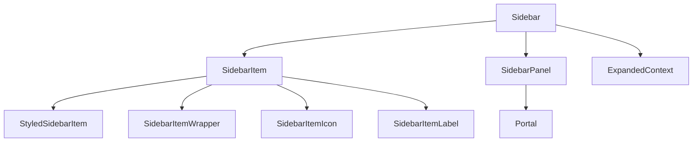

# Overview

The Sidebar is a component that provides navigation and access to various sections of the application. It is designed to be flexible and responsive, adapting to different screen sizes and user interactions.

# Sidebar Items

The <SwmToken path="static/app/components/sidebar/sidebarItem.tsx" pos="123:2:2" line-data="function SidebarItem({">`SidebarItem`</SwmToken> component represents individual items in the Sidebar, including icons, labels, and badges. These items are styled using various styled components such as <SwmToken path="static/app/components/sidebar/sidebarItem.tsx" pos="231:2:2" line-data="          &lt;StyledSidebarItem">`StyledSidebarItem`</SwmToken>, <SwmToken path="static/app/components/sidebar/sidebarItem.tsx" pos="252:2:2" line-data="            &lt;SidebarItemWrapper collapsed={isInCollapsedState} hasNewNav={hasNewNav}&gt;">`SidebarItemWrapper`</SwmToken>, <SwmToken path="static/app/components/sidebar/sidebarItem.tsx" pos="254:2:2" line-data="                &lt;SidebarItemIcon hasNewNav={hasNewNav}&gt;{icon}&lt;/SidebarItemIcon&gt;">`SidebarItemIcon`</SwmToken>, and <SwmToken path="static/app/components/sidebar/sidebarItem.tsx" pos="257:2:2" line-data="                &lt;SidebarItemLabel">`SidebarItemLabel`</SwmToken> to ensure consistent styling and behavior across different items.

<SwmSnippet path="/static/app/components/sidebar/sidebarItem.tsx" line="123">

---

The <SwmToken path="static/app/components/sidebar/sidebarItem.tsx" pos="123:2:2" line-data="function SidebarItem({">`SidebarItem`</SwmToken> function handles the rendering of icons, labels, badges, and other elements. It also manages the active state of the item based on the current router path.

```tsx
function SidebarItem({
  id,
  href,
  to,
  search,
  icon,
  label,
  badge,
  active,
  exact,
  hasPanel,
  isNew,
  isBeta,
  isAlpha,
  collapsed,
  className,
  orientation,
  isNewSeenKeySuffix,
  onClick,
  trailingItems,
  variant,
```

---

</SwmSnippet>

# Sidebar Panel

The <SwmToken path="static/app/components/sidebar/sidebarPanel.tsx" pos="63:2:2" line-data="function SidebarPanel({">`SidebarPanel`</SwmToken> component is used to display additional content or options related to a specific sidebar item. This panel can be shown or hidden based on user interactions and uses a portal to render its content outside the main DOM hierarchy, ensuring it appears above other elements.

<SwmSnippet path="/static/app/components/sidebar/sidebarPanel.tsx" line="63">

---

The <SwmToken path="static/app/components/sidebar/sidebarPanel.tsx" pos="63:2:2" line-data="function SidebarPanel({">`SidebarPanel`</SwmToken> function uses a portal to render its content outside the main DOM hierarchy, ensuring it appears above other elements.

```tsx
function SidebarPanel({
  orientation,
  collapsed,
  hidePanel,
  title,
  children,
  ...props
}: Props): React.ReactElement {
  const portalEl = useRef<HTMLDivElement>(getSidebarPortal());

  const panelCloseHandler = useCallback(
    (evt: MouseEvent) => {
      if (!(evt.target instanceof Element)) {
        return;
      }

      if (portalEl.current.contains(evt.target)) {
        return;
      }

      // If we are in Sandbox, don't hide panel when the modal is clicked (before the email is added)
```

---

</SwmSnippet>

# Context and Hooks

Hooks and context providers, such as <SwmToken path="static/app/components/sidebar/index.tsx" pos="121:11:11" line-data="  const {shouldAccordionFloat} = useContext(ExpandedContext);">`ExpandedContext`</SwmToken>, manage the state and behavior of the sidebar items and panels. These hooks and contexts ensure that the sidebar remains responsive and interactive.

<SwmSnippet path="/static/app/components/sidebar/index.tsx" line="116">

---

The <SwmToken path="static/app/components/sidebar/index.tsx" pos="116:2:2" line-data="function Sidebar() {">`Sidebar`</SwmToken> function is the main component that renders the sidebar. It uses various hooks and context providers to manage its state and behavior, including logic for handling the sidebar's collapsed state, orientation, and active panels.

```tsx
function Sidebar() {
  const location = useLocation();
  const preferences = useLegacyStore(PreferencesStore);
  const activePanel = useLegacyStore(SidebarPanelStore);
  const organization = useOrganization({allowNull: true});
  const {shouldAccordionFloat} = useContext(ExpandedContext);
  const hasNewNav = organization?.features.includes('navigation-sidebar-v2');
  const hasOrganization = !!organization;
  const isSelfHostedErrorsOnly = ConfigStore.get('isSelfHostedErrorsOnly');

  const collapsed = hasNewNav ? true : !!preferences.collapsed;
  const horizontal = useMedia(`(max-width: ${theme.breakpoints.medium})`);
  // Panel determines whether to highlight
  const hasPanel = !!activePanel;
  const orientation: SidebarOrientation = horizontal ? 'top' : 'left';

  const sidebarItemProps = {
    orientation,
    collapsed,
    hasPanel,
    organization,
```

---

</SwmSnippet>

&nbsp;

*This is an auto-generated document by Swimm AI 🌊 and has not yet been verified by a human*

<SwmMeta version="3.0.0" repo-id="Z2l0aHViJTNBJTNBc2VudHJ5LWRlbW8tMSUzQSUzQVN3aW1tLURlbW8=" repo-name="sentry-demo-1" doc-type="overview"><sup>Powered by [Swimm](/)</sup></SwmMeta>
