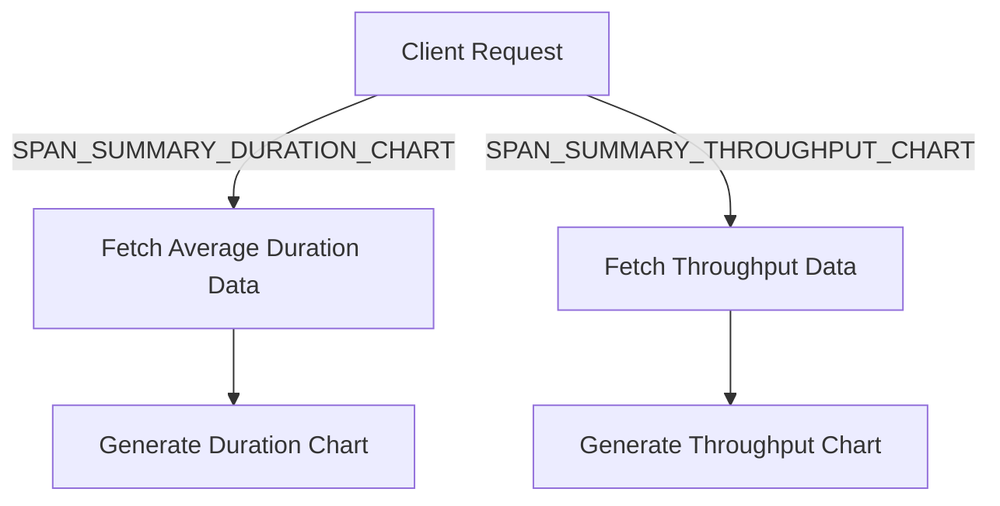

# Understanding Transaction Spans

Transaction spans represent individual units of work within a transaction. They break down the transaction into smaller, more manageable pieces, allowing for detailed performance analysis and identification of bottlenecks.

Transaction spans measure the duration and performance of specific operations within a transaction. This helps in identifying which parts of the transaction are taking the most time.

Transaction spans are displayed in the transaction summary to provide insights into the performance of different parts of the transaction. Metrics such as span duration and operation type are included.

Visual representations, such as charts and tables, are generated using transaction spans to help developers understand the performance characteristics of their applications.

## Transaction Spans in <SwmToken path="static/app/views/performance/transactionSummary/transactionSpans/spanDetails/spanDetailsTable.tsx" pos="97:6:6" line-data="        id=&quot;SpanDetails-SpanDetailsTable&quot;">`SpanDetailsTable`</SwmToken>

The <SwmToken path="static/app/views/performance/transactionSummary/transactionSpans/spanDetails/spanDetailsTable.tsx" pos="242:4:4" line-data="export function SpanDurationBar(props: SpanDurationBarProps) {">`SpanDurationBar`</SwmToken> component visualizes the duration of a span relative to the entire transaction duration. This helps in identifying which spans are taking the most time within a transaction.

<SwmSnippet path="/static/app/views/performance/transactionSummary/transactionSpans/spanDetails/spanDetailsTable.tsx" line="236">

---

The <SwmToken path="static/app/views/performance/transactionSummary/transactionSpans/spanDetails/spanDetailsTable.tsx" pos="242:4:4" line-data="export function SpanDurationBar(props: SpanDurationBarProps) {">`SpanDurationBar`</SwmToken> component calculates the width percentage of the span duration relative to the transaction duration and displays it with a tooltip showing the percentage and duration.

```tsx
type SpanDurationBarProps = {
  spanDuration: number;
  spanOp: string;
  transactionDuration: number;
};

export function SpanDurationBar(props: SpanDurationBarProps) {
  const {spanOp, spanDuration, transactionDuration} = props;
  const widthPercentage = spanDuration / transactionDuration;
  const position = widthPercentage < 0.7 ? 'right' : 'inset';

  return (
    <DurationBar>
      <div style={{width: toPercent(widthPercentage)}}>
        <Tooltip
          title={tct('[percentage] of the transaction ([duration])', {
            percentage: formatPercentage(widthPercentage),
            duration: formatTraceDuration(transactionDuration),
          })}
          containerDisplayMode="block"
        >
```

---

</SwmSnippet>

## Transaction Spans in <SwmToken path="static/app/views/performance/transactionSummary/transactionSpans/spanSummary/content.tsx" pos="79:2:2" line-data="          &lt;SpanSummaryContent">`SpanSummaryContent`</SwmToken>

The <SwmToken path="static/app/views/performance/transactionSummary/transactionSpans/spanSummary/content.tsx" pos="79:2:2" line-data="          &lt;SpanSummaryContent">`SpanSummaryContent`</SwmToken> component uses transaction spans to query and display metrics such as span description, sum of span durations, and count of spans. This provides a summary view of span performance.

<SwmSnippet path="/static/app/views/performance/transactionSummary/transactionSpans/spanSummary/content.tsx" line="105">

---

The <SwmToken path="static/app/views/performance/transactionSummary/transactionSpans/spanSummary/content.tsx" pos="79:2:2" line-data="          &lt;SpanSummaryContent">`SpanSummaryContent`</SwmToken> component queries span metrics and displays them, including span description, sum of span durations, and count of spans.

```tsx
    'span.group': groupId,
    'span.op': spanOp,
    transaction: transactionName,
  };

  const {data: spanHeaderData} = useSpanMetrics(
    {
      search: MutableSearch.fromQueryObject(filters),
      fields: ['span.description', 'sum(span.duration)', 'count()'],
      sorts: [{field: 'sum(span.duration)', kind: 'desc'}],
    },
    SpanSummaryReferrer.SPAN_SUMMARY_HEADER_DATA
  );

  // Average span duration must be queried for separately, since it could get broken up into multiple groups if used in the first query
  const {data: avgDurationData} = useSpanMetrics(
    {
      search: MutableSearch.fromQueryObject(filters),
      fields: ['avg(span.duration)'],
    },
    SpanSummaryReferrer.SPAN_SUMMARY_HEADER_DATA
```

---

</SwmSnippet>

## Transaction Spans in <SwmToken path="static/app/views/performance/transactionSummary/transactionSpans/suspectSpansTable.tsx" pos="33:6:6" line-data="export default function SuspectSpansTable(props: Props) {">`SuspectSpansTable`</SwmToken>

The <SwmToken path="static/app/views/performance/transactionSummary/transactionSpans/suspectSpansTable.tsx" pos="33:6:6" line-data="export default function SuspectSpansTable(props: Props) {">`SuspectSpansTable`</SwmToken> component maps suspect spans to a table format, displaying metrics like operation type, group, description, frequency, and exclusive times. This helps in identifying and analyzing spans that may be causing performance issues.

<SwmSnippet path="/static/app/views/performance/transactionSummary/transactionSpans/suspectSpansTable.tsx" line="34">

---

The <SwmToken path="static/app/views/performance/transactionSummary/transactionSpans/suspectSpansTable.tsx" pos="33:6:6" line-data="export default function SuspectSpansTable(props: Props) {">`SuspectSpansTable`</SwmToken> component processes suspect spans and displays them in a table format with relevant metrics.

```tsx
  const {
    location,
    organization,
    transactionName,
    isLoading,
    suspectSpans,
    totals,
    sort,
    project,
  } = props;

  const data: TableDataRowWithExtras[] = suspectSpans.map(suspectSpan => ({
    operation: suspectSpan.op,
    group: suspectSpan.group,
    description: suspectSpan.description,
    frequency:
      // Frequency is computed using the `uniq` function in ClickHouse.
      // Because it is an approximation, it can occasionally exceed the number of events.
      defined(suspectSpan.frequency) && defined(totals?.['count()'])
        ? Math.min(1, suspectSpan.frequency / totals!['count()'])
        : null,
```

---

</SwmSnippet>

## Main Functions

Several main functions related to transaction spans include <SwmToken path="static/app/views/performance/transactionSummary/transactionSpans/spanSummary/spanSummaryTable.tsx" pos="102:6:6" line-data="export default function SpanSummaryTable(props: Props) {">`SpanSummaryTable`</SwmToken>, <SwmToken path="static/app/views/performance/transactionSummary/transactionSpans/spanDetails/spanDetailsTable.tsx" pos="58:6:6" line-data="export default function SpanTable(props: Props) {">`SpanTable`</SwmToken>, <SwmToken path="static/app/views/performance/transactionSummary/transactionSpans/spanSummary/content.tsx" pos="79:2:2" line-data="          &lt;SpanSummaryContent">`SpanSummaryContent`</SwmToken>, and <SwmToken path="static/app/views/performance/transactionSummary/transactionSpans/spanDetails/spanDetailsTable.tsx" pos="242:4:4" line-data="export function SpanDurationBar(props: SpanDurationBarProps) {">`SpanDurationBar`</SwmToken>. We will dive into <SwmToken path="static/app/views/performance/transactionSummary/transactionSpans/spanSummary/spanSummaryTable.tsx" pos="102:6:6" line-data="export default function SpanSummaryTable(props: Props) {">`SpanSummaryTable`</SwmToken> and <SwmToken path="static/app/views/performance/transactionSummary/transactionSpans/spanDetails/spanDetailsTable.tsx" pos="58:6:6" line-data="export default function SpanTable(props: Props) {">`SpanTable`</SwmToken>.

## <SwmToken path="static/app/views/performance/transactionSummary/transactionSpans/spanSummary/spanSummaryTable.tsx" pos="102:6:6" line-data="export default function SpanSummaryTable(props: Props) {">`SpanSummaryTable`</SwmToken>

The <SwmToken path="static/app/views/performance/transactionSummary/transactionSpans/spanSummary/spanSummaryTable.tsx" pos="102:6:6" line-data="export default function SpanSummaryTable(props: Props) {">`SpanSummaryTable`</SwmToken> function displays a summary table of spans within a transaction. It fetches and processes span data, handles sorting and filtering, and renders the table with relevant span metrics such as span duration and transaction ID.

<SwmSnippet path="/static/app/views/performance/transactionSummary/transactionSpans/spanSummary/spanSummaryTable.tsx" line="102">

---

The <SwmToken path="static/app/views/performance/transactionSummary/transactionSpans/spanSummary/spanSummaryTable.tsx" pos="102:6:6" line-data="export default function SpanSummaryTable(props: Props) {">`SpanSummaryTable`</SwmToken> function processes span data and renders a summary table with relevant metrics.

```tsx
export default function SpanSummaryTable(props: Props) {
  const {project} = props;
  const organization = useOrganization();
  const supportedTags = useSpanFieldSupportedTags();
  const {spanSlug} = useParams();
  const navigate = useNavigate();
  const [spanOp, groupId] = spanSlug.split(':');

  const location = useLocation();
  const {transaction} = location.query;
  const spansCursor = decodeScalar(location.query?.[QueryParameterNames.SPANS_CURSOR]);
  const spansQuery = decodeScalar(location.query.spansQuery, '');

  const filters: SpanMetricsQueryFilters = {
    'span.group': groupId,
    'span.op': spanOp,
    transaction: transaction as string,
  };

  const sort = useSpanSummarySort();
```

---

</SwmSnippet>

## <SwmToken path="static/app/views/performance/transactionSummary/transactionSpans/spanDetails/spanDetailsTable.tsx" pos="58:6:6" line-data="export default function SpanTable(props: Props) {">`SpanTable`</SwmToken>

The <SwmToken path="static/app/views/performance/transactionSummary/transactionSpans/spanDetails/spanDetailsTable.tsx" pos="58:6:6" line-data="export default function SpanTable(props: Props) {">`SpanTable`</SwmToken> function displays detailed information about individual spans within a transaction. It processes span examples, filters and maps the data, and renders a table with span metrics such as span duration, occurrences, and cumulative duration.

<SwmSnippet path="/static/app/views/performance/transactionSummary/transactionSpans/spanDetails/spanDetailsTable.tsx" line="58">

---

The <SwmToken path="static/app/views/performance/transactionSummary/transactionSpans/spanDetails/spanDetailsTable.tsx" pos="58:6:6" line-data="export default function SpanTable(props: Props) {">`SpanTable`</SwmToken> function processes span examples and renders a table with detailed span metrics.

```tsx
export default function SpanTable(props: Props) {
  const {
    location,
    organization,
    project,
    examples,
    suspectSpan,
    isLoading,
    pageLinks,
    transactionName,
  } = props;

  if (!defined(examples)) {
    return null;
  }

  const data = examples
    // we assume that the span appears in each example at least once,
    // if this assumption is broken, nothing onwards will work so
    // filter out such examples
    .filter(example => example.spans.length > 0)
```

---

</SwmSnippet>

## Endpoints for Transaction Spans

Endpoints for transaction spans are used to fetch data for various span metrics. These endpoints are referenced in hooks that handle data fetching and state management for charts.

## <SwmToken path="static/app/views/performance/transactionSummary/transactionSpans/spanSummary/spanSummaryCharts.tsx" pos="68:3:3" line-data="    SpanSummaryReferrer.SPAN_SUMMARY_DURATION_CHART">`SPAN_SUMMARY_DURATION_CHART`</SwmToken>

The <SwmToken path="static/app/views/performance/transactionSummary/transactionSpans/spanSummary/spanSummaryCharts.tsx" pos="68:3:3" line-data="    SpanSummaryReferrer.SPAN_SUMMARY_DURATION_CHART">`SPAN_SUMMARY_DURATION_CHART`</SwmToken> endpoint fetches data for the average duration of spans. This data is used to generate a chart that visualizes the average duration of spans over time.

<SwmSnippet path="/static/app/views/performance/transactionSummary/transactionSpans/spanSummary/spanSummaryCharts.tsx" line="63">

---

The <SwmToken path="static/app/views/performance/transactionSummary/transactionSpans/spanSummary/spanSummaryCharts.tsx" pos="68:3:3" line-data="    SpanSummaryReferrer.SPAN_SUMMARY_DURATION_CHART">`SPAN_SUMMARY_DURATION_CHART`</SwmToken> endpoint is referenced in the <SwmToken path="static/app/views/performance/transactionSummary/transactionSpans/spanSummary/spanSummaryCharts.tsx" pos="63:5:5" line-data="  } = useSpanMetricsSeries(">`useSpanMetricsSeries`</SwmToken> hook to fetch average duration data for spans.

```tsx
  } = useSpanMetricsSeries(
    {
      search: MutableSearch.fromQueryObject(filters),
      yAxis: [`avg(${SpanMetricsField.SPAN_DURATION})`],
    },
    SpanSummaryReferrer.SPAN_SUMMARY_DURATION_CHART
  );
```

---

</SwmSnippet>

## <SwmToken path="static/app/views/performance/transactionSummary/transactionSpans/spanSummary/spanSummaryCharts.tsx" pos="56:3:3" line-data="    SpanSummaryReferrer.SPAN_SUMMARY_THROUGHPUT_CHART">`SPAN_SUMMARY_THROUGHPUT_CHART`</SwmToken>

The <SwmToken path="static/app/views/performance/transactionSummary/transactionSpans/spanSummary/spanSummaryCharts.tsx" pos="56:3:3" line-data="    SpanSummaryReferrer.SPAN_SUMMARY_THROUGHPUT_CHART">`SPAN_SUMMARY_THROUGHPUT_CHART`</SwmToken> endpoint fetches data for the throughput of spans. This data is used to generate a chart that visualizes the number of spans processed per minute.

<SwmSnippet path="/static/app/views/performance/transactionSummary/transactionSpans/spanSummary/spanSummaryCharts.tsx" line="47">

---

The <SwmToken path="static/app/views/performance/transactionSummary/transactionSpans/spanSummary/spanSummaryCharts.tsx" pos="56:3:3" line-data="    SpanSummaryReferrer.SPAN_SUMMARY_THROUGHPUT_CHART">`SPAN_SUMMARY_THROUGHPUT_CHART`</SwmToken> endpoint is referenced in the <SwmToken path="static/app/views/performance/transactionSummary/transactionSpans/spanSummary/spanSummaryCharts.tsx" pos="51:5:5" line-data="  } = useSpanMetricsSeries(">`useSpanMetricsSeries`</SwmToken> hook to fetch throughput data for spans.

```tsx
  const {
    isPending: isThroughputDataLoading,
    data: throughputData,
    error: throughputError,
  } = useSpanMetricsSeries(
    {
      search: MutableSearch.fromQueryObject(filters),
      yAxis: ['spm()'],
    },
    SpanSummaryReferrer.SPAN_SUMMARY_THROUGHPUT_CHART
  );
```

---

</SwmSnippet>

&nbsp;

*This is an auto-generated document by Swimm AI 🌊 and has not yet been verified by a human*

<SwmMeta version="3.0.0" repo-id="Z2l0aHViJTNBJTNBc2VudHJ5LWRlbW8tMSUzQSUzQVN3aW1tLURlbW8=" repo-name="sentry-demo-1" doc-type="overview"><sup>Powered by [Swimm](/)</sup></SwmMeta>
