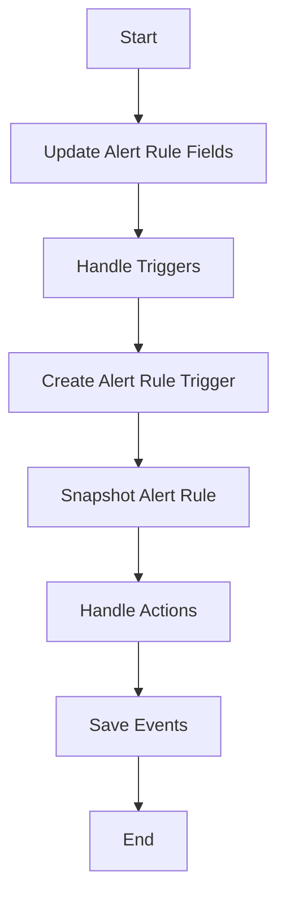

This document will cover the Update Process Overview, which includes:

1. Updating Alert Rule Fields
2. Handling Triggers
3. Creating Alert Rule Trigger
4. Snapshotting Alert Rule
5. Handling Actions
6. Saving Events

Technical document: <SwmLink doc-title="Update Process Overview">[Update Process Overview](/.swm/update-process-overview.aug9eeda.sw.md)</SwmLink>

# [Updating Alert Rule Fields](https://app.swimm.io/repos/Z2l0aHViJTNBJTNBc2VudHJ5LWRlbW8tMSUzQSUzQVN3aW1tLURlbW8=/docs/aug9eeda#updating-alert-rule-fields)

The update process begins with updating the alert rule fields based on the provided parameters. This involves modifying various fields such as name, description, sensitivity, seasonality, query, aggregate, time window, threshold type, resolve threshold, include all projects, dataset, query type, monitor type, event types, owner, comparison delta, and detection type. This ensures that the alert rule is updated with the latest configurations, providing accurate and relevant alerts to the end user.

# [Handling Triggers](https://app.swimm.io/repos/Z2l0aHViJTNBJTNBc2VudHJ5LWRlbW8tMSUzQSUzQVN3aW1tLURlbW8=/docs/aug9eeda#handling-triggers)

The next step involves managing the alert rule triggers. This process starts by deleting any triggers that are not present in the incoming data. Then, it iterates over the provided triggers, updating existing ones or creating new ones as necessary. If any validation errors occur, they are raised to be handled by the calling function. This ensures that the triggers associated with the alert rule are always up-to-date and accurate.

# [Creating Alert Rule Trigger](https://app.swimm.io/repos/Z2l0aHViJTNBJTNBc2VudHJ5LWRlbW8tMSUzQSUzQVN3aW1tLURlbW8=/docs/aug9eeda#creating-alert-rule-trigger)

In this step, the system creates an alert rule trigger. It extracts the actions from the validated data, creates the alert rule trigger using the provided parameters, and then handles the actions by calling the appropriate function. This step is crucial for ensuring that the alert rule trigger is correctly set up and ready to respond to the specified conditions.

# [Snapshotting Alert Rule](https://app.swimm.io/repos/Z2l0aHViJTNBJTNBc2VudHJ5LWRlbW8tMSUzQSUzQVN3aW1tLURlbW8=/docs/aug9eeda#snapshotting-alert-rule)

Snapshotting an alert rule involves creating an archived version of the alert rule and resolving any incidents attached to it. This process duplicates the alert rule and its associated triggers and actions, and updates the incidents to reference the new snapshot. This ensures that historical data is preserved when an alert rule is updated, allowing for accurate tracking and analysis of past alerts.

# [Handling Actions](https://app.swimm.io/repos/Z2l0aHViJTNBJTNBc2VudHJ5LWRlbW8tMSUzQSUzQVN3aW1tLURlbW8=/docs/aug9eeda#handling-actions)

The handling of actions associated with an alert rule trigger involves deleting actions that are not present in the updated data, updating existing actions, and creating new actions as needed. This step ensures that the actions tied to an alert rule trigger are correctly maintained and updated, providing accurate and timely responses to the specified conditions.

# [Saving Events](https://app.swimm.io/repos/Z2l0aHViJTNBJTNBc2VudHJ5LWRlbW8tMSUzQSUzQVN3aW1tLURlbW8=/docs/aug9eeda#saving-events)

The final step in the update process involves saving events. This includes normalizing and processing the event, saving related models such as releases and environments to the database, and writing the event into the event stream. Depending on the event type, the system delegates the saving process to either save transaction events or save error events. This ensures that all necessary data is persisted and that signals are emitted for further processing, providing accurate and comprehensive event tracking.

&nbsp;

*This is an auto-generated document by Swimm AI 🌊 and has not yet been verified by a human*

<SwmMeta version="3.0.0" repo-id="Z2l0aHViJTNBJTNBc2VudHJ5LWRlbW8tMSUzQSUzQVN3aW1tLURlbW8=" repo-name="sentry-demo-1" doc-type="product-flows">Powered by [Swimm](/)</SwmMeta>
