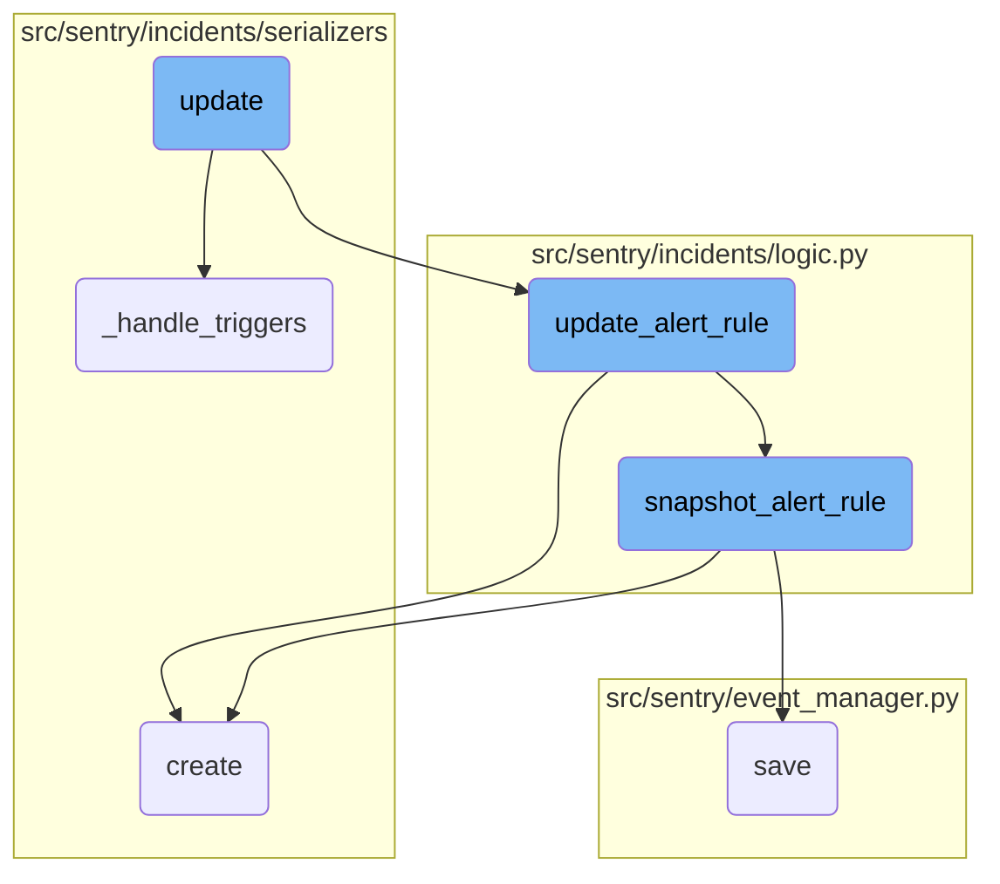
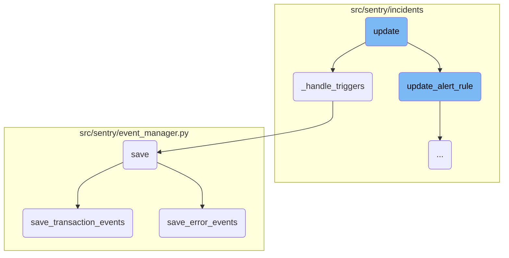
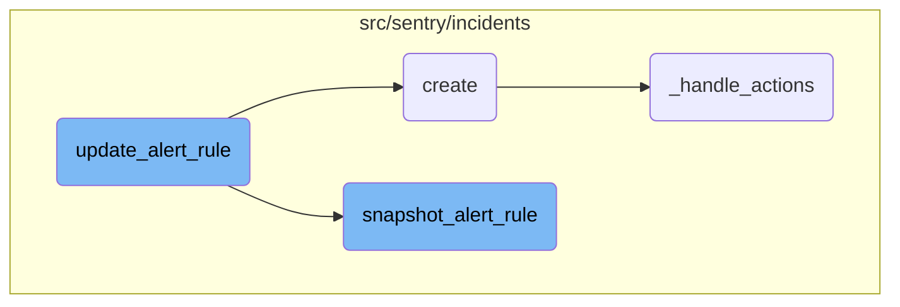

This document explains the update process within the Sentry application. It covers how alert rules are updated, how triggers and actions are managed, and how events are saved. The document provides a high-level overview of the flow and dives into specific functions responsible for handling these updates.

The update process starts with updating the alert rule fields based on the provided parameters. It then handles the triggers associated with the alert rule, updating existing ones or creating new ones as necessary. Next, it manages the actions tied to the alert rule triggers, ensuring they are correctly maintained. Finally, the process involves saving events, which includes normalizing and processing the event, saving related models, and writing the event into the event stream.

Here is a high level diagram of the flow, showing only the most important functions:



# Flow drill down

First, we'll zoom into this section of the flow:



<SwmSnippet path="/src/sentry/incidents/serializers/alert_rule.py" line="541">

---

## Handling Triggers

The <SwmToken path="src/sentry/incidents/serializers/alert_rule.py" pos="541:3:3" line-data="    def _handle_triggers(self, alert_rule, triggers):">`_handle_triggers`</SwmToken> function manages the alert rule triggers. It first deletes any triggers that are not present in the incoming data. Then, it iterates over the provided triggers, updating existing ones or creating new ones as necessary. If any validation errors occur, they are raised to be handled by the calling function.

```python
    def _handle_triggers(self, alert_rule, triggers):
        channel_lookup_timeout_error = None
        if triggers is not None:
            # Delete triggers we don't have present in the incoming data
            trigger_ids = [x["id"] for x in triggers if "id" in x]
            triggers_to_delete = AlertRuleTrigger.objects.filter(alert_rule=alert_rule).exclude(
                id__in=trigger_ids
            )
            for trigger in triggers_to_delete:
                delete_alert_rule_trigger(trigger)

            for trigger_data in triggers:
                if "id" in trigger_data:
                    trigger_instance = AlertRuleTrigger.objects.get(
                        alert_rule=alert_rule, id=trigger_data["id"]
                    )
                else:
                    trigger_instance = None

                trigger_serializer = AlertRuleTriggerSerializer(
                    context={
```

---

</SwmSnippet>

<SwmSnippet path="/src/sentry/event_manager.py" line="448">

---

## Saving Events

The <SwmToken path="src/sentry/event_manager.py" pos="448:3:3" line-data="    def save(">`save`</SwmToken> function is responsible for normalizing and processing an event, saving adjacent models such as releases and environments to the database, and writing the event into the event stream. Depending on the event type, it delegates the saving process to either <SwmToken path="src/sentry/event_manager.py" pos="3040:2:2" line-data="def save_transaction_events(jobs: Sequence[Job], projects: ProjectsMapping) -&gt; Sequence[Job]:">`save_transaction_events`</SwmToken> or <SwmToken path="src/sentry/event_manager.py" pos="544:3:3" line-data="    def save_error_events(">`save_error_events`</SwmToken>.

```python
    def save(
        self,
        project_id: int | None,
        raw: bool = False,
        assume_normalized: bool = False,
        start_time: float | None = None,
        cache_key: str | None = None,
        skip_send_first_transaction: bool = False,
        has_attachments: bool = False,
    ) -> Event:
        """
        After normalizing and processing an event, save adjacent models such as
        releases and environments to postgres and write the event into
        eventstream. From there it will be picked up by Snuba and
        post-processing.

        We re-insert events with duplicate IDs into Snuba, which is responsible
        for deduplicating events. Since deduplication in Snuba is on the primary
        key (based on event ID, project ID and day), events with same IDs are only
        deduplicated if their timestamps fall on the same day. The latest event
        always wins and overwrites the value of events received earlier in that day.
```

---

</SwmSnippet>

<SwmSnippet path="/src/sentry/event_manager.py" line="3040">

---

### Saving Transaction Events

The <SwmToken path="src/sentry/event_manager.py" pos="3040:2:2" line-data="def save_transaction_events(jobs: Sequence[Job], projects: ProjectsMapping) -&gt; Sequence[Job]:">`save_transaction_events`</SwmToken> function handles the saving of transaction events. It performs various operations such as setting cached field values, creating releases, deriving tags, and inserting the events into the event stream.

```python
def save_transaction_events(jobs: Sequence[Job], projects: ProjectsMapping) -> Sequence[Job]:
    organization_ids = {project.organization_id for project in projects.values()}
    organizations = {o.id: o for o in Organization.objects.get_many_from_cache(organization_ids)}

    for project in projects.values():
        try:
            project.set_cached_field_value("organization", organizations[project.organization_id])
        except KeyError:
            continue

    set_measurement(measurement_name="jobs", value=len(jobs))
    set_measurement(measurement_name="projects", value=len(projects))

    _get_or_create_release_many(jobs, projects)
    _get_event_user_many(jobs, projects)
    _derive_plugin_tags_many(jobs, projects)
    _derive_interface_tags_many(jobs)
    _calculate_span_grouping(jobs, projects)
    _materialize_metadata_many(jobs)
    _get_or_create_environment_many(jobs, projects)
    _get_or_create_release_associated_models(jobs, projects)
```

---

</SwmSnippet>

<SwmSnippet path="/src/sentry/event_manager.py" line="544">

---

### Saving Error Events

The <SwmToken path="src/sentry/event_manager.py" pos="544:3:3" line-data="    def save_error_events(">`save_error_events`</SwmToken> function manages the saving of error events. It includes steps for assigning events to groups, creating environments, recording metrics, and saving attachments. This function ensures that all necessary data is persisted and that signals are emitted for further processing.

```python
    def save_error_events(
        self,
        project: Project,
        job: Job,
        projects: ProjectsMapping,
        metric_tags: MutableTags,
        raw: bool = False,
        cache_key: str | None = None,
        has_attachments: bool = False,
    ) -> Event:
        jobs = [job]

        if is_sample_event(job):
            logger.info(
                "save_error_events: processing sample event",
                extra={
                    "event.id": job["event"].event_id,
                    "project_id": project.id,
                    "sample_event": True,
                },
            )
```

---

</SwmSnippet>

Now, lets zoom into this section of the flow:



<SwmSnippet path="/src/sentry/incidents/logic.py" line="804">

---

## Updating Alert Rule Fields

The function <SwmToken path="src/sentry/incidents/serializers/alert_rule.py" pos="30:1:1" line-data="    update_alert_rule,">`update_alert_rule`</SwmToken> updates various fields of an alert rule based on the provided parameters. It modifies fields such as <SwmToken path="src/sentry/incidents/logic.py" pos="806:3:3" line-data="    if name:">`name`</SwmToken>, <SwmToken path="src/sentry/incidents/logic.py" pos="808:3:3" line-data="    if description:">`description`</SwmToken>, <SwmToken path="src/sentry/incidents/logic.py" pos="810:3:3" line-data="    if sensitivity is not NOT_SET:">`sensitivity`</SwmToken>, <SwmToken path="src/sentry/incidents/logic.py" pos="812:3:3" line-data="    if seasonality is not NOT_SET:">`seasonality`</SwmToken>, <SwmToken path="src/sentry/incidents/logic.py" pos="814:3:3" line-data="    if query is not None:">`query`</SwmToken>, <SwmToken path="src/sentry/incidents/logic.py" pos="816:3:3" line-data="    if aggregate is not None:">`aggregate`</SwmToken>, <SwmToken path="src/sentry/incidents/logic.py" pos="818:3:3" line-data="    if time_window:">`time_window`</SwmToken>, <SwmToken path="src/sentry/incidents/logic.py" pos="820:3:3" line-data="    if threshold_type:">`threshold_type`</SwmToken>, <SwmToken path="src/sentry/incidents/logic.py" pos="822:3:3" line-data="    if resolve_threshold is not NOT_SET:">`resolve_threshold`</SwmToken>, <SwmToken path="src/sentry/incidents/serializers/alert_rule.py" pos="121:2:2" line-data="            &quot;include_all_projects&quot;,">`include_all_projects`</SwmToken>, <SwmToken path="src/sentry/incidents/serializers/alert_rule.py" pos="40:6:6" line-data="from sentry.snuba.dataset import Dataset">`dataset`</SwmToken>, <SwmToken path="src/sentry/incidents/serializers/alert_rule.py" pos="78:1:1" line-data="    query_type = serializers.IntegerField(required=False)">`query_type`</SwmToken>, <SwmToken path="src/sentry/incidents/serializers/alert_rule.py" pos="97:1:1" line-data="    monitor_type = serializers.IntegerField(required=False, min_value=0)">`monitor_type`</SwmToken>, <SwmToken path="src/sentry/incidents/serializers/alert_rule.py" pos="80:1:1" line-data="    event_types = serializers.ListField(child=serializers.CharField(), required=False)">`event_types`</SwmToken>, <SwmToken path="src/sentry/incidents/serializers/alert_rule.py" pos="95:1:1" line-data="    owner = ActorField(required=False, allow_null=True)">`owner`</SwmToken>, <SwmToken path="src/sentry/incidents/serializers/alert_rule.py" pos="86:1:1" line-data="    comparison_delta = serializers.IntegerField(">`comparison_delta`</SwmToken>, and <SwmToken path="src/sentry/incidents/serializers/alert_rule.py" pos="103:1:1" line-data="    detection_type = serializers.CharField(required=False, default=AlertRuleDetectionType.STATIC)">`detection_type`</SwmToken>. This ensures that the alert rule is updated with the latest configurations.

```python
    updated_fields: dict[str, Any] = {"date_modified": django_timezone.now()}
    updated_query_fields = {}
    if name:
        updated_fields["name"] = name
    if description:
        updated_fields["description"] = description
    if sensitivity is not NOT_SET:
        updated_fields["sensitivity"] = sensitivity
    if seasonality is not NOT_SET:
        updated_fields["seasonality"] = seasonality
    if query is not None:
        updated_query_fields["query"] = query
    if aggregate is not None:
        updated_query_fields["aggregate"] = aggregate
    if time_window:
        updated_query_fields["time_window"] = timedelta(minutes=time_window)
    if threshold_type:
        updated_fields["threshold_type"] = threshold_type.value
    if resolve_threshold is not NOT_SET:
        updated_fields["resolve_threshold"] = resolve_threshold
    if threshold_period:
```

---

</SwmSnippet>

<SwmSnippet path="/src/sentry/incidents/serializers/alert_rule_trigger.py" line="40">

---

## Creating Alert Rule Trigger

The <SwmToken path="src/sentry/incidents/serializers/alert_rule_trigger.py" pos="40:3:3" line-data="    def create(self, validated_data):">`create`</SwmToken> function in <SwmPath>[src/sentry/incidents/serializers/alert_rule_trigger.py](src/sentry/incidents/serializers/alert_rule_trigger.py)</SwmPath> is responsible for creating an alert rule trigger. It extracts the <SwmToken path="src/sentry/incidents/serializers/alert_rule_trigger.py" pos="42:1:1" line-data="            actions = validated_data.pop(&quot;actions&quot;, None)">`actions`</SwmToken> from the validated data, creates the alert rule trigger using <SwmToken path="src/sentry/incidents/serializers/alert_rule_trigger.py" pos="43:5:5" line-data="            alert_rule_trigger = create_alert_rule_trigger(">`create_alert_rule_trigger`</SwmToken>, and then handles the actions by calling <SwmToken path="src/sentry/incidents/serializers/alert_rule_trigger.py" pos="46:3:3" line-data="            self._handle_actions(alert_rule_trigger, actions)">`_handle_actions`</SwmToken>.

```python
    def create(self, validated_data):
        try:
            actions = validated_data.pop("actions", None)
            alert_rule_trigger = create_alert_rule_trigger(
                alert_rule=self.context["alert_rule"], **validated_data
            )
            self._handle_actions(alert_rule_trigger, actions)

            return alert_rule_trigger
```

---

</SwmSnippet>

<SwmSnippet path="/src/sentry/incidents/logic.py" line="705">

---

## Snapshotting Alert Rule

The <SwmToken path="src/sentry/incidents/logic.py" pos="705:2:2" line-data="def snapshot_alert_rule(alert_rule, user=None):">`snapshot_alert_rule`</SwmToken> function creates an archived version of the alert rule and resolves any incidents attached to it. It duplicates the alert rule and its associated triggers and actions, and updates the incidents to reference the new snapshot. This ensures that historical data is preserved when an alert rule is updated.

```python
def snapshot_alert_rule(alert_rule, user=None):
    # Creates an archived alert_rule using the same properties as the passed rule
    # It will also resolve any incidents attached to this rule.
    with transaction.atomic(router.db_for_write(AlertRuleActivity)):
        triggers = AlertRuleTrigger.objects.filter(alert_rule=alert_rule)
        incidents = Incident.objects.filter(alert_rule=alert_rule)
        snuba_query_snapshot = deepcopy(alert_rule.snuba_query)
        snuba_query_snapshot.id = None
        snuba_query_snapshot.save()
        alert_rule_snapshot = deepcopy(alert_rule)
        alert_rule_snapshot.id = None
        alert_rule_snapshot.status = AlertRuleStatus.SNAPSHOT.value
        alert_rule_snapshot.snuba_query = snuba_query_snapshot
        if alert_rule.user_id or alert_rule.team_id:
            alert_rule_snapshot.user_id = alert_rule.user_id
            alert_rule_snapshot.team_id = alert_rule.team_id
        alert_rule_snapshot.save()
        AlertRuleActivity.objects.create(
            alert_rule=alert_rule_snapshot,
            previous_alert_rule=alert_rule,
            user_id=user.id if user else None,
```

---

</SwmSnippet>

<SwmSnippet path="/src/sentry/incidents/serializers/alert_rule_trigger.py" line="69">

---

### Handling Actions

The <SwmToken path="src/sentry/incidents/serializers/alert_rule_trigger.py" pos="69:3:3" line-data="    def _handle_actions(self, alert_rule_trigger, actions):">`_handle_actions`</SwmToken> function manages the actions associated with an alert rule trigger. It deletes actions that are not present in the updated data, updates existing actions, and creates new actions as needed. This function ensures that the actions tied to an alert rule trigger are correctly maintained and updated.

```python
    def _handle_actions(self, alert_rule_trigger, actions):
        channel_lookup_timeout_error = None
        if actions is not None:
            # Delete actions we don't have present in the updated data.
            action_ids = [x["id"] for x in actions if "id" in x]
            actions_to_delete = AlertRuleTriggerAction.objects.filter(
                alert_rule_trigger=alert_rule_trigger
            ).exclude(id__in=action_ids)
            for action in actions_to_delete:
                delete_alert_rule_trigger_action(action)

            for action_data in actions:
                action_data = rewrite_trigger_action_fields(action_data)
                if "id" in action_data:
                    action_instance = AlertRuleTriggerAction.objects.get(
                        alert_rule_trigger=alert_rule_trigger, id=action_data["id"]
                    )
                else:
                    action_instance = None

                action_serializer = AlertRuleTriggerActionSerializer(
```

---

</SwmSnippet>

&nbsp;

*This is an auto-generated document by Swimm AI 🌊 and has not yet been verified by a human*

<SwmMeta version="3.0.0" repo-id="Z2l0aHViJTNBJTNBc2VudHJ5LWRlbW8tMSUzQSUzQVN3aW1tLURlbW8=" repo-name="sentry-demo-1" doc-type="flows"><sup>Powered by [Swimm](/)</sup></SwmMeta>
