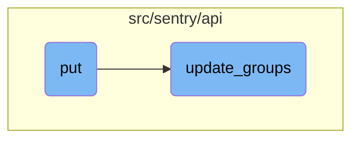

This document explains how the <SwmToken path="src/sentry/api/endpoints/group_details.py" pos="63:2:2" line-data="        &quot;PUT&quot;: ApiPublishStatus.UNKNOWN,">`PUT`</SwmToken> function is used to update an issue's attributes. It describes the steps involved in retrieving data from the request, applying updates, and returning the updated information.

The flow starts with the <SwmToken path="src/sentry/api/endpoints/group_details.py" pos="63:2:2" line-data="        &quot;PUT&quot;: ApiPublishStatus.UNKNOWN,">`PUT`</SwmToken> function, which retrieves the necessary data from the request. It then calls the <SwmToken path="src/sentry/api/endpoints/group_details.py" pos="352:5:5" line-data="            response = update_groups(">`update_groups`</SwmToken> function to apply the updates to the issue. After the updates are applied, the function serializes the updated group and returns a response. If the action is to discard, or if the response status code is not 200, the function returns the response from <SwmToken path="src/sentry/api/endpoints/group_details.py" pos="352:5:5" line-data="            response = update_groups(">`update_groups`</SwmToken>.

# Flow drill down



<SwmSnippet path="/src/sentry/api/endpoints/group_details.py" line="348">

---

## Updating an Issue

The <SwmToken path="src/sentry/api/endpoints/group_details.py" pos="63:2:2" line-data="        &quot;PUT&quot;: ApiPublishStatus.UNKNOWN,">`PUT`</SwmToken> function updates an individual issue's attributes. It retrieves the necessary data from the request, calls the <SwmToken path="src/sentry/api/endpoints/group_details.py" pos="352:5:5" line-data="            response = update_groups(">`update_groups`</SwmToken> function to apply the updates, and then serializes the updated group to return a response.

```python
        try:
            discard = request.data.get("discard")
            project = group.project
            search_fn = functools.partial(prep_search, self, request, project)
            response = update_groups(
                request, [group.id], [project], project.organization_id, search_fn
            )
            # if action was discard, there isn't a group to serialize anymore
            # if response isn't 200, return the response update_groups gave us (i.e. helpful error)
            # instead of serializing the updated group
            if discard or response.status_code != 200:
                return response

            # we need to fetch the object against as the bulk mutation endpoint
            # only returns a delta, and object mutation returns a complete updated
            # entity.
            # TODO(dcramer): we should update the API and have this be an explicit
            # flag (or remove it entirely) so that delta's are the primary response
            # for mutation.
            group = Group.objects.get(id=group.id)

```

---

</SwmSnippet>

<SwmSnippet path="/src/sentry/api/helpers/group_index/update.py" line="166">

---

## Applying Group Updates

The <SwmToken path="src/sentry/api/helpers/group_index/update.py" pos="166:2:2" line-data="def update_groups(">`update_groups`</SwmToken> function handles the bulk of the logic for updating group attributes. It validates the input data, filters the groups to be updated, and applies the necessary changes based on the provided data.

```python
def update_groups(
    request: Request,
    group_ids: Sequence[int | str] | None,
    projects: Sequence[Project],
    organization_id: int,
    search_fn: SearchFunction | None,
    user: User | None = None,
    data: Mapping[str, Any] | None = None,
) -> Response:
    # If `user` and `data` are passed as parameters then they should override
    # the values in `request`.
    user = user or request.user
    data = data or request.data

    if group_ids:
        group_list = Group.objects.filter(
            project__organization_id=organization_id, project__in=projects, id__in=group_ids
        )
        # filter down group ids to only valid matches
        group_ids = [g.id for g in group_list]
        if not group_ids:
```

---

</SwmSnippet>

&nbsp;

*This is an auto-generated document by Swimm AI 🌊 and has not yet been verified by a human*

<SwmMeta version="3.0.0" repo-id="Z2l0aHViJTNBJTNBc2VudHJ5LWRlbW8tMSUzQSUzQVN3aW1tLURlbW8=" repo-name="sentry-demo-1" doc-type="flows"><sup>Powered by [Swimm](/)</sup></SwmMeta>
