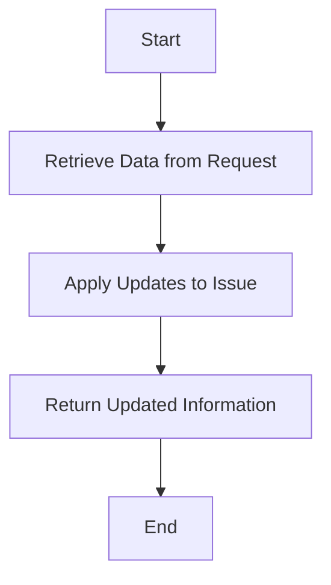

This document will cover the process of updating an issue, which includes:

1. Retrieving data from the request
2. Applying updates to the issue
3. Returning the updated information.

Technical document: <SwmLink doc-title="Updating an Issue">[Updating an Issue](/.swm/updating-an-issue.b7upif8h.sw.md)</SwmLink>

# [Retrieving Data from the Request](https://app.swimm.io/repos/Z2l0aHViJTNBJTNBc2VudHJ5LWRlbW8tMSUzQSUzQVN3aW1tLURlbW8=/docs/b7upif8h#updating-an-issue)

The process begins by retrieving the necessary data from the request. This includes checking if the action is to discard the issue and identifying the project associated with the issue. The data retrieved will be used to determine the specific updates that need to be applied to the issue.

# [Applying Updates to the Issue](https://app.swimm.io/repos/Z2l0aHViJTNBJTNBc2VudHJ5LWRlbW8tMSUzQSUzQVN3aW1tLURlbW8=/docs/b7upif8h#applying-group-updates)

Once the data is retrieved, the next step is to apply the updates to the issue. This involves validating the input data and filtering the groups to be updated. The updates are then applied based on the provided data. If the action is to discard the issue, the issue will be removed. Otherwise, the necessary changes are made to the issue's attributes.

# [Returning the Updated Information](https://app.swimm.io/repos/Z2l0aHViJTNBJTNBc2VudHJ5LWRlbW8tMSUzQSUzQVN3aW1tLURlbW8=/docs/b7upif8h#updating-an-issue)

After the updates are applied, the updated issue is serialized and a response is returned. If the action was to discard the issue or if the response status code is not 200, the response from the update process is returned. This ensures that the user receives the most accurate and up-to-date information about the issue.

&nbsp;

*This is an auto-generated document by Swimm AI 🌊 and has not yet been verified by a human*

<SwmMeta version="3.0.0" repo-id="Z2l0aHViJTNBJTNBc2VudHJ5LWRlbW8tMSUzQSUzQVN3aW1tLURlbW8=" repo-name="sentry-demo-1" doc-type="product-flows">Powered by [Swimm](/)</SwmMeta>
