In this document, we will explain the process of updating and creating widgets. This process involves identifying existing widgets, updating them if necessary, and creating new widgets if they do not already exist.

The flow starts by identifying which widgets need to be updated or created. Existing widgets are updated with new data, while new widgets are created from scratch. The process ensures that all widgets are up-to-date and correctly ordered.

# Flow drill down

```mermaid
graph TD;
      subgraph src/sentry/api/serializers/rest_framework/dashboard.py
26182bf2067521355a22b294c4bfbc6ce61733b69de325a6ff0cbcfff1e25ad7(update_widgets):::mainFlowStyle --> 64a0c624f26e997ce6a18edf6991c70bf05e1958093c33ac526e776ce0ad9400(create_widget)
end

subgraph src/sentry/api/serializers/rest_framework/dashboard.py
26182bf2067521355a22b294c4bfbc6ce61733b69de325a6ff0cbcfff1e25ad7(update_widgets):::mainFlowStyle --> 7ba18986748f61b064ace4c6b31de7ff23bb069216a91da13ab6ce5f64279f67(update_widget):::mainFlowStyle
end

subgraph src/sentry/api/serializers/rest_framework/dashboard.py
7ba18986748f61b064ace4c6b31de7ff23bb069216a91da13ab6ce5f64279f67(update_widget):::mainFlowStyle --> b63f820c96c22b450c3bf9d9324e5bea901d8079c04dc8fc4b04d206f3229994(update_widget_queries):::mainFlowStyle
end

subgraph src/sentry/api/serializers/rest_framework/dashboard.py
64a0c624f26e997ce6a18edf6991c70bf05e1958093c33ac526e776ce0ad9400(create_widget) --> d2a15f48f69c320586e12dd935cb17c385d465939cd8ed95f1f04de10d9bea3d(create)
end

subgraph src/sentry/api/serializers/rest_framework/dashboard.py
b63f820c96c22b450c3bf9d9324e5bea901d8079c04dc8fc4b04d206f3229994(update_widget_queries):::mainFlowStyle --> d2d51e7814d9cff7bfc052199b3cf4290c035e22341baba3300ef9436d8c67bc(_check_query_cardinality):::mainFlowStyle
end


      classDef mainFlowStyle color:#000000,fill:#7CB9F4
classDef rootsStyle color:#000000,fill:#00FFF4
classDef Style1 color:#000000,fill:#00FFAA
classDef Style2 color:#000000,fill:#FFFF00
classDef Style3 color:#000000,fill:#AA7CB9

%% Swimm:
%% graph TD;
%%       subgraph <SwmPath>[src/sentry/api/serializers/rest_framework/dashboard.py](src/sentry/api/serializers/rest_framework/dashboard.py)</SwmPath>
%% 26182bf2067521355a22b294c4bfbc6ce61733b69de325a6ff0cbcfff1e25ad7(update_widgets):::mainFlowStyle --> 64a0c624f26e997ce6a18edf6991c70bf05e1958093c33ac526e776ce0ad9400(create_widget)
%% end
%% 
%% subgraph <SwmPath>[src/sentry/api/serializers/rest_framework/dashboard.py](src/sentry/api/serializers/rest_framework/dashboard.py)</SwmPath>
%% 26182bf2067521355a22b294c4bfbc6ce61733b69de325a6ff0cbcfff1e25ad7(update_widgets):::mainFlowStyle --> 7ba18986748f61b064ace4c6b31de7ff23bb069216a91da13ab6ce5f64279f67(update_widget):::mainFlowStyle
%% end
%% 
%% subgraph <SwmPath>[src/sentry/api/serializers/rest_framework/dashboard.py](src/sentry/api/serializers/rest_framework/dashboard.py)</SwmPath>
%% 7ba18986748f61b064ace4c6b31de7ff23bb069216a91da13ab6ce5f64279f67(update_widget):::mainFlowStyle --> b63f820c96c22b450c3bf9d9324e5bea901d8079c04dc8fc4b04d206f3229994(update_widget_queries):::mainFlowStyle
%% end
%% 
%% subgraph <SwmPath>[src/sentry/api/serializers/rest_framework/dashboard.py](src/sentry/api/serializers/rest_framework/dashboard.py)</SwmPath>
%% 64a0c624f26e997ce6a18edf6991c70bf05e1958093c33ac526e776ce0ad9400(create_widget) --> d2a15f48f69c320586e12dd935cb17c385d465939cd8ed95f1f04de10d9bea3d(create)
%% end
%% 
%% subgraph <SwmPath>[src/sentry/api/serializers/rest_framework/dashboard.py](src/sentry/api/serializers/rest_framework/dashboard.py)</SwmPath>
%% b63f820c96c22b450c3bf9d9324e5bea901d8079c04dc8fc4b04d206f3229994(update_widget_queries):::mainFlowStyle --> d2d51e7814d9cff7bfc052199b3cf4290c035e22341baba3300ef9436d8c67bc(_check_query_cardinality):::mainFlowStyle
%% end
%% 
%% 
%%       classDef mainFlowStyle color:#000000,fill:#7CB9F4
%% classDef rootsStyle color:#000000,fill:#00FFF4
%% classDef Style1 color:#000000,fill:#00FFAA
%% classDef Style2 color:#000000,fill:#FFFF00
%% classDef Style3 color:#000000,fill:#AA7CB9
```



<SwmSnippet path="/src/sentry/api/serializers/rest_framework/dashboard.py" line="589">

---

## Updating and creating widgets

The <SwmToken path="src/sentry/api/serializers/rest_framework/dashboard.py" pos="589:3:3" line-data="    def update_widgets(self, instance, widget_data):">`update_widgets`</SwmToken> function is responsible for updating existing widgets and creating new ones if they do not already exist. It first identifies the widgets that need to be updated or created by checking their <SwmToken path="src/sentry/api/serializers/rest_framework/dashboard.py" pos="570:7:7" line-data="        - Widgets without ids will be created.">`ids`</SwmToken>. Existing widgets are updated using the <SwmToken path="src/sentry/api/serializers/rest_framework/dashboard.py" pos="605:3:3" line-data="                self.update_widget(existing_map[widget_id], data, next_order + i)">`update_widget`</SwmToken> function, while new widgets are created using the <SwmToken path="src/sentry/api/serializers/rest_framework/dashboard.py" pos="608:3:3" line-data="                self.create_widget(instance, data, next_order + i)">`create_widget`</SwmToken> function.

```python
    def update_widgets(self, instance, widget_data):
        widget_ids = [widget["id"] for widget in widget_data if "id" in widget]

        existing_widgets = DashboardWidget.objects.filter(dashboard=instance, id__in=widget_ids)
        existing_map = {widget.id: widget for widget in existing_widgets}

        # Remove widgets that are not in the current request.
        self.remove_missing_widgets(instance.id, widget_ids)

        # Get new ordering start point to avoid constraint errors
        next_order = get_next_dashboard_order(instance.id)

        for i, data in enumerate(widget_data):
            widget_id = data.get("id")
            if widget_id and widget_id in existing_map:
                # Update existing widget.
                self.update_widget(existing_map[widget_id], data, next_order + i)
            elif not widget_id:
                # Create a new widget.
                self.create_widget(instance, data, next_order + i)
            else:
```

---

</SwmSnippet>

<SwmSnippet path="/src/sentry/api/serializers/rest_framework/dashboard.py" line="620">

---

### Creating a new widget

The <SwmToken path="src/sentry/api/serializers/rest_framework/dashboard.py" pos="620:3:3" line-data="    def create_widget(self, dashboard, widget_data, order):">`create_widget`</SwmToken> function handles the creation of a new widget. It initializes a new <SwmToken path="src/sentry/api/serializers/rest_framework/dashboard.py" pos="621:5:5" line-data="        widget = DashboardWidget.objects.create(">`DashboardWidget`</SwmToken> object with the provided data and creates associated queries. If the widget type is <SwmToken path="src/sentry/api/serializers/rest_framework/dashboard.py" pos="628:14:14" line-data="            widget_type=widget_data.get(&quot;widget_type&quot;, DashboardWidgetTypes.DISCOVER),">`DISCOVER`</SwmToken>, it also checks the query cardinality using the <SwmToken path="src/sentry/api/serializers/rest_framework/dashboard.py" pos="657:3:3" line-data="    def _check_query_cardinality(self, new_queries: Sequence[DashboardWidgetQuery]):">`_check_query_cardinality`</SwmToken> function.

```python
    def create_widget(self, dashboard, widget_data, order):
        widget = DashboardWidget.objects.create(
            dashboard=dashboard,
            display_type=widget_data["display_type"],
            title=widget_data["title"],
            description=widget_data.get("description", None),
            thresholds=widget_data.get("thresholds", None),
            interval=widget_data.get("interval", "5m"),
            widget_type=widget_data.get("widget_type", DashboardWidgetTypes.DISCOVER),
            discover_widget_split=widget_data.get("discover_widget_split", None),
            order=order,
            limit=widget_data.get("limit", None),
            detail={"layout": widget_data.get("layout")},
        )

        new_queries = []
        for i, query in enumerate(widget_data.pop("queries")):
            new_queries.append(
                DashboardWidgetQuery(
                    widget=widget,
                    fields=query["fields"],
```

---

</SwmSnippet>

<SwmSnippet path="/src/sentry/api/serializers/rest_framework/dashboard.py" line="677">

---

### Updating an existing widget

The <SwmToken path="src/sentry/api/serializers/rest_framework/dashboard.py" pos="677:3:3" line-data="    def update_widget(self, widget, data, order):">`update_widget`</SwmToken> function updates the properties of an existing widget based on the provided data. It also updates the widget's queries if they are included in the data by calling the <SwmToken path="src/sentry/api/serializers/rest_framework/dashboard.py" pos="694:3:3" line-data="            self.update_widget_queries(widget, data[&quot;queries&quot;])">`update_widget_queries`</SwmToken> function.

```python
    def update_widget(self, widget, data, order):
        prev_layout = widget.detail.get("layout") if widget.detail else None
        widget.title = data.get("title", widget.title)
        widget.description = data.get("description", widget.description)
        widget.thresholds = data.get("thresholds", widget.thresholds)
        widget.display_type = data.get("display_type", widget.display_type)
        widget.interval = data.get("interval", widget.interval)
        widget.widget_type = data.get("widget_type", widget.widget_type)
        widget.discover_widget_split = data.get(
            "discover_widget_split", widget.discover_widget_split
        )
        widget.order = order
        widget.limit = data.get("limit", widget.limit)
        widget.detail = {"layout": data.get("layout", prev_layout)}
        widget.save()

        if "queries" in data:
            self.update_widget_queries(widget, data["queries"])
```

---

</SwmSnippet>

<SwmSnippet path="/src/sentry/api/serializers/rest_framework/dashboard.py" line="696">

---

### Updating widget queries

The <SwmToken path="src/sentry/api/serializers/rest_framework/dashboard.py" pos="696:3:3" line-data="    def update_widget_queries(self, widget, data):">`update_widget_queries`</SwmToken> function updates the queries associated with a widget. It removes any queries that are no longer needed, updates existing queries, and creates new ones as necessary. It also checks the query cardinality for <SwmToken path="src/sentry/api/serializers/rest_framework/dashboard.py" pos="628:14:14" line-data="            widget_type=widget_data.get(&quot;widget_type&quot;, DashboardWidgetTypes.DISCOVER),">`DISCOVER`</SwmToken> widgets.

```python
    def update_widget_queries(self, widget, data):
        query_ids = [query["id"] for query in data if "id" in query]
        self.remove_missing_queries(widget.id, query_ids)

        existing = DashboardWidgetQuery.objects.filter(widget=widget, id__in=query_ids)
        existing_map = {query.id: query for query in existing}

        # Get new ordering start point to avoid constraint errors
        next_order = get_next_query_order(widget.id)

        new_queries = []
        update_queries = []
        for i, query_data in enumerate(data):
            query_id = query_data.get("id")
            if query_id and query_id in existing_map:
                update_queries.append(
                    self.update_widget_query(existing_map[query_id], query_data, next_order + i)
                )
            elif not query_id:
                new_queries.append(
                    DashboardWidgetQuery(
```

---

</SwmSnippet>

<SwmSnippet path="/src/sentry/api/serializers/rest_framework/dashboard.py" line="657">

---

### Checking query cardinality

The <SwmToken path="src/sentry/api/serializers/rest_framework/dashboard.py" pos="657:3:3" line-data="    def _check_query_cardinality(self, new_queries: Sequence[DashboardWidgetQuery]):">`_check_query_cardinality`</SwmToken> function ensures that the queries associated with a widget do not exceed the maximum allowed cardinality. It checks the cardinality of each query and sets or creates the <SwmToken path="src/sentry/api/serializers/rest_framework/dashboard.py" pos="663:4:6" line-data="            &quot;organizations:on-demand-metrics-extraction-widgets&quot;, organization">`on-demand`</SwmToken> state accordingly.

```python
    def _check_query_cardinality(self, new_queries: Sequence[DashboardWidgetQuery]):
        organization = self.context["organization"]

        max_cardinality_allowed = options.get("on_demand.max_widget_cardinality.on_query_count")
        # To match the format of the extraction state function in ondemand
        ondemand_feature = features.has(
            "organizations:on-demand-metrics-extraction-widgets", organization
        )
        current_widget_specs = get_current_widget_specs(organization)

        for new_query in new_queries:
            query_cardinality = all(
                check_field_cardinality(
                    new_query.columns, organization, max_cardinality_allowed
                ).values()
            )
            set_or_create_on_demand_state(
                new_query, organization, query_cardinality, ondemand_feature, current_widget_specs
            )
```

---

</SwmSnippet>

# Where is this flow used?

This flow is used multiple times in the codebase as represented in the following diagram:

(Note - these are only some of the entry points of this flow)

```mermaid
graph TD;
      subgraph src/sentry/api/serializers/models
c4576582ccd04726a4fb07fb3f6c0a8a751f8c7a9191c6c9ac96d2a08b9b1966(get_attrs):::rootsStyle --> c67478ca18aa36e053a1eae78eeb37cb6b67bccbaa2ec26e56074835bd106617(_get_last_commit_metadata)
end

subgraph src/sentry/api/serializers/models
c67478ca18aa36e053a1eae78eeb37cb6b67bccbaa2ec26e56074835bd106617(_get_last_commit_metadata) --> 56d5d358acf064b5ff96d94bdd762617a41283081e5053ccad1efcc4aea30b4a(serialize)
end

subgraph src/sentry/api/serializers/models
56d5d358acf064b5ff96d94bdd762617a41283081e5053ccad1efcc4aea30b4a(serialize) --> 41905746e4ff5df55085c014961c5253ab18ab335e5f8a72546a4982a87f93fc(expose_version_info)
end

subgraph src/sentry/api/serializers/rest_framework/dashboard.py
41905746e4ff5df55085c014961c5253ab18ab335e5f8a72546a4982a87f93fc(expose_version_info) --> 22905eef3a92457f137106c85db1f668e2bc47558a4448ea0358af9f5d99ed98(update)
end

subgraph src/sentry/api/serializers/rest_framework/dashboard.py
22905eef3a92457f137106c85db1f668e2bc47558a4448ea0358af9f5d99ed98(update) --> 26182bf2067521355a22b294c4bfbc6ce61733b69de325a6ff0cbcfff1e25ad7(update_widgets):::mainFlowStyle
end

subgraph src/sentry/api/helpers/group_index/update.py
378e2027e1b378bcfbcc91a18bde28335218f6d5dd924e094044a504e462c86b(put):::rootsStyle --> 188ca195e6088019dfa2e01f3d6b8f40dc40af002621ed845cfb10bea3dc964e(update_groups)
end

subgraph src/sentry/api/helpers/group_index/update.py
188ca195e6088019dfa2e01f3d6b8f40dc40af002621ed845cfb10bea3dc964e(update_groups) --> a1df7831c389bcfa3df472d15322b7d67f8b3b051216014cf0ed15f0ce1c0db3(handle_discard)
end

subgraph src/sentry/api/serializers/rest_framework/dashboard.py
a1df7831c389bcfa3df472d15322b7d67f8b3b051216014cf0ed15f0ce1c0db3(handle_discard) --> d2a15f48f69c320586e12dd935cb17c385d465939cd8ed95f1f04de10d9bea3d(create)
end

subgraph src/sentry/api/serializers/rest_framework/dashboard.py
d2a15f48f69c320586e12dd935cb17c385d465939cd8ed95f1f04de10d9bea3d(create) --> 26182bf2067521355a22b294c4bfbc6ce61733b69de325a6ff0cbcfff1e25ad7(update_widgets):::mainFlowStyle
end

subgraph src/sentry/api/helpers/group_index/update.py
378e2027e1b378bcfbcc91a18bde28335218f6d5dd924e094044a504e462c86b(put):::rootsStyle --> 188ca195e6088019dfa2e01f3d6b8f40dc40af002621ed845cfb10bea3dc964e(update_groups)
end

subgraph src/sentry/api/serializers/models
c4576582ccd04726a4fb07fb3f6c0a8a751f8c7a9191c6c9ac96d2a08b9b1966(get_attrs):::rootsStyle --> fafc2ef2e300ed4114e63b8104d3f4150df614c0b2d959498ce3110d8404dc53(_resolve_resolutions)
end

subgraph src/sentry/api/serializers/models
fafc2ef2e300ed4114e63b8104d3f4150df614c0b2d959498ce3110d8404dc53(_resolve_resolutions) --> 28c48ea30004047eb7ecce03ba1a8b868835aeb68958357bab28e32981105fc2(serialize)
end

subgraph src/sentry/api/serializers/models
28c48ea30004047eb7ecce03ba1a8b868835aeb68958357bab28e32981105fc2(serialize) --> c23da29ff1af63ab794632e2c19616cb64e3cad435d766401c6e0951c3359e72(_get_status)
end

subgraph src/sentry/api/serializers/rest_framework/dashboard.py
c23da29ff1af63ab794632e2c19616cb64e3cad435d766401c6e0951c3359e72(_get_status) --> 22905eef3a92457f137106c85db1f668e2bc47558a4448ea0358af9f5d99ed98(update)
end

subgraph src/sentry/api/serializers/rest_framework/dashboard.py
c4576582ccd04726a4fb07fb3f6c0a8a751f8c7a9191c6c9ac96d2a08b9b1966(get_attrs):::rootsStyle --> 22905eef3a92457f137106c85db1f668e2bc47558a4448ea0358af9f5d99ed98(update)
end


      classDef mainFlowStyle color:#000000,fill:#7CB9F4
classDef rootsStyle color:#000000,fill:#00FFF4
classDef Style1 color:#000000,fill:#00FFAA
classDef Style2 color:#000000,fill:#FFFF00
classDef Style3 color:#000000,fill:#AA7CB9

%% Swimm:
%% graph TD;
%%       subgraph <SwmPath>[src/sentry/api/serializers/models/](src/sentry/api/serializers/models/)</SwmPath>
%% c4576582ccd04726a4fb07fb3f6c0a8a751f8c7a9191c6c9ac96d2a08b9b1966(get_attrs):::rootsStyle --> c67478ca18aa36e053a1eae78eeb37cb6b67bccbaa2ec26e56074835bd106617(_get_last_commit_metadata)
%% end
%% 
%% subgraph <SwmPath>[src/sentry/api/serializers/models/](src/sentry/api/serializers/models/)</SwmPath>
%% c67478ca18aa36e053a1eae78eeb37cb6b67bccbaa2ec26e56074835bd106617(_get_last_commit_metadata) --> 56d5d358acf064b5ff96d94bdd762617a41283081e5053ccad1efcc4aea30b4a(serialize)
%% end
%% 
%% subgraph <SwmPath>[src/sentry/api/serializers/models/](src/sentry/api/serializers/models/)</SwmPath>
%% 56d5d358acf064b5ff96d94bdd762617a41283081e5053ccad1efcc4aea30b4a(serialize) --> 41905746e4ff5df55085c014961c5253ab18ab335e5f8a72546a4982a87f93fc(expose_version_info)
%% end
%% 
%% subgraph <SwmPath>[src/sentry/api/serializers/rest_framework/dashboard.py](src/sentry/api/serializers/rest_framework/dashboard.py)</SwmPath>
%% 41905746e4ff5df55085c014961c5253ab18ab335e5f8a72546a4982a87f93fc(expose_version_info) --> 22905eef3a92457f137106c85db1f668e2bc47558a4448ea0358af9f5d99ed98(update)
%% end
%% 
%% subgraph <SwmPath>[src/sentry/api/serializers/rest_framework/dashboard.py](src/sentry/api/serializers/rest_framework/dashboard.py)</SwmPath>
%% 22905eef3a92457f137106c85db1f668e2bc47558a4448ea0358af9f5d99ed98(update) --> 26182bf2067521355a22b294c4bfbc6ce61733b69de325a6ff0cbcfff1e25ad7(update_widgets):::mainFlowStyle
%% end
%% 
%% subgraph <SwmPath>[src/sentry/api/helpers/group_index/update.py](src/sentry/api/helpers/group_index/update.py)</SwmPath>
%% 378e2027e1b378bcfbcc91a18bde28335218f6d5dd924e094044a504e462c86b(put):::rootsStyle --> 188ca195e6088019dfa2e01f3d6b8f40dc40af002621ed845cfb10bea3dc964e(update_groups)
%% end
%% 
%% subgraph <SwmPath>[src/sentry/api/helpers/group_index/update.py](src/sentry/api/helpers/group_index/update.py)</SwmPath>
%% 188ca195e6088019dfa2e01f3d6b8f40dc40af002621ed845cfb10bea3dc964e(update_groups) --> a1df7831c389bcfa3df472d15322b7d67f8b3b051216014cf0ed15f0ce1c0db3(handle_discard)
%% end
%% 
%% subgraph <SwmPath>[src/sentry/api/serializers/rest_framework/dashboard.py](src/sentry/api/serializers/rest_framework/dashboard.py)</SwmPath>
%% a1df7831c389bcfa3df472d15322b7d67f8b3b051216014cf0ed15f0ce1c0db3(handle_discard) --> d2a15f48f69c320586e12dd935cb17c385d465939cd8ed95f1f04de10d9bea3d(create)
%% end
%% 
%% subgraph <SwmPath>[src/sentry/api/serializers/rest_framework/dashboard.py](src/sentry/api/serializers/rest_framework/dashboard.py)</SwmPath>
%% d2a15f48f69c320586e12dd935cb17c385d465939cd8ed95f1f04de10d9bea3d(create) --> 26182bf2067521355a22b294c4bfbc6ce61733b69de325a6ff0cbcfff1e25ad7(update_widgets):::mainFlowStyle
%% end
%% 
%% subgraph <SwmPath>[src/sentry/api/helpers/group_index/update.py](src/sentry/api/helpers/group_index/update.py)</SwmPath>
%% 378e2027e1b378bcfbcc91a18bde28335218f6d5dd924e094044a504e462c86b(put):::rootsStyle --> 188ca195e6088019dfa2e01f3d6b8f40dc40af002621ed845cfb10bea3dc964e(update_groups)
%% end
%% 
%% subgraph <SwmPath>[src/sentry/api/serializers/models/](src/sentry/api/serializers/models/)</SwmPath>
%% c4576582ccd04726a4fb07fb3f6c0a8a751f8c7a9191c6c9ac96d2a08b9b1966(get_attrs):::rootsStyle --> fafc2ef2e300ed4114e63b8104d3f4150df614c0b2d959498ce3110d8404dc53(_resolve_resolutions)
%% end
%% 
%% subgraph <SwmPath>[src/sentry/api/serializers/models/](src/sentry/api/serializers/models/)</SwmPath>
%% fafc2ef2e300ed4114e63b8104d3f4150df614c0b2d959498ce3110d8404dc53(_resolve_resolutions) --> 28c48ea30004047eb7ecce03ba1a8b868835aeb68958357bab28e32981105fc2(serialize)
%% end
%% 
%% subgraph <SwmPath>[src/sentry/api/serializers/models/](src/sentry/api/serializers/models/)</SwmPath>
%% 28c48ea30004047eb7ecce03ba1a8b868835aeb68958357bab28e32981105fc2(serialize) --> c23da29ff1af63ab794632e2c19616cb64e3cad435d766401c6e0951c3359e72(_get_status)
%% end
%% 
%% subgraph <SwmPath>[src/sentry/api/serializers/rest_framework/dashboard.py](src/sentry/api/serializers/rest_framework/dashboard.py)</SwmPath>
%% c23da29ff1af63ab794632e2c19616cb64e3cad435d766401c6e0951c3359e72(_get_status) --> 22905eef3a92457f137106c85db1f668e2bc47558a4448ea0358af9f5d99ed98(update)
%% end
%% 
%% subgraph <SwmPath>[src/sentry/api/serializers/rest_framework/dashboard.py](src/sentry/api/serializers/rest_framework/dashboard.py)</SwmPath>
%% c4576582ccd04726a4fb07fb3f6c0a8a751f8c7a9191c6c9ac96d2a08b9b1966(get_attrs):::rootsStyle --> 22905eef3a92457f137106c85db1f668e2bc47558a4448ea0358af9f5d99ed98(update)
%% end
%% 
%% 
%%       classDef mainFlowStyle color:#000000,fill:#7CB9F4
%% classDef rootsStyle color:#000000,fill:#00FFF4
%% classDef Style1 color:#000000,fill:#00FFAA
%% classDef Style2 color:#000000,fill:#FFFF00
%% classDef Style3 color:#000000,fill:#AA7CB9
```



&nbsp;

*This is an auto-generated document by Swimm AI 🌊 and has not yet been verified by a human*

<SwmMeta version="3.0.0" repo-id="Z2l0aHViJTNBJTNBc2VudHJ5LWRlbW8tMSUzQSUzQVN3aW1tLURlbW8=" repo-name="sentry-demo-1" doc-type="flows"><sup>Powered by [Swimm](/)</sup></SwmMeta>
