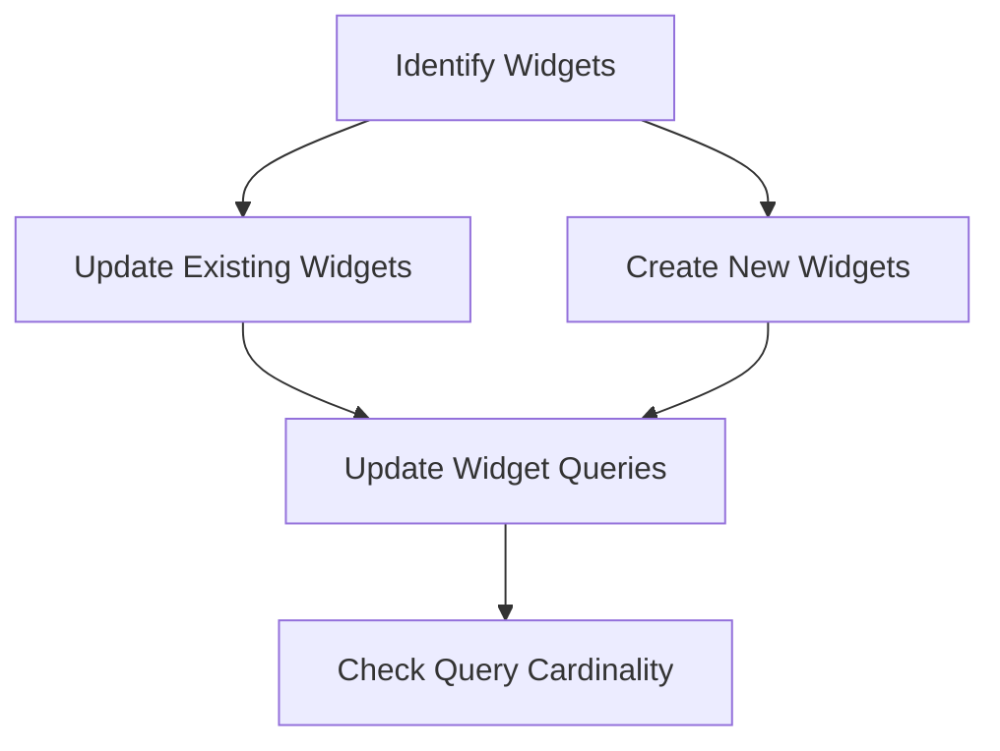

This document will cover the process of updating and creating widgets, which includes:

1. Identifying widgets to update or create
2. Updating existing widgets
3. Creating new widgets
4. Updating widget queries
5. Checking query cardinality.

Technical document: <SwmLink doc-title="Updating and Creating Widgets">[Updating and Creating Widgets](/.swm/updating-and-creating-widgets.4u5nsbi2.sw.md)</SwmLink>

# [Identifying Widgets to Update or Create](https://app.swimm.io/repos/Z2l0aHViJTNBJTNBc2VudHJ5LWRlbW8tMSUzQSUzQVN3aW1tLURlbW8=/docs/4u5nsbi2#updating-and-creating-widgets)

The process begins by identifying which widgets need to be updated or created. This is done by checking the IDs of the widgets provided in the request. If a widget ID exists, it means the widget already exists and needs to be updated. If there is no widget ID, it means a new widget needs to be created.

# [Updating Existing Widgets](https://app.swimm.io/repos/Z2l0aHViJTNBJTNBc2VudHJ5LWRlbW8tMSUzQSUzQVN3aW1tLURlbW8=/docs/4u5nsbi2#updating-an-existing-widget)

For widgets that already exist, their properties are updated based on the new data provided. This includes updating the title, description, thresholds, display type, interval, widget type, and order. The widget's queries are also updated if they are included in the data. This ensures that the widget reflects the most current information and configuration.

# [Creating New Widgets](https://app.swimm.io/repos/Z2l0aHViJTNBJTNBc2VudHJ5LWRlbW8tMSUzQSUzQVN3aW1tLURlbW8=/docs/4u5nsbi2#creating-a-new-widget)

For new widgets, a new `DashboardWidget` object is created with the provided data. This includes setting properties such as the dashboard it belongs to, display type, title, description, thresholds, interval, widget type, order, and any specific layout details. Additionally, any queries associated with the widget are also created. This ensures that new widgets are fully initialized and ready for use.

# [Updating Widget Queries](https://app.swimm.io/repos/Z2l0aHViJTNBJTNBc2VudHJ5LWRlbW8tMSUzQSUzQVN3aW1tLURlbW8=/docs/4u5nsbi2#updating-widget-queries)

The queries associated with a widget are updated to reflect any changes. This involves removing any queries that are no longer needed, updating existing queries with new data, and creating new queries as necessary. This step ensures that the data displayed by the widget is accurate and up-to-date.

# [Checking Query Cardinality](https://app.swimm.io/repos/Z2l0aHViJTNBJTNBc2VudHJ5LWRlbW8tMSUzQSUzQVN3aW1tLURlbW8=/docs/4u5nsbi2#checking-query-cardinality)

For widgets of type `DISCOVER`, the cardinality of the queries is checked to ensure they do not exceed the maximum allowed. This involves checking the cardinality of each query and setting or creating the on-demand state accordingly. This step is important to ensure that the system can handle the queries efficiently without performance issues.

&nbsp;

*This is an auto-generated document by Swimm AI 🌊 and has not yet been verified by a human*

<SwmMeta version="3.0.0" repo-id="Z2l0aHViJTNBJTNBc2VudHJ5LWRlbW8tMSUzQSUzQVN3aW1tLURlbW8=" repo-name="sentry-demo-1" doc-type="product-flows">Powered by [Swimm](/)</SwmMeta>
