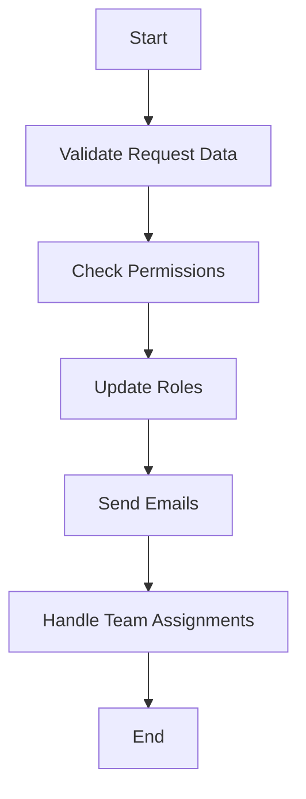

This document will cover the process of updating member roles, which includes:

1. Validating request data
2. Checking permissions
3. Updating roles
4. Sending emails
5. Handling team assignments.

Technical document: <SwmLink doc-title="Updating Member Roles">[Updating Member Roles](/.swm/updating-member-roles.pzkopumj.sw.md)</SwmLink>

# [Validating Request Data](https://app.swimm.io/repos/Z2l0aHViJTNBJTNBc2VudHJ5LWRlbW8tMSUzQSUzQVN3aW1tLURlbW8=/docs/pzkopumj#handling-put-requests)

The process begins by validating the data received in the request. This ensures that all necessary information is provided and correctly formatted. For example, it checks if the new role is specified and if the team assignments are valid. This step is crucial to prevent any invalid data from being processed further.

# [Checking Permissions](https://app.swimm.io/repos/Z2l0aHViJTNBJTNBc2VudHJ5LWRlbW8tMSUzQSUzQVN3aW1tLURlbW8=/docs/pzkopumj#handling-put-requests)

Next, the system checks if the user making the request has the necessary permissions to update roles. This involves verifying that the user's current role allows them to make changes to other members' roles. For instance, a Manager can change a Member's role to Manager but cannot promote someone to Owner. This step ensures that only authorized users can make significant changes to the organization's structure.

# [Updating Roles](https://app.swimm.io/repos/Z2l0aHViJTNBJTNBc2VudHJ5LWRlbW8tMSUzQSUzQVN3aW1tLURlbW8=/docs/pzkopumj#changing-organization-role)

If the request data is valid and the user has the necessary permissions, the system proceeds to update the member's roles. This involves changing the organization-level role and any team-level roles. The system also removes any redundant team roles to avoid confusion in the user interface. For example, if a member's organization role is changed to a higher level, any team roles that are now redundant will be set to null.

# [Sending Emails](https://app.swimm.io/repos/Z2l0aHViJTNBJTNBc2VudHJ5LWRlbW8tMSUzQSUzQVN3aW1tLURlbW8=/docs/pzkopumj#sending-invite-email)

If the member being updated is pending, the system sends an invitation email or an SSO link email. The invitation email includes a link for the member to join the organization, while the SSO link email helps the member link their SSO account. These emails are sent asynchronously to ensure that the user experience is not delayed.

# [Handling Team Assignments](https://app.swimm.io/repos/Z2l0aHViJTNBJTNBc2VudHJ5LWRlbW8tMSUzQSUzQVN3aW1tLURlbW8=/docs/pzkopumj#saving-team-assignments)

Finally, the system handles team assignments. It assigns the member to the specified teams and roles, ensuring data consistency by acquiring a lock before making changes. Existing team assignments are deleted, and new ones are created based on the provided data. This step ensures that the member's team roles are updated accurately and consistently.

&nbsp;

*This is an auto-generated document by Swimm AI 🌊 and has not yet been verified by a human*

<SwmMeta version="3.0.0" repo-id="Z2l0aHViJTNBJTNBc2VudHJ5LWRlbW8tMSUzQSUzQVN3aW1tLURlbW8=" repo-name="sentry-demo-1" doc-type="product-flows">Powered by [Swimm](/)</SwmMeta>
