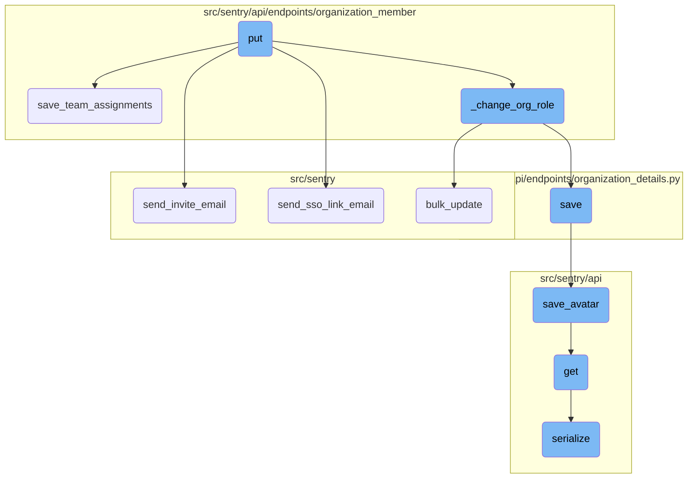
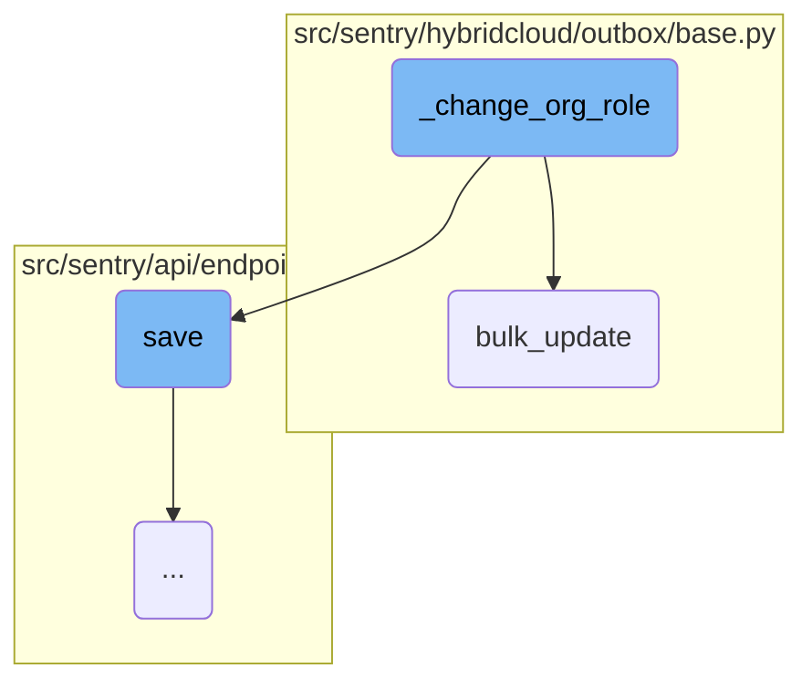
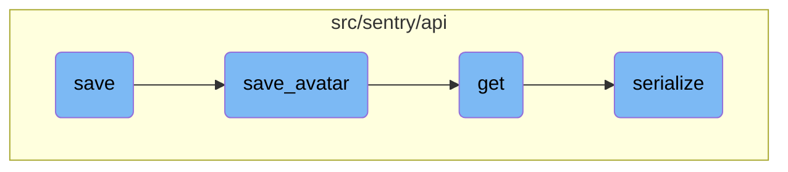

This document explains the <SwmToken path="src/sentry/api/endpoints/organization_member/details.py" pos="178:3:3" line-data="    def put(">`put`</SwmToken> function, which is responsible for updating a member's <SwmToken path="src/sentry/api/endpoints/organization_member/details.py" pos="185:10:12" line-data="        Update a member&#39;s [organization-level](https://docs.sentry.io/organization/membership/#organization-level-roles) and [team-level](https://docs.sentry.io/organization/membership/#team-level-roles) roles.">`organization-level`</SwmToken> and <SwmToken path="src/sentry/api/endpoints/organization_member/details.py" pos="185:37:39" line-data="        Update a member&#39;s [organization-level](https://docs.sentry.io/organization/membership/#organization-level-roles) and [team-level](https://docs.sentry.io/organization/membership/#team-level-roles) roles.">`team-level`</SwmToken> roles. It covers the validation of request data, permission checks, and the subsequent actions taken to update roles, send emails, and handle team assignments.

The <SwmToken path="src/sentry/api/endpoints/organization_member/details.py" pos="178:3:3" line-data="    def put(">`put`</SwmToken> function starts by validating the data received in the request and checking if the user has the necessary permissions to make changes. If everything is in order, it updates the member's roles within the organization and their assigned teams. If the member is pending, it sends an invitation email or an SSO link email. The function also ensures that any redundant team roles are removed to avoid confusion in the user interface. Finally, it saves all the changes and updates the relevant metrics.

Here is a high level diagram of the flow, showing only the most important functions:



# Flow drill down

First, we'll zoom into this section of the flow:

```mermaid
graph TD;
      subgraph src/sentry/api/endpoints/organization_member
50791e01737e43192b31e5d0f59b12e677359e72d7cc1572bc6b8dac46176e19(put):::mainFlowStyle --> 30220066414b2f8e1cabcbec39a80064fa47895b8d6362f1b269415b1b538190(save_team_assignments)
end

subgraph src/sentry
50791e01737e43192b31e5d0f59b12e677359e72d7cc1572bc6b8dac46176e19(put):::mainFlowStyle --> 6a5e1ee91e615a906b4fe2d3f7e36d23e863a3ff985bff34d264c4b9994a070d(send_invite_email)
end

subgraph src/sentry
50791e01737e43192b31e5d0f59b12e677359e72d7cc1572bc6b8dac46176e19(put):::mainFlowStyle --> 5e178b5e3dd8b459bce17a386eb9d23e39f2839c5880e595d52c612526c2024a(send_sso_link_email)
end

subgraph src/sentry/api/endpoints/organization_member
50791e01737e43192b31e5d0f59b12e677359e72d7cc1572bc6b8dac46176e19(put):::mainFlowStyle --> f80d7ae07117ec2f64f044e38e1b7635ae0d68b565efbc2c78f31cb7c14c8053(_change_org_role):::mainFlowStyle
end

subgraph src/sentry/api/endpoints/organization_member
f80d7ae07117ec2f64f044e38e1b7635ae0d68b565efbc2c78f31cb7c14c8053(_change_org_role):::mainFlowStyle --> 1t8dc(...)
end

subgraph src/sentry
5e178b5e3dd8b459bce17a386eb9d23e39f2839c5880e595d52c612526c2024a(send_sso_link_email) --> fb0abeb1b6faaed13a100b07a3130ef489ca361412aab99659e9781832aaa46c(send_async)
end

subgraph src/sentry
6a5e1ee91e615a906b4fe2d3f7e36d23e863a3ff985bff34d264c4b9994a070d(send_invite_email) --> fb0abeb1b6faaed13a100b07a3130ef489ca361412aab99659e9781832aaa46c(send_async)
end

subgraph src/sentry
30220066414b2f8e1cabcbec39a80064fa47895b8d6362f1b269415b1b538190(save_team_assignments) --> abfef65c5226f2473bb554df85cf5d322d9dbfe2d09136616f8f43b7ba81df89(bulk_delete)
end


      classDef mainFlowStyle color:#000000,fill:#7CB9F4
classDef rootsStyle color:#000000,fill:#00FFF4
classDef Style1 color:#000000,fill:#00FFAA
classDef Style2 color:#000000,fill:#FFFF00
classDef Style3 color:#000000,fill:#AA7CB9

%% Swimm:
%% graph TD;
%%       subgraph <SwmPath>[src/sentry/api/endpoints/organization_member/](src/sentry/api/endpoints/organization_member/)</SwmPath>
%% 50791e01737e43192b31e5d0f59b12e677359e72d7cc1572bc6b8dac46176e19(put):::mainFlowStyle --> 30220066414b2f8e1cabcbec39a80064fa47895b8d6362f1b269415b1b538190(save_team_assignments)
%% end
%% 
%% subgraph <SwmPath>[src/sentry/](src/sentry/)</SwmPath>
%% 50791e01737e43192b31e5d0f59b12e677359e72d7cc1572bc6b8dac46176e19(put):::mainFlowStyle --> 6a5e1ee91e615a906b4fe2d3f7e36d23e863a3ff985bff34d264c4b9994a070d(send_invite_email)
%% end
%% 
%% subgraph <SwmPath>[src/sentry/](src/sentry/)</SwmPath>
%% 50791e01737e43192b31e5d0f59b12e677359e72d7cc1572bc6b8dac46176e19(put):::mainFlowStyle --> 5e178b5e3dd8b459bce17a386eb9d23e39f2839c5880e595d52c612526c2024a(send_sso_link_email)
%% end
%% 
%% subgraph <SwmPath>[src/sentry/api/endpoints/organization_member/](src/sentry/api/endpoints/organization_member/)</SwmPath>
%% 50791e01737e43192b31e5d0f59b12e677359e72d7cc1572bc6b8dac46176e19(put):::mainFlowStyle --> f80d7ae07117ec2f64f044e38e1b7635ae0d68b565efbc2c78f31cb7c14c8053(_change_org_role):::mainFlowStyle
%% end
%% 
%% subgraph <SwmPath>[src/sentry/api/endpoints/organization_member/](src/sentry/api/endpoints/organization_member/)</SwmPath>
%% f80d7ae07117ec2f64f044e38e1b7635ae0d68b565efbc2c78f31cb7c14c8053(_change_org_role):::mainFlowStyle --> 1t8dc(...)
%% end
%% 
%% subgraph <SwmPath>[src/sentry/](src/sentry/)</SwmPath>
%% 5e178b5e3dd8b459bce17a386eb9d23e39f2839c5880e595d52c612526c2024a(send_sso_link_email) --> fb0abeb1b6faaed13a100b07a3130ef489ca361412aab99659e9781832aaa46c(send_async)
%% end
%% 
%% subgraph <SwmPath>[src/sentry/](src/sentry/)</SwmPath>
%% 6a5e1ee91e615a906b4fe2d3f7e36d23e863a3ff985bff34d264c4b9994a070d(send_invite_email) --> fb0abeb1b6faaed13a100b07a3130ef489ca361412aab99659e9781832aaa46c(send_async)
%% end
%% 
%% subgraph <SwmPath>[src/sentry/](src/sentry/)</SwmPath>
%% 30220066414b2f8e1cabcbec39a80064fa47895b8d6362f1b269415b1b538190(save_team_assignments) --> abfef65c5226f2473bb554df85cf5d322d9dbfe2d09136616f8f43b7ba81df89(bulk_delete)
%% end
%% 
%% 
%%       classDef mainFlowStyle color:#000000,fill:#7CB9F4
%% classDef rootsStyle color:#000000,fill:#00FFF4
%% classDef Style1 color:#000000,fill:#00FFAA
%% classDef Style2 color:#000000,fill:#FFFF00
%% classDef Style3 color:#000000,fill:#AA7CB9
```



<SwmSnippet path="/src/sentry/api/endpoints/organization_member/details.py" line="178">

---

## Handling PUT requests

The <SwmToken path="src/sentry/api/endpoints/organization_member/details.py" pos="178:3:3" line-data="    def put(">`put`</SwmToken> function handles updating a member's <SwmToken path="src/sentry/api/endpoints/organization_member/details.py" pos="185:10:12" line-data="        Update a member&#39;s [organization-level](https://docs.sentry.io/organization/membership/#organization-level-roles) and [team-level](https://docs.sentry.io/organization/membership/#team-level-roles) roles.">`organization-level`</SwmToken> and <SwmToken path="src/sentry/api/endpoints/organization_member/details.py" pos="185:37:39" line-data="        Update a member&#39;s [organization-level](https://docs.sentry.io/organization/membership/#organization-level-roles) and [team-level](https://docs.sentry.io/organization/membership/#team-level-roles) roles.">`team-level`</SwmToken> roles. It validates the request data, checks for permissions, and updates the member's roles accordingly. If the member is pending, it sends an invite email or an SSO link email.

```python
    def put(
        self,
        request: Request,
        organization: Organization,
        member: OrganizationMember,
    ) -> Response:
        """
        Update a member's [organization-level](https://docs.sentry.io/organization/membership/#organization-level-roles) and [team-level](https://docs.sentry.io/organization/membership/#team-level-roles) roles.

        Note that for changing organization-roles, this endpoint is restricted to
        [user auth tokens](https://docs.sentry.io/account/auth-tokens/#user-auth-tokens).
        Additionally, both the original and desired organization role must have
        the same or lower permissions than the role of the organization user making the request

        For example, an organization Manager may change someone's role from
        Member to Manager, but not to Owner.
        """
        allowed_roles = get_allowed_org_roles(request, organization)
        serializer = OrganizationMemberRequestSerializer(
            data=request.data,
            partial=True,
```

---

</SwmSnippet>

<SwmSnippet path="/src/sentry/api/endpoints/organization_member/__init__.py" line="23">

---

### Saving team assignments

The <SwmToken path="src/sentry/api/endpoints/organization_member/__init__.py" pos="23:2:2" line-data="def save_team_assignments(">`save_team_assignments`</SwmToken> function assigns the member to the specified teams and roles. It first acquires a lock to ensure data consistency, then deletes existing team assignments and creates new ones based on the provided data.

```python
def save_team_assignments(
    organization_member: OrganizationMember,
    teams: list[Team] | None,
    teams_with_roles: list[tuple[Team, str]] | None = None,
):
    # https://github.com/getsentry/sentry/pull/6054/files/8edbdb181cf898146eda76d46523a21d69ab0ec7#r145798271
    lock = locks.get(
        f"org:member:{organization_member.id}", duration=5, name="save_team_assignment"
    )
    with TimedRetryPolicy(10)(lock.acquire):
        if teams_with_roles:
            # Map will avoid O(n * n) search later
            team_role_map = {team.slug: role_id for team, role_id in teams_with_roles}
            target_teams = [team for team, _ in teams_with_roles]
        elif teams:
            team_role_map = {}
            target_teams = teams
        else:
            team_role_map = {}
            target_teams = []

```

---

</SwmSnippet>

<SwmSnippet path="/src/sentry/models/organizationmember.py" line="350">

---

### Sending invite email

The <SwmToken path="src/sentry/models/organizationmember.py" pos="350:3:3" line-data="    def send_invite_email(self, referrer: str | None = None):">`send_invite_email`</SwmToken> function sends an invitation email to the member. It constructs the email context and uses the <SwmToken path="src/sentry/models/organizationmember.py" pos="351:11:11" line-data="        from sentry.utils.email import MessageBuilder">`MessageBuilder`</SwmToken> to send the email asynchronously.

```python
    def send_invite_email(self, referrer: str | None = None):
        from sentry.utils.email import MessageBuilder

        context = {
            "email": self.email,
            "organization": self.organization,
            "url": self.get_invite_link(referrer),
        }

        msg = MessageBuilder(
            subject="Join %s in using Sentry" % self.organization.name,
            template="sentry/emails/member-invite.txt",
            html_template="sentry/emails/member-invite.html",
            type="organization.invite",
            context=context,
        )

        try:
            msg.send_async([self.get_email()])
        except Exception as e:
            mail_logger = get_logger(name="sentry.mail")
```

---

</SwmSnippet>

<SwmSnippet path="/src/sentry/models/organizationmember.py" line="373">

---

### Sending SSO link email

The <SwmToken path="src/sentry/models/organizationmember.py" pos="373:3:3" line-data="    def send_sso_link_email(self, sending_user_email: str, provider):">`send_sso_link_email`</SwmToken> function sends an email to link the member's SSO account. It constructs the email context with the organization and provider details and uses the <SwmToken path="src/sentry/models/organizationmember.py" pos="374:11:11" line-data="        from sentry.utils.email import MessageBuilder">`MessageBuilder`</SwmToken> to send the email asynchronously.

```python
    def send_sso_link_email(self, sending_user_email: str, provider):
        from sentry.utils.email import MessageBuilder

        link_args = {"organization_slug": self.organization.slug}
        context = {
            "organization": self.organization,
            "actor_email": sending_user_email,
            "provider": provider,
            "url": absolute_uri(reverse("sentry-auth-organization", kwargs=link_args)),
        }

        msg = MessageBuilder(
            subject=f"Action Required for {self.organization.name}",
            template="sentry/emails/auth-link-identity.txt",
            html_template="sentry/emails/auth-link-identity.html",
            type="organization.auth_link",
            context=context,
        )
        msg.send_async([self.get_email()])
```

---

</SwmSnippet>

<SwmSnippet path="/src/sentry/utils/email/message_builder.py" line="232">

---

### Sending email asynchronously

The <SwmToken path="src/sentry/utils/email/message_builder.py" pos="232:3:3" line-data="    def send_async(">`send_async`</SwmToken> function sends an email asynchronously. It builds the email messages and queues them for sending using the appropriate task based on the current silo mode.

```python
    def send_async(
        self,
        to: Iterable[str] | None = None,
        cc: Sequence[str] | None = None,
        bcc: Sequence[str] | None = None,
    ) -> None:
        from sentry.tasks.email import send_email, send_email_control

        fmt = options.get("system.logging-format")
        messages = self.get_built_messages(to, cc=cc, bcc=bcc)
        extra: MutableMapping[str, str | tuple[str]] = {"message_type": self.type}
        loggable = [v for k, v in self.context.items() if hasattr(v, "id")]
        for context in loggable:
            extra[f"{type(context).__name__.lower()}_id"] = context.id

        log_mail_queued = partial(logger.info, "mail.queued", extra=extra)
        for message in messages:
            send_email_task = send_email.delay
            if SiloMode.get_current_mode() == SiloMode.CONTROL:
                send_email_task = send_email_control.delay
            safe_execute(send_email_task, message=message)
```

---

</SwmSnippet>

<SwmSnippet path="/src/sentry/hybridcloud/outbox/base.py" line="134">

---

### Bulk deleting team assignments

The <SwmToken path="src/sentry/hybridcloud/outbox/base.py" pos="134:3:3" line-data="    def bulk_delete(self, objs: Iterable[_RM]) -&gt; tuple[int, Mapping[str, int]]:">`bulk_delete`</SwmToken> function deletes multiple team assignments in a single transaction. It creates outbox entries for the objects to be deleted and then performs the deletion.

```python
    def bulk_delete(self, objs: Iterable[_RM]) -> tuple[int, Mapping[str, int]]:
        from sentry.hybridcloud.models.outbox import outbox_context

        tuple_of_objs: tuple[_RM, ...] = tuple(objs)
        if not tuple_of_objs:
            return 0, {}

        model: type[_RM] = type(tuple_of_objs[0])
        using = router.db_for_write(model)
        with outbox_context(transaction.atomic(using=using), flush=False):
            outboxes: list[RegionOutboxBase] = []
            for obj in tuple_of_objs:
                outboxes.append(obj.outbox_for_update())

            type(outboxes[0]).objects.bulk_create(outboxes)
            return self.filter(id__in={o.id for o in tuple_of_objs}).delete()
```

---

</SwmSnippet>

Now, lets zoom into this section of the flow:



<SwmSnippet path="/src/sentry/api/endpoints/organization_member/details.py" line="340">

---

## Changing Organization Role

The <SwmToken path="src/sentry/api/endpoints/organization_member/details.py" pos="317:3:3" line-data="            self._change_org_role(member, assigned_org_role)">`_change_org_role`</SwmToken> function is responsible for updating the role of an organization member. It first determines the new minimum team role based on the provided role. Then, it identifies any existing team roles that are less than or equal to the new minimum role and sets them to null to avoid redundancy. This ensures that the UI does not display any unexpected roles after the user's organization role is changed. Finally, it updates the member's role and saves the changes. If any team roles were updated, it increments a metric to track the update.

```python
        new_minimum_team_role = roles.get_minimum_team_role(role)
        lesser_team_roles = [
            r.id for r in team_roles.get_all() if r.priority <= new_minimum_team_role.priority
        ]

        with transaction.atomic(router.db_for_write(OrganizationMemberTeam)):
            # If the member has any existing team roles that are less than or equal
            # to their new minimum role, overwrite the redundant team roles with
            # null. We do this because such a team role would be effectively
            # invisible in the UI, and would be surprising if it were left behind
            # after the user's org role is lowered again.
            omts: list[OrganizationMemberTeam] = []
            for omt in OrganizationMemberTeam.objects.filter(
                organizationmember=member, role__in=lesser_team_roles
            ):
                omt.role = None
            OrganizationMemberTeam.objects.bulk_update(omts, fields=["role"])
            omt_update_count = len(omts)
            member.role = role
            member.save()
        if omt_update_count > 0:
```

---

</SwmSnippet>

<SwmSnippet path="/src/sentry/hybridcloud/outbox/base.py" line="115">

---

## Bulk Updating Team Roles

The <SwmToken path="src/sentry/hybridcloud/outbox/base.py" pos="115:3:3" line-data="    def bulk_update(">`bulk_update`</SwmToken> function is used to update multiple objects in the database efficiently. It first converts the list of objects to a tuple and checks if it is empty. If not, it determines the database to use for the write operation and creates an atomic transaction context. Within this context, it prepares outbox entries for each object to be updated and then performs the bulk update operation. This ensures that all updates are handled in a single transaction, improving performance and consistency.

```python
    def bulk_update(
        self, objs: Iterable[_RM], fields: Sequence[str], *args: Any, **kwds: Any
    ) -> Any:
        from sentry.hybridcloud.models.outbox import outbox_context

        tuple_of_objs: tuple[_RM, ...] = tuple(objs)
        if not tuple_of_objs:
            return super().bulk_update(tuple_of_objs, fields, *args, **kwds)

        model: type[_RM] = type(tuple_of_objs[0])
        using = router.db_for_write(model)
        with outbox_context(transaction.atomic(using=using), flush=False):
            outboxes: list[RegionOutboxBase] = []
            for obj in tuple_of_objs:
                outboxes.append(obj.outbox_for_update())

            type(outboxes[0]).objects.bulk_create(outboxes)
            return super().bulk_update(tuple_of_objs, fields, *args, **kwds)
```

---

</SwmSnippet>

Now, lets zoom into this section of the flow:



<SwmSnippet path="/src/sentry/api/endpoints/organization_details.py" line="462">

---

## Updating Organization Settings

The <SwmToken path="src/sentry/api/endpoints/organization_details.py" pos="462:3:3" line-data="    def save(self):">`save`</SwmToken> function updates various organization settings based on the provided data. It iterates over <SwmToken path="src/sentry/api/endpoints/organization_details.py" pos="472:16:16" line-data="        for key, option, type_, default_value in ORG_OPTIONS:">`ORG_OPTIONS`</SwmToken> to update or create <SwmToken path="src/sentry/api/endpoints/organization_details.py" pos="476:5:5" line-data="                option_inst = OrganizationOption.objects.get(organization=org, key=option)">`OrganizationOption`</SwmToken> instances and tracks changes.

```python
    def save(self):
        from sentry import features

        org = self.context["organization"]
        changed_data = {}
        if not hasattr(org, "__data"):
            update_tracked_data(org)

        data = self.validated_data

        for key, option, type_, default_value in ORG_OPTIONS:
            if key not in data:
                continue
            try:
                option_inst = OrganizationOption.objects.get(organization=org, key=option)
                update_tracked_data(option_inst)
            except OrganizationOption.DoesNotExist:
                OrganizationOption.objects.set_value(
                    organization=org, key=option, value=type_(data[key])
                )

```

---

</SwmSnippet>

<SwmSnippet path="/src/sentry/api/endpoints/organization_details.py" line="497">

---

## Handling Organization Flags

The function updates organization flags such as <SwmToken path="src/sentry/api/endpoints/organization_details.py" pos="497:4:4" line-data="        if &quot;openMembership&quot; in data:">`openMembership`</SwmToken>, <SwmToken path="src/sentry/api/endpoints/organization_details.py" pos="499:4:4" line-data="        if &quot;allowSharedIssues&quot; in data:">`allowSharedIssues`</SwmToken>, <SwmToken path="src/sentry/api/endpoints/organization_details.py" pos="501:4:4" line-data="        if &quot;enhancedPrivacy&quot; in data:">`enhancedPrivacy`</SwmToken>, and others based on the input data.

```python
        if "openMembership" in data:
            org.flags.allow_joinleave = data["openMembership"]
        if "allowSharedIssues" in data:
            org.flags.disable_shared_issues = not data["allowSharedIssues"]
        if "enhancedPrivacy" in data:
            org.flags.enhanced_privacy = data["enhancedPrivacy"]
        if "isEarlyAdopter" in data:
            org.flags.early_adopter = data["isEarlyAdopter"]
        if "codecovAccess" in data:
            org.flags.codecov_access = data["codecovAccess"]
        if "require2FA" in data:
            org.flags.require_2fa = data["require2FA"]
        if (
            features.has("organizations:required-email-verification", org)
            and "requireEmailVerification" in data
        ):
            org.flags.require_email_verification = data["requireEmailVerification"]
        if "allowMemberProjectCreation" in data:
            org.flags.disable_member_project_creation = not data["allowMemberProjectCreation"]
        if "allowSuperuserAccess" in data:
            org.flags.prevent_superuser_access = not data["allowSuperuserAccess"]
```

---

</SwmSnippet>

<SwmSnippet path="/src/sentry/api/endpoints/organization_details.py" line="554">

---

## Saving Organization Changes

After updating the organization settings and flags, the function saves the organization instance and handles additional settings like <SwmToken path="src/sentry/api/endpoints/organization_details.py" pos="556:4:4" line-data="        if &quot;avatar&quot; in data or &quot;avatarType&quot; in data:">`avatar`</SwmToken>, <SwmToken path="src/sentry/api/endpoints/organization_details.py" pos="563:8:8" line-data="        if data.get(&quot;require2FA&quot;) is True:">`require2FA`</SwmToken>, and <SwmToken path="src/sentry/api/endpoints/organization_details.py" pos="567:8:8" line-data="            and data.get(&quot;requireEmailVerification&quot;) is True">`requireEmailVerification`</SwmToken>.

```python
        org.save()

        if "avatar" in data or "avatarType" in data:
            OrganizationAvatar.save_avatar(
                relation={"organization": org},
                type=data.get("avatarType", "upload"),
                avatar=data.get("avatar"),
                filename=f"{org.slug}.png",
            )
        if data.get("require2FA") is True:
            org.handle_2fa_required(self.context["request"])
        if (
            features.has("organizations:required-email-verification", org)
            and data.get("requireEmailVerification") is True
        ):
            org.handle_email_verification_required(self.context["request"])
        return org, changed_data
```

---

</SwmSnippet>

<SwmSnippet path="/src/sentry/api/bases/avatar.py" line="73">

---

## Saving Avatar

The <SwmToken path="src/sentry/api/bases/avatar.py" pos="73:3:3" line-data="    def save_avatar(self, obj: Any, serializer: serializers.Serializer, **kwargs: Any) -&gt; AvatarT:">`save_avatar`</SwmToken> function saves the avatar for the organization. It uses the validated data from the serializer to update the avatar details.

```python
    def save_avatar(self, obj: Any, serializer: serializers.Serializer, **kwargs: Any) -> AvatarT:
        result = serializer.validated_data

        return self.model.save_avatar(
            relation={self.object_type: obj},
            type=result["avatar_type"],
            avatar=result.get("avatar_photo"),
            filename=self.get_avatar_filename(obj),
            color=result.get("color"),
        )
```

---

</SwmSnippet>

<SwmSnippet path="/src/sentry/api/bases/avatar.py" line="55">

---

## Retrieving Serialized Data

The <SwmToken path="src/sentry/api/bases/avatar.py" pos="55:3:3" line-data="    def get(self, request: Request, **kwargs: Any) -&gt; Response:">`get`</SwmToken> function retrieves the serialized data for the given object. It uses the <SwmToken path="src/sentry/api/bases/avatar.py" pos="57:5:5" line-data="        return Response(serialize(obj, request.user, **kwargs))">`serialize`</SwmToken> function to convert the object into a response format.

```python
    def get(self, request: Request, **kwargs: Any) -> Response:
        obj = kwargs.pop(self.object_type, None)
        return Response(serialize(obj, request.user, **kwargs))
```

---

</SwmSnippet>

<SwmSnippet path="/src/sentry/api/serializers/base.py" line="27">

---

## Serializing Objects

The <SwmToken path="src/sentry/api/serializers/base.py" pos="27:2:2" line-data="def serialize(">`serialize`</SwmToken> function converts a model or list of models into a Python object made entirely of primitives. It uses a specified serializer or looks up the serializer in the registry based on the object's type.

```python
def serialize(
    objects: Any | Sequence[Any],
    user: Any | None = None,
    serializer: Any | None = None,
    **kwargs: Any,
) -> Any:
    """
    Turn a model (or list of models) into a python object made entirely of primitives.

    :param objects: A list of objects
    :param user: The user who will be viewing the objects. Omit to view as `AnonymousUser`.
    :param serializer: The `Serializer` class whose logic we'll use to serialize
        `objects` (see below.) Omit to just look up the Serializer in the
        registry by the `objects`'s type.
    :param kwargs Any
    :returns A list of the serialized versions of `objects`.
    """
    if user is None:
        user = AnonymousUser()

    if not objects:
```

---

</SwmSnippet>

&nbsp;

*This is an auto-generated document by Swimm AI 🌊 and has not yet been verified by a human*

<SwmMeta version="3.0.0" repo-id="Z2l0aHViJTNBJTNBc2VudHJ5LWRlbW8tMSUzQSUzQVN3aW1tLURlbW8=" repo-name="sentry-demo-1" doc-type="flows"><sup>Powered by [Swimm](/)</sup></SwmMeta>
