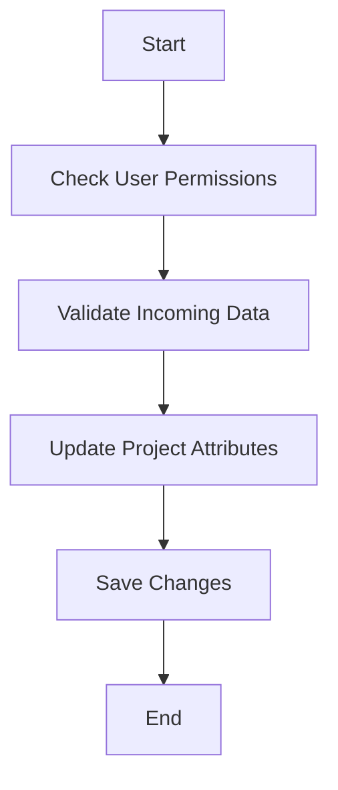

This document will cover the process of updating project settings, which includes:

1. Checking user permissions
2. Validating incoming data
3. Updating project attributes
4. Saving changes.

Technical document: <SwmLink doc-title="Updating Project Settings">[Updating Project Settings](/.swm/updating-project-settings.xf24fdw7.sw.md)</SwmLink>

# [Checking User Permissions](https://app.swimm.io/repos/Z2l0aHViJTNBJTNBc2VudHJ5LWRlbW8tMSUzQSUzQVN3aW1tLURlbW8=/docs/xf24fdw7#checking-user-access-levels)

The first step in updating project settings is to check if the user has the appropriate permissions. This ensures that only authorized users can make changes to the project settings. Users with elevated scopes such as 'project:write' or 'project:admin' are allowed to update more settings compared to users with only 'project:read' scope. This step is crucial for maintaining security and ensuring that sensitive settings are not modified by unauthorized users.

# [Validating Incoming Data](https://app.swimm.io/repos/Z2l0aHViJTNBJTNBc2VudHJ5LWRlbW8tMSUzQSUzQVN3aW1tLURlbW8=/docs/xf24fdw7#validating-incoming-data)

Once the user's permissions are verified, the next step is to validate the data sent by the user. This involves checking that all required fields are present and that the data is in the correct format. For example, if the user is updating the project's name, the new name must be a valid string. This step helps prevent errors and ensures that the data being saved is accurate and complete.

# [Updating Project Attributes](https://app.swimm.io/repos/Z2l0aHViJTNBJTNBc2VudHJ5LWRlbW8tMSUzQSUzQVN3aW1tLURlbW8=/docs/xf24fdw7#updating-project-attributes)

After validating the incoming data, the project attributes are updated. This can include changes to the project's name, platform, and other configurable settings. For instance, if the user wants to change the project's name from 'Old Project' to 'New Project', this is where the change is made. Updating these attributes allows the project to reflect the latest information provided by the user.

# [Saving Changes](https://app.swimm.io/repos/Z2l0aHViJTNBJTNBc2VudHJ5LWRlbW8tMSUzQSUzQVN3aW1tLURlbW8=/docs/xf24fdw7#saving-the-changes)

The final step in the process is to save the changes. This involves writing the updated project attributes to the database. If any changes were made, the project is saved to ensure that the new settings are persisted. This step is essential for making sure that the updates are not lost and that the project settings are up-to-date.

&nbsp;

*This is an auto-generated document by Swimm AI 🌊 and has not yet been verified by a human*

<SwmMeta version="3.0.0" repo-id="Z2l0aHViJTNBJTNBc2VudHJ5LWRlbW8tMSUzQSUzQVN3aW1tLURlbW8=" repo-name="sentry-demo-1" doc-type="product-flows">Powered by [Swimm](/)</SwmMeta>
