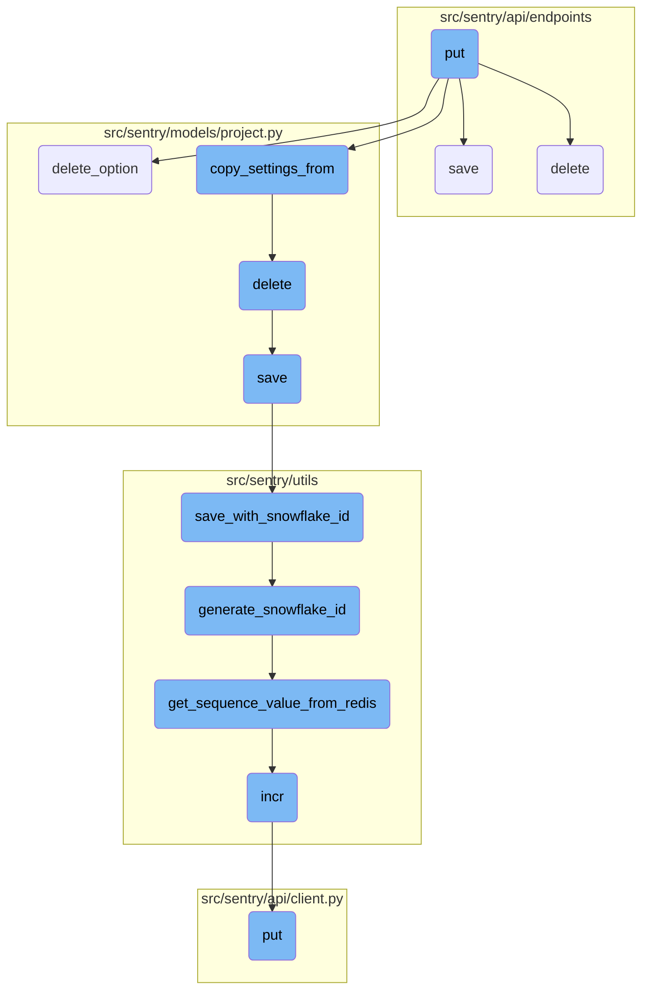
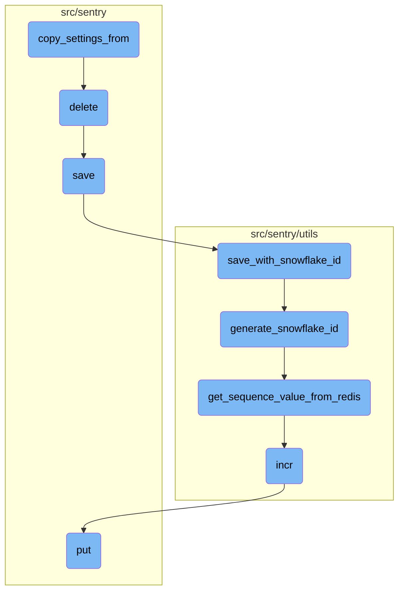

This document explains the <SwmToken path="src/sentry/api/endpoints/project_details.py" pos="542:3:3" line-data="    def put(self, request: Request, project) -&gt; Response:">`put`</SwmToken> function, which is responsible for updating various attributes and configurable settings for a given project. It includes checking user access levels, validating incoming data, and updating project attributes.

The <SwmToken path="src/sentry/api/endpoints/project_details.py" pos="542:3:3" line-data="    def put(self, request: Request, project) -&gt; Response:">`put`</SwmToken> function updates project settings. First, it checks if the user has the right permissions. Then, it validates the data sent by the user. If everything is correct, it updates the project's details like name and platform. Finally, it saves the changes.

Here is a high level diagram of the flow, showing only the most important functions:



# Flow drill down

First, we'll zoom into this section of the flow:

```mermaid
graph TD;
      subgraph src/sentry/api/endpoints
123f668a07167068ab19b17eab3b9c1267bffc328894aca84ba00efbc4e4804b(put):::mainFlowStyle --> e7e0a0243c1e8121e4e6b9f766a2b7592ddac04041819dc275371e02322ce783(save)
end

subgraph src/sentry/api/endpoints
123f668a07167068ab19b17eab3b9c1267bffc328894aca84ba00efbc4e4804b(put):::mainFlowStyle --> f38fdad662ded5ff6becd1b109ebcaa0f4c5451ae863b06dea114cd8274e916b(delete)
end

subgraph src/sentry/models
123f668a07167068ab19b17eab3b9c1267bffc328894aca84ba00efbc4e4804b(put):::mainFlowStyle --> 5c4ddf05ea05264413ab9671aa86e6753202838c48a0a958f73fc85c499f8cff(delete_option)
end

subgraph src/sentry/models
123f668a07167068ab19b17eab3b9c1267bffc328894aca84ba00efbc4e4804b(put):::mainFlowStyle --> db5616db301fade066755d1b2ba0c7561eac584b974b5a69f44e51d21f54bea1(copy_settings_from):::mainFlowStyle
end

subgraph src/sentry/models
db5616db301fade066755d1b2ba0c7561eac584b974b5a69f44e51d21f54bea1(copy_settings_from):::mainFlowStyle --> ortau(...)
end

subgraph src/sentry/models
5c4ddf05ea05264413ab9671aa86e6753202838c48a0a958f73fc85c499f8cff(delete_option) --> 8059348e590933422d313d3ebaa4831e7374566958510eb1d288281e9256253b(unset_value)
end

subgraph src/sentry/db/mixin.py
f38fdad662ded5ff6becd1b109ebcaa0f4c5451ae863b06dea114cd8274e916b(delete) --> 223f2769892bbb7c35e769a3df4e1657fa56b7cdcd01ed5feffec4251283a429(rename_on_pending_deletion)
end

subgraph src/sentry/api/bases/avatar.py
e7e0a0243c1e8121e4e6b9f766a2b7592ddac04041819dc275371e02322ce783(save) --> 4840e06d7d2fcff2ec09e8fb0fb9717aff6966a85b0d184959efcf82ca1b5cb1(save_avatar)
end


      classDef mainFlowStyle color:#000000,fill:#7CB9F4
classDef rootsStyle color:#000000,fill:#00FFF4
classDef Style1 color:#000000,fill:#00FFAA
classDef Style2 color:#000000,fill:#FFFF00
classDef Style3 color:#000000,fill:#AA7CB9

%% Swimm:
%% graph TD;
%%       subgraph <SwmPath>[src/sentry/api/endpoints/](src/sentry/api/endpoints/)</SwmPath>
%% 123f668a07167068ab19b17eab3b9c1267bffc328894aca84ba00efbc4e4804b(put):::mainFlowStyle --> e7e0a0243c1e8121e4e6b9f766a2b7592ddac04041819dc275371e02322ce783(save)
%% end
%% 
%% subgraph <SwmPath>[src/sentry/api/endpoints/](src/sentry/api/endpoints/)</SwmPath>
%% 123f668a07167068ab19b17eab3b9c1267bffc328894aca84ba00efbc4e4804b(put):::mainFlowStyle --> f38fdad662ded5ff6becd1b109ebcaa0f4c5451ae863b06dea114cd8274e916b(delete)
%% end
%% 
%% subgraph <SwmPath>[src/sentry/models/](src/sentry/models/)</SwmPath>
%% 123f668a07167068ab19b17eab3b9c1267bffc328894aca84ba00efbc4e4804b(put):::mainFlowStyle --> 5c4ddf05ea05264413ab9671aa86e6753202838c48a0a958f73fc85c499f8cff(delete_option)
%% end
%% 
%% subgraph <SwmPath>[src/sentry/models/](src/sentry/models/)</SwmPath>
%% 123f668a07167068ab19b17eab3b9c1267bffc328894aca84ba00efbc4e4804b(put):::mainFlowStyle --> db5616db301fade066755d1b2ba0c7561eac584b974b5a69f44e51d21f54bea1(copy_settings_from):::mainFlowStyle
%% end
%% 
%% subgraph <SwmPath>[src/sentry/models/](src/sentry/models/)</SwmPath>
%% db5616db301fade066755d1b2ba0c7561eac584b974b5a69f44e51d21f54bea1(copy_settings_from):::mainFlowStyle --> ortau(...)
%% end
%% 
%% subgraph <SwmPath>[src/sentry/models/](src/sentry/models/)</SwmPath>
%% 5c4ddf05ea05264413ab9671aa86e6753202838c48a0a958f73fc85c499f8cff(delete_option) --> 8059348e590933422d313d3ebaa4831e7374566958510eb1d288281e9256253b(unset_value)
%% end
%% 
%% subgraph <SwmPath>[src/sentry/db/mixin.py](src/sentry/db/mixin.py)</SwmPath>
%% f38fdad662ded5ff6becd1b109ebcaa0f4c5451ae863b06dea114cd8274e916b(delete) --> 223f2769892bbb7c35e769a3df4e1657fa56b7cdcd01ed5feffec4251283a429(rename_on_pending_deletion)
%% end
%% 
%% subgraph <SwmPath>[src/sentry/api/bases/avatar.py](src/sentry/api/bases/avatar.py)</SwmPath>
%% e7e0a0243c1e8121e4e6b9f766a2b7592ddac04041819dc275371e02322ce783(save) --> 4840e06d7d2fcff2ec09e8fb0fb9717aff6966a85b0d184959efcf82ca1b5cb1(save_avatar)
%% end
%% 
%% 
%%       classDef mainFlowStyle color:#000000,fill:#7CB9F4
%% classDef rootsStyle color:#000000,fill:#00FFF4
%% classDef Style1 color:#000000,fill:#00FFAA
%% classDef Style2 color:#000000,fill:#FFFF00
%% classDef Style3 color:#000000,fill:#AA7CB9
```



<SwmSnippet path="/src/sentry/api/endpoints/project_details.py" line="542">

---

## Updating Project Settings

The <SwmToken path="src/sentry/api/endpoints/project_details.py" pos="542:3:3" line-data="    def put(self, request: Request, project) -&gt; Response:">`put`</SwmToken> function is responsible for updating various attributes and configurable settings for a given project. It first checks the user's access level to determine which serializer to use. Then, it validates the incoming data and updates the project's attributes like <SwmToken path="src/sentry/models/project.py" pos="366:7:7" line-data="        if not self.slug:">`slug`</SwmToken>, <SwmToken path="src/sentry/db/mixin.py" pos="35:7:7" line-data="        require a new name, but do need to be saved on pending deletion.">`name`</SwmToken>, and <SwmToken path="src/sentry/api/endpoints/project_details.py" pos="142:1:1" line-data="    platform = serializers.CharField(">`platform`</SwmToken>. If any changes are made, the project is saved.

```python
    def put(self, request: Request, project) -> Response:
        """
        Update various attributes and configurable settings for the given project.

        Note that solely having the **`project:read`** scope restricts updatable settings to
        `isBookmarked`.
        """

        old_data = serialize(project, request.user, DetailedProjectSerializer())
        has_elevated_scopes = request.access and (
            request.access.has_scope("project:write")
            or request.access.has_scope("project:admin")
            or request.access.has_any_project_scope(project, ["project:write", "project:admin"])
        )

        if has_elevated_scopes:
            serializer_cls: type[ProjectMemberSerializer] = ProjectAdminSerializer
        else:
            serializer_cls = ProjectMemberSerializer

        serializer = serializer_cls(
```

---

</SwmSnippet>

<SwmSnippet path="/src/sentry/api/endpoints/project_details.py" line="943">

---

## Handling Project Deletion

The <SwmToken path="src/sentry/api/endpoints/project_details.py" pos="943:3:3" line-data="    def delete(self, request: Request, project) -&gt; Response:">`delete`</SwmToken> function schedules a project for deletion. It first checks if the project is an internal project, which cannot be deleted. If not, it updates the project's status to <SwmToken path="src/sentry/api/endpoints/project_details.py" pos="957:5:5" line-data="            status=ObjectStatus.PENDING_DELETION">`PENDING_DELETION`</SwmToken> and schedules the deletion. It also logs an audit entry and renames the project to indicate it is pending deletion.

```python
    def delete(self, request: Request, project) -> Response:
        """
        Schedules a project for deletion.

        Deletion happens asynchronously and therefore is not immediate. However once deletion has
        begun the state of a project changes and will be hidden from most public views.
        """
        if project.is_internal_project():
            return Response(
                '{"error": "Cannot remove projects internally used by Sentry."}',
                status=status.HTTP_403_FORBIDDEN,
            )

        updated = Project.objects.filter(id=project.id, status=ObjectStatus.ACTIVE).update(
            status=ObjectStatus.PENDING_DELETION
        )
        if updated:
            scheduled = RegionScheduledDeletion.schedule(project, days=0, actor=request.user)

            common_audit_data = {
                "request": request,
```

---

</SwmSnippet>

<SwmSnippet path="/src/sentry/db/mixin.py" line="26">

---

### Renaming on Pending Deletion

The <SwmToken path="src/sentry/db/mixin.py" pos="26:3:3" line-data="    def rename_on_pending_deletion(">`rename_on_pending_deletion`</SwmToken> function is called within the <SwmToken path="src/sentry/api/endpoints/project_details.py" pos="943:3:3" line-data="    def delete(self, request: Request, project) -&gt; Response:">`delete`</SwmToken> function to rename the project's fields when it is marked for deletion. This ensures that the project is uniquely identifiable even after being scheduled for deletion.

```python
    def rename_on_pending_deletion(
        self,
        fields: set[str] | None = None,
        extra_fields_to_save: list[str] | None = None,
    ) -> None:
        """
        `fields` represents the fields that should be renamed when pending deletion occurs.

        For special situations, `extra_fields_to_save`, adds additional fields that do not
        require a new name, but do need to be saved on pending deletion.

        See the Repository Model for an example.
        """
        fields = fields or self._rename_fields_on_pending_delete
        original_data = {"id": self.id, "model": self.__class__.__name__}

        for field in fields:
            original_data[field] = getattr(self, field)
            setattr(self, field, uuid4().hex)

        if extra_fields_to_save:
```

---

</SwmSnippet>

<SwmSnippet path="/src/sentry/models/project.py" line="428">

---

## Deleting Project Options

The <SwmToken path="src/sentry/models/project.py" pos="428:3:3" line-data="    def delete_option(self, key: str) -&gt; None:">`delete_option`</SwmToken> function is used to delete specific options associated with a project. This is part of the cleanup process when a project is being deleted.

```python
    def delete_option(self, key: str) -> None:
        self.option_manager.unset_value(self, key)
```

---

</SwmSnippet>

<SwmSnippet path="/src/sentry/models/groupmeta.py" line="76">

---

### Unsetting Group Meta Values

The <SwmToken path="src/sentry/models/groupmeta.py" pos="76:3:3" line-data="    def unset_value(self, instance, key):">`unset_value`</SwmToken> function is used to delete specific metadata associated with a group. This function is called during the deletion process to ensure that all related metadata is removed.

```python
    def unset_value(self, instance, key):
        self.filter(group=instance, key=key).delete()
        try:
            del self.__cache[instance.id][key]
        except KeyError:
            pass
```

---

</SwmSnippet>

<SwmSnippet path="/src/sentry/api/endpoints/organization_details.py" line="462">

---

## Saving Project Settings

The <SwmToken path="src/sentry/api/endpoints/organization_details.py" pos="462:3:3" line-data="    def save(self):">`save`</SwmToken> function is responsible for saving the updated settings of an organization. It iterates through the provided data and updates the corresponding organization options and flags. If any changes are detected, they are saved, and the organization object is updated.

```python
    def save(self):
        from sentry import features

        org = self.context["organization"]
        changed_data = {}
        if not hasattr(org, "__data"):
            update_tracked_data(org)

        data = self.validated_data

        for key, option, type_, default_value in ORG_OPTIONS:
            if key not in data:
                continue
            try:
                option_inst = OrganizationOption.objects.get(organization=org, key=option)
                update_tracked_data(option_inst)
            except OrganizationOption.DoesNotExist:
                OrganizationOption.objects.set_value(
                    organization=org, key=option, value=type_(data[key])
                )

```

---

</SwmSnippet>

<SwmSnippet path="/src/sentry/api/bases/avatar.py" line="73">

---

## Saving Avatar

The <SwmToken path="src/sentry/api/bases/avatar.py" pos="73:3:3" line-data="    def save_avatar(self, obj: Any, serializer: serializers.Serializer, **kwargs: Any) -&gt; AvatarT:">`save_avatar`</SwmToken> function is used to save the avatar for an organization or project. It takes the validated data from the serializer and saves the avatar image, updating the corresponding object with the new avatar information.

```python
    def save_avatar(self, obj: Any, serializer: serializers.Serializer, **kwargs: Any) -> AvatarT:
        result = serializer.validated_data

        return self.model.save_avatar(
            relation={self.object_type: obj},
            type=result["avatar_type"],
            avatar=result.get("avatar_photo"),
            filename=self.get_avatar_filename(obj),
            color=result.get("color"),
        )
```

---

</SwmSnippet>

Now, lets zoom into this section of the flow:



<SwmSnippet path="/src/sentry/models/project.py" line="649">

---

## Copying Project Settings

The function <SwmToken path="src/sentry/models/project.py" pos="649:3:3" line-data="    def copy_settings_from(self, project_id: int) -&gt; bool:">`copy_settings_from`</SwmToken> is responsible for copying various project-level settings from one project to another. It handles settings such as General Settings, <SwmToken path="src/sentry/models/project.py" pos="653:3:3" line-data="        - ProjectTeams">`ProjectTeams`</SwmToken>, Alerts Settings and Rules, <SwmToken path="src/sentry/models/project.py" pos="655:3:3" line-data="        - EnvironmentProjects">`EnvironmentProjects`</SwmToken>, <SwmToken path="src/sentry/models/project.py" pos="656:3:3" line-data="        - ProjectOwnership Rules and settings">`ProjectOwnership`</SwmToken> Rules and settings, and Project Inbound Data Filters. The function first removes all previous settings of the current project and then copies the settings from the specified project. If any error occurs during this process, it logs the error and returns `False`; otherwise, it returns `True`.

```python
    def copy_settings_from(self, project_id: int) -> bool:
        """
        Copies project level settings of the inputted project
        - General Settings
        - ProjectTeams
        - Alerts Settings and Rules
        - EnvironmentProjects
        - ProjectOwnership Rules and settings
        - Project Inbound Data Filters

        Returns True if the settings have successfully been copied over
        Returns False otherwise
        """
        from sentry.models.environment import EnvironmentProject
        from sentry.models.options.project_option import ProjectOption
        from sentry.models.projectownership import ProjectOwnership
        from sentry.models.projectteam import ProjectTeam
        from sentry.models.rule import Rule

        # XXX: this type sucks but it helps the type checker understand
        model_list: tuple[type[EnvironmentProject | ProjectOwnership | ProjectTeam | Rule], ...] = (
```

---

</SwmSnippet>

<SwmSnippet path="/src/sentry/models/project.py" line="718">

---

## Deleting Project

The <SwmToken path="src/sentry/models/project.py" pos="718:3:3" line-data="    def delete(self, *args, **kwargs):">`delete`</SwmToken> function manually cascades the deletion of a project by removing notification settings and saving the outbox for update. This ensures that all related data is properly cleaned up when a project is deleted.

```python
    def delete(self, *args, **kwargs):
        # There is no foreign key relationship so we have to manually cascade.
        notifications_service.remove_notification_settings_for_project(project_id=self.id)

        with outbox_context(transaction.atomic(router.db_for_write(Project))):
            Project.outbox_for_update(self.id, self.organization_id).save()
            return super().delete(*args, **kwargs)
```

---

</SwmSnippet>

<SwmSnippet path="/src/sentry/models/project.py" line="365">

---

## Saving Project

The <SwmToken path="src/sentry/models/project.py" pos="365:3:3" line-data="    def save(self, *args, **kwargs):">`save`</SwmToken> function is responsible for saving a project. It ensures that the project has a unique slug and, if the Snowflake ID system is used, it saves the project with a Snowflake ID. Otherwise, it uses the default save method.

```python
    def save(self, *args, **kwargs):
        if not self.slug:
            lock = locks.get(
                f"slug:project:{self.organization_id}", duration=5, name="project_slug"
            )
            with TimedRetryPolicy(10)(lock.acquire):
                slugify_instance(
                    self,
                    self.name,
                    organization=self.organization,
                    reserved=RESERVED_PROJECT_SLUGS,
                    max_length=50,
                )

        if SENTRY_USE_SNOWFLAKE:
            snowflake_redis_key = "project_snowflake_key"
            save_with_snowflake_id(
                instance=self,
                snowflake_redis_key=snowflake_redis_key,
                save_callback=lambda: super(Project, self).save(*args, **kwargs),
            )
```

---

</SwmSnippet>

<SwmSnippet path="/src/sentry/utils/snowflake.py" line="47">

---

## Saving with Snowflake ID

The <SwmToken path="src/sentry/utils/snowflake.py" pos="47:2:2" line-data="def save_with_snowflake_id(">`save_with_snowflake_id`</SwmToken> function saves a model instance with a Snowflake ID. It generates a unique Snowflake ID and attempts to save the instance. If an <SwmToken path="src/sentry/utils/snowflake.py" pos="61:3:3" line-data="        except IntegrityError:">`IntegrityError`</SwmToken> occurs, it retries the process up to a maximum number of times.

```python
def save_with_snowflake_id(
    instance: BaseModel, snowflake_redis_key: str, save_callback: Callable[[], object]
) -> None:
    assert uses_snowflake_id(
        instance.__class__
    ), "Only models decorated with uses_snowflake_id can be saved with save_with_snowflake_id()"

    for _ in range(settings.MAX_REDIS_SNOWFLAKE_RETRY_COUNTER):
        if not instance.id:
            instance.id = generate_snowflake_id(snowflake_redis_key)
        try:
            with enforce_constraints(transaction.atomic(using=router.db_for_write(type(instance)))):
                save_callback()
            return
        except IntegrityError:
            instance.id = None  # type: ignore[assignment]  # see typeddjango/django-stubs#2014
    raise MaxSnowflakeRetryError
```

---

</SwmSnippet>

<SwmSnippet path="/src/sentry/utils/snowflake.py" line="113">

---

## Generating Snowflake ID

The <SwmToken path="src/sentry/utils/snowflake.py" pos="113:2:2" line-data="def generate_snowflake_id(redis_key: str) -&gt; int:">`generate_snowflake_id`</SwmToken> function generates a unique Snowflake ID based on various segments such as version ID, region ID, and time difference. It ensures that the generated ID is valid and unique.

```python
def generate_snowflake_id(redis_key: str) -> int:
    segment_values = {}

    segment_values[VERSION_ID] = msb_0_ordering(settings.SNOWFLAKE_VERSION_ID, VERSION_ID.length)

    try:
        segment_values[REGION_ID] = get_local_region().snowflake_id
    except RegionContextError:  # expected if running in monolith mode
        segment_values[REGION_ID] = NULL_REGION_ID

    current_time = datetime.now().timestamp()
    # supports up to 130 years
    segment_values[TIME_DIFFERENCE] = int(current_time - settings.SENTRY_SNOWFLAKE_EPOCH_START)

    snowflake_id = 0
    (
        segment_values[TIME_DIFFERENCE],
        segment_values[REGION_SEQUENCE],
    ) = get_sequence_value_from_redis(redis_key, segment_values[TIME_DIFFERENCE])

    for segment in BIT_SEGMENT_SCHEMA:
```

---

</SwmSnippet>

<SwmSnippet path="/src/sentry/utils/snowflake.py" line="148">

---

## Getting Sequence Value from Redis

The <SwmToken path="src/sentry/utils/snowflake.py" pos="148:2:2" line-data="def get_sequence_value_from_redis(redis_key: str, starting_timestamp: int) -&gt; tuple[int, int]:">`get_sequence_value_from_redis`</SwmToken> function retrieves a sequence value from Redis for a given timestamp. It ensures that the sequence value is within the allowed range and sets an expiration time for the Redis key.

```python
def get_sequence_value_from_redis(redis_key: str, starting_timestamp: int) -> tuple[int, int]:
    cluster = get_redis_cluster(redis_key)

    # this is the amount we want to lookback for previous timestamps
    # the below is more of a safety net if starting_timestamp is ever
    # below 5 minutes, then we will change the lookback window accordingly
    time_range = min(starting_timestamp, int(_TTL.total_seconds()))

    for i in range(time_range):
        timestamp = starting_timestamp - i

        # We are decreasing the value by 1 each time since the incr operation in redis
        # initializes the counter at 1. For our region sequences, we want the value to
        # be from 0-15 and not 1-16
        sequence_value = cluster.incr(str(timestamp))
        sequence_value -= 1

        if sequence_value == 0:
            cluster.expire(str(timestamp), int(_TTL.total_seconds()))

        if sequence_value < MAX_AVAILABLE_REGION_SEQUENCES:
```

---

</SwmSnippet>

<SwmSnippet path="/src/sentry/utils/metrics.py" line="98">

---

## Incrementing Metrics

The <SwmToken path="src/sentry/utils/metrics.py" pos="98:3:3" line-data="    def incr(">`incr`</SwmToken> function increments a metric by a specified amount. It ensures that the metrics system is started and then puts the increment operation in a queue for processing.

```python
    def incr(
        self,
        key: str,
        instance: str | None = None,
        tags: Tags | None = None,
        amount: int = 1,
        sample_rate: float = settings.SENTRY_METRICS_SAMPLE_RATE,
    ) -> None:
        if not self._started:
            self._start()
        self.q.put((key, instance, tags, amount, sample_rate))
```

---

</SwmSnippet>

<SwmSnippet path="/src/sentry/api/client.py" line="119">

---

## Making PUT Request

The <SwmToken path="src/sentry/api/client.py" pos="119:3:3" line-data="    def put(self, *args, **kwargs):">`put`</SwmToken> function makes a PUT request using the <SwmToken path="src/sentry/api/client.py" pos="120:5:5" line-data="        return self.request(&quot;PUT&quot;, *args, **kwargs)">`request`</SwmToken> method. It is a wrapper around the <SwmToken path="src/sentry/api/client.py" pos="120:5:5" line-data="        return self.request(&quot;PUT&quot;, *args, **kwargs)">`request`</SwmToken> method to simplify making PUT requests.

```python
    def put(self, *args, **kwargs):
        return self.request("PUT", *args, **kwargs)
```

---

</SwmSnippet>

&nbsp;

*This is an auto-generated document by Swimm AI 🌊 and has not yet been verified by a human*

<SwmMeta version="3.0.0" repo-id="Z2l0aHViJTNBJTNBc2VudHJ5LWRlbW8tMSUzQSUzQVN3aW1tLURlbW8=" repo-name="sentry-demo-1" doc-type="flows"><sup>Powered by [Swimm](/)</sup></SwmMeta>
