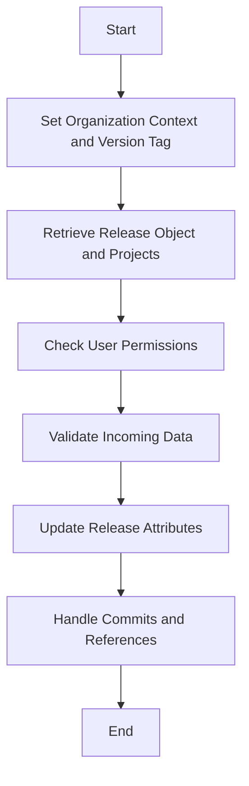

This document will cover the process of updating release metadata, which includes:

1. Setting the organization context and version tag
2. Retrieving the release object and its projects
3. Checking user permissions
4. Validating incoming data
5. Updating release attributes, including handling commits and references.

Technical document: <SwmLink doc-title="Updating Release Metadata">[Updating Release Metadata](/.swm/updating-release-metadata.8oswlhzd.sw.md)</SwmLink>

# [Setting the Organization Context and Version Tag](https://app.swimm.io/repos/Z2l0aHViJTNBJTNBc2VudHJ5LWRlbW8tMSUzQSUzQVN3aW1tLURlbW8=/docs/8oswlhzd#binding-the-organization-context)

The first step in updating release metadata is to set the organization context and version tag. This ensures that all subsequent operations are performed within the correct organizational scope and are associated with the correct release version. This step is crucial for maintaining data integrity and ensuring that updates are applied to the correct release.

# [Retrieving the Release Object and Projects](https://app.swimm.io/repos/Z2l0aHViJTNBJTNBc2VudHJ5LWRlbW8tMSUzQSUzQVN3aW1tLURlbW8=/docs/8oswlhzd#retrieving-the-release-object)

Next, the system attempts to retrieve the release object and its associated projects. If the release does not exist, an error is raised. This step is essential to ensure that the release being updated is valid and that the system has all the necessary information about the release and its projects.

# [Checking User Permissions](https://app.swimm.io/repos/Z2l0aHViJTNBJTNBc2VudHJ5LWRlbW8tMSUzQSUzQVN3aW1tLURlbW8=/docs/8oswlhzd#checking-permissions)

The system then checks if the user has the necessary permissions to update the release. This involves verifying that the user has access to the projects associated with the release. If the user does not have the required permissions, an error is raised. This step is important for maintaining security and ensuring that only authorized users can make changes to the release.

# [Validating Incoming Data](https://app.swimm.io/repos/Z2l0aHViJTNBJTNBc2VudHJ5LWRlbW8tMSUzQSUzQVN3aW1tLURlbW8=/docs/8oswlhzd#validating-incoming-data)

Once permissions are verified, the system validates the incoming data using a serializer. This step ensures that the data being used to update the release is in the correct format and meets all necessary criteria. Validating the data helps prevent errors and ensures that the release is updated with accurate and reliable information.

# [Updating Release Attributes](https://app.swimm.io/repos/Z2l0aHViJTNBJTNBc2VudHJ5LWRlbW8tMSUzQSUzQVN3aW1tLURlbW8=/docs/8oswlhzd#updating-the-releases-attributes)

If the data is valid, the system proceeds to update the release's attributes. This includes updating metadata such as the reference, URL, and dates. Additionally, the system handles commits and references, ensuring that all related data is correctly updated. This step is crucial for keeping the release information up-to-date and accurate.

# [Handling Commits and References](https://app.swimm.io/repos/Z2l0aHViJTNBJTNBc2VudHJ5LWRlbW8tMSUzQSUzQVN3aW1tLURlbW8=/docs/8oswlhzd#handling-commits-and-references)

The final step involves handling commits and references. This includes clearing existing commit data, setting new references, and binding commits to the release. These operations ensure that the release is correctly associated with the relevant commits and that all commit-related data is accurately updated. This step is important for maintaining the integrity of the release's commit history and ensuring that all related data is consistent.

&nbsp;

*This is an auto-generated document by Swimm AI 🌊 and has not yet been verified by a human*

<SwmMeta version="3.0.0" repo-id="Z2l0aHViJTNBJTNBc2VudHJ5LWRlbW8tMSUzQSUzQVN3aW1tLURlbW8=" repo-name="sentry-demo-1" doc-type="product-flows">Powered by [Swimm](/)</SwmMeta>
