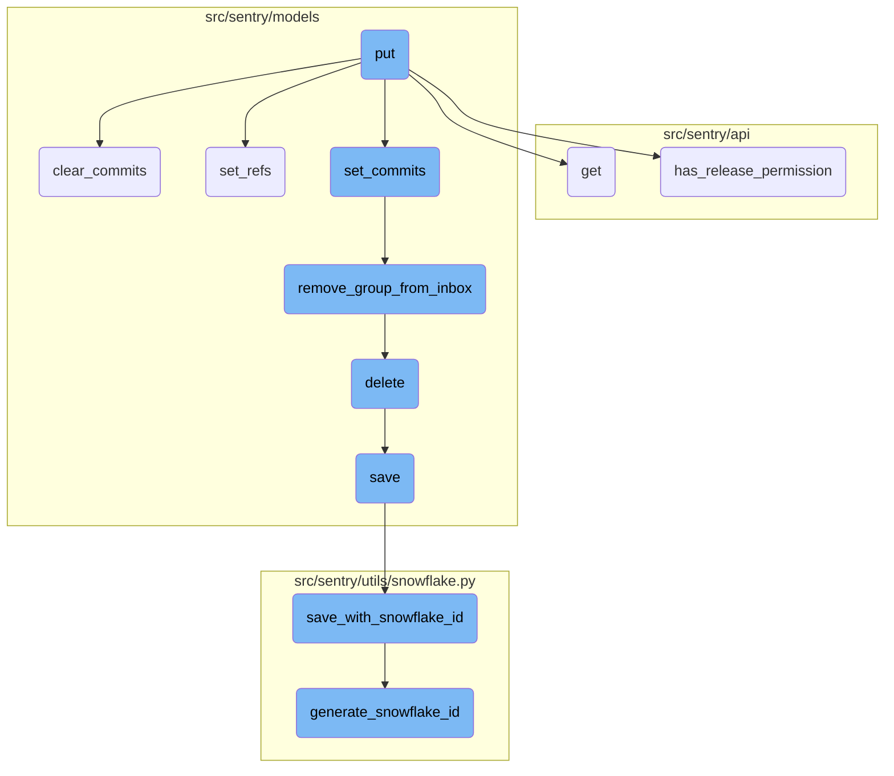
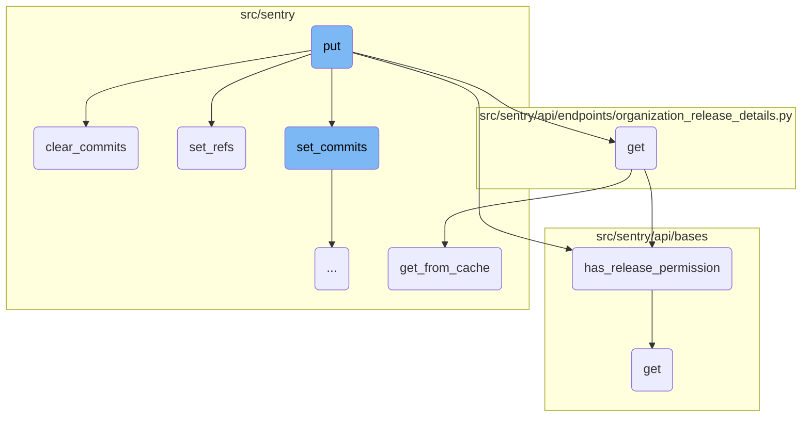
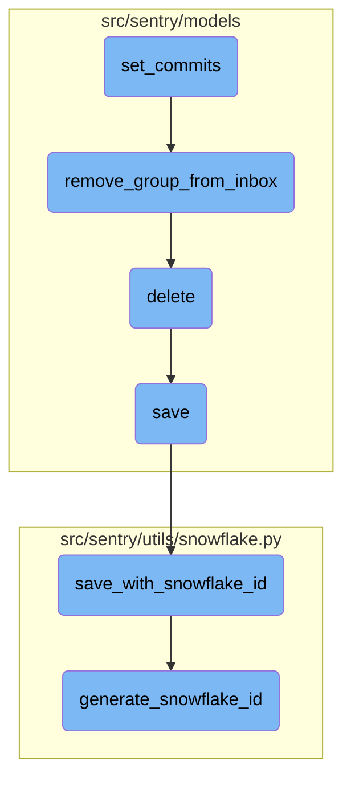

This document provides an overview of the <SwmToken path="src/sentry/api/endpoints/organization_release_details.py" pos="430:3:3" line-data="    def put(self, request: Request, organization, version) -&gt; Response:">`put`</SwmToken> function, which is responsible for updating a release's metadata. It covers the main steps involved in the process, including binding the organization context, retrieving the release object, checking permissions, validating incoming data, and updating the release's attributes.

The <SwmToken path="src/sentry/api/endpoints/organization_release_details.py" pos="430:3:3" line-data="    def put(self, request: Request, organization, version) -&gt; Response:">`put`</SwmToken> function updates a release's information. First, it sets the organization context and version tag. Then, it tries to find the release and its projects. If the release isn't found, it raises an error. Next, it checks if the user has permission to update the release. If the user is allowed, it validates the new data and updates the release's details, including handling commits and references.

Here is a high level diagram of the flow, showing only the most important functions:



# Flow drill down

First, we'll zoom into this section of the flow:



<SwmSnippet path="/src/sentry/api/endpoints/organization_release_details.py" line="430">

---

## Handling release updates

The <SwmToken path="src/sentry/api/endpoints/organization_release_details.py" pos="430:3:3" line-data="    def put(self, request: Request, organization, version) -&gt; Response:">`put`</SwmToken> function is responsible for updating a release's metadata, such as the ref, URL, and dates. It first binds the organization context and sets the version tag. It then attempts to retrieve the release object and its associated projects. If the release does not exist, it raises a <SwmToken path="src/sentry/api/endpoints/organization_release_details.py" pos="445:3:3" line-data="            raise ResourceDoesNotExist">`ResourceDoesNotExist`</SwmToken> exception. The function checks if the user has permission to update the release and validates the incoming data using <SwmToken path="src/sentry/api/endpoints/organization_release_details.py" pos="49:2:2" line-data="class OrganizationReleaseSerializer(ReleaseSerializer):">`OrganizationReleaseSerializer`</SwmToken>. If the data is valid, it updates the release's attributes and handles commits and refs accordingly.

```python
    def put(self, request: Request, organization, version) -> Response:
        """

        Update a release. This can change some metadata associated with
        the release (the ref, url, and dates).
        """
        bind_organization_context(organization)

        scope = Scope.get_isolation_scope()
        scope.set_tag("version", version)
        try:
            release = Release.objects.get(organization_id=organization, version=version)
            projects = release.projects.all()
        except Release.DoesNotExist:
            scope.set_tag("failure_reason", "Release.DoesNotExist")
            raise ResourceDoesNotExist

        if not self.has_release_permission(request, organization, release):
            scope.set_tag("failure_reason", "no_release_permission")
            raise ResourceDoesNotExist

```

---

</SwmSnippet>

<SwmSnippet path="/src/sentry/models/release.py" line="1000">

---

### Clearing commits

The <SwmToken path="src/sentry/models/release.py" pos="1000:3:3" line-data="    def clear_commits(self):">`clear_commits`</SwmToken> function deletes all <SwmToken path="src/sentry/models/release.py" pos="1002:5:7" line-data="        Delete all release-specific commit data associated to this release. We will not delete the Commit model values because other releases may use these commits.">`release-specific`</SwmToken> commit data associated with a release without deleting the <SwmToken path="src/sentry/models/release.py" pos="1002:9:9" line-data="        Delete all release-specific commit data associated to this release. We will not delete the Commit model values because other releases may use these commits.">`commit`</SwmToken> model values, as other releases may use these commits. It removes entries from <SwmToken path="src/sentry/models/release.py" pos="1006:7:7" line-data="            from sentry.models.releaseheadcommit import ReleaseHeadCommit">`releaseheadcommit`</SwmToken> and <SwmToken path="src/sentry/models/release.py" pos="1005:7:7" line-data="            from sentry.models.releasecommit import ReleaseCommit">`releasecommit`</SwmToken> models and resets the release's authors, commit count, and last commit ID.

```python
    def clear_commits(self):
        """
        Delete all release-specific commit data associated to this release. We will not delete the Commit model values because other releases may use these commits.
        """
        with sentry_sdk.start_span(op="clear_commits"):
            from sentry.models.releasecommit import ReleaseCommit
            from sentry.models.releaseheadcommit import ReleaseHeadCommit

            ReleaseHeadCommit.objects.get(
                organization_id=self.organization_id, release=self
            ).delete()
            ReleaseCommit.objects.filter(
                organization_id=self.organization_id, release=self
            ).delete()

            self.authors = []
            self.commit_count = 0
            self.last_commit_id = None
            self.save()
```

---

</SwmSnippet>

<SwmSnippet path="/src/sentry/api/endpoints/organization_release_details.py" line="328">

---

### Fetching release details

The <SwmToken path="src/sentry/api/endpoints/organization_release_details.py" pos="328:3:3" line-data="    def get(self, request: Request, organization, version) -&gt; Response:">`get`</SwmToken> function returns details on an individual release. It retrieves the release object and checks if the user has permission to access it. If health data is requested, it fetches session time bounds and adjacent releases. The function then serializes the release object along with additional metadata and returns it in the response.

```python
    def get(self, request: Request, organization, version) -> Response:
        """

        Return details on an individual release.
        """
        # Dictionary responsible for storing selected project meta data
        current_project_meta = {}
        project_id = request.GET.get("project")
        with_health = request.GET.get("health") == "1"
        with_adoption_stages = request.GET.get("adoptionStages") == "1"
        summary_stats_period = request.GET.get("summaryStatsPeriod") or "14d"
        health_stats_period = request.GET.get("healthStatsPeriod") or ("24h" if with_health else "")
        sort = request.GET.get("sort") or "date"
        status_filter = request.GET.get("status", "open")
        query = request.GET.get("query")

        if summary_stats_period not in STATS_PERIODS:
            raise ParseError(detail=get_stats_period_detail("summaryStatsPeriod", STATS_PERIODS))
        if health_stats_period and health_stats_period not in STATS_PERIODS:
            raise ParseError(detail=get_stats_period_detail("healthStatsPeriod", STATS_PERIODS))

```

---

</SwmSnippet>

<SwmSnippet path="/src/sentry/models/release.py" line="600">

---

### Setting references

The <SwmToken path="src/sentry/models/release.py" pos="600:3:3" line-data="    def set_refs(self, refs, user_id, fetch=False):">`set_refs`</SwmToken> function associates commit references with a release. It validates the repository names and handles commit ranges. For each reference, it updates the head commit for the repository and release. If the <SwmToken path="src/sentry/models/release.py" pos="600:14:14" line-data="    def set_refs(self, refs, user_id, fetch=False):">`fetch`</SwmToken> flag is set, it triggers a task to fetch commits.

```python
    def set_refs(self, refs, user_id, fetch=False):
        with sentry_sdk.start_span(op="set_refs"):
            from sentry.api.exceptions import InvalidRepository
            from sentry.models.commit import Commit
            from sentry.models.releaseheadcommit import ReleaseHeadCommit
            from sentry.models.repository import Repository
            from sentry.tasks.commits import fetch_commits

            # TODO: this does the wrong thing unless you are on the most
            # recent release.  Add a timestamp compare?
            prev_release = (
                type(self)
                .objects.filter(
                    organization_id=self.organization_id, projects__in=self.projects.all()
                )
                .extra(select={"sort": "COALESCE(date_released, date_added)"})
                .exclude(version=self.version)
                .order_by("-sort")
                .first()
            )

```

---

</SwmSnippet>

<SwmSnippet path="/src/sentry/api/bases/organization.py" line="638">

---

## Checking release permissions

The <SwmToken path="src/sentry/api/bases/organization.py" pos="638:3:3" line-data="    def has_release_permission(">`has_release_permission`</SwmToken> function checks if the given request has permission to access a release based on the projects associated with the release. It caches the results for a minute based on the unique combination of actor, organization, release, and project <SwmToken path="src/sentry/api/bases/organization.py" pos="651:1:1" line-data="        ids.">`ids`</SwmToken>. If the release is associated with any projects the user has access to, the function returns `True`.

```python
    def has_release_permission(
        self,
        request: Request,
        organization: Organization | RpcOrganization,
        release: Release | None = None,
        project_ids: set[int] | None = None,
    ) -> bool:
        """
        Does the given request have permission to access this release, based
        on the projects to which the release is attached?

        If the given request has an actor (user or ApiKey), cache the results
        for a minute on the unique combination of actor,org,release, and project
        ids.
        """
        actor_id = None
        has_perms = None
        key = None
        if getattr(request, "user", None) and request.user.id:
            actor_id = "user:%s" % request.user.id
        if getattr(request, "auth", None) and getattr(request.auth, "id", None):
```

---

</SwmSnippet>

<SwmSnippet path="/src/sentry/api/bases/avatar.py" line="55">

---

### Serializing objects

The <SwmToken path="src/sentry/api/bases/avatar.py" pos="55:3:3" line-data="    def get(self, request: Request, **kwargs: Any) -&gt; Response:">`get`</SwmToken> function in <SwmPath>[src/sentry/api/bases/avatar.py](src/sentry/api/bases/avatar.py)</SwmPath> serializes an object and returns it in the response. It retrieves the object type from the keyword arguments and uses the <SwmToken path="src/sentry/api/bases/avatar.py" pos="57:5:5" line-data="        return Response(serialize(obj, request.user, **kwargs))">`serialize`</SwmToken> function to convert it into a response format.

```python
    def get(self, request: Request, **kwargs: Any) -> Response:
        obj = kwargs.pop(self.object_type, None)
        return Response(serialize(obj, request.user, **kwargs))
```

---

</SwmSnippet>

<SwmSnippet path="/src/sentry/db/models/manager/base.py" line="284">

---

### Caching database queries

The <SwmToken path="src/sentry/db/models/manager/base.py" pos="284:3:3" line-data="    def get_from_cache(">`get_from_cache`</SwmToken> function is a wrapper around <SwmToken path="src/sentry/db/models/manager/base.py" pos="288:5:7" line-data="        Wrapper around QuerySet.get which supports caching of the">`QuerySet.get`</SwmToken> that supports caching of the intermediate value. It ensures that the cache key is cleared on save and validates the result before returning it. If the result is not found in the cache, it queries the database and stores the result in both the Django and local caches.

```python
    def get_from_cache(
        self, use_replica: bool = settings.SENTRY_MODEL_CACHE_USE_REPLICA, **kwargs: Any
    ) -> M:
        """
        Wrapper around QuerySet.get which supports caching of the
        intermediate value.  Callee is responsible for making sure
        the cache key is cleared on save.
        """
        if not self.cache_fields:
            raise ValueError("We cannot cache this query. Just hit the database.")

        key, pk_name, value = self._get_cacheable_kv_from_kwargs(kwargs)
        if key not in self.cache_fields and key != pk_name:
            raise ValueError("We cannot cache this query. Just hit the database.")

        cache_key = self.__get_lookup_cache_key(**{key: value})
        local_cache = self._get_local_cache()

        def validate_result(inst: Any) -> M:
            if isinstance(inst, self.model) and (key != pk_name or int(value) == inst.pk):
                return inst
```

---

</SwmSnippet>

Now, lets zoom into this section of the flow:



<SwmSnippet path="/src/sentry/models/release.py" line="655">

---

## Binding commits to a release

The function <SwmToken path="src/sentry/models/release.py" pos="655:3:3" line-data="    def set_commits(self, commit_list):">`set_commits`</SwmToken> binds a list of commits to a release. It first sorts the commits in reverse order and filters out any commits that should be ignored. It then acquires a lock to ensure no concurrent modifications. The function deletes any existing commit logs for the release and processes each commit, creating or updating <SwmToken path="src/sentry/models/release.py" pos="659:11:11" line-data="        This will clear any existing commit log and replace it with the given">`commit`</SwmToken> objects and associating them with the release. It also handles the creation of <SwmToken path="src/sentry/models/release.py" pos="673:7:7" line-data="        from sentry.models.releasecommit import ReleaseCommit">`releasecommit`</SwmToken> and <SwmToken path="src/sentry/models/release.py" pos="674:7:7" line-data="        from sentry.models.releaseheadcommit import ReleaseHeadCommit">`releaseheadcommit`</SwmToken> entries, updates the release with commit statistics, and resolves any groups linked to the commits.

```python
    def set_commits(self, commit_list):
        """
        Bind a list of commits to this release.

        This will clear any existing commit log and replace it with the given
        commits.
        """

        # Sort commit list in reverse order
        commit_list.sort(key=lambda commit: commit.get("timestamp", 0), reverse=True)

        # TODO(dcramer): this function could use some cleanup/refactoring as it's a bit unwieldy
        from sentry.integrations.tasks.kick_off_status_syncs import kick_off_status_syncs
        from sentry.models.commit import Commit
        from sentry.models.group import Group, GroupStatus
        from sentry.models.grouplink import GroupLink
        from sentry.models.groupresolution import GroupResolution
        from sentry.models.pullrequest import PullRequest
        from sentry.models.releasecommit import ReleaseCommit
        from sentry.models.releaseheadcommit import ReleaseHeadCommit
        from sentry.models.repository import Repository
```

---

</SwmSnippet>

<SwmSnippet path="/src/sentry/models/groupinbox.py" line="96">

---

## Removing group from inbox

The function <SwmToken path="src/sentry/models/groupinbox.py" pos="96:2:2" line-data="def remove_group_from_inbox(group, action=None, user=None, referrer=None):">`remove_group_from_inbox`</SwmToken> removes a group from the inbox. It first tries to find the <SwmToken path="src/sentry/models/groupinbox.py" pos="98:5:5" line-data="        group_inbox = GroupInbox.objects.get(group=group)">`GroupInbox`</SwmToken> entry for the given group and deletes it. If the action is <SwmToken path="src/sentry/models/groupinbox.py" pos="101:9:9" line-data="        if action is GroupInboxRemoveAction.MARK_REVIEWED and user is not None:">`MARK_REVIEWED`</SwmToken> and a user is provided, it creates an <SwmToken path="src/sentry/models/groupinbox.py" pos="102:1:1" line-data="            Activity.objects.create(">`Activity`</SwmToken> entry to mark the group as reviewed and records the group history.

```python
def remove_group_from_inbox(group, action=None, user=None, referrer=None):
    try:
        group_inbox = GroupInbox.objects.get(group=group)
        group_inbox.delete()

        if action is GroupInboxRemoveAction.MARK_REVIEWED and user is not None:
            Activity.objects.create(
                project_id=group_inbox.group.project_id,
                group_id=group_inbox.group_id,
                type=ActivityType.MARK_REVIEWED.value,
                user_id=user.id,
            )
            record_group_history(group, GroupHistoryStatus.REVIEWED, actor=user)
    except GroupInbox.DoesNotExist:
        pass
```

---

</SwmSnippet>

<SwmSnippet path="/src/sentry/models/project.py" line="718">

---

## Deleting a project

The function <SwmToken path="src/sentry/models/project.py" pos="718:3:3" line-data="    def delete(self, *args, **kwargs):">`delete`</SwmToken> manually cascades the deletion of a project by removing notification settings and saving an outbox entry before calling the superclass's delete method.

```python
    def delete(self, *args, **kwargs):
        # There is no foreign key relationship so we have to manually cascade.
        notifications_service.remove_notification_settings_for_project(project_id=self.id)

        with outbox_context(transaction.atomic(router.db_for_write(Project))):
            Project.outbox_for_update(self.id, self.organization_id).save()
            return super().delete(*args, **kwargs)
```

---

</SwmSnippet>

<SwmSnippet path="/src/sentry/models/project.py" line="365">

---

## Saving a project

The function <SwmToken path="src/sentry/models/project.py" pos="365:3:3" line-data="    def save(self, *args, **kwargs):">`save`</SwmToken> ensures that a project has a unique slug before saving it. If the <SwmToken path="src/sentry/models/project.py" pos="379:3:3" line-data="        if SENTRY_USE_SNOWFLAKE:">`SENTRY_USE_SNOWFLAKE`</SwmToken> setting is enabled, it uses the <SwmToken path="src/sentry/models/project.py" pos="381:1:1" line-data="            save_with_snowflake_id(">`save_with_snowflake_id`</SwmToken> function to generate a unique ID for the project.

```python
    def save(self, *args, **kwargs):
        if not self.slug:
            lock = locks.get(
                f"slug:project:{self.organization_id}", duration=5, name="project_slug"
            )
            with TimedRetryPolicy(10)(lock.acquire):
                slugify_instance(
                    self,
                    self.name,
                    organization=self.organization,
                    reserved=RESERVED_PROJECT_SLUGS,
                    max_length=50,
                )

        if SENTRY_USE_SNOWFLAKE:
            snowflake_redis_key = "project_snowflake_key"
            save_with_snowflake_id(
                instance=self,
                snowflake_redis_key=snowflake_redis_key,
                save_callback=lambda: super(Project, self).save(*args, **kwargs),
            )
```

---

</SwmSnippet>

<SwmSnippet path="/src/sentry/utils/snowflake.py" line="47">

---

## Saving with snowflake ID

The function <SwmToken path="src/sentry/utils/snowflake.py" pos="47:2:2" line-data="def save_with_snowflake_id(">`save_with_snowflake_id`</SwmToken> generates a unique snowflake ID for an instance and attempts to save it. If an <SwmToken path="src/sentry/utils/snowflake.py" pos="61:3:3" line-data="        except IntegrityError:">`IntegrityError`</SwmToken> occurs, it retries the operation up to a maximum number of times.

```python
def save_with_snowflake_id(
    instance: BaseModel, snowflake_redis_key: str, save_callback: Callable[[], object]
) -> None:
    assert uses_snowflake_id(
        instance.__class__
    ), "Only models decorated with uses_snowflake_id can be saved with save_with_snowflake_id()"

    for _ in range(settings.MAX_REDIS_SNOWFLAKE_RETRY_COUNTER):
        if not instance.id:
            instance.id = generate_snowflake_id(snowflake_redis_key)
        try:
            with enforce_constraints(transaction.atomic(using=router.db_for_write(type(instance)))):
                save_callback()
            return
        except IntegrityError:
            instance.id = None  # type: ignore[assignment]  # see typeddjango/django-stubs#2014
    raise MaxSnowflakeRetryError
```

---

</SwmSnippet>

<SwmSnippet path="/src/sentry/utils/snowflake.py" line="113">

---

## Generating a snowflake ID

The function <SwmToken path="src/sentry/utils/snowflake.py" pos="113:2:2" line-data="def generate_snowflake_id(redis_key: str) -&gt; int:">`generate_snowflake_id`</SwmToken> generates a unique snowflake ID based on the current time, region, and a sequence value obtained from Redis. It validates the generated ID before returning it.

```python
def generate_snowflake_id(redis_key: str) -> int:
    segment_values = {}

    segment_values[VERSION_ID] = msb_0_ordering(settings.SNOWFLAKE_VERSION_ID, VERSION_ID.length)

    try:
        segment_values[REGION_ID] = get_local_region().snowflake_id
    except RegionContextError:  # expected if running in monolith mode
        segment_values[REGION_ID] = NULL_REGION_ID

    current_time = datetime.now().timestamp()
    # supports up to 130 years
    segment_values[TIME_DIFFERENCE] = int(current_time - settings.SENTRY_SNOWFLAKE_EPOCH_START)

    snowflake_id = 0
    (
        segment_values[TIME_DIFFERENCE],
        segment_values[REGION_SEQUENCE],
    ) = get_sequence_value_from_redis(redis_key, segment_values[TIME_DIFFERENCE])

    for segment in BIT_SEGMENT_SCHEMA:
```

---

</SwmSnippet>

&nbsp;

*This is an auto-generated document by Swimm AI 🌊 and has not yet been verified by a human*

<SwmMeta version="3.0.0" repo-id="Z2l0aHViJTNBJTNBc2VudHJ5LWRlbW8tMSUzQSUzQVN3aW1tLURlbW8=" repo-name="sentry-demo-1" doc-type="flows"><sup>Powered by [Swimm](/)</sup></SwmMeta>
