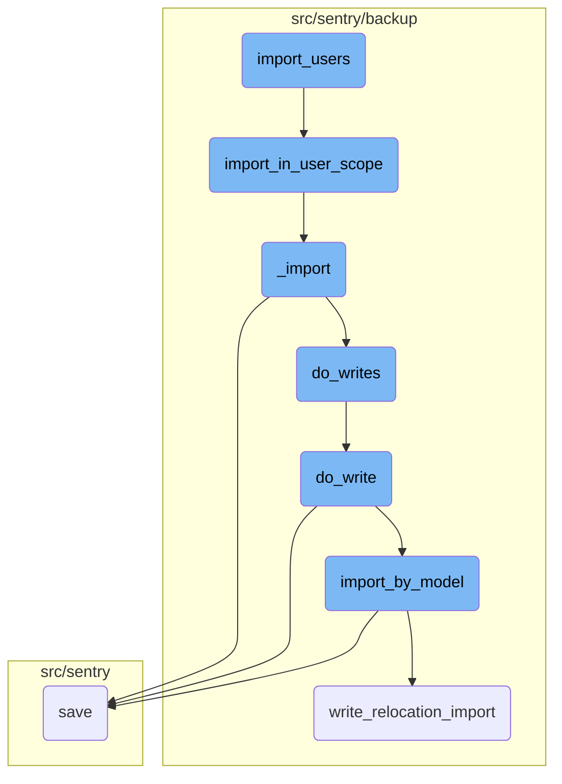
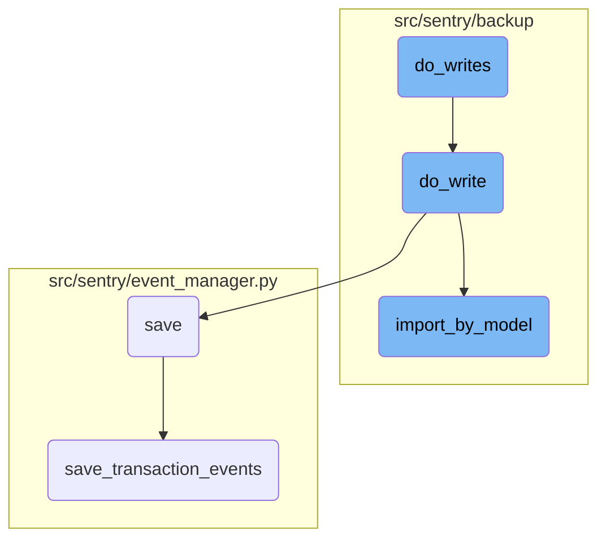

This document explains the process of importing users from an exported JSON file. The process involves setting up parameters, handling the import within the user scope, and performing the core import logic.

The flow starts with setting up the necessary parameters for importing users. Then, it handles the import within the user scope, filtering user data if needed. The core import logic is executed, which involves parsing the JSON models and writing the data. Finally, the data is saved and any necessary <SwmToken path="src/sentry/event_manager.py" pos="462:1:3" line-data="        post-processing.">`post-processing`</SwmToken> is done.

Here is a high level diagram of the flow, showing only the most important functions:



# Flow drill down

First, we'll zoom into this section of the flow:

```mermaid
graph TD;
      subgraph src/sentry
74c81bb1cce8bc6a92c0bba12b7259adab1f033db10adb7e36333b7cfa668234(import_users):::mainFlowStyle --> fc4b14a0ef14554fa02ed09e62998efa534babb7973ce7546938835ce523a132(import_in_user_scope):::mainFlowStyle
end

subgraph src/sentry
fc4b14a0ef14554fa02ed09e62998efa534babb7973ce7546938835ce523a132(import_in_user_scope):::mainFlowStyle --> e51390835e25abe9700c58ce684275b91c592cbc3798916fccfb8d5e98213501(_import):::mainFlowStyle
end

subgraph src/sentry
e51390835e25abe9700c58ce684275b91c592cbc3798916fccfb8d5e98213501(_import):::mainFlowStyle --> 5086692df24257d76a0adf892eba843feac14033d92b4a32022b125d5a725f9b(save)
end

subgraph src/sentry
e51390835e25abe9700c58ce684275b91c592cbc3798916fccfb8d5e98213501(_import):::mainFlowStyle --> 26207a08d7fb570302a7c1ba260755115f33628088a15b2009f16110f8f0dae8(do_writes):::mainFlowStyle
end

subgraph src/sentry
26207a08d7fb570302a7c1ba260755115f33628088a15b2009f16110f8f0dae8(do_writes):::mainFlowStyle --> n7qzx(...)
end

subgraph src/sentry
5086692df24257d76a0adf892eba843feac14033d92b4a32022b125d5a725f9b(save) --> b8052a0e9cf4dd2783dd9f9b401321908e36ff05fa95ad9dd7944757173348b4(save_transaction_events)
end


      classDef mainFlowStyle color:#000000,fill:#7CB9F4
classDef rootsStyle color:#000000,fill:#00FFF4
classDef Style1 color:#000000,fill:#00FFAA
classDef Style2 color:#000000,fill:#FFFF00
classDef Style3 color:#000000,fill:#AA7CB9

%% Swimm:
%% graph TD;
%%       subgraph <SwmPath>[src/sentry/](src/sentry/)</SwmPath>
%% 74c81bb1cce8bc6a92c0bba12b7259adab1f033db10adb7e36333b7cfa668234(import_users):::mainFlowStyle --> fc4b14a0ef14554fa02ed09e62998efa534babb7973ce7546938835ce523a132(import_in_user_scope):::mainFlowStyle
%% end
%% 
%% subgraph <SwmPath>[src/sentry/](src/sentry/)</SwmPath>
%% fc4b14a0ef14554fa02ed09e62998efa534babb7973ce7546938835ce523a132(import_in_user_scope):::mainFlowStyle --> e51390835e25abe9700c58ce684275b91c592cbc3798916fccfb8d5e98213501(_import):::mainFlowStyle
%% end
%% 
%% subgraph <SwmPath>[src/sentry/](src/sentry/)</SwmPath>
%% e51390835e25abe9700c58ce684275b91c592cbc3798916fccfb8d5e98213501(_import):::mainFlowStyle --> 5086692df24257d76a0adf892eba843feac14033d92b4a32022b125d5a725f9b(save)
%% end
%% 
%% subgraph <SwmPath>[src/sentry/](src/sentry/)</SwmPath>
%% e51390835e25abe9700c58ce684275b91c592cbc3798916fccfb8d5e98213501(_import):::mainFlowStyle --> 26207a08d7fb570302a7c1ba260755115f33628088a15b2009f16110f8f0dae8(do_writes):::mainFlowStyle
%% end
%% 
%% subgraph <SwmPath>[src/sentry/](src/sentry/)</SwmPath>
%% 26207a08d7fb570302a7c1ba260755115f33628088a15b2009f16110f8f0dae8(do_writes):::mainFlowStyle --> n7qzx(...)
%% end
%% 
%% subgraph <SwmPath>[src/sentry/](src/sentry/)</SwmPath>
%% 5086692df24257d76a0adf892eba843feac14033d92b4a32022b125d5a725f9b(save) --> b8052a0e9cf4dd2783dd9f9b401321908e36ff05fa95ad9dd7944757173348b4(save_transaction_events)
%% end
%% 
%% 
%%       classDef mainFlowStyle color:#000000,fill:#7CB9F4
%% classDef rootsStyle color:#000000,fill:#00FFF4
%% classDef Style1 color:#000000,fill:#00FFAA
%% classDef Style2 color:#000000,fill:#FFFF00
%% classDef Style3 color:#000000,fill:#AA7CB9
```



<SwmSnippet path="/src/sentry/runner/commands/backup.py" line="667">

---

## <SwmToken path="src/sentry/runner/commands/backup.py" pos="667:2:2" line-data="def import_users(">`import_users`</SwmToken>

The <SwmToken path="src/sentry/runner/commands/backup.py" pos="667:2:2" line-data="def import_users(">`import_users`</SwmToken> function is the entry point for importing users from an exported JSON file. It sets up the necessary parameters and calls <SwmToken path="src/sentry/runner/commands/backup.py" pos="682:11:11" line-data="    from sentry.backup.imports import import_in_user_scope">`import_in_user_scope`</SwmToken> to handle the import process within the user scope.

```python
def import_users(
    src: IO[bytes],
    decrypt_with: IO[bytes],
    decrypt_with_gcp_kms: IO[bytes],
    filter_usernames: str,
    filter_usernames_file: IO[str],
    findings_file: IO[str],
    merge_users: bool,
    no_prompt: bool,
    silent: bool,
) -> None:
    """
    Import the Sentry users from an exported JSON file.
    """

    from sentry.backup.imports import import_in_user_scope

    printer = get_printer(silent=silent, no_prompt=no_prompt)
    with write_import_findings(findings_file, printer):
        import_in_user_scope(
            src,
```

---

</SwmSnippet>

<SwmSnippet path="/src/sentry/backup/imports.py" line="492">

---

## <SwmToken path="src/sentry/backup/imports.py" pos="492:2:2" line-data="def import_in_user_scope(">`import_in_user_scope`</SwmToken>

The <SwmToken path="src/sentry/backup/imports.py" pos="492:2:2" line-data="def import_in_user_scope(">`import_in_user_scope`</SwmToken> function performs the import within the <SwmToken path="src/sentry/backup/imports.py" pos="501:12:12" line-data="    Perform an import in the `User` scope, meaning that only models with `RelocationScope.User` will">`User`</SwmToken> scope. It filters the user data based on the provided <SwmToken path="src/sentry/backup/imports.py" pos="497:1:1" line-data="    user_filter: set[str] | None = None,">`user_filter`</SwmToken> and calls the <SwmToken path="src/sentry/backup/imports.py" pos="511:3:3" line-data="    return _import(">`_import`</SwmToken> function to handle the core import logic.

```python
def import_in_user_scope(
    src: IO[bytes],
    *,
    decryptor: Decryptor | None = None,
    flags: ImportFlags | None = None,
    user_filter: set[str] | None = None,
    printer: Printer,
):
    """
    Perform an import in the `User` scope, meaning that only models with `RelocationScope.User` will
    be imported from the provided `src` file.

    The `user_filter` argument allows imports to be filtered by username. If the argument is set to
    `None`, there is no filtering, meaning all encountered users are imported.
    """

    # Import here to prevent circular module resolutions.
    from sentry.users.models.user import User

    return _import(
        src,
```

---

</SwmSnippet>

<SwmSnippet path="/src/sentry/backup/imports.py" line="87">

---

## \_import

The <SwmToken path="src/sentry/backup/imports.py" pos="87:2:2" line-data="def _import(">`_import`</SwmToken> function is responsible for the core import logic. It parses the JSON models from the provided content and writes the data using the <SwmToken path="src/sentry/backup/imports.py" pos="404:1:1" line-data="            do_write(import_write_context, pk_map, model_name, json_data, offset)">`do_write`</SwmToken> and <SwmToken path="src/sentry/backup/imports.py" pos="396:3:3" line-data="    def do_writes(pk_map: PrimaryKeyMap) -&gt; None:">`do_writes`</SwmToken> functions. It also handles resolving organization slugs from the primary key map.

```python
def _import(
    src: IO[bytes],
    scope: ImportScope,
    *,
    decryptor: Decryptor | None = None,
    flags: ImportFlags | None = None,
    filter_by: Filter | None = None,
    printer: Printer,
):
    """
    Imports core data for a Sentry installation.

    It is generally preferable to avoid calling this function directly, as there are certain
    combinations of input parameters that should not be used together. Instead, use one of the other
    wrapper functions in this file, named `import_in_XXX_scope()`.
    """

    # Import here to prevent circular module resolutions.
    from sentry.models.organization import Organization
    from sentry.models.organizationmember import OrganizationMember
    from sentry.users.models.email import Email
```

---

</SwmSnippet>

<SwmSnippet path="/src/sentry/event_manager.py" line="448">

---

## save

The <SwmToken path="src/sentry/event_manager.py" pos="448:3:3" line-data="    def save(">`save`</SwmToken> function processes and saves events after normalizing and processing them. It handles adjacent models such as releases and environments, writes the event into the event stream, and ensures deduplication in Snuba.

```python
    def save(
        self,
        project_id: int | None,
        raw: bool = False,
        assume_normalized: bool = False,
        start_time: float | None = None,
        cache_key: str | None = None,
        skip_send_first_transaction: bool = False,
        has_attachments: bool = False,
    ) -> Event:
        """
        After normalizing and processing an event, save adjacent models such as
        releases and environments to postgres and write the event into
        eventstream. From there it will be picked up by Snuba and
        post-processing.

        We re-insert events with duplicate IDs into Snuba, which is responsible
        for deduplicating events. Since deduplication in Snuba is on the primary
        key (based on event ID, project ID and day), events with same IDs are only
        deduplicated if their timestamps fall on the same day. The latest event
        always wins and overwrites the value of events received earlier in that day.
```

---

</SwmSnippet>

<SwmSnippet path="/src/sentry/event_manager.py" line="3040">

---

## <SwmToken path="src/sentry/event_manager.py" pos="3040:2:2" line-data="def save_transaction_events(jobs: Sequence[Job], projects: ProjectsMapping) -&gt; Sequence[Job]:">`save_transaction_events`</SwmToken>

The <SwmToken path="src/sentry/event_manager.py" pos="3040:2:2" line-data="def save_transaction_events(jobs: Sequence[Job], projects: ProjectsMapping) -&gt; Sequence[Job]:">`save_transaction_events`</SwmToken> function handles the saving of transaction-specific events. It processes various aspects of the events, such as releases, environments, and metrics, and inserts the events into the event stream.

```python
def save_transaction_events(jobs: Sequence[Job], projects: ProjectsMapping) -> Sequence[Job]:
    organization_ids = {project.organization_id for project in projects.values()}
    organizations = {o.id: o for o in Organization.objects.get_many_from_cache(organization_ids)}

    for project in projects.values():
        try:
            project.set_cached_field_value("organization", organizations[project.organization_id])
        except KeyError:
            continue

    set_measurement(measurement_name="jobs", value=len(jobs))
    set_measurement(measurement_name="projects", value=len(projects))

    _get_or_create_release_many(jobs, projects)
    _get_event_user_many(jobs, projects)
    _derive_plugin_tags_many(jobs, projects)
    _derive_interface_tags_many(jobs)
    _calculate_span_grouping(jobs, projects)
    _materialize_metadata_many(jobs)
    _get_or_create_environment_many(jobs, projects)
    _get_or_create_release_associated_models(jobs, projects)
```

---

</SwmSnippet>

Now, lets zoom into this section of the flow:



<SwmSnippet path="/src/sentry/backup/imports.py" line="399">

---

## Handling deferred organization authentication tokens

The <SwmToken path="src/sentry/backup/imports.py" pos="396:3:3" line-data="    def do_writes(pk_map: PrimaryKeyMap) -&gt; None:">`do_writes`</SwmToken> function iterates over the JSON models extracted from the content. If the model name matches the organization authentication token model, it defers the processing by appending the JSON data to <SwmToken path="src/sentry/backup/imports.py" pos="401:1:1" line-data="                deferred_org_auth_tokens.append(json_data)">`deferred_org_auth_tokens`</SwmToken> and continues to the next iteration.

```python
        for model_name, json_data, offset in yield_json_models(content):
            if model_name == org_auth_token_model_name:
                deferred_org_auth_tokens.append(json_data)
                continue
```

---

</SwmSnippet>

<SwmSnippet path="/src/sentry/backup/imports.py" line="404">

---

## Writing model data

For other models, the <SwmToken path="src/sentry/backup/imports.py" pos="396:3:3" line-data="    def do_writes(pk_map: PrimaryKeyMap) -&gt; None:">`do_writes`</SwmToken> function calls <SwmToken path="src/sentry/backup/imports.py" pos="404:1:1" line-data="            do_write(import_write_context, pk_map, model_name, json_data, offset)">`do_write`</SwmToken> to handle the actual writing of the model data.

```python
            do_write(import_write_context, pk_map, model_name, json_data, offset)
```

---

</SwmSnippet>

<SwmSnippet path="/src/sentry/backup/imports.py" line="320">

---

### Importing by model

The <SwmToken path="src/sentry/backup/imports.py" pos="404:1:1" line-data="            do_write(import_write_context, pk_map, model_name, json_data, offset)">`do_write`</SwmToken> function uses <SwmToken path="src/sentry/backup/imports.py" pos="320:5:5" line-data="        result = import_by_model(">`import_by_model`</SwmToken> to import the model data. It passes various parameters including the model name, scope, flags, and JSON data to perform the import operation.

```python
        result = import_by_model(
            import_model_name=model_name_str,
            scope=import_write_context.scope,
            flags=import_write_context.flags,
            filter_by=import_write_context.filter_by,
            pk_map=RpcPrimaryKeyMap.into_rpc(pk_map.partition(dep_models)),
            json_data=json_data,
            min_ordinal=min_ordinal,
        )
```

---

</SwmSnippet>

<SwmSnippet path="/src/sentry/backup/imports.py" line="330">

---

### Handling import errors

If the import operation returns an error, <SwmToken path="src/sentry/backup/imports.py" pos="404:1:1" line-data="            do_write(import_write_context, pk_map, model_name, json_data, offset)">`do_write`</SwmToken> handles it by logging the error and raising an <SwmToken path="src/sentry/backup/imports.py" pos="335:3:3" line-data="            raise ImportingError(result)">`ImportingError`</SwmToken>.

```python
        if isinstance(result, RpcImportError):
            printer.echo(result.pretty(), err=True)
            if result.get_kind() == RpcImportErrorKind.IntegrityError:
                warningText = ">> Are you restoring from a backup of the same version of Sentry?\n>> Are you restoring onto a clean database?\n>> If so then this IntegrityError might be our fault, you can open an issue here:\n>> https://github.com/getsentry/sentry/issues/new/choose"
                printer.echo(warningText, err=True)
            raise ImportingError(result)
```

---

</SwmSnippet>

<SwmSnippet path="/src/sentry/backup/imports.py" line="337">

---

### Extending primary key map

Upon successful import, <SwmToken path="src/sentry/backup/imports.py" pos="404:1:1" line-data="            do_write(import_write_context, pk_map, model_name, json_data, offset)">`do_write`</SwmToken> extends the primary key map with the new mappings returned by the import operation.

```python
        out_pk_map: PrimaryKeyMap = result.mapped_pks.from_rpc()
        pk_map.extend(out_pk_map)
```

---

</SwmSnippet>

<SwmSnippet path="/src/sentry/backup/imports.py" line="344">

---

### Creating control import chunk replica

If the imported model lives in the control silo, <SwmToken path="src/sentry/backup/imports.py" pos="404:1:1" line-data="            do_write(import_write_context, pk_map, model_name, json_data, offset)">`do_write`</SwmToken> creates a replica of the <SwmToken path="src/sentry/backup/imports.py" pos="342:23:23" line-data="        # the RPC divide, we create a replica of the `ControlImportChunk` that successful import">`ControlImportChunk`</SwmToken> to ensure an accurate view of the import result across RPC divides.

```python
        if result.min_ordinal is not None and SiloMode.CONTROL in deps[model_name].silos:
            # Maybe we are resuming an import on a retry. Check to see if this
            # `ControlImportChunkReplica` already exists, and only write it if it does not. There
            # can't be races here, since there is only one celery task running at a time, pushing
            # updates in a synchronous manner.
            existing_control_import_chunk_replica = ControlImportChunkReplica.objects.filter(
                import_uuid=flags.import_uuid, model=model_name_str, min_ordinal=result.min_ordinal
            ).first()
            if existing_control_import_chunk_replica is not None:
                logger.info("import_by_model.control_replica_already_exists", extra=extra)
            else:
                # If `min_ordinal` is not null, these values must not be either.
                assert result.max_ordinal is not None
                assert result.min_source_pk is not None
                assert result.max_source_pk is not None

                inserted = out_pk_map.partition({model_name}, {ImportKind.Inserted}).mapping[
                    model_name_str
                ]
                existing = out_pk_map.partition({model_name}, {ImportKind.Existing}).mapping[
                    model_name_str
```

---

</SwmSnippet>

<SwmSnippet path="/src/sentry/backup/services/import_export/impl.py" line="176">

---

## Importing model data

The <SwmToken path="src/sentry/backup/services/import_export/impl.py" pos="179:17:17" line-data="            # this in the transaction because, while `import_by_model` is generally called in a">`import_by_model`</SwmToken> function checks if the write operation has already occurred by looking for an existing import chunk. If found, it reuses the existing reply to avoid redundant work.

```python
        try:
            # It's possible that this write has already occurred, and we are simply retrying
            # because the response got lost in transit. If so, just re-use that reply. We do
            # this in the transaction because, while `import_by_model` is generally called in a
            # sequential manner, cases like timeouts or long queues may cause a previous call to
            # still be active when the next one is made. We'll check once here for an existing
            # copy of this (uniquely identifiable) import chunk here to short circuit and avoid
            # doing frivolous work. However, this doesn't fully solve our data race error, as it
            # is possible that another runaway process makes the colliding write while we're
            # building our transaction. Thus, we'll check `get_existing_import_chunk()` again if
            # we catch an `IntegrityError` below.
            existing_import_chunk = get_existing_import_chunk(
                batch_model_name, import_flags, import_chunk_type, min_ordinal
            )
            if existing_import_chunk is not None:
                logger.info("import_by_model.already_imported", extra=extra)
                return existing_import_chunk
```

---

</SwmSnippet>

<SwmSnippet path="/src/sentry/backup/services/import_export/impl.py" line="211">

---

### Writing model instance

The function iterates over deserialized objects and writes each model instance to the database. It normalizes the model before relocation import and performs the actual database write.

```python
                for deserialized_object in deserialize("json", json_data, use_natural_keys=False):
                    model_instance = deserialized_object.object
                    inst_model_name = get_model_name(model_instance)

                    if not isinstance(model_instance, BaseModel):
                        return RpcImportError(
                            kind=RpcImportErrorKind.UnexpectedModel,
                            on=InstanceID(model=str(inst_model_name), ordinal=None),
                            left_pk=model_instance.pk,
                            reason=f"Received non-sentry model of kind `{inst_model_name}`",
                        )

                    if model_instance._meta.app_label not in EXCLUDED_APPS or model_instance:
                        if model_instance.get_possible_relocation_scopes() & ok_relocation_scopes:
                            if inst_model_name != batch_model_name:
                                return RpcImportError(
                                    kind=RpcImportErrorKind.UnexpectedModel,
                                    on=InstanceID(model=str(inst_model_name), ordinal=None),
                                    left_pk=model_instance.pk,
                                    reason=f"Received model of kind `{inst_model_name}` when `{batch_model_name}` was expected",
                                )
```

---

</SwmSnippet>

&nbsp;

*This is an auto-generated document by Swimm AI 🌊 and has not yet been verified by a human*

<SwmMeta version="3.0.0" repo-id="Z2l0aHViJTNBJTNBc2VudHJ5LWRlbW8tMSUzQSUzQVN3aW1tLURlbW8=" repo-name="sentry-demo-1" doc-type="flows"><sup>Powered by [Swimm](/)</sup></SwmMeta>
