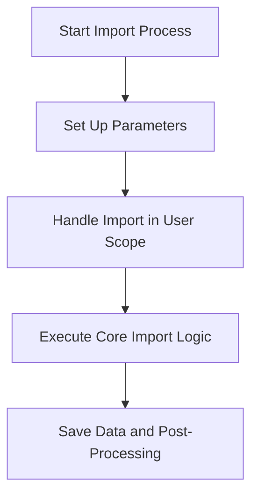

The process of importing users from an exported JSON file involves several steps:

1. Setting up parameters
2. Handling the import within the user scope
3. Executing the core import logic
4. Saving the data and performing post-processing.

Technical document: <SwmLink doc-title="User Import Process">[User Import Process](/.swm/user-import-process.65slrc64.sw.md)</SwmLink>

# [Setting Up Parameters](https://app.swimm.io/repos/Z2l0aHViJTNBJTNBc2VudHJ5LWRlbW8tMSUzQSUzQVN3aW1tLURlbW8=/docs/65slrc64#import_users)

The first step in the user import process is setting up the necessary parameters. These parameters include the source of the JSON file, decryption methods, user filters, and various flags that control the import behavior. This setup ensures that the import process has all the required information to proceed smoothly.

# [Handling Import in User Scope](https://app.swimm.io/repos/Z2l0aHViJTNBJTNBc2VudHJ5LWRlbW8tMSUzQSUzQVN3aW1tLURlbW8=/docs/65slrc64#import_in_user_scope)

Once the parameters are set, the import process is handled within the user scope. This means that only user-related data is processed. The user data can be filtered based on specific criteria, such as usernames. This step ensures that only relevant user data is imported, which helps in maintaining data integrity and relevance.

# [Executing Core Import Logic](https://app.swimm.io/repos/Z2l0aHViJTNBJTNBc2VudHJ5LWRlbW8tMSUzQSUzQVN3aW1tLURlbW8=/docs/65slrc64#_import)

The core import logic involves parsing the JSON models from the provided content and writing the data. This step is crucial as it translates the JSON data into a format that can be stored in the system. The process includes handling various models and ensuring that the data is correctly mapped and written.

# [Saving Data and Post-Processing](https://app.swimm.io/repos/Z2l0aHViJTNBJTNBc2VudHJ5LWRlbW8tMSUzQSUzQVN3aW1tLURlbW8=/docs/65slrc64#save)

After the core import logic is executed, the data is saved. This involves processing and normalizing the data, handling adjacent models, and ensuring deduplication. Post-processing steps may include additional data validation and integration with other system components. This final step ensures that the imported data is fully integrated and ready for use.

&nbsp;

*This is an auto-generated document by Swimm AI 🌊 and has not yet been verified by a human*

<SwmMeta version="3.0.0" repo-id="Z2l0aHViJTNBJTNBc2VudHJ5LWRlbW8tMSUzQSUzQVN3aW1tLURlbW8=" repo-name="sentry-demo-1" doc-type="product-flows">Powered by [Swimm](/)</SwmMeta>
