This document explains the process of handling user registration and organization invitation acceptance. The process involves validating the registration form, adding the user to the organization, and accepting any pending invites.

The flow starts with the user submitting a registration form. If the form is valid, the user is created and added to the organization. The system then checks for any pending invites and accepts them, finally redirecting the user to the organization login.

# Flow drill down

```mermaid
graph TD;
      subgraph src/sentry
f5d17f97dcceae7765b545797f314fda63813d7621636d232a31fe361907d907(post):::mainFlowStyle --> d08642909cc579e34e100b30db73d705446c074fef603805231591ecd30a436b(handle_register_form_submit):::mainFlowStyle
end

subgraph src/sentry
d08642909cc579e34e100b30db73d705446c074fef603805231591ecd30a436b(handle_register_form_submit):::mainFlowStyle --> 5f66137fca7b08c6b40b925aa5f30243a887ea39ba4a752189e3b3376ca5dcc2(add_to_org_and_redirect_to_next_register_step):::mainFlowStyle
end

subgraph src/sentry
5f66137fca7b08c6b40b925aa5f30243a887ea39ba4a752189e3b3376ca5dcc2(add_to_org_and_redirect_to_next_register_step):::mainFlowStyle --> 40372acd18e9086eb3355ca1cc30707ae36d1aa156c25bdfa8bf6f6696db2847(accept_invite_and_redirect_to_org):::mainFlowStyle
end

subgraph src/sentry
40372acd18e9086eb3355ca1cc30707ae36d1aa156c25bdfa8bf6f6696db2847(accept_invite_and_redirect_to_org):::mainFlowStyle --> bad70fd4c50a8bc45d1a75219b5ec4a4d71d23a6a7b2f868cbac851cb371bf1b(accept_invite):::mainFlowStyle
end


      classDef mainFlowStyle color:#000000,fill:#7CB9F4
classDef rootsStyle color:#000000,fill:#00FFF4
classDef Style1 color:#000000,fill:#00FFAA
classDef Style2 color:#000000,fill:#FFFF00
classDef Style3 color:#000000,fill:#AA7CB9

%% Swimm:
%% graph TD;
%%       subgraph <SwmPath>[src/sentry/](src/sentry/)</SwmPath>
%% f5d17f97dcceae7765b545797f314fda63813d7621636d232a31fe361907d907(post):::mainFlowStyle --> d08642909cc579e34e100b30db73d705446c074fef603805231591ecd30a436b(handle_register_form_submit):::mainFlowStyle
%% end
%% 
%% subgraph <SwmPath>[src/sentry/](src/sentry/)</SwmPath>
%% d08642909cc579e34e100b30db73d705446c074fef603805231591ecd30a436b(handle_register_form_submit):::mainFlowStyle --> 5f66137fca7b08c6b40b925aa5f30243a887ea39ba4a752189e3b3376ca5dcc2(add_to_org_and_redirect_to_next_register_step):::mainFlowStyle
%% end
%% 
%% subgraph <SwmPath>[src/sentry/](src/sentry/)</SwmPath>
%% 5f66137fca7b08c6b40b925aa5f30243a887ea39ba4a752189e3b3376ca5dcc2(add_to_org_and_redirect_to_next_register_step):::mainFlowStyle --> 40372acd18e9086eb3355ca1cc30707ae36d1aa156c25bdfa8bf6f6696db2847(accept_invite_and_redirect_to_org):::mainFlowStyle
%% end
%% 
%% subgraph <SwmPath>[src/sentry/](src/sentry/)</SwmPath>
%% 40372acd18e9086eb3355ca1cc30707ae36d1aa156c25bdfa8bf6f6696db2847(accept_invite_and_redirect_to_org):::mainFlowStyle --> bad70fd4c50a8bc45d1a75219b5ec4a4d71d23a6a7b2f868cbac851cb371bf1b(accept_invite):::mainFlowStyle
%% end
%% 
%% 
%%       classDef mainFlowStyle color:#000000,fill:#7CB9F4
%% classDef rootsStyle color:#000000,fill:#00FFF4
%% classDef Style1 color:#000000,fill:#00FFAA
%% classDef Style2 color:#000000,fill:#FFFF00
%% classDef Style3 color:#000000,fill:#AA7CB9
```



<SwmSnippet path="/src/sentry/web/frontend/auth_login.py" line="266">

---

## Handling Registration Form Submission

The function <SwmToken path="src/sentry/web/frontend/auth_login.py" pos="266:3:3" line-data="    def handle_register_form_submit(">`handle_register_form_submit`</SwmToken> is responsible for validating the registration form. If the form is valid, it creates a new user and proceeds to add the user to the organization and redirect to the next registration step. If the form is invalid, it returns the form with errors displayed.

```python
    def handle_register_form_submit(
        self, request: Request, organization: RpcOrganization, **kwargs
    ) -> HttpResponseBase:
        """
        Validates a completed register form, redirecting to the next
        step or returning the form with its errors displayed.
        """
        context = self.get_default_context(request=request, **kwargs)

        register_form = self.initialize_register_form(request=request)
        if register_form.is_valid():
            user = self.handle_new_user_creation(
                request=request, register_form=register_form, organization=organization
            )
            return self.add_to_org_and_redirect_to_next_register_step(request=request, user=user)
        else:
            context.update(
                {
                    "op": "register",
                    "register_form": register_form,
                    "CAN_REGISTER": True,
```

---

</SwmSnippet>

<SwmSnippet path="/src/sentry/web/frontend/auth_login.py" line="323">

---

## Adding to Organization and Redirecting

The function <SwmToken path="src/sentry/web/frontend/auth_login.py" pos="323:3:3" line-data="    def add_to_org_and_redirect_to_next_register_step(">`add_to_org_and_redirect_to_next_register_step`</SwmToken> adds the newly registered user to the organization. It attempts to accept any pending invites and redirects the user to the next step in the registration process.

```python
    def add_to_org_and_redirect_to_next_register_step(
        self, request: Request, user: User
    ) -> HttpResponseBase:
        """
        Given a valid register form, adds them to their org, accepts their invite, and
        redirects the user to their next step.
        """

        # Attempt to directly accept any pending invites
        invite_helper = ApiInviteHelper.from_session(request=request, logger=logger)

        # In single org mode, associate the user to the only organization.
        #
        # XXX: Only do this if there isn't a pending invitation. The user
        # may need to configure 2FA in which case, we don't want to make
        # the association for them.
        if settings.SENTRY_SINGLE_ORGANIZATION and not invite_helper:
            self.add_single_org_user_to_org(user=user)

        if invite_helper and invite_helper.valid_request:
            return self.accept_invite_and_redirect_to_org(
```

---

</SwmSnippet>

<SwmSnippet path="/src/sentry/web/frontend/auth_login.py" line="360">

---

## Accepting Invite and Redirecting to Organization

The function <SwmToken path="src/sentry/web/frontend/auth_login.py" pos="360:3:3" line-data="    def accept_invite_and_redirect_to_org(">`accept_invite_and_redirect_to_org`</SwmToken> accepts an invite on behalf of the user and redirects them to the organization login. It ensures that the invite is valid and updates the session accordingly.

```python
    def accept_invite_and_redirect_to_org(
        self, request: Request, invite_helper: ApiInviteHelper
    ) -> HttpResponseBase:
        """
        Accepts an invite on behalf of a user and redirects them to their org login
        """
        invite_helper.accept_invite()
        org_slug = invite_helper.invite_context.organization.slug
        self.determine_active_organization(request=request, organization_slug=org_slug)
        response = self.redirect_to_org(request=request)
        remove_invite_details_from_session(request=request)
        return response
```

---

</SwmSnippet>

<SwmSnippet path="/src/sentry/api/invite_helper.py" line="214">

---

## Accepting Invite

The function <SwmToken path="src/sentry/api/invite_helper.py" pos="214:3:3" line-data="    def accept_invite(self, user: User | None = None) -&gt; RpcOrganizationMember | None:">`accept_invite`</SwmToken> handles the logic for accepting an invite. It checks if the user already exists, handles SSO requirements, and creates an audit entry for the invite acceptance. It also schedules a signal for the member joining the organization.

```python
    def accept_invite(self, user: User | None = None) -> RpcOrganizationMember | None:
        member = self.invite_context.member
        assert member

        if user is None:
            user = self.request.user

        if self.member_already_exists:
            self.handle_member_already_exists()
            if self.invite_context.invite_organization_member_id is not None:
                organization_service.delete_organization_member(
                    organization_member_id=self.invite_context.invite_organization_member_id,
                    organization_id=self.invite_context.organization.id,
                )
            return None

        try:
            provider = AuthProvider.objects.get(organization_id=self.invite_context.organization.id)
        except AuthProvider.DoesNotExist:
            provider = None

```

---

</SwmSnippet>

&nbsp;

*This is an auto-generated document by Swimm AI 🌊 and has not yet been verified by a human*

<SwmMeta version="3.0.0" repo-id="Z2l0aHViJTNBJTNBc2VudHJ5LWRlbW8tMSUzQSUzQVN3aW1tLURlbW8=" repo-name="sentry-demo-1" doc-type="flows"><sup>Powered by [Swimm](/)</sup></SwmMeta>
