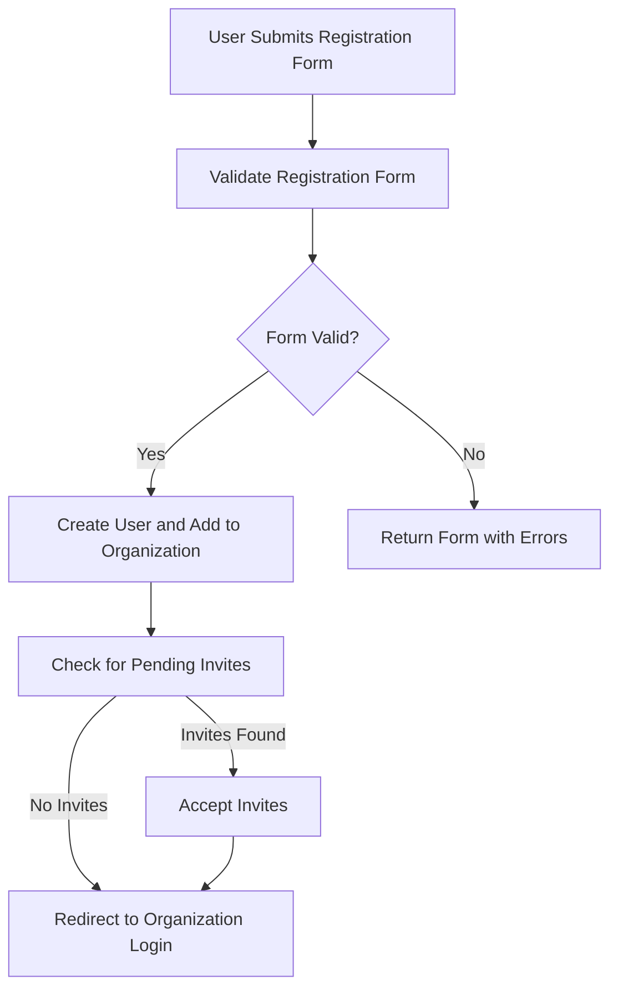

This document will cover the User Registration and Invitation Acceptance Flow, which includes:

1. Handling Registration Form Submission
2. Adding to Organization and Redirecting
3. Accepting Invite and Redirecting to Organization.

Technical document: <SwmLink doc-title="User Registration and Invitation Acceptance Flow">[User Registration and Invitation Acceptance Flow](/.swm/user-registration-and-invitation-acceptance-flow.6yoft3zb.sw.md)</SwmLink>

# [Handling Registration Form Submission](https://app.swimm.io/repos/Z2l0aHViJTNBJTNBc2VudHJ5LWRlbW8tMSUzQSUzQVN3aW1tLURlbW8=/docs/6yoft3zb#handling-registration-form-submission)

When a user submits the registration form, the system first validates the form. If the form is valid, a new user is created and added to the organization. If the form is invalid, the system returns the form with errors displayed to the user. This ensures that only users with correctly filled forms can proceed, enhancing data integrity and user experience.

# [Adding to Organization and Redirecting](https://app.swimm.io/repos/Z2l0aHViJTNBJTNBc2VudHJ5LWRlbW8tMSUzQSUzQVN3aW1tLURlbW8=/docs/6yoft3zb#adding-to-organization-and-redirecting)

Once the user is created, the system adds the user to the organization. It then checks for any pending invites. If there are pending invites, the system attempts to accept them. This step ensures that users are properly associated with their organization and any pending invitations are handled seamlessly. The user is then redirected to the next step in the registration process, which could involve additional setup or configuration.

# [Accepting Invite and Redirecting to Organization](https://app.swimm.io/repos/Z2l0aHViJTNBJTNBc2VudHJ5LWRlbW8tMSUzQSUzQVN3aW1tLURlbW8=/docs/6yoft3zb#accepting-invite-and-redirecting-to-organization)

If there are pending invites, the system accepts the invite on behalf of the user. This involves verifying the invite's validity and updating the session accordingly. Once the invite is accepted, the user is redirected to the organization login page. This step ensures that users can seamlessly join their organization and start using the platform without any manual intervention.

&nbsp;

*This is an auto-generated document by Swimm AI 🌊 and has not yet been verified by a human*

<SwmMeta version="3.0.0" repo-id="Z2l0aHViJTNBJTNBc2VudHJ5LWRlbW8tMSUzQSUzQVN3aW1tLURlbW8=" repo-name="sentry-demo-1" doc-type="product-flows">Powered by [Swimm](/)</SwmMeta>
