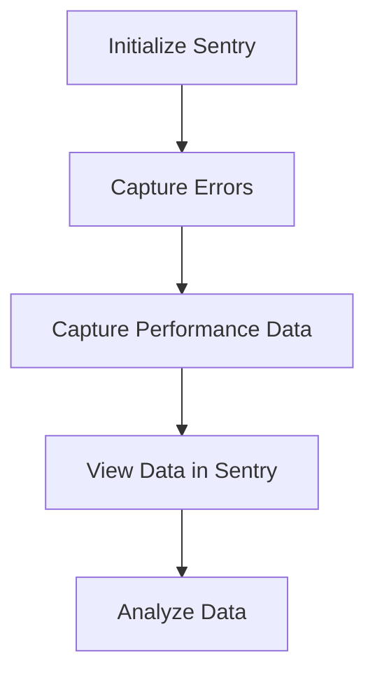

This document will cover the process of error tracking and performance monitoring using Sentry. We'll cover:

1. Initializing Sentry in the application
2. Capturing errors and performance data
3. Viewing and analyzing the captured data in Sentry.

Technical document: <SwmLink doc-title="" repo-id="Z2l0aHViJTNBJTNBc2VudHJ5LWRlbW8tMSUzQSUzQVN3aW1tLURlbW8=" path="/.swm/.oyii8e6r.sw.md"></SwmLink>

# [Initializing Sentry](https://app.swimm.io/repos/Z2l0aHViJTNBJTNBc2VudHJ5LWRlbW8tMSUzQSUzQVN3aW1tLURlbW8=/docs/oyii8e6r#initializing-sentry)

To start using Sentry for error tracking and performance monitoring, the first step is to initialize Sentry in your application. This involves setting up Sentry with the necessary configuration details such as the DSN (Data Source Name), which uniquely identifies your project in Sentry. This step ensures that your application is ready to capture and send error and performance data to Sentry.

# [Capturing Errors](https://app.swimm.io/repos/Z2l0aHViJTNBJTNBc2VudHJ5LWRlbW8tMSUzQSUzQVN3aW1tLURlbW8=/docs/oyii8e6r#capturing-errors)

Once Sentry is initialized, it automatically starts capturing errors that occur in your application. This includes unhandled exceptions, runtime errors, and other types of failures. Capturing errors is crucial for identifying issues that affect the user experience. When an error is captured, Sentry collects detailed information about the error, including the stack trace, user context, and environment details. This information helps in diagnosing and fixing the issue efficiently.

# [Capturing Performance Data](https://app.swimm.io/repos/Z2l0aHViJTNBJTNBc2VudHJ5LWRlbW8tMSUzQSUzQVN3aW1tLURlbW8=/docs/oyii8e6r#capturing-performance-data)

In addition to error tracking, Sentry also captures performance data to help you understand how your application is performing. This includes metrics such as response times, throughput, and transaction traces. Capturing performance data allows you to identify bottlenecks and optimize the performance of your application. Sentry provides insights into slow transactions and helps you pinpoint the root cause of performance issues.

# [Viewing Data in Sentry](https://app.swimm.io/repos/Z2l0aHViJTNBJTNBc2VudHJ5LWRlbW8tMSUzQSUzQVN3aW1tLURlbW8=/docs/oyii8e6r#viewing-data-in-sentry)

After capturing errors and performance data, you can view this information in the Sentry dashboard. The dashboard provides a comprehensive view of all the captured data, including error details, performance metrics, and trends over time. You can filter and search the data to find specific issues or performance bottlenecks. The dashboard also provides visualizations and reports to help you analyze the data effectively.

# [Analyzing Data](https://app.swimm.io/repos/Z2l0aHViJTNBJTNBc2VudHJ5LWRlbW8tMSUzQSUzQVN3aW1tLURlbW8=/docs/oyii8e6r#analyzing-data)

Analyzing the captured data in Sentry is essential for improving the quality and performance of your application. By examining error patterns and performance trends, you can identify recurring issues and areas that need optimization. Sentry provides tools for root cause analysis, allowing you to trace errors back to their source and understand the impact on users. This analysis helps in prioritizing fixes and enhancements to deliver a better user experience.

&nbsp;

*This is an auto-generated document by Swimm AI 🌊 and has not yet been verified by a human*

<SwmMeta version="3.0.0" repo-id="Z2l0aHViJTNBJTNBc2VudHJ5LWRlbW8tMSUzQSUzQVN3aW1tLURlbW8=" repo-name="sentry-demo-1" doc-type="product-flows">Powered by [Swimm](/)</SwmMeta>
